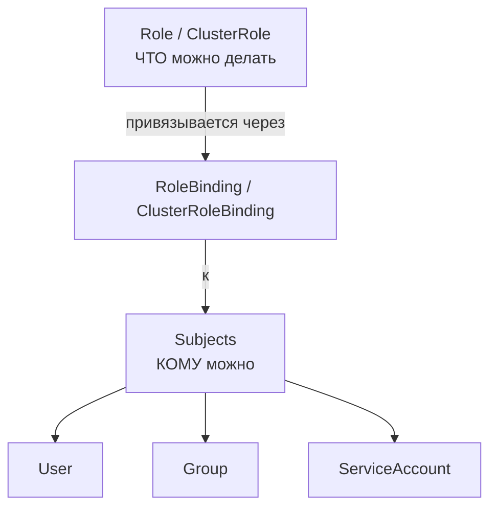

# RBAC (Role-Based Access Control) — управление доступом

> 📌 `RBAC` регулирует доступ к API K8s через 4 объекта: `Role`/`ClusterRole` (что можно делать) + `RoleBinding`/`ClusterRoleBinding` (кому это можно). Принцип: **минимальные привилегии**. Включается флагом `--authorization-mode=RBAC` у API-сервера.

---

## 🔹 4 ключевых объекта RBAC

| Объект | Scope | Что делает |
|--------|-------|------------|
| **`Role`** | Namespace | Набор правил (permissions) в рамках одного namespace |
| **`ClusterRole`** | Cluster | Набор правил для всего кластера (или для использования в namespace через RoleBinding) |
| **`RoleBinding`** | Namespace | Привязывает Role/ClusterRole к субъектам в конкретном namespace |
| **`ClusterRoleBinding`** | Cluster | Привязывает ClusterRole к субъектам во всём кластере |



---

## 🔹 Rules — что можно делать

Правила состоят из 3 частей:

| Поле | Описание | Пример |
|------|----------|--------|
| **`apiGroups`** | Группа API (`""` = core, `"apps"`, `"batch"`) | `[""]`, `["apps"]` |
| **`resources`** | Типы ресурсов | `["pods"]`, `["deployments"]`, `["pods", "pods/log"]` |
| **`verbs`** | Действия | `["get", "list", "watch", "create", "update", "patch", "delete"]` |
| **`resourceNames`** | Конкретные имена ресурсов (опционально) | `["my-config"]` |
| **`nonResourceURLs`** | Non-resource endpoints (только в ClusterRole) | `["/healthz", "/healthz/*"]` |

### 📝 Пример Role

```yaml
apiVersion: rbac.authorization.k8s.io/v1
kind: Role
metadata:
  namespace: default
  name: pod-reader
rules:
- apiGroups: [""]                    # ← core API group
  resources: ["pods"]                # ← какие ресурсы
  verbs: ["get", "watch", "list"]    # ← что можно делать
```

### 📝 Пример ClusterRole

```yaml
apiVersion: rbac.authorization.k8s.io/v1
kind: ClusterRole
metadata:
  name: secret-reader
  # namespace НЕ указывается — ClusterRole не namespace-scoped
rules:
- apiGroups: [""]
  resources: ["secrets"]
  verbs: ["get", "watch", "list"]
```

### 🎯 Когда использовать Role vs ClusterRole

| Сценарий | Объект |
|----------|--------|
| Права на ресурсы в **одном namespace** | `Role` |
| Права на **cluster-scoped** ресурсы (nodes, PV) | `ClusterRole` |
| Права на **non-resource URLs** (`/healthz`) | `ClusterRole` |
| Права на ресурсы во **всех namespace** | `ClusterRole` + `ClusterRoleBinding` |
| Права на ресурсы в **одном namespace**, но роль переиспользуется | `ClusterRole` + `RoleBinding` |

---

## 🔹 Bindings — кому можно

### 📝 RoleBinding (namespace-scoped)

```yaml
apiVersion: rbac.authorization.k8s.io/v1
kind: RoleBinding
metadata:
  name: read-pods
  namespace: default
subjects:
- kind: User
  name: jane              # ← имя пользователя (case-sensitive)
  apiGroup: rbac.authorization.k8s.io
roleRef:
  kind: Role              # ← Role или ClusterRole
  name: pod-reader        # ← имя Role/ClusterRole
  apiGroup: rbac.authorization.k8s.io
```

### 📝 RoleBinding с ClusterRole (права в одном namespace)

```yaml
apiVersion: rbac.authorization.k8s.io/v1
kind: RoleBinding
metadata:
  name: read-secrets
  namespace: development    # ← права действуют ТОЛЬКО в этом namespace
subjects:
- kind: User
  name: dave
  apiGroup: rbac.authorization.k8s.io
roleRef:
  kind: ClusterRole         # ← ссылаемся на ClusterRole
  name: secret-reader
  apiGroup: rbac.authorization.k8s.io
```

### 📝 ClusterRoleBinding (cluster-wide)

```yaml
apiVersion: rbac.authorization.k8s.io/v1
kind: ClusterRoleBinding
metadata:
  name: read-secrets-global
subjects:
- kind: Group
  name: manager             # ← вся группа
  apiGroup: rbac.authorization.k8s.io
roleRef:
  kind: ClusterRole
  name: secret-reader
  apiGroup: rbac.authorization.k8s.io
```

> ⚠️ **Важно**: `roleRef` **неизменяемый**. Чтобы изменить роль в binding — удали и создай заново (или используй `kubectl auth reconcile`).

---

## 🔹 Subjects — типы субъектов

| Kind | Пример | Описание |
|------|--------|----------|
| **`User`** | `name: alice@example.com` | Конкретный пользователь |
| **`Group`** | `name: frontend-admins` | Группа пользователей |
| **`ServiceAccount`** | `name: my-sa`, `namespace: default` | SA в конкретном namespace |

### 🎯 Специальные группы

| Группа | Описание |
|--------|----------|
| `system:authenticated` | Все аутентифицированные пользователи |
| `system:unauthenticated` | Все неаутентифицированные |
| `system:serviceaccounts` | **Все** SA во всех namespace |
| `system:serviceaccounts:<ns>` | Все SA в конкретном namespace |
| `system:masters` | Суперпользователи (cluster-admin) |

### 📝 Примеры subjects

```yaml
# Конкретный пользователь
subjects:
- kind: User
  name: "alice@example.com"
  apiGroup: rbac.authorization.k8s.io

# Группа пользователей
subjects:
- kind: Group
  name: "frontend-admins"
  apiGroup: rbac.authorization.k8s.io

# Конкретный SA
subjects:
- kind: ServiceAccount
  name: default
  namespace: kube-system

# Все SA в namespace "qa"
subjects:
- kind: Group
  name: system:serviceaccounts:qa
  apiGroup: rbac.authorization.k8s.io

# Все SA во всём кластере
subjects:
- kind: Group
  name: system:serviceaccounts
  apiGroup: rbac.authorization.k8s.io

# Все аутентифицированные пользователи
subjects:
- kind: Group
  name: system:authenticated
  apiGroup: rbac.authorization.k8s.io

# Все пользователи (аутентифицированные + неаутентифицированные)
subjects:
- kind: Group
  name: system:authenticated
  apiGroup: rbac.authorization.k8s.io
- kind: Group
  name: system:unauthenticated
  apiGroup: rbac.authorization.k8s.io
```

---

## 🔹 Default ClusterRoles (user-facing)

| Роль | Описание | Когда использовать |
|------|----------|-------------------|
| **`cluster-admin`** | Полный доступ ко всему (суперпользователь) | Только для админов кластера |
| **`admin`** | Полный доступ в namespace (включая Role/RoleBinding) | Администраторы namespace |
| **`edit`** | Read/write в namespace (кроме Role/RoleBinding) | Разработчики |
| **`view`** | Read-only в namespace (кроме Secrets) | Наблюдатели, CI/CD |

> 💡 **Secrets не видны в `view`** — потому что через Secrets можно получить токены SA и повысить привилегии.

---

## 🔹 Default роли компонентов (справочно)

> API-сервер автоматически создаёт ClusterRole/ClusterRoleBinding для системных компонентов. **Не изменяй их** — это может сломать кластер.

### 🎯 Роли обнаружения API

| ClusterRole | Binding | Описание |
|-------------|---------|----------|
| `system:base-user` | `system:authenticated` | Read-only доступ к информации о себе |
| `system:discovery` | `system:authenticated` | Read-only доступ к API discovery endpoints |
| `system:public-info-viewer` | `system:authenticated` + `system:unauthenticated` | Read-only доступ к публичной информации кластера |

### 🎯 Роли основных компонентов

| ClusterRole | Binding | Компонент |
|-------------|---------|-----------|
| `system:kube-scheduler` | `system:kube-scheduler` | Планировщик |
| `system:kube-controller-manager` | `system:kube-controller-manager` | Controller Manager |
| `system:node` | — | Kubelet (legacy, используется Node authorizer) |
| `system:node-proxier` | `system:kube-proxy` | Kube-proxy |

### 🎯 Роли встроенных контроллеров

Каждый встроенный контроллер имеет свою роль с префиксом `system:controller:`:

```
system:controller:deployment-controller
system:controller:replicaset-controller
system:controller:job-controller
system:controller:cronjob-controller
system:controller:daemon-set-controller
system:controller:statefulset-controller
system:controller:horizontal-pod-autoscaler
system:controller:node-controller
system:controller:namespace-controller
... (и другие)
```

> 💡 Если `kube-controller-manager` запущен с `--use-service-account-credentials`, каждый контроллер использует свой SA и свою роль.

### ⚙️ Автоматическая сверка (autoupdate)

API-сервер **автоматически обновляет** default ClusterRole/ClusterRoleBinding при каждом запуске:
- Добавляет отсутствующие permissions
- Добавляет отсутствующие subjects

**Отключить** (не рекомендуется):
```yaml
metadata:
  annotations:
    rbac.authorization.kubernetes.io/autoupdate: "false"
```

> ⚠️ **Важно**: если отключишь autoupdate и обновишь K8s — default роли могут не получить новые необходимые permissions → кластер может сломаться.

---

## 🔹 Агрегация ClusterRole

> Позволяет автоматически объединять несколько ClusterRole в один через label selector.

### 📝 Пример

```yaml
# Агрегирующая роль
apiVersion: rbac.authorization.k8s.io/v1
kind: ClusterRole
metadata:
  name: monitoring
aggregationRule:
  clusterRoleSelectors:
  - matchLabels:
      rbac.example.com/aggregate-to-monitoring: "true"
rules: []    # ← автоматически заполняется контроллером
---
# Роли, которые будут агрегированы
apiVersion: rbac.authorization.k8s.io/v1
kind: ClusterRole
metadata:
  name: monitoring-endpoints
  labels:
    rbac.example.com/aggregate-to-monitoring: "true"    # ← эта метка важна
rules:
- apiGroups: [""]
  resources: ["endpoints", "services"]
  verbs: ["get", "list"]
```

### 🎯 Встроенная агрегация

K8s использует агрегацию для ролей `admin`, `edit`, `view`. Чтобы добавить свои ресурсы в эти роли:

```yaml
apiVersion: rbac.authorization.k8s.io/v1
kind: ClusterRole
metadata:
  name: aggregate-crontabs-edit
  labels:
    rbac.authorization.k8s.io/aggregate-to-edit: "true"    # ← добавить в edit
    rbac.authorization.k8s.io/aggregate-to-admin: "true"   # ← и в admin
rules:
- apiGroups: ["stable.example.com"]
  resources: ["crontabs"]
  verbs: ["get", "list", "watch", "create", "update", "patch", "delete"]
```

---

## 🔹 Subresources и resourceNames

### 📝 Доступ к subresources

```yaml
rules:
- apiGroups: [""]
  resources: ["pods", "pods/log", "pods/exec"]    # ← subresources через /
  verbs: ["get", "list"]
```

### 📝 Ограничение по именам ресурсов

```yaml
rules:
- apiGroups: [""]
  resources: ["configmaps"]
  resourceNames: ["my-config"]    # ← только этот конкретный ConfigMap
  verbs: ["get", "update"]
```

> ⚠️ **Ограничения**: нельзя ограничить `create` по `resourceNames` (имя ещё не известно). Нельзя ограничить `delete` коллекции.

---

## 🔹 Практика: создание RBAC

### 🚀 Пошаговая настройка

```bash
# 1. Создать Role
kubectl create role pod-reader \
  --verb=get --verb=list --verb=watch \
  --resource=pods \
  -n default

# 2. Создать RoleBinding для пользователя
kubectl create rolebinding jane-read-pods \
  --role=pod-reader \
  --user=jane \
  -n default

# 3. Создать ClusterRole
kubectl create clusterrole secret-reader \
  --verb=get --verb=list --verb=watch \
  --resource=secrets

# 4. Создать ClusterRoleBinding для группы
kubectl create clusterrolebinding managers-read-secrets \
  --clusterrole=secret-reader \
  --group=manager

# 5. Создать RoleBinding для SA
kubectl create rolebinding myapp-view \
  --clusterrole=view \
  --serviceaccount=default:myapp-sa \
  -n default

# 6. Проверить права
kubectl auth can-i --list --as=jane -n default
kubectl auth can-i get pods --as=jane -n default
kubectl auth can-i delete pods --as=jane -n default
```

### 📝 Полный пример через YAML

```yaml
# ServiceAccount
apiVersion: v1
kind: ServiceAccount
metadata:
  name: ci-bot
  namespace: default
---
# Role: только чтение pods и jobs
apiVersion: rbac.authorization.k8s.io/v1
kind: Role
metadata:
  name: ci-bot-role
  namespace: default
rules:
- apiGroups: [""]
  resources: ["pods", "pods/log"]
  verbs: ["get", "list", "watch"]
- apiGroups: ["batch"]
  resources: ["jobs"]
  verbs: ["get", "list", "watch", "create", "delete"]
---
# RoleBinding: привязка Role к SA
apiVersion: rbac.authorization.k8s.io/v1
kind: RoleBinding
metadata:
  name: ci-bot-binding
  namespace: default
subjects:
- kind: ServiceAccount
  name: ci-bot
  namespace: default
roleRef:
  kind: Role
  name: ci-bot-role
  apiGroup: rbac.authorization.k8s.io
---
# Pod, использующий SA
apiVersion: v1
kind: Pod
metadata:
  name: ci-bot
  namespace: default
spec:
  serviceAccountName: ci-bot
  containers:
  - name: bot
    image: bitnami/kubectl:latest
    command: ["sleep", "infinity"]
```

```bash
# Применить
kubectl apply -f rbac.yaml

# Проверить
kubectl exec ci-bot -- kubectl get pods
kubectl exec ci-bot -- kubectl get jobs
kubectl exec ci-bot -- kubectl get secrets    # ← должно быть Forbidden
```

---

## 🔹 Иерархия подходов к разрешениям ServiceAccount

> От наиболее безопасного к наименее безопасному. Выбирай в зависимости от требований.

### 🟢 1. Отдельный SA для конкретного приложения (РЕКОМЕНДУЕТСЯ)

```yaml
# Создать SA для приложения
apiVersion: v1
kind: ServiceAccount
metadata:
  name: my-app-sa
  namespace: my-namespace
---
# Привязать роль только к этому SA
apiVersion: rbac.authorization.k8s.io/v1
kind: RoleBinding
metadata:
  name: my-app-view
  namespace: my-namespace
subjects:
- kind: ServiceAccount
  name: my-app-sa
  namespace: my-namespace
roleRef:
  kind: ClusterRole
  name: view
  apiGroup: rbac.authorization.k8s.io
---
# Использовать SA в Pod
apiVersion: v1
kind: Pod
metadata:
  name: my-app
  namespace: my-namespace
spec:
  serviceAccountName: my-app-sa    # ← явно указываем SA
  containers:
  - name: app
    image: my-app:latest
```

```bash
# Через kubectl
kubectl create rolebinding my-sa-view \
  --clusterrole=view \
  --serviceaccount=my-namespace:my-sa \
  --namespace=my-namespace
```

**Преимущества**: минимальные привилегии, изоляция, аудит.

### 🟡 2. Роль для default SA в namespace

```bash
# Дать права default SA (используется, если pod не указывает serviceAccountName)
kubectl create rolebinding default-view \
  --clusterrole=view \
  --serviceaccount=my-namespace:default \
  --namespace=my-namespace
```

**⚠️ Риск**: права доступны **всем** подам в namespace, которые не указывают `serviceAccountName`.

### 🟡 3. Роль для default SA в kube-system (для addons)

```bash
# ⚠️ ОПАСНО: даёт cluster-admin всем addon'ам в kube-system
kubectl create clusterrolebinding add-on-cluster-admin \
  --clusterrole=cluster-admin \
  --serviceaccount=kube-system:default
```

**⚠️ Риск**: kube-system содержит секреты с доступом суперпользователя.

### 🟠 4. Роль для всех SA в namespace

```bash
# Дать права всем SA в namespace (независимо от имени SA)
kubectl create rolebinding serviceaccounts-view \
  --clusterrole=view \
  --group=system:serviceaccounts:my-namespace \
  --namespace=my-namespace
```

**⚠️ Риск**: все приложения в namespace получают одинаковые права.

### 🔴 5. Роль для всех SA в кластере (НЕ РЕКОМЕНДУЕТСЯ)

```bash
# ⚠️ ОПАСНО: даёт права всем SA во всём кластере
kubectl create clusterrolebinding serviceaccounts-view \
  --clusterrole=view \
  --group=system:serviceaccounts
```

**⚠️ Риск**: любое приложение в любом namespace получает эти права.

### ⛔ 6. Cluster-admin для всех SA (КАТЕГОРИЧЕСКИ НЕ РЕКОМЕНДУЕТСЯ)

```bash
# ⛔ КРИТИЧЕСКАЯ УЯЗВИМОСТЬ: cluster-admin для всех SA
kubectl create clusterrolebinding serviceaccounts-cluster-admin \
  --clusterrole=cluster-admin \
  --group=system:serviceaccounts
```

**⛔ Риск**: **любое** приложение может получить полный доступ к кластеру через чтение Secrets или создание подов.

---

## 🔹 Отладка RBAC

```bash
# Проверить, какие права есть у пользователя/SA
kubectl auth can-i --list --as=jane -n default
kubectl auth can-i --list --as=system:serviceaccount:default:myapp-sa -n default

# Проверить конкретное действие
kubectl auth can-i get pods --as=jane -n default
kubectl auth can-i create secrets --as=system:serviceaccount:default:myapp-sa -n default

# Проверить в другом namespace
kubectl auth can-i get secrets --as=jane -n kube-system

# Посмотреть все Role/ClusterRole
kubectl get roles,clusterroles -A
kubectl get rolebindings,clusterrolebindings -A

# Посмотреть детали Role
kubectl describe role pod-reader -n default

# Посмотреть, кто имеет доступ к secrets
kubectl auth can-i get secrets --list --as=system:serviceaccount:default:myapp-sa -A

# Проверить, какие RoleBinding привязаны к SA
kubectl get rolebindings -A -o json | jq -r '.items[] | select(.subjects[]? | .kind=="ServiceAccount" and .name=="myapp-sa") | "\(.metadata.namespace)/\(.metadata.name)"'

# Посмотреть логи API-сервера (RBAC denials)
kubectl logs -n kube-system kube-apiserver-* | grep RBAC

# Reconcile RBAC из файла (создаёт/обновляет/удаляет лишнее)
kubectl auth reconcile -f rbac.yaml --dry-run=client
kubectl auth reconcile -f rbac.yaml --remove-extra-permissions --remove-extra-subjects
```

### 🔍 Частые ошибки

| Ошибка | Причина | Решение |
|--------|---------|---------|
| `Forbidden: pods is forbidden` | Нет Role/RoleBinding | Создать Role + RoleBinding |
| `cannot get resource "secrets"` | Нет прав на secrets | Добавить secrets в resources |
| `cannot create rolebindings` | Нет прав на RBAC | Нужен `admin` или явные права на `rolebindings` |
| `roleRef is immutable` | Попытка изменить roleRef | Удалить binding и создать заново |
| Права не работают после изменения | Кэш API-сервера | Подождать несколько секунд |

---

## 🔹 Защита от повышения привилегий

> K8s **автоматически предотвращает** создание Role/RoleBinding с правами, которых нет у создателя.

### 🎯 Правила

1. **Создать/обновить Role** можно только если:
   - У тебя уже есть все права из этой Role, ИЛИ
   - Тебе явно дан verb `escalate` на `roles`/`clusterroles`

2. **Создать/обновить RoleBinding** можно только если:
   - У тебя уже есть все права из привязываемой Role, ИЛИ
   - Тебе явно дан verb `bind` на эту конкретную Role

### 📝 Пример: дать пользователю возможность назначать роли

```yaml
apiVersion: rbac.authorization.k8s.io/v1
kind: ClusterRole
metadata:
  name: role-grantor
rules:
- apiGroups: ["rbac.authorization.k8s.io"]
  resources: ["rolebindings"]
  verbs: ["create"]
- apiGroups: ["rbac.authorization.k8s.io"]
  resources: ["clusterroles"]
  verbs: ["bind"]
  resourceNames: ["admin", "edit", "view"]    # ← только эти роли можно привязывать
---
apiVersion: rbac.authorization.k8s.io/v1
kind: RoleBinding
metadata:
  name: role-grantor-binding
  namespace: my-namespace
roleRef:
  kind: ClusterRole
  name: role-grantor
  apiGroup: rbac.authorization.k8s.io
subjects:
- kind: User
  name: alice
  apiGroup: rbac.authorization.k8s.io
```

---

## 🔹 Переход с ABAC (legacy)

> Для кластеров, которые мигрируют со старых версий K8s с ABAC на RBAC.

### 🎯 Вариант 1: Параллельные авторизаторы

```bash
# Запустить API-сервер с обоими авторизаторами
kube-apiserver \
  --authorization-mode=Node,RBAC,ABAC \
  --authorization-policy-file=mypolicy.json \
  --vmodule=rbac*=5    # ← логировать RBAC denials
```

**Как работает**:
1. Сначала проверяет Node authorizer
2. Потом RBAC
3. Если оба отказали — проверяет ABAC
4. Если хоть один разрешил — запрос проходит

**Процесс миграции**:
```bash
# 1. Включить логирование RBAC denials
--vmodule=rbac*=5

# 2. Анализировать логи
kubectl logs -n kube-system kube-apiserver-* | grep "RBAC DENY"

# 3. Создавать Role/RoleBinding на основе denials
# 4. Когда denials исчезнут — убрать ABAC
```

### 🎯 Вариант 2: Разрешительные RBAC-права (НЕ РЕКОМЕНДУЕТСЯ)

```bash
# ⚠️ ОПАСНО: эквивалент разрешительной ABAC-политики
kubectl create clusterrolebinding permissive-binding \
  --clusterrole=cluster-admin \
  --user=admin \
  --user=kubelet \
  --group=system:serviceaccounts
```

**⚠️ Риск**: все SA становятся cluster-admin. **Не используй в production!**

---

## 🔹 CVE-2021-25740: права на запись EndpointSlices

> В кластерах до v1.22 роли `edit` и `admin` имели права на запись `endpoints`. Это уязвимость.

### 🎯 Проблема

```yaml
# Роли edit/admin в кластерах < 1.22 позволяли:
rules:
- apiGroups: [""]
  resources: ["endpoints"]
  verbs: ["create", "delete", "patch", "update"]
```

**Риск**: злоумышленник с правами `edit` мог направить LoadBalancer/Ingress на внутренние IP, обходя NetworkPolicy.

### 🔧 Исправление

В кластерах **≥ 1.22** эти права **удалены** из `edit`/`admin`.

**Для обновлённых кластеров** (если нужно вернуть старое поведение):

```yaml
apiVersion: rbac.authorization.k8s.io/v1
kind: ClusterRole
metadata:
  name: custom:aggregate-to-edit:endpoints
  labels:
    rbac.authorization.k8s.io/aggregate-to-edit: "true"
  annotations:
    kubernetes.io/description: |-
      ⚠️ ОПАСНО: возвращает уязвимость CVE-2021-25740.
      Не используй без крайней необходимости.
rules:
- apiGroups: [""]
  resources: ["endpoints"]
  verbs: ["create", "delete", "deletecollection", "patch", "update"]
```

> ⚠️ **Не применяй** без понимания рисков. Лучше обнови код приложений, чтобы не зависеть от `endpoints`.

---

## 🔹 Best Practices

### ✅ Делай

1. **Принцип минимальных привилегий** — давай только необходимые verbs и resources
2. **Отдельный SA для каждого приложения** — не используй `default`
3. **Namespace-scoped роли** — используй `Role` + `RoleBinding`, а не `ClusterRole` + `ClusterRoleBinding`
4. **Избегай wildcard** (`*`) — лучше явно указать ресурсы и verbs
5. **Регулярный аудит** — `kubectl auth can-i --list` для проверки прав
6. **GitOps для RBAC** — храни Role/RoleBinding в Git, применяй через ArgoCD/Flux

### ❌ Не делай

```bash
# ❌ НЕ давай cluster-admin всем SA
kubectl create clusterrolebinding bad-idea \
  --clusterrole=cluster-admin \
  --group=system:serviceaccounts

# ❌ НЕ используй wildcard без необходимости
rules:
- apiGroups: ["*"]
  resources: ["*"]
  verbs: ["*"]

# ❌ НЕ давай права на secrets без крайней необходимости
# Secrets содержат токены SA — это путь к повышению привилегий

# ❌ НЕ привязывай ClusterRole к ClusterRoleBinding, если достаточно RoleBinding
# ClusterRole + RoleBinding = права только в одном namespace
```

---

## 🔹 Чек-лист: настройка RBAC

```bash
# ✅ 1. Определить, кому нужны права
#    - Пользователь (User)?
#    - Группа (Group)?
#    - ServiceAccount?

# ✅ 2. Определить, какие права нужны
#    - Какие resources?
#    - Какие verbs?
#    - В каком namespace?
#    - Нужен ли доступ к subresources (pods/log, pods/exec)?

# ✅ 3. Выбрать подход к SA permissions
#    🟢 Отдельный SA для приложения (РЕКОМЕНДУЕТСЯ)
#    🟡 Роль для default SA (если нельзя изменить приложение)
#    🟠 Роль для всех SA в namespace (быстро, но менее безопасно)
#    🔴 Роль для всех SA в кластере (НЕ РЕКОМЕНДУЕТСЯ)
#    ⛔ Cluster-admin для всех SA (КАТЕГОРИЧЕСКИ НЕЛЬЗЯ)

# ✅ 4. Создать Role или ClusterRole
kubectl create role <name> --verb=<verbs> --resource=<resources> -n <ns>
kubectl create clusterrole <name> --verb=<verbs> --resource=<resources>

# ✅ 5. Создать RoleBinding или ClusterRoleBinding
kubectl create rolebinding <name> --role=<role> --user=<user> -n <ns>
kubectl create clusterrolebinding <name> --clusterrole=<role> --group=<group>

# ✅ 6. Проверить права
kubectl auth can-i --list --as=<user> -n <ns>
kubectl auth can-i <verb> <resource> --as=<user> -n <ns>

# ✅ 7. Протестировать из пода (если SA)
kubectl exec <pod> -- kubectl get <resource>

# ✅ 8. Аудит
kubectl get roles,rolebindings -A
kubectl get clusterroles,clusterrolebindings
kubectl auth can-i --list --as=system:serviceaccount:<ns>:<sa> -n <ns>
```

> 💡 **Совет для конспекта**:
> 1. Создай файл `00_rbac_cheatsheet.md` с шпаргалкой по командам.
> 2. Добавь блок «Частые ошибки»: «забыл apiGroup", "использовал wildcard", "дал cluster-admin SA".
> 3. Веди список «Какие RBAC у нас в кластере»: SA, Role, Binding, права.
> 4. Настрой алерты на создание ClusterRoleBinding с `cluster-admin` для `system:serviceaccounts`.

---

## 🔹 Ключевые выводы

1. **4 объекта**: `Role`/`ClusterRole` (правила) + `RoleBinding`/`ClusterRoleBinding` (привязка к субъектам).
2. **Rules**: `apiGroups` + `resources` + `verbs`. Можно уточнить через `resourceNames`.
3. **Subjects**: `User`, `Group`, `ServiceAccount`. Специальные группы: `system:authenticated`, `system:serviceaccounts`.
4. **Default роли**: `cluster-admin` (суперпользователь), `admin`/`edit`/`view` (namespace-scoped).
5. **Default роли компонентов** (`system:*`) создаются автоматически, не изменяй их.
6. **Автоматическая сверка** (autoupdate) обновляет default роли при каждом запуске API-сервера.
7. **Агрегация**: ClusterRole с `aggregationRule` автоматически собирает правила из других ClusterRole по label selector.
8. **Защита от эскалации**: нельзя создать Role/Binding с правами, которых нет у создателя (без verb `escalate`/`bind`).
9. **`roleRef` неизменяем** — для изменения роли в binding нужно пересоздать binding.
10. **Иерархия подходов к SA permissions**: от отдельного SA (безопасно) до cluster-admin для всех SA (критическая уязвимость).
11. **CVE-2021-25740**: в кластерах < 1.22 роли `edit`/`admin` имели опасные права на `endpoints`.
12. **Best practice**: минимальные привилегии, отдельные SA для приложений, избегать wildcard, регулярный аудит.
13. **Отладка**: `kubectl auth can-i --list --as=<user>` — главный инструмент.
14. **Subresources**: `pods/log`, `pods/exec` — требуют явного указания в `resources`.