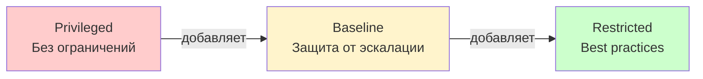

# Pod Security Standards (PSS) — стандарты безопасности подов

> 📌 PSS определяет 3 уровня политик безопасности подов: `Privileged` (без ограничений), `Baseline` (защита от известных путей эскалации), `Restricted` (строгие best practices). Политики кумулятивные. Применяются через **Pod Security Admission (PSA)** — labels на namespace.

---

## 🔹 3 уровня политик PSS

| Профиль | Описание | Когда использовать |
|---------|----------|-------------------|
| **🔴 Privileged** | Без ограничений. Разрешает всё, включая привилегированные контейнеры. | Системные/инфраструктурные workloads (kube-system, CNI, monitoring) |
| **🟡 Baseline** | Минимальные ограничения. Блокирует известные пути эскалации привилегий. | Большинство приложений, некритичные workloads |
| **🟢 Restricted** | Строгие best practices. Требует non-root, drop ALL capabilities, seccomp. | Критичные приложения, multi-tenant, high-security |



> 💡 **Кумулятивность**: Restricted включает все правила Baseline + свои дополнительные. Нельзя "ослабить" Restricted до Baseline — только переключить профиль.

---

## 🔹 Baseline — защита от известных путей эскалации

> Цель: предотвратить **известные** способы повышения привилегий, не ломая совместимость с большинством приложений.

### 🎯 Что запрещено в Baseline

| Контроль | Запрещённые поля | Допустимые значения |
|----------|------------------|---------------------|
| **Privileged containers** | `securityContext.privileged` | `false` или не задано |
| **Host namespaces** | `hostNetwork`, `hostPID`, `hostIPC` | `false` или не задано |
| **HostPath volumes** | `volumes[*].hostPath` | Не задано |
| **Host ports** | `ports[*].hostPort` | `0` или не задано |
| **Capabilities (add)** | `capabilities.add` | Только whitelist: `AUDIT_WRITE`, `CHOWN`, `DAC_OVERRIDE`, `FOWNER`, `FSETID`, `KILL`, `MKNOD`, `NET_BIND_SERVICE`, `SETFCAP`, `SETGID`, `SETPCAP`, `SETUID`, `SYS_CHROOT` |
| **Seccomp** | `seccompProfile.type` | `RuntimeDefault`, `Localhost` или не задано (НЕ `Unconfined`) |
| **AppArmor** | `appArmorProfile.type` | `RuntimeDefault`, `Localhost` или не задано |
| **SELinux type** | `seLinuxOptions.type` | `container_t`, `container_init_t`, `container_kvm_t`, `container_engine_t` или не задано |
| **SELinux user/role** | `seLinuxOptions.user`, `seLinuxOptions.role` | Не задано |
| **procMount** | `procMount` | `Default` или не задано |
| **Sysctls** | `sysctls[*].name` | Только safe sysctls: `kernel.shm_rmid_forced`, `net.ipv4.ip_local_port_range`, `net.ipv4.ip_unprivileged_port_start`, `net.ipv4.tcp_syncookies`, `net.ipv4.ping_group_range`, `net.ipv4.ip_local_reserved_ports`, `net.ipv4.tcp_keepalive_*` |
| **Host probes (v1.34+)** | `livenessProbe.httpGet.host`, `tcpSocket.host`, `lifecycle.*.host` | `""` или не задано |
| **Windows HostProcess** | `windowsOptions.hostProcess` | `false` или не задано |

### 📝 Пример: Pod, соответствующий Baseline

```yaml
apiVersion: v1
kind: Pod
metadata:
  name: baseline-compliant
spec:
  hostNetwork: false              # ✅ не задано или false
  hostPID: false                  # ✅ не задано или false
  hostIPC: false                  # ✅ не задано или false
  securityContext:
    seccompProfile:
      type: RuntimeDefault        # ✅ допустимо
  containers:
  - name: app
    image: nginx:1.25
    securityContext:
      privileged: false           # ✅ не задано или false
      capabilities:
        add: ["NET_BIND_SERVICE"] # ✅ в whitelist
        # add: ["SYS_ADMIN"]      # ❌ ЗАПРЕЩЕНО
    ports:
    - containerPort: 80
      # hostPort: 80              # ❌ ЗАПРЕЩЕНО
    volumeMounts:
    - name: data
      mountPath: /data
  volumes:
  - name: data
    emptyDir: {}                  # ✅ допустимо
    # hostPath:                   # ❌ ЗАПРЕЩЕНО
    #   path: /var/data
```

### 📝 Пример: Pod, нарушающий Baseline

```yaml
apiVersion: v1
kind: Pod
metadata:
  name: baseline-violation
spec:
  hostNetwork: true               # ❌ ЗАПРЕЩЕНО
  containers:
  - name: app
    image: nginx:1.25
    securityContext:
      privileged: true            # ❌ ЗАПРЕЩЕНО
      capabilities:
        add: ["SYS_ADMIN"]        # ❌ ЗАПРЕЩЕНО (не в whitelist)
      seccompProfile:
        type: Unconfined          # ❌ ЗАПРЕЩЕНО
    ports:
    - containerPort: 80
      hostPort: 80                # ❌ ЗАПРЕЩЕНО
    volumeMounts:
    - name: host-data
      mountPath: /data
  volumes:
  - name: host-data
    hostPath:                     # ❌ ЗАПРЕЩЕНО
      path: /var/data
```

---

## 🔹 Restricted — строгие best practices

> Цель: современные best practices безопасности. Требует больше изменений в манифестах, но обеспечивает максимальную защиту.

### 🎯 Дополнительные правила Restricted (сверх Baseline)

| Контроль | Запрещённые поля | Допустимые значения |
|----------|------------------|---------------------|
| **Volume types** | `volumes[*]` | Только: `configMap`, `csi`, `downwardAPI`, `emptyDir`, `ephemeral`, `persistentVolumeClaim`, `projected`, `secret` |
| **Privilege escalation** | `allowPrivilegeEscalation` | **`false`** (обязательно!) |
| **Run as non-root** | `runAsNonRoot` | **`true`** (обязательно!) |
| **Run as user** | `runAsUser` | Не `0` (не root) |
| **Seccomp** | `seccompProfile.type` | **`RuntimeDefault`** или **`Localhost`** (обязательно, не `Unconfined` и не не задано) |
| **Capabilities (drop)** | `capabilities.drop` | Должен включать **`ALL`** |
| **Capabilities (add)** | `capabilities.add` | Только `NET_BIND_SERVICE` или не задано |

### 📝 Пример: Pod, соответствующий Restricted

```yaml
apiVersion: v1
kind: Pod
metadata:
  name: restricted-compliant
spec:
  securityContext:
    runAsNonRoot: true            # ✅ ОБЯЗАТЕЛЬНО
    runAsUser: 1000               # ✅ не 0
    seccompProfile:
      type: RuntimeDefault        # ✅ ОБЯЗАТЕЛЬНО (RuntimeDefault или Localhost)
  containers:
  - name: app
    image: nginx:1.25
    securityContext:
      allowPrivilegeEscalation: false    # ✅ ОБЯЗАТЕЛЬНО
      capabilities:
        drop: ["ALL"]                    # ✅ ОБЯЗАТЕЛЬНО
        add: ["NET_BIND_SERVICE"]        # ✅ допустимо (единственное исключение)
      runAsNonRoot: true                 # ✅ можно на уровне контейнера
      runAsUser: 1000                    # ✅ не 0
      seccompProfile:
        type: RuntimeDefault             # ✅ можно на уровне контейнера
    volumeMounts:
    - name: config
      mountPath: /etc/config
    - name: data
      mountPath: /data
  volumes:
  - name: config
    configMap:                    # ✅ допустимый тип
      name: app-config
  - name: data
    persistentVolumeClaim:        # ✅ допустимый тип
      claimName: app-data
    # hostPath:                   # ❌ ЗАПРЕЩЕНО в Restricted
    #   path: /var/data
```

### 📝 Пример: Pod, нарушающий Restricted (но проходит Baseline)

```yaml
apiVersion: v1
kind: Pod
metadata:
  name: restricted-violation
spec:
  # securityContext:
  #   runAsNonRoot: true          # ❌ ОТСУТСТВУЕТ — нарушение Restricted
  #   seccompProfile:
  #     type: RuntimeDefault      # ❌ ОТСУТСТВУЕТ — нарушение Restricted
  containers:
  - name: app
    image: nginx:1.25
    securityContext:
      # allowPrivilegeEscalation: false    # ❌ ОТСУТСТВУЕТ — нарушение Restricted
      # capabilities:
      #   drop: ["ALL"]                    # ❌ ОТСУТСТВУЕТ — нарушение Restricted
      runAsUser: 0                # ❌ root — нарушение Restricted
    volumeMounts:
    - name: data
      mountPath: /data
  volumes:
  - name: data
    hostPath:                     # ❌ ЗАПРЕЩЕНО в Restricted
      path: /var/data
```

> 💡 Этот Pod пройдёт Baseline (если убрать `hostPath` и `runAsUser: 0`), но **не пройдёт Restricted**.

---

## 🔹 Сравнение: Baseline vs Restricted

| Контроль | Baseline | Restricted |
|----------|----------|------------|
| Privileged containers | ❌ Запрещено | ❌ Запрещено |
| Host namespaces | ❌ Запрещено | ❌ Запрещено |
| HostPath volumes | ❌ Запрещено | ❌ Запрещено |
| Host ports | ❌ Запрещено | ❌ Запрещено |
| Capabilities (add) | ⚠️ Whitelist | ⚠️ Только `NET_BIND_SERVICE` |
| Seccomp | ⚠️ Не `Unconfined` | ✅ **Обязательно** `RuntimeDefault`/`Localhost` |
| **Volume types** | ✅ Любые (кроме hostPath) | ⚠️ Только безопасные (configMap, secret, PVC, etc.) |
| **allowPrivilegeEscalation** | ✅ Не проверяется | ✅ **Обязательно** `false` |
| **runAsNonRoot** | ✅ Не проверяется | ✅ **Обязательно** `true` |
| **runAsUser** | ✅ Не проверяется | ⚠️ Не `0` |
| **Capabilities (drop)** | ✅ Не проверяется | ✅ **Обязательно** `drop: ["ALL"]` |

---

## 🔹 Применение PSS через Pod Security Admission (PSA)

> PSA — встроенный admission controller, применяет PSS через **labels на namespace**.

### 🎯 3 режима применения

| Режим | Поведение | Когда использовать |
|-------|-----------|-------------------|
| **`enforce`** | Блокирует создание подов, нарушающих политику | Production, строгий контроль |
| **`audit`** | Логирует нарушения, но не блокирует | Мониторинг, подготовка к enforce |
| **`warn`** | Показывает предупреждения пользователю, но не блокирует | Soft migration, обучение |

### 📝 Пример: применение Baseline в режиме enforce

```yaml
apiVersion: v1
kind: Namespace
metadata:
  name: my-app
  labels:
    pod-security.kubernetes.io/enforce: "baseline"
    pod-security.kubernetes.io/enforce-version: "latest"
    # Опционально: audit и warn
    pod-security.kubernetes.io/audit: "restricted"
    pod-security.kubernetes.io/audit-version: "latest"
    pod-security.kubernetes.io/warn: "restricted"
    pod-security.kubernetes.io/warn-version: "latest"
```

```bash
# Применить через kubectl
kubectl label namespace my-app \
  pod-security.kubernetes.io/enforce=baseline \
  pod-security.kubernetes.io/enforce-version=latest

# Проверить labels
kubectl get namespace my-app --show-labels
```

### 📝 Пример: применение Restricted в режиме enforce

```yaml
apiVersion: v1
kind: Namespace
metadata:
  name: secure-app
  labels:
    pod-security.kubernetes.io/enforce: "restricted"
    pod-security.kubernetes.io/enforce-version: "latest"
```

### 🎯 Версионирование

```yaml
# Конкретная версия K8s
pod-security.kubernetes.io/enforce: "baseline"
pod-security.kubernetes.io/enforce-version: "v1.28"

# Или "latest" (всегда последняя версия)
pod-security.kubernetes.io/enforce-version: "latest"
```

> 💡 **Best practice**: используй конкретную версию (например, `v1.28`), чтобы избежать неожиданных изменений при обновлении кластера.

---

## 🔹 Практика: настройка PSS

### 🚀 Пошаговая настройка

```bash
# 1. Создать namespace с Baseline в enforce
kubectl create namespace my-app
kubectl label namespace my-app \
  pod-security.kubernetes.io/enforce=baseline \
  pod-security.kubernetes.io/enforce-version=latest

# 2. Попробовать создать Pod, нарушающий Baseline
kubectl apply -n my-app -f - <<EOF
apiVersion: v1
kind: Pod
metadata:
  name: bad-pod
spec:
  hostNetwork: true              # ❌ нарушение Baseline
  containers:
  - name: app
    image: nginx:1.25
EOF
# Error from server (Forbidden): violates PodSecurity "baseline:latest": host namespaces (hostNetwork=true)

# 3. Создать Pod, соответствующий Baseline
kubectl apply -n my-app -f - <<EOF
apiVersion: v1
kind: Pod
metadata:
  name: good-pod
spec:
  containers:
  - name: app
    image: nginx:1.25
EOF
# pod/good-pod created

# 4. Переключить namespace на Restricted
kubectl label namespace my-app \
  pod-security.kubernetes.io/enforce=restricted \
  pod-security.kubernetes.io/enforce-version=latest \
  --overwrite

# 5. Попробовать создать Pod, нарушающий Restricted
kubectl apply -n my-app -f - <<EOF
apiVersion: v1
kind: Pod
metadata:
  name: restricted-violation
spec:
  containers:
  - name: app
    image: nginx:1.25
    securityContext:
      runAsUser: 0               # ❌ нарушение Restricted (root)
EOF
# Error from server (Forbidden): violates PodSecurity "restricted:latest": 
# allowPrivilegeEscalation != false, runAsNonRoot != true, seccompProfile

# 6. Создать Pod, соответствующий Restricted
kubectl apply -n my-app -f - <<EOF
apiVersion: v1
kind: Pod
metadata:
  name: restricted-compliant
spec:
  securityContext:
    runAsNonRoot: true
    seccompProfile:
      type: RuntimeDefault
  containers:
  - name: app
    image: nginx:1.25
    securityContext:
      allowPrivilegeEscalation: false
      capabilities:
        drop: ["ALL"]
      runAsNonRoot: true
      seccompProfile:
        type: RuntimeDefault
EOF
# pod/restricted-compliant created
```

### 🔍 Отладка

```bash
# Проверить labels namespace
kubectl get namespace my-app --show-labels | grep pod-security

# Посмотреть события namespace (audit/warn логи)
kubectl get events -n my-app --field-selector reason=PolicyViolation

# Проверить, какие поды нарушают политику (если audit включён)
kubectl get pods -n my-app -o json | jq -r '.items[] | select(.metadata.annotations["pod-security.kubernetes.io/audit-violations"] != null) | .metadata.name'

# Посмотреть детали нарушения
kubectl describe pod bad-pod -n my-app | grep -A10 'Events:'
```

### ⚠️ Частые проблемы

| Проблема | Причина | Решение |
|----------|---------|---------|
| **Pod не создаётся** | Нарушает enforce политику | Исправить securityContext |
| **System pods не запускаются** | kube-system не имеет Privileged | Добавить label `pod-security.kubernetes.io/enforce=privileged` на kube-system |
| **Старые поды не проходят Restricted** | Не имеют `runAsNonRoot`, `drop: ALL` | Обновить манифесты или использовать Baseline |
| **Audit/warn не работают** | Labels не применены | Проверить `kubectl get ns --show-labels` |
| **Версия политики не совпадает** | Указана старая версия | Использовать `latest` или конкретную версию K8s |

---

## 🔹 Исключения: system namespaces

> Некоторые namespaces **требуют** Privileged для работы системных компонентов.

```bash
# kube-system — системные компоненты (kube-proxy, CNI, CoreDNS)
kubectl label namespace kube-system \
  pod-security.kubernetes.io/enforce=privileged \
  pod-security.kubernetes.io/enforce-version=latest

# kube-public — публичные конфиги
kubectl label namespace kube-public \
  pod-security.kubernetes.io/enforce=privileged \
  pod-security.kubernetes.io/enforce-version=latest

# kube-node-lease — leases для нод
kubectl label namespace kube-node-lease \
  pod-security.kubernetes.io/enforce=privileged \
  pod-security.kubernetes.io/enforce-version=latest
```

> ⚠️ **Важно**: не применяй Baseline/Restricted к `kube-system` — сломаешь кластер!

---

## 🔹 Альтернативы PSA

> PSA — встроенный механизм, но есть и сторонние решения для более сложной логики.

| Инструмент | Описание | Когда использовать |
|------------|----------|-------------------|
| **Pod Security Admission (PSA)** | Встроенный, простой, labels на namespace | Стандартный выбор, большинство случаев |
| **OPA Gatekeeper** | Мощный policy engine, Rego language | Сложные политики, кастомные правила |
| **Kyverno** | Kubernetes-native, YAML-политики | GitOps-friendly, валидация и мутация |
| **KubeWarden** | WebAssembly-based policies | High-performance, кастомные политики |

### 📝 Пример: Kyverno для Restricted

```yaml
apiVersion: kyverno.io/v1
kind: ClusterPolicy
metadata:
  name: require-non-root
spec:
  validationFailureAction: Enforce
  rules:
  - name: check-run-as-non-root
    match:
      resources:
        kinds:
        - Pod
    validate:
      message: "Containers must run as non-root user"
      pattern:
        spec:
          securityContext:
            runAsNonRoot: true
```

> 💡 **Совет**: если PSA не хватает гибкости — используй Kyverno или OPA Gatekeeper.

---

## 🔹 FAQ

### ❓ Почему нет профиля между Privileged и Baseline?

PSS демонстрирует **линейную прогрессию**: Privileged → Baseline → Restricted. Всё, что выше Baseline, очень специфично для приложений (требует привилегий для CNI, storage, etc.), поэтому нет "стандартного" промежуточного профиля.

### ❓ В чём разница между Security Context и Security Profile?

| | Security Context | Security Profile (PSS) |
|--|------------------|------------------------|
| **Что это** | Настройки в манифесте Pod (`securityContext`) | Механизм enforcement на уровне control plane |
| **Где** | В `spec.containers[*].securityContext` | Labels на namespace (`pod-security.kubernetes.io/*`) |
| **Кто применяет** | Container runtime (containerd, CRI-O) | Admission controller (PSA) |
| **Цель** | Настроить конкретный Pod | Обеспечить соблюдение политик для всех подов в namespace |

### ❓ Что насчёт sandboxed подов (gVisor, Kata)?

Нет стандарта API для определения "sandboxed" подов. Sandbox-работы могут требовать **меньше** ограничений (например, привилегированные контейнеры безопасны внутри gVisor), поэтому PSS не покрывает этот случай — нужно определять политики индивидуально.

---

## 🔹 Чек-лист: применение PSS

```bash
# ✅ 1. Определить уровень безопасности для каждого namespace
#    - kube-system, kube-public, kube-node-lease → Privileged
#    - Системные addons (monitoring, logging) → Privileged или Baseline
#    - Обычные приложения → Baseline или Restricted
#    - Критичные приложения, multi-tenant → Restricted

# ✅ 2. Применить labels на namespace
kubectl label namespace <ns> \
  pod-security.kubernetes.io/enforce=<profile> \
  pod-security.kubernetes.io/enforce-version=latest

# ✅ 3. Для gradual rollout: начать с audit/warn
kubectl label namespace <ns> \
  pod-security.kubernetes.io/audit=restricted \
  pod-security.kubernetes.io/audit-version=latest \
  pod-security.kubernetes.io/warn=restricted \
  pod-security.kubernetes.io/warn-version=latest

# ✅ 4. Проанализировать нарушения
kubectl get events -n <ns> --field-selector reason=PolicyViolation

# ✅ 5. Исправить манифесты подов
#    - Для Baseline: убрать privileged, hostNetwork, hostPath
#    - Для Restricted: добавить runAsNonRoot, drop ALL capabilities, seccomp

# ✅ 6. Переключить на enforce
kubectl label namespace <ns> \
  pod-security.kubernetes.io/enforce=restricted \
  pod-security.kubernetes.io/enforce-version=latest \
  --overwrite

# ✅ 7. Мониторинг
#    - Алерт на PolicyViolation события
#    - Регулярный аудит labels namespaces
#    - Проверка, что все namespaces имеют PSS labels
```

> 💡 **Совет для конспекта**:
> 1. Создай файл `00_pss_cheatsheet.md` с шпаргалкой по labels и securityContext.
> 2. Добавь блок «Частые ошибки»: «забыл `drop: ["ALL"]`", "использовал `runAsUser: 0`", "применил Restricted к kube-system".
> 3. Веди список "Какие PSS у нас в кластере": namespace, профиль, версия.

---

## 🔹 Ключевые выводы

1. **3 профиля PSS**: `Privileged` (без ограничений), `Baseline` (защита от эскалации), `Restricted` (best practices).
2. **Кумулятивность**: Restricted включает все правила Baseline + свои.
3. **Baseline** блокирует: privileged containers, host namespaces, hostPath, hostPort, dangerous capabilities, Unconfined seccomp.
4. **Restricted** добавляет: `runAsNonRoot: true`, `allowPrivilegeEscalation: false`, `drop: ["ALL"]`, обязательный seccomp, только безопасные volume types.
5. **PSA (Pod Security Admission)** — встроенный механизм применения PSS через labels на namespace.
6. **3 режима PSA**: `enforce` (блокирует), `audit` (логирует), `warn` (предупреждает).
7. **System namespaces** (`kube-system`, `kube-public`, `kube-node-lease`) требуют `Privileged`.
8. **Версионирование**: используй конкретную версию (`v1.28`) или `latest`.
9. **Альтернативы**: OPA Gatekeeper, Kyverno, KubeWarden — для сложных политик.
10. **Best practice**: начинай с `audit`/`warn`, анализируй нарушения, потом переключай на `enforce`.