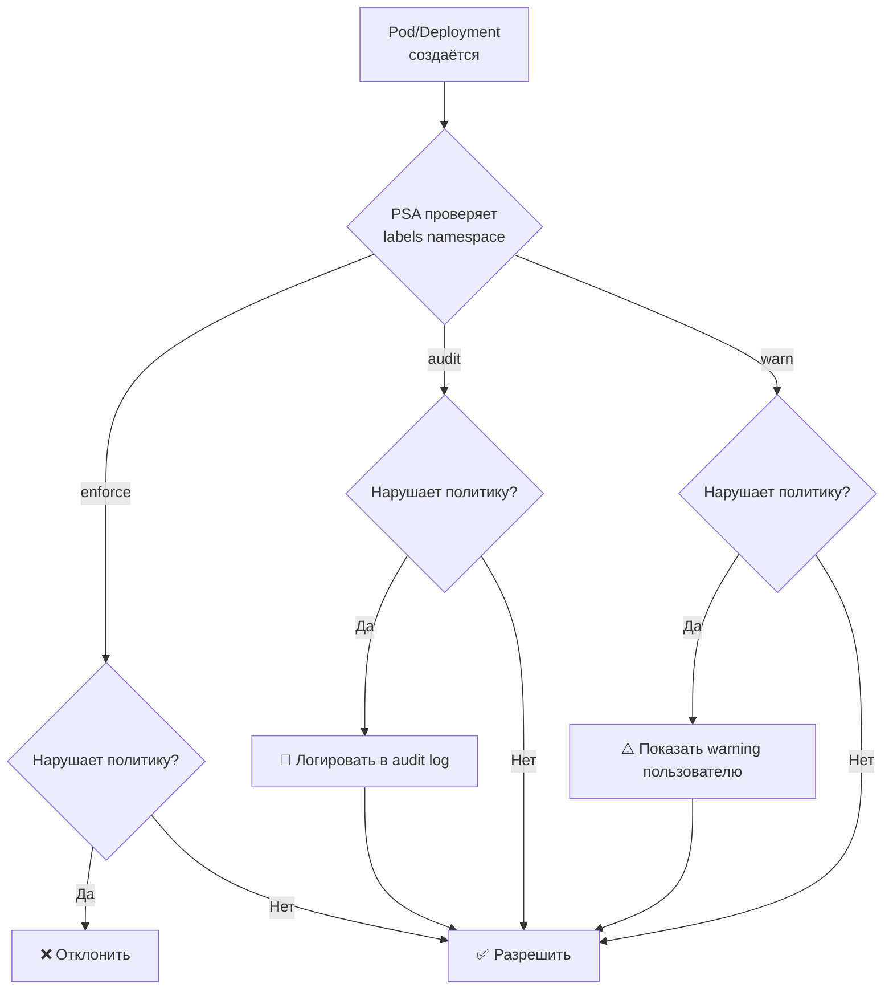

# Pod Security Admission (PSA) — применение стандартов безопасности

> 📌 PSA — встроенный admission controller (stable с v1.25), применяет **Pod Security Standards** через **labels на namespace**. 3 режима: `enforce` (блокирует), `audit` (логирует), `warn` (предупреждает). Применяется к Pod'ам и workload resources (Deployment, Job), но enforce — только к Pod'ам.

---

## 🔹 Что такое PSA

| Аспект | Описание |
|--------|----------|
| **Тип** | Built-in admission controller |
| **Статус** | ✅ Stable с v1.25 |
| **Scope** | Namespace-level (через labels) |
| **Применяется к** | Pod'ам и workload resources (Deployment, ReplicaSet, Job, etc.) |
| **Enforce** | Только к Pod'ам (не к workload resources) |
| **Audit/Warn** | К Pod'ам и workload resources |



---

## 🔹 3 режима PSA

| Режим | Поведение | Когда использовать |
|-------|-----------|-------------------|
| **`enforce`** | **Блокирует** создание Pod'а, если нарушает политику | Production, строгий контроль |
| **`audit`** | **Логирует** нарушение в audit log, но разрешает создание | Мониторинг, сбор статистики |
| **`warn`** | **Показывает предупреждение** пользователю, но разрешает создание | Soft migration, обучение |

> 💡 **Можно комбинировать**: например, `enforce: baseline`, `audit: restricted`, `warn: restricted` — блокировать нарушения baseline, но предупреждать о нарушениях restricted.

---

## 🔹 Labels для настройки PSA

### 📋 Формат labels

```yaml
# Основной label: режим и уровень
pod-security.kubernetes.io/<MODE>: <LEVEL>

# Опционально: версия политики
pod-security.kubernetes.io/<MODE>-version: <VERSION>
```

**Где**:
- `MODE`: `enforce`, `audit`, `warn`
- `LEVEL`: `privileged`, `baseline`, `restricted`
- `VERSION`: `latest` или конкретная версия K8s (например, `v1.28`)

### 📝 Пример: namespace с Baseline в enforce

```yaml
apiVersion: v1
kind: Namespace
metadata:
  name: my-app
  labels:
    # Enforce Baseline
    pod-security.kubernetes.io/enforce: "baseline"
    pod-security.kubernetes.io/enforce-version: "latest"
    
    # Audit и warn Restricted (для мониторинга)
    pod-security.kubernetes.io/audit: "restricted"
    pod-security.kubernetes.io/audit-version: "latest"
    pod-security.kubernetes.io/warn: "restricted"
    pod-security.kubernetes.io/warn-version: "latest"
```

```bash
# Применить через kubectl
kubectl label namespace my-app \
  pod-security.kubernetes.io/enforce=baseline \
  pod-security.kubernetes.io/enforce-version=latest \
  pod-security.kubernetes.io/audit=restricted \
  pod-security.kubernetes.io/audit-version=latest \
  pod-security.kubernetes.io/warn=restricted \
  pod-security.kubernetes.io/warn-version=latest

# Проверить labels
kubectl get namespace my-app --show-labels | grep pod-security
```

### 📝 Пример: namespace с Restricted в enforce

```yaml
apiVersion: v1
kind: Namespace
metadata:
  name: secure-app
  labels:
    pod-security.kubernetes.io/enforce: "restricted"
    pod-security.kubernetes.io/enforce-version: "v1.28"    # ← конкретная версия
```

### 🎯 Версионирование

```yaml
# "latest" — всегда последняя версия PSS
pod-security.kubernetes.io/enforce-version: "latest"

# Конкретная версия — зафиксировать политику
pod-security.kubernetes.io/enforce-version: "v1.28"
```

> ⚠️ **Best practice**: используй **конкретную версию** (например, `v1.28`), чтобы избежать неожиданных изменений при обновлении кластера. PSS может меняться между версиями K8s.

---

## 🔹 Применение к workload resources

> PSA применяется не только к Pod'ам, но и к **workload resources** (Deployment, ReplicaSet, Job, DaemonSet, StatefulSet, etc.).

### 🎯 Как работает

| Режим | Pod | Workload Resource (Deployment, Job, etc.) |
|-------|-----|-------------------------------------------|
| **`enforce`** | ✅ Применяется | ❌ **Не применяется** (только к Pod'ам) |
| **`audit`** | ✅ Применяется | ✅ Применяется |
| **`warn`** | ✅ Применяется | ✅ Применяется |

### 📝 Пример

```bash
# Namespace с enforce: restricted
kubectl label namespace my-app \
  pod-security.kubernetes.io/enforce=restricted \
  pod-security.kubernetes.io/enforce-version=latest

# Создать Deployment, нарушающий Restricted
kubectl apply -n my-app -f - <<EOF
apiVersion: apps/v1
kind: Deployment
metadata:
  name: bad-deployment
spec:
  replicas: 3
  selector:
    matchLabels:
      app: my-app
  template:
    metadata:
      labels:
        app: my-app
    spec:
      containers:
      - name: app
        image: nginx:1.25
        securityContext:
          runAsUser: 0    # ❌ нарушение Restricted
EOF
```

**Что произойдёт**:
1. **Deployment создастся** ✅ (enforce не применяется к workload resources)
2. **Deployment controller попытается создать Pod**
3. **Pod будет отклонён** ❌ (enforce применяется к Pod'ам)
4. **Deployment останется с 0 реплик**

```bash
# Проверить статус Deployment
kubectl get deployment bad-deployment -n my-app
# NAME             READY   UP-TO-DATE   AVAILABLE   AGE
# bad-deployment   0/3     0            0           1m

# Посмотреть события
kubectl describe deployment bad-deployment -n my-app | grep -A10 'Events:'
# Warning  FailedCreate  ...  Error creating: pods "bad-deployment-..." is forbidden: 
# violates PodSecurity "restricted:latest": runAsNonRoot != true
```

> 💡 **Audit и warn** работают для workload resources — ты увидишь предупреждения при создании Deployment, даже если Pod'ы ещё не созданы.

---

## 🔹 Исключения из политик

> Можно настроить исключения, чтобы определённые запросы **игнорировались** PSA (все режимы: enforce, audit, warn).

### 🎯 Типы исключений

| Тип | Описание | Когда использовать |
|-----|----------|-------------------|
| **Usernames** | Запросы от конкретных пользователей | Системные пользователи, админы |
| **RuntimeClassNames** | Pod'ы с определённым RuntimeClass | Sandboxed workloads (gVisor, Kata) |
| **Namespaces** | Pod'ы в определённых namespaces | System namespaces (kube-system) |

### ⚙️ Настройка исключений

Исключения настраиваются в **конфигурации API-сервера**:

```yaml
# kube-apiserver configuration
apiVersion: apiserver.config.k8s.io/v1
kind: AdmissionConfiguration
plugins:
- name: PodSecurity
  configuration:
    apiVersion: pod-security.admission.config.k8s.io/v1
    kind: PodSecurityConfiguration
    defaults:
      enforce: "restricted"
      enforce-version: "latest"
    exemptions:
      # Исключения по usernames
      usernames:
      - "system:serviceaccount:kube-system:replicaset-controller"
      - "system:serviceaccount:kube-system:deployment-controller"
      
      # Исключения по RuntimeClass
      runtimeClasses:
      - "gvisor"
      - "kata"
      
      # Исключения по namespaces
      namespaces:
      - "kube-system"
      - "kube-public"
      - "kube-node-lease"
```

### ⚠️ Ограничения исключений

> ⚠️ **Важно**: исключения для usernames **не работают** для Pod'ов, созданных контроллерами.

**Пример**:
- Ты добавил исключение для `system:serviceaccount:kube-system:deployment-controller`
- Пользователь создаёт Deployment → Deployment controller создаёт Pod
- Pod **НЕ исключён** из проверки (потому что его создал контроллер, а не пользователь напрямую)

**Решение**: используй исключения по **namespaces** для системных компонентов.

---

## 🔹 Обновления полей, которые не проверяются

> Некоторые обновления Pod'а **не проверяются** PSA, даже если Pod нарушает политику.

### 🎯 Поля, которые можно обновлять без проверки

| Поле | Описание |
|------|----------|
| **Metadata** | Любые изменения метаданных (labels, annotations), **кроме** seccomp/AppArmor аннотаций |
| **`.spec.activeDeadlineSeconds`** | Срок жизни Job |
| **`.spec.tolerations`** | Tolerations для нод |

### 📝 Пример

```bash
# Pod нарушает Restricted (runAsUser: 0)
kubectl apply -n secure-app -f - <<EOF
apiVersion: v1
kind: Pod
metadata:
  name: legacy-pod
  labels:
    app: legacy
spec:
  containers:
  - name: app
    image: nginx:1.25
    securityContext:
      runAsUser: 0    # ❌ нарушение Restricted
EOF
# ❌ Ошибка: violates PodSecurity "restricted:latest"

# Но если Pod уже существует (создан до включения PSA)
# Можно обновить labels
kubectl label pod legacy-pod version=v2 -n secure-app
# ✅ Успешно (metadata не проверяется)

# Можно обновить tolerations
kubectl patch pod legacy-pod -n secure-app --type='merge' -p='{"spec":{"tolerations":[{"key":"node-role.kubernetes.io/master","effect":"NoSchedule"}]}}'
# ✅ Успешно (tolerations не проверяется)

# Но нельзя обновить securityContext
kubectl patch pod legacy-pod -n secure-app --type='merge' -p='{"spec":{"containers":[{"name":"app","securityContext":{"runAsUser":1000}}]}}'
# ❌ Ошибка: violates PodSecurity "restricted:latest"
```

---

## 🔹 Метрики PSA

> PSA предоставляет метрики Prometheus для мониторинга.

### 📊 Доступные метрики

| Метрика | Описание |
|---------|----------|
| `pod_security_errors_total` | Количество ошибок при оценке политики |
| `pod_security_evaluations_total` | Количество проведённых оценок (исключая exempted) |
| `pod_security_exemptions_total` | Количество exempted запросов |

### 📝 Пример запросов Prometheus

```promql
# Количество нарушений enforce за последние 5 минут
increase(pod_security_evaluations_total{decision="deny"}[5m])

# Количество audit violations за последние 5 минут
increase(pod_security_evaluations_total{decision="allow", mode="audit"}[5m])

# Количество exempted запросов
increase(pod_security_exemptions_total[5m])

# Ошибки PSA
increase(pod_security_errors_total[5m])
```

### 🎯 Алерты

```yaml
# Пример алерта для Prometheus
groups:
- name: pod-security-admission
  rules:
  - alert: PodSecurityEnforceViolations
    expr: increase(pod_security_evaluations_total{decision="deny"}[5m]) > 10
    for: 5m
    labels:
      severity: warning
    annotations:
      summary: "Много нарушений Pod Security enforce"
      description: "За последние 5 минут {{ $value }} Pod'ов отклонено PSA"
  
  - alert: PodSecurityErrors
    expr: increase(pod_security_errors_total[5m]) > 0
    for: 1m
    labels:
      severity: critical
    annotations:
      summary: "Ошибки в Pod Security Admission"
      description: "PSA возвращает ошибки: {{ $value }} за последние 5 минут"
```

---

## 🔹 Практика: настройка PSA

### 🚀 Пошаговая настройка

```bash
# 1. Создать namespace с Baseline в enforce
kubectl create namespace my-app
kubectl label namespace my-app \
  pod-security.kubernetes.io/enforce=baseline \
  pod-security.kubernetes.io/enforce-version=latest

# 2. Попробовать создать Pod, нарушающий Baseline
kubectl apply -n my-app -f - <<EOF
apiVersion: v1
kind: Pod
metadata:
  name: bad-pod
spec:
  hostNetwork: true              # ❌ нарушение Baseline
  containers:
  - name: app
    image: nginx:1.25
EOF
# Error from server (Forbidden): violates PodSecurity "baseline:latest": 
# host namespaces (hostNetwork=true)

# 3. Создать Pod, соответствующий Baseline
kubectl apply -n my-app -f - <<EOF
apiVersion: v1
kind: Pod
metadata:
  name: good-pod
spec:
  containers:
  - name: app
    image: nginx:1.25
EOF
# pod/good-pod created

# 4. Добавить audit и warn для Restricted
kubectl label namespace my-app \
  pod-security.kubernetes.io/audit=restricted \
  pod-security.kubernetes.io/audit-version=latest \
  pod-security.kubernetes.io/warn=restricted \
  pod-security.kubernetes.io/warn-version=latest

# 5. Создать Pod, нарушающий Restricted (но passing Baseline)
kubectl apply -n my-app -f - <<EOF
apiVersion: v1
kind: Pod
metadata:
  name: restricted-violation
spec:
  containers:
  - name: app
    image: nginx:1.25
    securityContext:
      runAsUser: 0               # ❌ нарушение Restricted
EOF
# Warning: would violate PodSecurity "restricted:latest": 
# runAsNonRoot != true, allowPrivilegeEscalation != false
# pod/restricted-violation created  # ← создан, но с warning

# 6. Проверить audit log
kubectl get events -n my-app --field-selector reason=PolicyViolation

# 7. Переключить на enforce: restricted
kubectl label namespace my-app \
  pod-security.kubernetes.io/enforce=restricted \
  pod-security.kubernetes.io/enforce-version=latest \
  --overwrite

# 8. Попробовать создать Pod, нарушающий Restricted
kubectl apply -n my-app -f - <<EOF
apiVersion: v1
kind: Pod
metadata:
  name: restricted-violation-2
spec:
  containers:
  - name: app
    image: nginx:1.25
    securityContext:
      runAsUser: 0               # ❌ нарушение Restricted
EOF
# Error from server (Forbidden): violates PodSecurity "restricted:latest": 
# runAsNonRoot != true, allowPrivilegeEscalation != false
```

### 🔍 Отладка

```bash
# Проверить labels namespace
kubectl get namespace my-app --show-labels | grep pod-security

# Посмотреть события namespace (audit/warn логи)
kubectl get events -n my-app --field-selector reason=PolicyViolation

# Посмотреть детали нарушения в событиях Pod
kubectl describe pod bad-pod -n my-app | grep -A10 'Events:'

# Проверить audit log (если включён)
kubectl get --raw /apis/audit.k8s.io/v1/events | jq '.items[] | select(.objectRef.resource=="pods") | {verb: .verb, user: .user.username, object: .objectRef.name, level: .level}'

# Посмотреть метрики PSA
kubectl get --raw /metrics | grep pod_security
# pod_security_evaluations_total{decision="allow",mode="enforce",policy_level="baseline",request_operation="create",resource="pod",subresource=""} 5
# pod_security_evaluations_total{decision="deny",mode="enforce",policy_level="restricted",request_operation="create",resource="pod",subresource=""} 2
```

### ⚠️ Частые проблемы

| Проблема | Причина | Решение |
|----------|---------|---------|
| **Pod не создаётся** | Нарушает enforce политику | Исправить securityContext |
| **Deployment создан, но 0 реплик** | Pod'ы отклоняются PSA | Проверить template в Deployment |
| **System pods не запускаются** | kube-system не имеет Privileged | Добавить label `enforce=privileged` на kube-system |
| **Audit/warn не работают** | Labels не применены | Проверить `kubectl get ns --show-labels` |
| **Версия политики не совпадает** | Указана старая версия | Использовать `latest` или конкретную версию K8s |
| **Исключения не работают** | Исключения для usernames не работают для контроллеров | Использовать исключения по namespaces |

---

## 🔹 Gradual rollout: от audit к enforce

> Best practice: начинай с `audit`/`warn`, анализируй нарушения, потом переключай на `enforce`.

### 📋 План миграции

```bash
# Фаза 1: Audit (сбор статистики)
kubectl label namespace my-app \
  pod-security.kubernetes.io/audit=restricted \
  pod-security.kubernetes.io/audit-version=latest

# Ждать 1-2 недели, собирать статистику
kubectl get events -n my-app --field-selector reason=PolicyViolation | wc -l

# Фаза 2: Warn (предупреждения пользователям)
kubectl label namespace my-app \
  pod-security.kubernetes.io/warn=restricted \
  pod-security.kubernetes.io/warn-version=latest

# Ждать 1-2 недели, собирать feedback от разработчиков

# Фаза 3: Enforce (строгий контроль)
kubectl label namespace my-app \
  pod-security.kubernetes.io/enforce=restricted \
  pod-security.kubernetes.io/enforce-version=latest \
  --overwrite
```

### 📊 Анализ нарушений

```bash
# Посмотреть все нарушения
kubectl get events -n my-app --field-selector reason=PolicyViolation -o json | jq -r '.items[] | {pod: .involvedObject.name, message: .message}'

# Группировка по типам нарушений
kubectl get events -n my-app --field-selector reason=PolicyViolation -o json | jq -r '.items[].message' | grep -o 'violates PodSecurity "[^"]*"' | sort | uniq -c | sort -rn
#   15 violates PodSecurity "restricted:latest": runAsNonRoot != true
#   10 violates PodSecurity "restricted:latest": allowPrivilegeEscalation != false
#    5 violates PodSecurity "restricted:latest": seccompProfile

# Экспорт в CSV для анализа
kubectl get events -n my-app --field-selector reason=PolicyViolation -o json | jq -r '.items[] | [.involvedObject.name, .message] | @csv' > psa-violations.csv
```

---

## 🔹 Чек-лист: настройка PSA

```bash
# ✅ 1. Определить уровень безопасности для каждого namespace
#    - kube-system, kube-public, kube-node-lease → Privileged
#    - Системные addons (monitoring, logging) → Privileged или Baseline
#    - Обычные приложения → Baseline или Restricted
#    - Критичные приложения, multi-tenant → Restricted

# ✅ 2. Начать с audit/warn (gradual rollout)
kubectl label namespace <ns> \
  pod-security.kubernetes.io/audit=restricted \
  pod-security.kubernetes.io/audit-version=latest \
  pod-security.kubernetes.io/warn=restricted \
  pod-security.kubernetes.io/warn-version=latest

# ✅ 3. Анализировать нарушения (1-2 недели)
kubectl get events -n <ns> --field-selector reason=PolicyViolation

# ✅ 4. Исправить манифесты подов
#    - Для Baseline: убрать privileged, hostNetwork, hostPath
#    - Для Restricted: добавить runAsNonRoot, drop ALL capabilities, seccomp

# ✅ 5. Переключить на enforce
kubectl label namespace <ns> \
  pod-security.kubernetes.io/enforce=restricted \
  pod-security.kubernetes.io/enforce-version=latest \
  --overwrite

# ✅ 6. Настроить мониторинг
#    - Метрики PSA: pod_security_evaluations_total, pod_security_errors_total
#    - Алерты на violations и errors
#    - Регулярный аудит labels namespaces

# ✅ 7. Настроить исключения (если нужно)
#    - Exemptions в конфигурации API-сервера
#    - Usernames, RuntimeClassNames, Namespaces
```

> 💡 **Совет для конспекта**:
> 1. Создай файл `00_psa_cheatsheet.md` с шпаргалкой по labels и командам.
> 2. Добавь блок «Частые ошибки»: «забыл version label", "применил Restricted к kube-system", "использовал username exemptions для контроллеров".
> 3. Веди список "Какие PSA у нас в кластере": namespace, enforce/audit/warn уровни, версии.

---

## 🔹 Ключевые выводы

1. **PSA** — встроенный admission controller (stable с v1.25), применяет PSS через labels на namespace.
2. **3 режима**: `enforce` (блокирует), `audit` (логирует), `warn` (предупреждает).
3. **Labels**: `pod-security.kubernetes.io/<MODE>: <LEVEL>` и опционально `<MODE>-version: <VERSION>`.
4. **Enforce** применяется только к Pod'ам, **audit/warn** — к Pod'ам и workload resources.
5. **Исключения**: usernames, runtimeClassNames, namespaces (настраиваются в конфигурации API-сервера).
6. **Обновления metadata, activeDeadlineSeconds, tolerations** не проверяются PSA.
7. **Метрики**: `pod_security_evaluations_total`, `pod_security_errors_total`, `pod_security_exemptions_total`.
8. **Gradual rollout**: начинай с `audit`/`warn`, анализируй нарушения, потом переключай на `enforce`.
9. **System namespaces** (`kube-system`, `kube-public`, `kube-node-lease`) требуют `Privileged`.
10. **Версионирование**: используй конкретную версию (`v1.28`) или `latest`