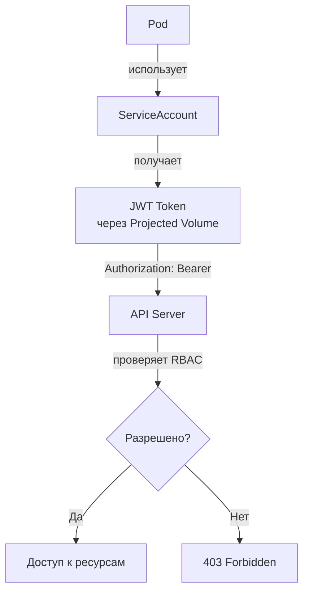

# Service Accounts — идентификация подов и автоматизации

> 📌 `ServiceAccount` — не-человеческая идентификация в K8s для подов и автоматизации. Каждый namespace имеет `default` SA. Поды получают JWT-токены через **Projected Volume** (рекомендуется, v1.20+) или **TokenRequest API**. Старый способ через `Secret` — **устарел и небезопасен** (токены не истекают).

---

## 🔹 Что такое ServiceAccount

| Аспект | Описание |
|--------|----------|
| **Назначение** | Идентификация подов, системных компонентов, автоматизации (CI/CD) |
| **Scope** | Namespace-scoped (привязан к namespace) |
| **Объект API** | `ServiceAccount` (v1) |
| **Аутентификация** | JWT-токены (подписанные API-сервером) |
| **Авторизация** | RBAC (Role/ClusterRole + RoleBinding/ClusterRoleBinding) |
| **По умолчанию** | `default` SA в каждом namespace |

### 🆚 ServiceAccount vs User

| Характеристика | ServiceAccount | User / Group |
|----------------|----------------|--------------|
| **Тип** | Нечеловеческий (поды, автоматизация) | Человек (разработчики, админы) |
| **Где хранится** | В K8s API (объект `ServiceAccount`) | Внешне (LDAP, OIDC, x509, cloud IAM) |
| **Namespace** | ✅ Да (scoped) | ❌ Нет (cluster-wide) |
| **Токены** | JWT, автоматически выдаются K8s | Зависит от провайдера |
| **Создание** | `kubectl create sa <name>` | Зависит от провайдера (нет API) |
| **Использование** | Поды, CI/CD, внешние сервисы | Люди через `kubectl`, UI |



---

## 🔹 Default ServiceAccount

Каждый namespace при создании автоматически получает SA с именем `default`:

```bash
# Посмотреть default SA
kubectl get sa -n default
# NAME      SECRETS   AGE
# default   0         10d

# Посмотреть детали
kubectl describe sa default -n default
# Name:                default
# Namespace:           default
# Labels:              <none>
# Annotations:         <none>
# Image pull secrets:  <none>
# Mountable secrets:   <none>
# Tokens:              <none>
```

### ⚠️ Особенности default SA

- Если удалить `default` SA — контроллер автоматически создаст новый
- Поды без явного указания `serviceAccountName` используют `default`
- **Не имеет никаких специальных прав** (кроме базового API discovery)
- **Не рекомендуется** использовать для рабочих нагрузок — создавай отдельные SA

---

## 🔹 Назначение ServiceAccount поду

### 📝 Базовый пример

```yaml
apiVersion: v1
kind: ServiceAccount
metadata:
  name: my-app-sa
  namespace: default
---
apiVersion: v1
kind: Pod
metadata:
  name: my-app
  namespace: default
spec:
  serviceAccountName: my-app-sa    # ← назначение SA
  automountServiceAccountToken: true    # ← по умолчанию true
  containers:
  - name: app
    image: my-app:latest
```

### 🔒 Отключение автоматического монтирования токена

Если под **не нуждается** в доступе к API K8s — отключи монтирование токена:

```yaml
spec:
  serviceAccountName: my-app-sa
  automountServiceAccountToken: false    # ← токен НЕ монтируется
  containers:
  - name: app
    image: my-app:latest
```

> 💡 **Best practice**: всегда устанавливай `automountServiceAccountToken: false`, если под не общается с API K8s. Это снижает риск компрометации.

### 📝 Проверка монтирования

```bash
# Проверить, какой SA используется подом
kubectl get pod my-app -o jsonpath='{.spec.serviceAccountName}'
# my-app-sa

# Проверить, смонтирован ли токен
kubectl exec my-app -- ls /var/run/secrets/kubernetes.io/serviceaccount/
# ca-cert  namespace  token

# Посмотреть содержимое токена (JWT)
kubectl exec my-app -- cat /var/run/secrets/kubernetes.io/serviceaccount/token
# eyJhbGciOiJSUzI1NiIsImtpZCI6Ij...

# Декодировать JWT (без проверки подписи)
kubectl exec my-app -- cat /var/run/secrets/kubernetes.io/serviceaccount/token | cut -d. -f2 | base64 -d 2>/dev/null | jq
# {
#   "aud": ["https://kubernetes.default.svc.cluster.local"],
#   "exp": 1735689600,
#   "iat": 1735603200,
#   "iss": "https://kubernetes.default.svc.cluster.local",
#   "kubernetes.io": {
#     "namespace": "default",
#     "pod": {"name": "my-app", "uid": "..."},
#     "serviceaccount": {"name": "my-app-sa", "uid": "..."}
#   },
#   "sub": "system:serviceaccount:default:my-app-sa"
# }
```

---

## 🔹 Способы получения токена ServiceAccount

| Способ | Статус | Особенности | Когда использовать |
|--------|--------|-------------|-------------------|
| **Projected Volume** | ✅ Рекомендуется (v1.20+) | Автоматическая ротация, привязан к Pod, истекает | Стандартный способ для подов |
| **TokenRequest API** | ✅ Рекомендуется | Запрос токена из кода приложения, гибкая настройка audience | Кастомные сценарии, внешние сервисы |
| **Secret-based token** | ❌ Устарел (v1.24+) | Долгосрочный, не истекает, не ротируется | **Не использовать!** Только для legacy |

### 1️⃣ Projected Volume (рекомендуется)

```yaml
apiVersion: v1
kind: Pod
metadata:
  name: my-app
spec:
  serviceAccountName: my-app-sa
  containers:
  - name: app
    image: my-app:latest
    volumeMounts:
    - name: sa-token
      mountPath: /var/run/secrets/kubernetes.io/serviceaccount
      readOnly: true
  volumes:
  - name: sa-token
    projected:
      sources:
      - serviceAccountToken:
          audience: api              # ← audience токена
          expirationSeconds: 3600    # ← срок жизни (1 час)
          path: token
      - configMap:
          name: kube-root-ca.crt
          items:
          - key: ca.crt
            path: ca.crt
      - downwardAPI:
          items:
          - path: namespace
            fieldRef:
              fieldPath: metadata.namespace
```

**Преимущества**:
- ✅ Токен **автоматически ротируется** kubelet'ом
- ✅ **Привязан к Pod** — при удалении пода токен аннулируется
- ✅ Можно настроить **audience** и **expiration**
- ✅ Не создаёт лишних Secret'ов в etcd

### 2️⃣ TokenRequest API (для кастомных сценариев)

```bash
# Запросить токен для SA (из kubectl)
kubectl create token my-app-sa --duration=1h --audience=api
# eyJhbGciOiJSUzI1NiIsImtpZCI6Ij...

# Запросить токен с кастомным audience
kubectl create token my-app-sa --audience=my-external-service --duration=2h

# Запросить токен, привязанный к Pod
kubectl create token my-app-sa --bound-object-kind=Pod --bound-object-name=my-app --bound-object-uid=<pod-uid>
```

**Из кода приложения** (Go пример):
```go
import (
    authenticationv1 "k8s.io/api/authentication/v1"
    metav1 "k8s.io/apimachinery/pkg/apis/meta/v1"
    "k8s.io/client-go/kubernetes"
)

func getServiceAccountToken(clientset *kubernetes.Clientset, saName, namespace string) (string, error) {
    tokenRequest := &authenticationv1.TokenRequest{
        Spec: authenticationv1.TokenRequestSpec{
            Audiences:         []string{"my-external-service"},
            ExpirationSeconds: func() *int64 { v := int64(3600); return &v }(),
        },
    }
    result, err := clientset.CoreV1().ServiceAccounts(namespace).CreateToken(
        context.TODO(), saName, tokenRequest, metav1.CreateOptions{},
    )
    if err != nil {
        return "", err
    }
    return result.Status.Token, nil
}
```

### 3️⃣ Secret-based token (❌ устарело)

```yaml
# ❌ НЕ РЕКОМЕНДУЕТСЯ — только для legacy
apiVersion: v1
kind: Secret
metadata:
  name: my-app-sa-token
  annotations:
    kubernetes.io/service-account.name: my-app-sa
type: kubernetes.io/service-account-token
```

**Почему плохо**:
- ❌ Токен **не истекает** (пока не удалишь Secret)
- ❌ **Не ротируется** автоматически
- ❌ Если токен скомпрометирован — злоумышленник имеет доступ навсегда
- ❌ С v1.24 **не создаётся автоматически** (нужно создавать вручную)

---

## 🔹 RBAC для ServiceAccount

> ServiceAccount сам по себе **не имеет прав**. Права даются через RBAC (Role + RoleBinding).

### 📝 Пример: SA с доступом на чтение Pod'ов

```yaml
# 1. ServiceAccount
apiVersion: v1
kind: ServiceAccount
metadata:
  name: pod-reader-sa
  namespace: default
---
# 2. Role (что можно делать)
apiVersion: rbac.authorization.k8s.io/v1
kind: Role
metadata:
  name: pod-reader
  namespace: default
rules:
- apiGroups: [""]
  resources: ["pods"]
  verbs: ["get", "list", "watch"]
---
# 3. RoleBinding (привязка Role к SA)
apiVersion: rbac.authorization.k8s.io/v1
kind: RoleBinding
metadata:
  name: pod-reader-binding
  namespace: default
subjects:
- kind: ServiceAccount
  name: pod-reader-sa
  namespace: default
roleRef:
  kind: Role
  name: pod-reader
  apiGroup: rbac.authorization.k8s.io
---
# 4. Pod, использующий SA
apiVersion: v1
kind: Pod
metadata:
  name: pod-reader
  namespace: default
spec:
  serviceAccountName: pod-reader-sa
  containers:
  - name: app
    image: bitnami/kubectl:latest
    command: ["sleep", "infinity"]
```

```bash
# Проверить, что под может читать поды
kubectl exec pod-reader -- kubectl get pods
# NAME         READY   STATUS    AGE
# my-app       1/1     Running   5m
# pod-reader   1/1     Running   1m

# Проверить, что под НЕ может удалять поды
kubectl exec pod-reader -- kubectl delete pod my-app
# Error from server (Forbidden): pods "my-app" is forbidden: User "system:serviceaccount:default:pod-reader-sa" cannot delete resource "pods" in API group "" in the namespace "default"
```

### 🔗 Cross-namespace доступ

```yaml
# SA в namespace "dev" может читать Jobs в namespace "maintenance"
apiVersion: rbac.authorization.k8s.io/v1
kind: Role
metadata:
  name: job-reader
  namespace: maintenance          # ← целевой namespace
rules:
- apiGroups: ["batch"]
  resources: ["jobs"]
  verbs: ["get", "list", "watch"]
---
apiVersion: rbac.authorization.k8s.io/v1
kind: RoleBinding
metadata:
  name: job-reader-binding
  namespace: maintenance          # ← привязка в целевом namespace
subjects:
- kind: ServiceAccount
  name: dev-sa
  namespace: dev                  # ← SA из другого namespace
roleRef:
  kind: Role
  name: job-reader
  apiGroup: rbac.authorization.k8s.io
```

> 💡 **Подробнее про RBAC** — в следующей теме `20_k8s_rbac.md`.

---

## 🔹 Аудитория токенов (Token Audience)

> Audience определяет, **для какой системы** предназначен токен. Токен с audience `api` не будет принят внешним сервисом, и наоборот.

### 🎯 Зачем нужно

```
Токен с audience "api"           → работает только с K8s API Server
Токен с audience "my-service"    → работает только с my-service
Токен с audience "api,my-service" → работает с обоими
```

### 📝 Пример: токен для внешнего сервиса

```yaml
apiVersion: v1
kind: Pod
metadata:
  name: my-app
spec:
  serviceAccountName: my-app-sa
  containers:
  - name: app
    image: my-app:latest
    volumeMounts:
    - name: sa-token
      mountPath: /var/run/secrets/tokens
      readOnly: true
  volumes:
  - name: sa-token
    projected:
      sources:
      - serviceAccountToken:
          audience: https://my-external-service.example.com    # ← audience для внешнего сервиса
          expirationSeconds: 3600
          path: external-token
```

### 🛡️ NodeAudienceRestriction (beta, v1.33+)

> Ограничивает kubelet в запросе токенов только для тех audience, которые уже используются подами на ноде.

```bash
# Включить feature gate
--feature-gates=ServiceAccountNodeAudienceRestriction=true
```

**Зачем**: защита от компрометации kubelet'а — он не сможет запросить токен для произвольного audience.

---

## 🔹 Аутентификация токена

### 🔄 Как API-сервер проверяет JWT

```
1. Клиент отправляет: Authorization: Bearer <token>
2. API-сервер:
   a. Проверяет подпись токена (RSA/ECDSA)
   b. Проверяет срок действия (exp)
   c. Проверяет, что объект (Pod/SA) всё ещё существует
   d. Проверяет audience
   e. Проверяет, что токен не отозван
3. Если всё OK → извлекает identity: system:serviceaccount:<namespace>:<name>
4. Передаёт identity в авторизатор (RBAC)
```

### 🔍 TokenReview API (для внешних сервисов)

Если твой **внешний сервис** хочет проверить токен SA — используй `TokenReview`:

```bash
# Запросить проверку токена
kubectl create -f - <<EOF
apiVersion: authentication.k8s.io/v1
kind: TokenReview
spec:
  token: <jwt-token>
  audiences:
  - my-external-service
EOF
```

**Ответ**:
```yaml
status:
  authenticated: true
  user:
    username: system:serviceaccount:default:my-app-sa
    groups:
    - system:serviceaccounts
    - system:serviceaccounts:default
    - system:authenticated
    extra:
      authentication.kubernetes.io/pod-name:
      - my-app
      authentication.kubernetes.io/pod-uid:
      - abc123...
    audiences:
    - my-external-service
```

> 💡 **Важно**: `TokenReview` проверяет, что Pod/SA **всё ещё существуют**. Если Pod удалён — токен становится недействительным (даже если срок не истёк).

---

## 🔹 Альтернативы ServiceAccount

| Альтернатива | Описание | Когда использовать |
|--------------|----------|-------------------|
| **SPIFFE/SPIRE** (CSI driver) | X.509 сертификаты для подов | Zero-trust, service mesh |
| **Service Mesh** (Istio, Linkerd) | mTLS между подами, сертификаты | Микросервисы, observability |
| **OIDC** (Keycloak, Auth0) | Токены от внешнего IdP | Внешние пользователи, SSO |
| **Cloud IAM** (AWS IAM, GCP IAM) | Идентификация через cloud provider | Workloads в облаке (IRSA, WIF) |
| **Webhook Token Authentication** | Кастомный webhook для проверки токенов | Legacy системы, кастомная логика |
| **X.509 client certificates** | Клиентские сертификаты | Legacy, high-security |

### 🌩️ Cloud IAM (пример для AWS EKS — IRSA)

```yaml
# Аннотация для IAM Role for Service Accounts (IRSA)
apiVersion: v1
kind: ServiceAccount
metadata:
  name: my-app-sa
  namespace: default
  annotations:
    eks.amazonaws.com/role-arn: arn:aws:iam::123456789012:role/my-app-role
```

> 💡 **Best practice для облака**: используй IAM роли вместо долгоживущих credentials.

---

## 🔹 Практика: создание и использование SA

### 🚀 Пошаговая настройка

```bash
# 1. Создать ServiceAccount
kubectl create sa my-app-sa -n default

# 2. Создать Role (права)
kubectl apply -f - <<EOF
apiVersion: rbac.authorization.k8s.io/v1
kind: Role
metadata:
  name: configmap-reader
  namespace: default
rules:
- apiGroups: [""]
  resources: ["configmaps"]
  verbs: ["get", "list"]
EOF

# 3. Привязать Role к SA
kubectl create rolebinding configmap-reader-binding \
  --role=configmap-reader \
  --serviceaccount=default:my-app-sa \
  -n default

# 4. Создать Pod с SA
kubectl apply -f - <<EOF
apiVersion: v1
kind: Pod
metadata:
  name: my-app
  namespace: default
spec:
  serviceAccountName: my-app-sa
  automountServiceAccountToken: true
  containers:
  - name: app
    image: bitnami/kubectl:latest
    command: ["sleep", "infinity"]
EOF

# 5. Проверить доступ
kubectl exec my-app -- kubectl get configmaps
# NAME               DATA   AGE
# kube-root-ca.crt   1      10d

# 6. Проверить, что нет лишних прав
kubectl exec my-app -- kubectl get secrets
# Error from server (Forbidden): secrets is forbidden: User "system:serviceaccount:default:my-app-sa" cannot list resource "secrets" in API group "" in the namespace "default"
```

### 🔍 Отладка

```bash
# Проверить, какой SA используется подом
kubectl get pod my-app -o jsonpath='{.spec.serviceAccountName}'

# Проверить, какие токены смонтированы
kubectl exec my-app -- ls -la /var/run/secrets/kubernetes.io/serviceaccount/

# Посмотреть, какие RBAC-права есть у SA
kubectl auth can-i --list --as=system:serviceaccount:default:my-app-sa -n default
# Resources                                       Non-Resource URLs   Resource Names   Verbs
# configmaps                                      []                  []               [get list]
# selfsubjectaccessreviews.authorization.k8s.io   []                  []               [create]
# selfsubjectrulesreviews.authorization.k8s.io    []                  []               [create]

# Проверить конкретное действие
kubectl auth can-i get pods --as=system:serviceaccount:default:my-app-sa -n default
# yes

kubectl auth can-i delete pods --as=system:serviceaccount:default:my-app-sa -n default
# no

# Посмотреть все SA в namespace
kubectl get sa -n default

# Посмотреть, какие поды используют SA
kubectl get pods -A -o jsonpath='{range .items[*]}{.metadata.namespace}/{.metadata.name}{"\t"}{.spec.serviceAccountName}{"\n"}{end}'
```

### ⚠️ Частые проблемы

| Проблема | Причина | Решение |
|----------|---------|---------|
| **Pod не может получить токен** | Projected volume не настроен | Проверить `automountServiceAccountToken: true` |
| **403 Forbidden** | Нет RBAC-прав | Создать Role + RoleBinding |
| **Токен не принимается внешним сервисом** | Неверный audience | Указать правильный audience в projected volume |
| **Старый токен в Secret** | Legacy подход | Перейти на projected volume |
| **SA не существует** | Опечатка в имени | Проверить `kubectl get sa` |

---

## 🔹 Чек-лист: безопасное использование ServiceAccount

```bash
# ✅ 1. Создавать отдельные SA для каждой рабочей нагрузки
#    - НЕ использовать default SA
#    - Каждое приложение — свой SA

# ✅ 2. Отключать автоматическое монтирование, если не нужно
#    - automountServiceAccountToken: false
#    - Если под не общается с API K8s — токен не нужен

# ✅ 3. Использовать Projected Volume (не Secret)
#    - Токены ротируются автоматически
#    - Привязаны к Pod (аннулируются при удалении)

# ✅ 4. Указывать audience для токенов
#    - Ограничивать область действия токена
#    - Для K8s API: audience = "api"
#    - Для внешних сервисов: свой audience

# ✅ 5. Применять принцип минимальных привилегий (RBAC)
#    - Только необходимые verbs (get/list, не *)
#    - Только необходимые resources
#    - Только в нужном namespace

# ✅ 6. Для облачных workloads — использовать IAM (IRSA, WIF)
#    - Не хранить credentials в Secrets
#    - Использовать cloud-native идентификацию

# ✅ 7. Мониторить использование SA
#    - Аудит: кто использует какие SA
#    - Алерт на подозрительную активность
#    - Регулярный review RBAC-прав

# ✅ 8. Избегать долгоживущих токенов
#    - НЕ создавать Secret-based токены
#    - Использовать TokenRequest API с expiration
```

> 💡 **Совет для конспекта**:
> 1. Создай файл `00_sa_cheatsheet.md` с шпаргалкой по командам.
> 2. Добавь блок «Частые ошибки»: «использовал default SA», «забыл RBAC», «создал Secret-based token».
> 3. Веди список «Какие SA у нас в кластере»: имя, namespace, какие поды используют, RBAC-права.

---

## 🔹 Устаревшие функции (не использовать)

### ❌ `kubernetes.io/enforce-mountable-secrets` (deprecated с v1.32)

```yaml
# ❌ НЕ ИСПОЛЬЗОВАТЬ
metadata:
  annotations:
    kubernetes.io/enforce-mountable-secrets: "true"
```

**Что делал**: ограничивал, какие Secrets можно монтировать в поды с этим SA.
**Замена**: использовать отдельные namespaces для изоляции.

### ❌ Legacy ServiceAccount token Secrets

```yaml
# ❌ НЕ СОЗДАВАТЬ ВРУЧНУЮ
apiVersion: v1
kind: Secret
metadata:
  name: my-sa-token
  annotations:
    kubernetes.io/service-account.name: my-sa
type: kubernetes.io/service-account-token
```

**Почему плохо**: токен не истекает, не ротируется, компрометация = постоянный доступ.

---

## 🔹 Ключевые выводы

1. **ServiceAccount** — идентификация подов и автоматизации в K8s. Namespace-scoped.
2. **Default SA** создаётся автоматически в каждом namespace, но **не рекомендуется** для работы.
3. **Токены**: используй **Projected Volume** (рекомендуется) или **TokenRequest API**. **НЕ используй Secret-based токены**.
4. **Автоматическое монтирование**: отключай через `automountServiceAccountToken: false`, если под не общается с API.
5. **RBAC** — единственный способ дать SA права. Принцип минимальных привилегий.
6. **Audience** — ограничивает, где токен может быть использован. Указывай явно.
7. **TokenReview API** — для внешних сервисов, чтобы проверять токены SA.
8. **Облачные workloads**: используй IAM (IRSA для AWS, WIF для GCP) вместо credentials.
9. **Cross-namespace доступ**: через RoleBinding в целевом namespace, указывающий на SA из другого namespace.
10. **Мониторинг**: `kubectl auth can-i --list --as=system:serviceaccount:<ns>:<name>` — проверить права SA.