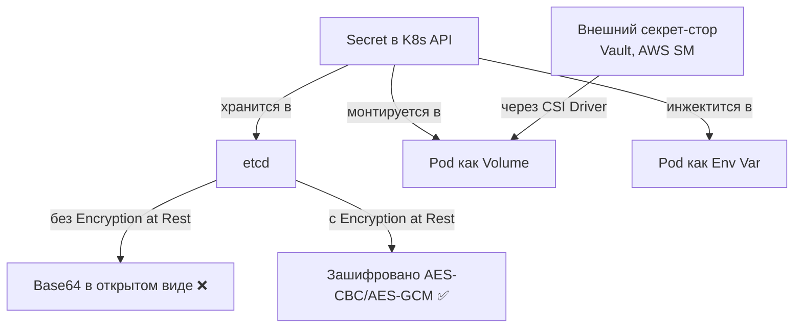

# Secrets Best Practices — безопасное управление секретами

> 📌 Секреты в K8s по умолчанию хранятся в etcd в **base64 (не зашифровано)**. Для production обязательно: (1) **Encryption at Rest** в etcd, (2) **минимальные привилегии RBAC** (особенно запрет `list`), (3) **внешние секрет-сторы** (Vault, AWS Secrets Manager) через CSI driver для критичных данных, (4) **изоляция через namespaces**, (5) **не хранить секреты в Git**.

---

## 🔹 Что такое Secret (кратко)

| Аспект | Описание |
|--------|----------|
| **Назначение** | Хранение конфиденциальных данных: пароли, токены, SSH-ключи, TLS-сертификаты |
| **Кодирование** | Base64 (по умолчанию) — **НЕ шифрование**, просто обфускация |
| **Хранение** | etcd (по умолчанию в незашифрованном виде) |
| **Использование** | Volume mount или environment variables в Pod'ах |
| **Отличие от ConfigMap** | Secret — для чувствительных данных, ConfigMap — для неконфиденциальных |



> ⚠️ **Важно**: base64 — это **не шифрование**. Любой, кто имеет доступ к Secret, может декодировать данные за секунды.

---

## 🔹 Блок 1: Для администраторов кластера

### 🔐 1. Шифрование данных в состоянии покоя (Encryption at Rest)

> По умолчанию Secrets хранятся в etcd в **base64 без шифрования**. Обязательно включи Encryption at Rest для production.

#### 📝 Настройка EncryptionConfiguration

```yaml
# /etc/kubernetes/encryption-config.yaml
apiVersion: apiserver.config.k8s.io/v1
kind: EncryptionConfiguration
resources:
  - resources:
      - secrets
    providers:
      # Первый провайдер — для шифрования новых секретов
      - aescbc:
          keys:
            - name: key1
              secret: <BASE64_ENCODED_32_BYTE_KEY>    # ← 32 байта, base64
      # Второй провайдер — для чтения старых (identity = без шифрования)
      - identity: {}
```

```bash
# Сгенерировать ключ (32 байта = 256 бит)
head -c 32 /dev/urandom | base64
# c2VjcmV0LWtleS1mb3ItZW5jcnlwdGlvbi1hdC1yZXN0

# Применить в kube-apiserver
kube-apiserver \
  --encryption-provider-config=/etc/kubernetes/encryption-config.yaml \
  --encryption-provider-config-automatic-reload=true    # ← авто-перезагрузка при изменении
```

#### 🔄 Шифрование существующих секретов

После включения шифрования **существующие** секреты остаются в base64. Нужно их перешифровать:

```bash
# Перешифровать все секреты в кластере
kubectl get secrets --all-namespaces -o json | kubectl replace -f -

# Или по одному namespace
kubectl get secrets -n my-app -o json | kubectl replace -f -
```

#### 🎯 Рекомендуемые провайдеры шифрования

| Провайдер | Описание | Когда использовать |
|-----------|----------|-------------------|
| **`aescbc`** | AES-CBC с PKCS#7 padding | Стандартный выбор, хорошая производительность |
| **`aesgcm`** | AES-GCM с nonce | Рекомендуется, но требует уникальных nonce |
| **`secretbox`** | XSalsa20-Poly1305 | Альтернатива AES |
| **`kms`** | Внешний KMS (AWS KMS, Azure Key Vault, GCP KMS) | **Production**, централизованное управление ключами |
| **`identity`** | Без шифрования | Только для чтения старых секретов при миграции |

> 💡 **Best practice**: используй **KMS-провайдер** для production — ключи хранятся в защищённом HSM, ротация автоматическая.

---

### 🔒 2. Минимальные привилегии RBAC для Secrets

> Секреты — самая чувствительная информация в кластере. Применяй **принцип минимальных привилегий**.

#### 🎯 Ключевые правила

| Правило | Почему важно |
|---------|--------------|
| **Ограничь `list` доступ** | `list` позволяет получить **все** секреты в namespace (и декодировать их) |
| **Ограничь `watch` доступ** | `watch` позволяет отслеживать изменения секретов в реальном времени |
| **Давай только `get` когда нужно** | Если приложению нужен только один секрет — дай `get` с `resourceNames` |
| **Никогда не давай `*` на secrets** |Wildcard = полный доступ ко всем секретам |
| **Ограничь доступ к etcd** | Только cluster-admin должен иметь прямой доступ к etcd |

#### 📝 Пример: безопасный RBAC для приложения

```yaml
# ❌ ПЛОХО: доступ ко всем секретам в namespace
apiVersion: rbac.authorization.k8s.io/v1
kind: Role
metadata:
  name: bad-secret-access
  namespace: my-app
rules:
- apiGroups: [""]
  resources: ["secrets"]
  verbs: ["get", "list", "watch"]    # ← слишком много прав!
---
# ✅ ХОРОШО: доступ только к конкретному секрету
apiVersion: rbac.authorization.k8s.io/v1
kind: Role
metadata:
  name: good-secret-access
  namespace: my-app
rules:
- apiGroups: [""]
  resources: ["secrets"]
  resourceNames: ["my-app-db-password"]    # ← только этот секрет
  verbs: ["get"]                            # ← только чтение
```

#### ⚠️ Опасность: Pod creation = Secret access

> Пользователь, который может **создавать Pod'ы**, может получить доступ к **любому секрету** в namespace, даже если у него нет прав на `get secrets`.

**Как это работает**:
```bash
# У пользователя есть только право создавать Pod'ы
kubectl auth can-i create pods -n my-app --as=alice
# yes

kubectl auth can-i get secrets -n my-app --as=alice
# no

# Но alice может создать Pod, который смонтирует любой секрет!
kubectl apply -n my-app -f - <<EOF
apiVersion: v1
kind: Pod
metadata:
  name: steal-secrets
spec:
  containers:
  - name: thief
    image: busybox
    command: ["sleep", "infinity"]
    volumeMounts:
    - name: secret-vol
      mountPath: /secrets
  volumes:
  - name: secret-vol
    secret:
      secretName: admin-credentials    # ← любой секрет в namespace
EOF

# Теперь alice может прочитать секрет через Pod
kubectl exec steal-secrets -n my-app -- cat /secrets/password
```

**Решение**:
- Ограничь создание Pod'ов через **Pod Security Policies** / **PSS**
- Используй **external secret stores** (Vault) — секреты не хранятся в K8s API
- Настрой **audit rules** для отслеживания подозрительной активности

#### 📝 Аудит-правила для отслеживания доступа к секретам

```yaml
# kube-apiserver audit policy
apiVersion: audit.k8s.io/v1
kind: Policy
rules:
- level: RequestResponse
  resources:
  - group: ""
    resources: ["secrets"]
  users:
  - "!system:kube-apiserver"
  - "!system:kube-controller-manager"
```

```bash
# Алерт, если один пользователь читает много секретов
kubectl get events --field-selector reason=SecretAccess -o json | jq -r '.items[] | .user.username' | sort | uniq -c | sort -rn | awk '$1 > 10 {print "ALERT: " $0}'
```

---

### 🏢 3. Изоляция через namespaces

> Используй **отдельные namespaces** для изоляции доступа к секретам.

#### 🎯 Best practices

| Практика | Описание |
|----------|----------|
| **Namespace per team/app** | Каждая команда/приложение — свой namespace |
| **Namespace per environment** | Dev, staging, production — разные namespaces |
| **Не используй default namespace** | Создай отдельные namespaces для workloads |
| **RBAC per namespace** | Role + RoleBinding (не ClusterRole + ClusterRoleBinding) |
| **NetworkPolicy** | Ограничь сетевой доступ между namespaces |

#### 📝 Пример: изоляция production

```bash
# Создать namespaces
kubectl create namespace prod-app-1
kubectl create namespace prod-app-2

# Применить RBAC только в своём namespace
kubectl create role app-1-secret-reader \
  --verb=get \
  --resource=secrets \
  --resource-name=app-1-db-password \
  -n prod-app-1

kubectl create rolebinding app-1-sa-secret-reader \
  --role=app-1-secret-reader \
  --serviceaccount=prod-app-1:app-1-sa \
  -n prod-app-1

# Теперь app-1-sa может читать только свой секрет
# app-2-sa не имеет доступа к секретам app-1
```

---

### 🗄️ 4. Hardening etcd

> etcd хранит все секреты. Защити etcd как самый критичный компонент.

#### 🎯 Checklist для etcd

| Практика | Как реализовать |
|----------|-----------------|
| **Шифрование трафика между etcd-нодами** | TLS для peer communication |
| **Ограничь доступ к etcd API** | Firewall rules, только API-сервер имеет доступ |
| **Регулярные бэкапы** | `etcdctl snapshot save` + шифрование бэкапов |
| **Wipe disks при выводе из строя** | `shred` или `dd if=/dev/urandom` для SSD/HDD |
| **Ограничь количество snapshot'ов** | Храни только последние N бэкапов |
| **Мониторинг etcd** | Метрики: `etcd_disk_backend_commit_duration_seconds`, `etcd_server_proposals_failed_total` |

```bash
# Пример: безопасное удаление etcd-ноды
# Для HDD
shred -vzn 0 /dev/sda

# Для SSD (TRIM + overwrite)
blkdiscard /dev/sda
dd if=/dev/urandom of=/dev/sda bs=1M

# Удалить данные etcd
rm -rf /var/lib/etcd/*
```

---

### 🌐 5. Внешние секрет-сторы (External Secret Stores)

> Для production используй **внешние секрет-сторы** (Vault, AWS Secrets Manager, GCP Secret Manager) вместо хранения в K8s API.

#### 🎯 Преимущества внешних сторов

| Преимущество | Описание |
|--------------|----------|
| **Централизованное управление** | Один источник правды для всех секретов |
| **Автоматическая ротация** | Секреты ротируются автоматически по расписанию |
| **Аудит и мониторинг** | Детальные логи доступа к секретам |
| **Fine-grained access control** | ACL на уровне отдельных секретов |
| **Интеграция с IAM** | AWS IAM, GCP IAM, Azure AD для доступа |
| **Не хранятся в etcd** | Секреты не попадают в K8s API → нет риска утечки через etcd backup |

#### 🔧 Secret Store CSI Driver

> Стандартный способ интеграции внешних сторов с K8s.

```bash
# Установить Secret Store CSI Driver
helm repo add secrets-store-csi-driver https://kubernetes-sigs.github.io/secrets-store-csi-driver/charts
helm install csi-secrets-store secrets-store-csi-driver/secrets-store-csi-driver

# Установить провайдер (например, Vault)
helm repo add hashicorp https://helm.releases.hashicorp.com
helm install vault-provider hashicorp/secrets-store-csi-driver-provider-vault
```

#### 📝 Пример: интеграция с HashiCorp Vault

```yaml
# SecretProviderClass — определяет, какие секреты брать из Vault
apiVersion: secrets-store.csi.x-k8s.io/v1
kind: SecretProviderClass
metadata:
  name: vault-db-secrets
  namespace: my-app
spec:
  provider: vault
  parameters:
    vaultAddress: "https://vault.example.com:8200"
    roleName: "my-app-role"
    objects: |
      - objectName: "db-password"
        secretPath: "secret/data/my-app/db"
        secretKey: "password"
      - objectName: "api-key"
        secretPath: "secret/data/my-app/api"
        secretKey: "key"
---
# Pod монтирует секреты через CSI volume
apiVersion: v1
kind: Pod
metadata:
  name: my-app
  namespace: my-app
spec:
  serviceAccountName: my-app-sa
  containers:
  - name: app
    image: my-app:latest
    volumeMounts:
    - name: secrets
      mountPath: /mnt/secrets
      readOnly: true
    env:
    - name: DB_PASSWORD
      valueFrom:
        secretKeyRef:
          name: vault-synced-secret    # ← опционально: синхронизация в K8s Secret
          key: db-password
  volumes:
  - name: secrets
    csi:
      driver: secrets-store.csi.k8s.io
      readOnly: true
      volumeAttributes:
        secretProviderClass: vault-db-secrets
```

#### 🎯 Популярные провайдеры

| Провайдер | Когда использовать |
|-----------|-------------------|
| **HashiCorp Vault** | On-premise, multi-cloud, complex policies |
| **AWS Secrets Manager** | Workloads в AWS, интеграция с IAM |
| **GCP Secret Manager** | Workloads в GCP, интеграция с IAM |
| **Azure Key Vault** | Workloads в Azure, интеграция with AD |
| **CyberArk Conjur** | Enterprise, compliance-heavy environments |
| **Doppler** | SaaS, developer-friendly |

---

### 💾 6. Управление swap

> Swap может привести к тому, что секреты из памяти попадут на диск в незашифрованном виде.

#### 🎯 Рекомендации

| Практика | Описание |
|----------|----------|
| **Отключи swap на нодах** | `swapoff -a` + удалить из `/etc/fstab` |
| **Если swap необходим** | Используй зашифрованный swap (`cryptsetup`) |
| **Ограничь swappiness** | `sysctl vm.swappiness=0` (или минимальное значение) |
| **Мониторь использование swap** | Алерт, если ноды используют swap |

```bash
# Отключить swap
sudo swapoff -a
sudo sed -i '/swap/d' /etc/fstab

# Проверить
free -h
# Swap: 0B 0B 0B

# Если swap необходим — зашифровать
sudo cryptsetup luksFormat /dev/sda2
sudo cryptsetup open /dev/sda2 cryptswap
sudo mkswap /dev/mapper/cryptswap
sudo swapon /dev/mapper/cryptswap
```

---

## 🔹 Блок 2: Для разработчиков

### 🎯 1. Ограничь доступ к секретам на уровне контейнеров

> Если в Pod несколько контейнеров — дай доступ к секрету **только тому контейнеру, которому он нужен**.

#### 📝 Пример: multi-container Pod

```yaml
apiVersion: v1
kind: Pod
metadata:
  name: multi-container-pod
spec:
  containers:
  # ✅ Главный контейнер имеет доступ к секрету
  - name: app
    image: my-app:latest
    env:
    - name: DB_PASSWORD
      valueFrom:
        secretKeyRef:
          name: db-credentials
          key: password
    volumeMounts:
    - name: secrets
      mountPath: /etc/secrets
      readOnly: true
  
  # ❌ Sidecar НЕ имеет доступа к секрету
  - name: log-collector
    image: fluentd:latest
    # Нет env и volumeMounts для секретов!
    volumeMounts:
    - name: logs
      mountPath: /var/log
  
  # ✅ Ещё один sidecar имеет доступ к другому секрету
  - name: metrics-exporter
    image: prometheus-exporter:latest
    env:
    - name: API_KEY
      valueFrom:
        secretKeyRef:
          name: metrics-credentials
          key: api-key
  
  volumes:
  - name: secrets
    secret:
      secretName: db-credentials
      items:
      - key: password
        path: db-password
  - name: logs
    emptyDir: {}
```

**Результат**:
- `app` имеет доступ к `db-credentials`
- `log-collector` **не имеет** доступа ни к каким секретам
- `metrics-exporter` имеет доступ только к `metrics-credentials`

---

### 🛡️ 2. Защищай секреты после чтения

> После того как приложение прочитало секрет (из env var или volume), оно должно **защищать** его.

#### 🎯 Best practices для приложений

| Практика | Описание |
|----------|----------|
| **Не логируй секреты** | Фильтруй sensitive данные из логов |
| **Не передавай в URL** | Секреты в URL попадают в access logs, browser history |
| **Не сохраняй в кэш** | Не кешируй секреты в Redis/Memcached без шифрования |
| **Используй memory-safe языки** | Go, Rust, Java — безопаснее, чем C/C++ (меньше риск memory leaks) |
| **Очищай память** | После использования секрета — zero out memory (если возможно) |
| **Не отправляй в error reports** | Sentry, Bugsnag — фильтруй sensitive данные |

#### 📝 Пример: безопасное чтение секрета в Go

```go
package main

import (
    "fmt"
    "io/ioutil"
    "log"
    "os"
)

func main() {
    // Читаем секрет из volume mount
    password, err := ioutil.ReadFile("/etc/secrets/db-password")
    if err != nil {
        log.Fatalf("Failed to read secret: %v", err)
    }
    
    // Используем секрет
    db, err := connectToDatabase("user", string(password))
    if err != nil {
        log.Fatalf("Failed to connect to database: %v", err)
    }
    defer db.Close()
    
    // ✅ Очищаем память после использования
    for i := range password {
        password[i] = 0
    }
    
    // ❌ НЕ ДЕЛАЙ ТАК:
    // log.Printf("Connected with password: %s", password)  // ← утечка в логи!
    // fmt.Println("Password:", string(password))           // ← вывод в stdout!
}
```

#### 📝 Пример: фильтрация секретов из логов

```go
import "regexp"

var sensitivePatterns = []*regexp.Regexp{
    regexp.MustCompile(`password=[^&\s]+`),
    regexp.MustCompile(`api_key=[^&\s]+`),
    regexp.MustCompile(`token=[^&\s]+`),
    regexp.MustCompile(`"password"\s*:\s*"[^"]+"`),
}

func sanitizeLog(message string) string {
    for _, pattern := range sensitivePatterns {
        message = pattern.ReplaceAllString(message, "[REDACTED]")
    }
    return message
}

// Использование
log.Printf(sanitizeLog("User login with password=secret123"))
// Output: User login with password=[REDACTED]
```

---

### 🚫 3. Не распространяй манифесты с секретами

> Если ты создаёшь Secret через YAML-манифест — данные в base64. **Не коммить этот файл в Git!**

#### ❌ Плохо: Secret в Git

```yaml
# ❌ НЕ КОММИТЬ В GIT!
apiVersion: v1
kind: Secret
metadata:
  name: db-credentials
type: Opaque
data:
  password: cGFzc3dvcmQxMjM=    # ← base64("password123") — любой может декодировать!
  username: YWRtaW4=            # ← base64("admin")
```

```bash
# Любой, кто имеет доступ к репозиторию, может декодировать
echo "cGFzc3dvcmQxMjM=" | base64 -d
# password123
```

#### ✅ Хорошо: внешние секрет-сторы или sealed secrets

**Вариант 1: External secrets (рекомендуется)**

```yaml
# ✅ Манифест не содержит секретов
apiVersion: external-secrets.io/v1beta1
kind: ExternalSecret
metadata:
  name: db-credentials
spec:
  secretStoreRef:
    name: vault-backend
    kind: ClusterSecretStore
  target:
    name: db-credentials
  data:
  - secretKey: password
    remoteRef:
      key: secret/data/my-app/db
      property: password
```

**Вариант 2: Sealed Secrets (для GitOps)**

```bash
# Установить Sealed Secrets controller
helm repo add sealed-secrets https://bitnami-labs.github.io/sealed-secrets
helm install sealed-secrets sealed-secrets/sealed-secrets

# Получить публичный ключ
kubeseal --fetch-cert > pub-sealed-secrets.pem

# Зашифровать Secret
kubectl create secret generic db-credentials \
  --from-literal=password=secret123 \
  --dry-run=client -o yaml | kubeseal --cert=pub-sealed-secrets.pem -o yaml > sealed-db-credentials.yaml
```

```yaml
# ✅ Можно коммитить в Git — зашифровано публичным ключом
apiVersion: bitnami.com/v1alpha1
kind: SealedSecret
metadata:
  name: db-credentials
spec:
  encryptedData:
    password: AgBy3i4OJSWK+PiTySYZZA9rO43cGDEq...    # ← зашифровано
    username: AgBz7hK5JQ3...
```

**Вариант 3: SOPS (Secrets OPerationS)**

```bash
# Установить SOPS
brew install sops

# Создать Secret с шифрованием через AWS KMS
sops --kms "arn:aws:kms:us-west-2:123456789012:key/abcd-1234" \
  --encrypt secret.yaml > secret.enc.yaml
```

```yaml
# ✅ Зашифровано через KMS, можно коммитить в Git
apiVersion: v1
kind: Secret
metadata:
  name: db-credentials
stringData:
  password: ENC[AES256_GCM,data:...,iv:...,tag:...,type:str]
sops:
  kms:
    - arn: arn:aws:kms:us-west-2:123456789012:key/abcd-1234
      created_at: "2024-01-01T00:00:00Z"
      enc: AQECAH...
```

---

## 🔹 Практика: безопасное создание Secret

### 🚀 Пошаговая настройка

```bash
# 1. Включить Encryption at Rest (для админов)
kubectl apply -f encryption-config.yaml
# Перезапустить kube-apiserver с --encryption-provider-config

# 2. Перешифровать существующие секреты
kubectl get secrets --all-namespaces -o json | kubectl replace -f -

# 3. Создать Secret через kubectl (не через YAML!)
kubectl create secret generic db-credentials \
  --from-literal=username=admin \
  --from-literal=password=$(openssl rand -base64 32) \
  -n my-app

# 4. Проверить, что Secret зашифрован в etcd
# (нужен доступ к etcd)
ETCDCTL_API=3 etcdctl get /registry/secrets/my-app/db-credentials --cacert=/etc/kubernetes/pki/etcd/ca.crt --cert=/etc/kubernetes/pki/etcd/peer.crt --key=/etc/kubernetes/pki/etcd/peer.key | hexdump -C
# Должен увидеть зашифрованные данные (не base64)

# 5. Создать RBAC с минимальными привилегиями
kubectl create role app-secret-reader \
  --verb=get \
  --resource=secrets \
  --resource-name=db-credentials \
  -n my-app

kubectl create rolebinding app-sa-secret-reader \
  --role=app-secret-reader \
  --serviceaccount=my-app:app-sa \
  -n my-app

# 6. Использовать Secret в Pod
kubectl apply -f - <<EOF
apiVersion: v1
kind: Pod
metadata:
  name: my-app
  namespace: my-app
spec:
  serviceAccountName: app-sa
  containers:
  - name: app
    image: my-app:latest
    env:
    - name: DB_PASSWORD
      valueFrom:
        secretKeyRef:
          name: db-credentials
          key: password
    volumeMounts:
    - name: secrets
      mountPath: /etc/secrets
      readOnly: true
  volumes:
  - name: secrets
    secret:
      secretName: db-credentials
EOF
```

### 🔍 Отладка

```bash
# Проверить, какие секреты есть в namespace
kubectl get secrets -n my-app

# Посмотреть детали Secret (без значений)
kubectl describe secret db-credentials -n my-app

# Декодировать значение (только для отладки!)
kubectl get secret db-credentials -n my-app -o jsonpath='{.data.password}' | base64 -d

# Проверить, кто имеет доступ к Secret
kubectl auth can-i get secrets/db-credentials -n my-app --as=system:serviceaccount:my-app:app-sa
kubectl auth can-i list secrets -n my-app --as=system:serviceaccount:my-app:app-sa

# Посмотреть audit log (если включён)
kubectl get events -n my-app --field-selector involvedObject.name=db-credentials

# Проверить EncryptionConfiguration
kubectl get --raw /apis/encryption.k8s.io/v1/encryptionconfigs
```

### ⚠️ Частые проблемы

| Проблема | Причина | Решение |
|----------|---------|---------|
| **Секреты в открытом виде в etcd** | Не включён Encryption at Rest | Настроить EncryptionConfiguration |
| **Пользователь может читать все секреты** | Даны права `list` на secrets | Ограничить до `get` с `resourceNames` |
| **Pod может получить любой секрет** | Пользователь может создавать Pod'ы | Использовать PSS, external secrets |
| **Секреты в Git** | YAML с base64 закоммичен | Использовать Sealed Secrets, SOPS, External Secrets |
| **Секреты в логах** | Приложение логирует sensitive data | Фильтровать логи, не логировать секреты |
| **Swap на нодах** | Секреты из памяти попадают на диск | Отключить swap или использовать зашифрованный swap |

---

## 🔹 Чек-лист: безопасное управление секретами

```bash
# ✅ 1. Шифрование at rest
#    - Включить EncryptionConfiguration в kube-apiserver
#    - Использовать aescbc или kms провайдер
#    - Перешифровать существующие секреты

# ✅ 2. RBAC минимальные привилегии
#    - Запретить list/watch на secrets (кроме cluster-admin)
#    - Давать только get с resourceNames
#    - Аудит доступа к секретам

# ✅ 3. Изоляция через namespaces
#    - Отдельный namespace для каждого приложения
#    - Role + RoleBinding (не ClusterRole)
#    - NetworkPolicy для ограничения сетевого доступа

# ✅ 4. Внешние секрет-сторы (для production)
#    - Vault, AWS Secrets Manager, GCP Secret Manager
#    - Secret Store CSI Driver для интеграции
#    - Автоматическая ротация секретов

# ✅ 5. Hardening etcd
#    - TLS для peer communication
#    - Ограничить доступ к etcd API
#    - Регулярные зашифрованные бэкапы
#    - Wipe disks при выводе из строя

# ✅ 6. Отключить swap
#    - swapoff -a на всех нодах
#    - Или использовать зашифрованный swap

# ✅ 7. Для разработчиков:
#    - Ограничивать доступ к секретам на уровне контейнеров
#    - Не логировать секреты
#    - Не передавать секреты в URL
#    - Очищать память после использования

# ✅ 8. GitOps безопасные секреты
#    - НЕ коммитить YAML с base64 секретами
#    - Использовать Sealed Secrets, SOPS, External Secrets
#    - Ротация ключей шифрования регулярно

# ✅ 9. Мониторинг и алертинг
#    - Алерт на массовое чтение секретов
#    - Аудит доступа к etcd
#    - Метрики: secret_access_count, etcd_request_duration_seconds

# ✅ 10. Ротация секретов
#    - Автоматическая ротация через external secret store
#    - Ротация ключей шифрования каждые 90 дней
#    - План реагирования на утечку секретов
```

> 💡 **Совет для конспекта**:
> 1. Создай файл `00_secrets_cheatsheet.md` с шпаргалкой по командам.
> 2. Добавь блок «Частые ошибки»: «закоммитил Secret в Git", "дал list на secrets", "не включил Encryption at Rest".
> 3. Веди список "Какие секреты у нас в кластере": имя, namespace, тип, кто имеет доступ.

---

## 🔹 Ключевые выводы

1. **Secrets по умолчанию хранятся в etcd в base64** — это **не шифрование**. Обязательно включи **Encryption at Rest**.
2. **Минимальные привилегии RBAC**: запрет `list`/`watch` на secrets, только `get` с `resourceNames`.
3. **Pod creation = Secret access**: пользователь, который может создавать Pod'ы, может получить доступ к любому секрету в namespace.
4. **Изоляция через namespaces**: отдельный namespace для каждого приложения, Role + RoleBinding.
5. **Внешние секрет-сторы** (Vault, AWS SM, GCP SM) — для production. Используй **Secret Store CSI Driver**.
6. **Hardening etcd**: TLS, ограничение доступа, зашифрованные бэкапы, wipe disks.
7. **Отключи swap** на нодах или используй зашифрованный swap.
8. **Для разработчиков**: ограничивай доступ к секретам на уровне контейнеров, не логируй секреты, не передавай в URL.
9. **Не коммить секреты в Git**: используй Sealed Secrets, SOPS, External Secrets.
10. **Мониторинг и ротация**: алерты на подозрительную активность, автоматическая ротация секретов.