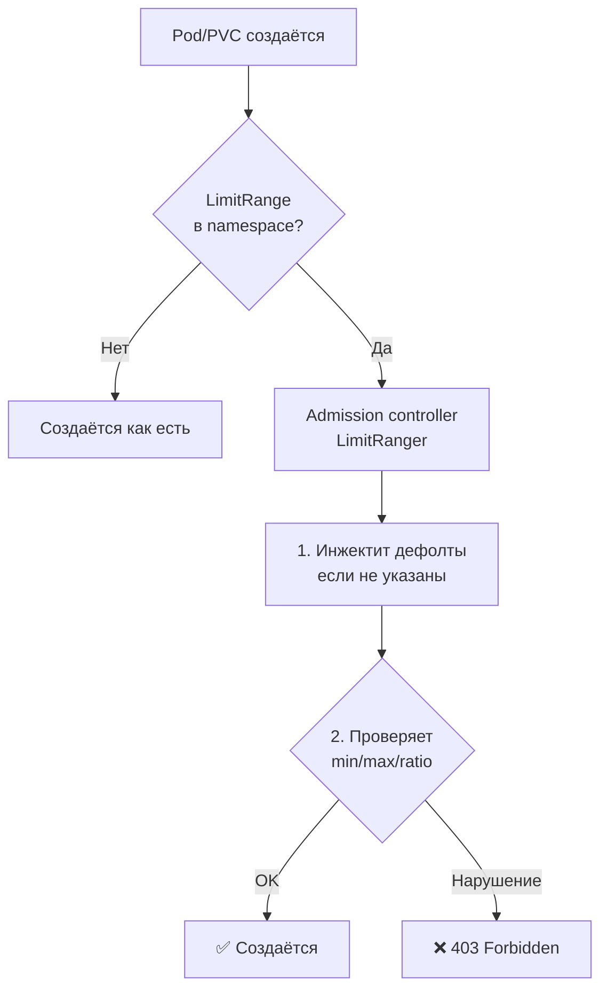

# LimitRange — ограничения ресурсов на уровне namespace

> 📌 `LimitRange` — политика, которая (1) задаёт **min/max** для CPU/memory/storage в namespace, (2) **автоматически инжектит дефолтные** requests/limits в контейнеры, если они не указаны. Работает через admission controller. Применяется к `Container`, `Pod`, `PersistentVolumeClaim`. **Проверяется только при создании/обновлении**, на уже запущенные поды не влияет.

---

## 🔹 Что такое LimitRange

| Аспект | Описание |
|--------|----------|
| **Scope** | Namespace |
| **Применяется к** | `Container`, `Pod`, `PersistentVolumeClaim` |
| **Механизм** | Admission controller `LimitRanger` |
| **Что делает** | (1) Валидирует min/max, (2) Инжектит дефолты, (3) Проверяет request/limit ratio |
| **Когда проверяется** | Только при **create/update** (не на работающих подах) |
| **Поведение при нарушении** | HTTP 403 Forbidden |



---

## 🔹 4 типа ограничений

LimitRange может устанавливать 4 типа политик:

| Тип | Что ограничивает | Когда использовать |
|-----|------------------|-------------------|
| **Min/Max** | Минимальные и максимальные ресурсы | Защита от монополизации ресурсов одним подом |
| **Default** | Дефолтные `limits` (если не указаны) | Гарантировать, что у всех контейнеров есть limits |
| **DefaultRequest** | Дефолтные `requests` (если не указаны) | Гарантировать, что у всех контейнеров есть requests |
| **Ratio** | Соотношение limit/request | Например, limit не более чем в 2 раза больше request |

---

## 🔹 Пример: LimitRange для Container

### 📝 Базовый пример

```yaml
apiVersion: v1
kind: LimitRange
metadata:
  name: container-limits
  namespace: my-app
spec:
  limits:
  - type: Container
    default:              # ← дефолтные limits (инжектятся, если не указаны)
      cpu: 500m
      memory: 512Mi
    defaultRequest:       # ← дефолтные requests (инжектятся, если не указаны)
      cpu: 100m
      memory: 128Mi
    max:                  # ← максимум, который может запросить контейнер
      cpu: "2"
      memory: 2Gi
    min:                  # ← минимум, который должен запросить контейнер
      cpu: 50m
      memory: 64Mi
    maxLimitRequestRatio: # ← соотношение limit/request (опционально)
      cpu: "2"            # limit не более чем в 2 раза больше request
      memory: "1"         # limit == request для памяти
```

### 🎯 Как работает инжект дефолтов

```yaml
# Исходный Pod (без resources)
apiVersion: v1
kind: Pod
metadata:
  name: my-pod
  namespace: my-app
spec:
  containers:
  - name: app
    image: nginx:1.25
    # resources НЕ указаны!
```

**После применения LimitRange** (то, что реально попадёт в API):

```yaml
spec:
  containers:
  - name: app
    image: nginx:1.25
    resources:
      limits:
        cpu: 500m         # ← инжектировано из default
        memory: 512Mi     # ← инжектировано из default
      requests:
        cpu: 100m         # ← инжектировано из defaultRequest
        memory: 128Mi     # ← инжектировано из defaultRequest
```

```bash
# Проверить, что дефолты применились
kubectl get pod my-pod -n my-app -o jsonpath='{.spec.containers[0].resources}'
# {"limits":{"cpu":"500m","memory":"512Mi"},"requests":{"cpu":"100m","memory":"128Mi"}}
```

---

## 🔹 Пример: LimitRange для Pod

> Ограничивает **суммарные** ресурсы всех контейнеров в Pod'е.

```yaml
apiVersion: v1
kind: LimitRange
metadata:
  name: pod-limits
  namespace: my-app
spec:
  limits:
  - type: Pod
    max:
      cpu: "4"            # ← все контейнеры в Pod вместе не более 4 CPU
      memory: 4Gi
    min:
      cpu: 100m           # ← все контейнеры в Pod вместе не менее 100m
      memory: 128Mi
```

**Когда использовать**:
- Ограничить общий footprint пода (например, для statefulset с sidecar'ами)
- Предотвратить создание "монстров" с 10+ контейнерами

---

## 🔹 Пример: LimitRange для PVC

```yaml
apiVersion: v1
kind: LimitRange
metadata:
  name: pvc-limits
  namespace: my-app
spec:
  limits:
  - type: PersistentVolumeClaim
    max:
      storage: 100Gi      # ← максимальный размер PVC
    min:
      storage: 1Gi        # ← минимальный размер PVC
```

**Когда использовать**:
- Предотвратить создание огромных PVC (например, 10TB)
- Гарантировать минимальный размер (например, для БД)

---

## 🔹 Практика: создание и проверка

### 🚀 Пошаговая настройка

```bash
# 1. Создать namespace
kubectl create namespace my-app

# 2. Создать LimitRange
kubectl apply -f - <<EOF
apiVersion: v1
kind: LimitRange
metadata:
  name: default-limits
  namespace: my-app
spec:
  limits:
  - type: Container
    default:
      cpu: 500m
      memory: 512Mi
    defaultRequest:
      cpu: 100m
      memory: 128Mi
    max:
      cpu: "2"
      memory: 2Gi
    min:
      cpu: 50m
      memory: 64Mi
EOF

# 3. Проверить, что LimitRange создан
kubectl get limitranges -n my-app
# NAME             CREATED AT
# default-limits   2024-01-01T00:00:00Z

# 4. Посмотреть детали
kubectl describe limitrange default-limits -n my-app
# Name:       default-limits
# Namespace:  my-app
# Type        Resource  Min   Max   Default Request  Default Limit  Max Limit/Request Ratio
# ----        --------  ---   ---   ---------------  -------------  -----------------------
# Container   cpu       50m   2     100m             500m           2
# Container   memory    64Mi  2Gi   128Mi            512Mi          1

# 5. Создать Pod без resources
kubectl apply -n my-app -f - <<EOF
apiVersion: v1
kind: Pod
metadata:
  name: test-pod
spec:
  containers:
  - name: app
    image: nginx:1.25
EOF

# 6. Проверить, что дефолты применились
kubectl get pod test-pod -n my-app -o jsonpath='{.spec.containers[0].resources}'
# {"limits":{"cpu":"500m","memory":"512Mi"},"requests":{"cpu":"100m","memory":"128Mi"}}
```

### 🧪 Тестирование ограничений

```bash
# ✅ OK: в пределах min/max
kubectl apply -n my-app -f - <<EOF
apiVersion: v1
kind: Pod
metadata:
  name: good-pod
spec:
  containers:
  - name: app
    image: nginx:1.25
    resources:
      requests:
        cpu: 200m
        memory: 256Mi
      limits:
        cpu: 1
        memory: 1Gi
EOF
# pod/good-pod created

# ❌ Нарушение max
kubectl apply -n my-app -f - <<EOF
apiVersion: v1
kind: Pod
metadata:
  name: bad-pod-max
spec:
  containers:
  - name: app
    image: nginx:1.25
    resources:
      requests:
        cpu: 3              # ❌ больше max (2)
        memory: 256Mi
      limits:
        cpu: 3
        memory: 1Gi
EOF
# Error from server (Forbidden): error when creating "bad-pod-max.yaml": 
# pods "bad-pod-max" is forbidden: [maximum cpu usage per Container is 2, but limit is 3]

# ❌ Нарушение min
kubectl apply -n my-app -f - <<EOF
apiVersion: v1
kind: Pod
metadata:
  name: bad-pod-min
spec:
  containers:
  - name: app
    image: nginx:1.25
    resources:
      requests:
        cpu: 10m            # ❌ меньше min (50m)
        memory: 256Mi
      limits:
        cpu: 100m
        memory: 1Gi
EOF
# Error from server (Forbidden): pods "bad-pod-min" is forbidden: 
# [minimum cpu usage per Container is 50m, but limit is 10m, request is 10m]

# ❌ Нарушение maxLimitRequestRatio
kubectl apply -n my-app -f - <<EOF
apiVersion: v1
kind: Pod
metadata:
  name: bad-pod-ratio
spec:
  containers:
  - name: app
    image: nginx:1.25
    resources:
      requests:
        cpu: 100m
        memory: 256Mi
      limits:
        cpu: 500m           # ❌ ratio = 5, но max = 2
        memory: 1Gi
EOF
# Error from server (Forbidden): pods "bad-pod-ratio" is forbidden: 
# [maximum cpu limit/request ratio is 2, but ratio is 5]
```

---

## 🔹 Подводные камни

### ⚠️ 1. Default limit < request → Pod не запланируется

> LimitRange **не проверяет** согласованность дефолтов. Если `default.limit < request` в манифесте — Pod создастся, но **не запланируется**.

#### 📝 Пример проблемы

```yaml
# LimitRange с проблемными дефолтами
apiVersion: v1
kind: LimitRange
metadata:
  name: problematic-limits
  namespace: my-app
spec:
  limits:
  - type: Container
    default:
      cpu: 500m           # ← дефолтный limit
    defaultRequest:
      cpu: 500m           # ← дефолтный request
    max:
      cpu: "1"
    min:
      cpu: 100m
---
# Pod с request > default limit
apiVersion: v1
kind: Pod
metadata:
  name: conflict-pod
  namespace: my-app
spec:
  containers:
  - name: app
    image: nginx:1.25
    resources:
      requests:
        cpu: 700m         # ← указали request, но НЕ limit
      # LimitRange инжектит limit: 500m (из default)
      # Результат: request (700m) > limit (500m) → ❌ ошибка
```

**Результат**:
```
Pod "conflict-pod" is invalid: spec.containers[0].resources.requests: 
Invalid value: "700m": must be less than or equal to cpu limit
```

#### ✅ Решение

```yaml
# Всегда указывай И request, И limit
resources:
  requests:
    cpu: 700m
  limits:
    cpu: 700m             # ← явно указываем limit
```

---

### ⚠️ 2. Несколько LimitRange в namespace → недетерминированное поведение

> Если в namespace несколько LimitRange — **не определено**, какой из них применит дефолты.

```bash
# ❌ ПЛОХО: несколько LimitRange
kubectl apply -n my-app -f limitrange-1.yaml
kubectl apply -n my-app -f limitrange-2.yaml

# ✅ ХОРОШО: один LimitRange на namespace
kubectl apply -n my-app -f single-limitrange.yaml
```

**Best practice**: **один LimitRange на namespace**.

---

### ⚠️ 3. Изменение LimitRange не влияет на существующие поды

> LimitRange проверяется **только при create/update**. Если изменил LimitRange — уже запущенные поды **не обновятся**.

```bash
# 1. Создать LimitRange с default: 500m CPU
kubectl apply -f limitrange.yaml

# 2. Создать Pod (получит 500m CPU limit)
kubectl apply -f pod.yaml

# 3. Изменить LimitRange: default → 1 CPU
kubectl apply -f limitrange-updated.yaml

# 4. Проверить Pod — всё ещё 500m!
kubectl get pod my-pod -o jsonpath='{.spec.containers[0].resources.limits.cpu}'
# 500m  ← не изменилось!

# 5. Чтобы применить новый LimitRange — пересоздать Pod
kubectl delete pod my-pod
kubectl apply -f pod.yaml
# Теперь Pod получит 1 CPU
```

---

### ⚠️ 4. LimitRange + HPA/VPA — потенциальный конфликт

> Если LimitRange задаёт дефолты, а HPA/VPA пытаются изменить resources — может возникнуть конфликт.

**Решение**:
- Убедись, что дефолты LimitRange совместимы с HPA/VPA
- Или не используй LimitRange для namespaces с HPA/VPA

---

## 🔹 Отладка

```bash
# Посмотреть все LimitRange в namespace
kubectl get limitranges -n my-app

# Детальная информация
kubectl describe limitrange <name> -n my-app

# Проверить, какие дефолты применятся к Pod
kubectl apply -n my-app -f pod.yaml --dry-run=server -o yaml | grep -A10 resources

# Посмотреть события namespace (ошибки LimitRange)
kubectl get events -n my-app --field-selector reason=FailedCreate

# Проверить, почему Pod не создаётся
kubectl describe pod bad-pod -n my-app | grep -A10 'Events:'
# Warning  FailedCreate  ...  Error creating: pods "bad-pod" is forbidden: 
# maximum cpu usage per Container is 2, but limit is 3

# Посмотреть, какие resources реально у пода
kubectl get pod my-pod -n my-app -o jsonpath='{.spec.containers[*].resources}'
```

### 🔍 Частые ошибки

| Ошибка | Причина | Решение |
|--------|---------|---------|
| **Pod не создаётся** | Нарушает max/min | Исправить resources в манифесте |
| **Pod не запланируется** | request > limit (из-за дефолтов) | Указать И request, И limit явно |
| **Дефолты не применились** | LimitRange не в том namespace | Проверить `metadata.namespace` |
| **Несколько LimitRange** | Недетерминированное поведение | Оставить один LimitRange |
| **Изменения не применились** | LimitRange не влияет на running pods | Пересоздать поды |

---

## 🔹 Связь с ResourceQuota

> LimitRange и ResourceQuota **дополняют** друг друга:

| Характеристика | LimitRange | ResourceQuota |
|----------------|------------|---------------|
| **Scope** | Отдельный Pod/Container/PVC | Весь namespace (сумма всех ресурсов) |
| **Что ограничивает** | Min/max на единицу | Общий лимит namespace |
| **Пример** | "Один под не более 2 CPU" | "Весь namespace не более 10 CPU" |
| **Дефолты** | ✅ Инжектит дефолты | ❌ Не инжектит |
| **Когда использовать** | Защита от "монстров" | Защита от исчерпания quota |

### 📝 Пример: LimitRange + ResourceQuota

```yaml
# LimitRange: один под не более 2 CPU
apiVersion: v1
kind: LimitRange
metadata:
  name: pod-limits
  namespace: my-app
spec:
  limits:
  - type: Container
    max:
      cpu: "2"
      memory: 2Gi
    default:
      cpu: 500m
      memory: 512Mi
    defaultRequest:
      cpu: 100m
      memory: 128Mi
---
# ResourceQuota: весь namespace не более 10 CPU
apiVersion: v1
kind: ResourceQuota
metadata:
  name: namespace-quota
  namespace: my-app
spec:
  hard:
    requests.cpu: "10"
    requests.memory: 20Gi
    limits.cpu: "20"
    limits.memory: 40Gi
```

**Результат**:
- Один под: max 2 CPU (LimitRange)
- Все поды вместе: max 10 CPU requests, 20 CPU limits (ResourceQuota)
- Если под не указал resources → LimitRange инжектит 100m request, 500m limit

---

## 🔹 Best Practices

### ✅ Делай

1. **Один LimitRange на namespace** — избегай конфликтов
2. **Всегда указывай И request, И limit** в манифестах — не полагайся на дефолты
3. **Используй LimitRange + ResourceQuota** вместе для полной защиты
4. **Тестируй дефолты** через `--dry-run=server -o yaml`
5. **Документируй** LimitRange в каждом namespace (зачем, какие значения)
6. **Согласуй с HPA/VPA** — дефолты не должны конфликтовать

### ❌ Не делай

```bash
# ❌ НЕ создавай несколько LimitRange в namespace
kubectl apply -f limitrange-1.yaml
kubectl apply -f limitrange-2.yaml    # ← конфликт!

# ❌ НЕ полагайся только на дефолты
# Всегда явно указывай resources в манифестах

# ❌ НЕ ставь слишком маленькие min
# Это может сломать легаси-приложения

# ❌ НЕ ставь слишком большие max
# Это не защитит от "монстров"

# ❌ НЕ забывай про PVC
# LimitRange для PVC тоже важен
```

---

## 🔹 Чек-лист: настройка LimitRange

```bash
# ✅ 1. Определить требования
#    - Какие типы объектов ограничивать? (Container, Pod, PVC)
#    - Какие min/max значения?
#    - Нужны ли дефолты?
#    - Нужно ли maxLimitRequestRatio?

# ✅ 2. Создать LimitRange
kubectl apply -f - <<EOF
apiVersion: v1
kind: LimitRange
metadata:
  name: default-limits
  namespace: <ns>
spec:
  limits:
  - type: Container
    default:
      cpu: 500m
      memory: 512Mi
    defaultRequest:
      cpu: 100m
      memory: 128Mi
    max:
      cpu: "2"
      memory: 2Gi
    min:
      cpu: 50m
      memory: 64Mi
EOF

# ✅ 3. Проверить, что LimitRange создан
kubectl get limitranges -n <ns>
kubectl describe limitrange <name> -n <ns>

# ✅ 4. Протестировать дефолты
kubectl apply -n <ns> -f test-pod.yaml --dry-run=server -o yaml | grep -A10 resources

# ✅ 5. Протестировать ограничения
kubectl apply -n <ns> -f good-pod.yaml    # должно работать
kubectl apply -n <ns> -f bad-pod.yaml     # должно быть Forbidden

# ✅ 6. Добавить ResourceQuota (опционально)
kubectl apply -f resource-quota.yaml

# ✅ 7. Мониторинг
#    - Алерт на FailedCreate события
#    - Метрики: limit_range_violations_total
#    - Регулярный review LimitRange
```

> 💡 **Совет для конспекта**:
> 1. Создай файл `00_limitrange_cheatsheet.md` с шпаргалкой по YAML.
> 2. Добавь блок «Частые ошибки»: «несколько LimitRange", "request > limit из-за дефолтов", "изменения не применились".
> 3. Веди список "Какие LimitRange у нас в кластере": namespace, тип, min/max, дефолты.

---

## 🔹 Ключевые выводы

1. **LimitRange** — политика на уровне namespace для min/max ресурсов и дефолтов.
2. **3 типа объектов**: `Container`, `Pod`, `PersistentVolumeClaim`.
3. **4 типа ограничений**: min, max, default, defaultRequest, maxLimitRequestRatio.
4. **Автоматический инжект**: если Pod не указал resources — LimitRange подставит дефолты.
5. **Проверка только при create/update** — на running pods не влияет.
6. **Один LimitRange на namespace** — несколько создают недетерминированное поведение.
7. **Подводный камень**: default limit < request → Pod не запланируется.
8. **LimitRange + ResourceQuota** — дополняют друг друга (единица vs весь namespace).
9. **Best practice**: всегда явно указывай resources в манифестах, не полагайся на дефолты.
10. **Отладка**: `kubectl describe limitrange`, `--dry-run=server -o yaml`, events.