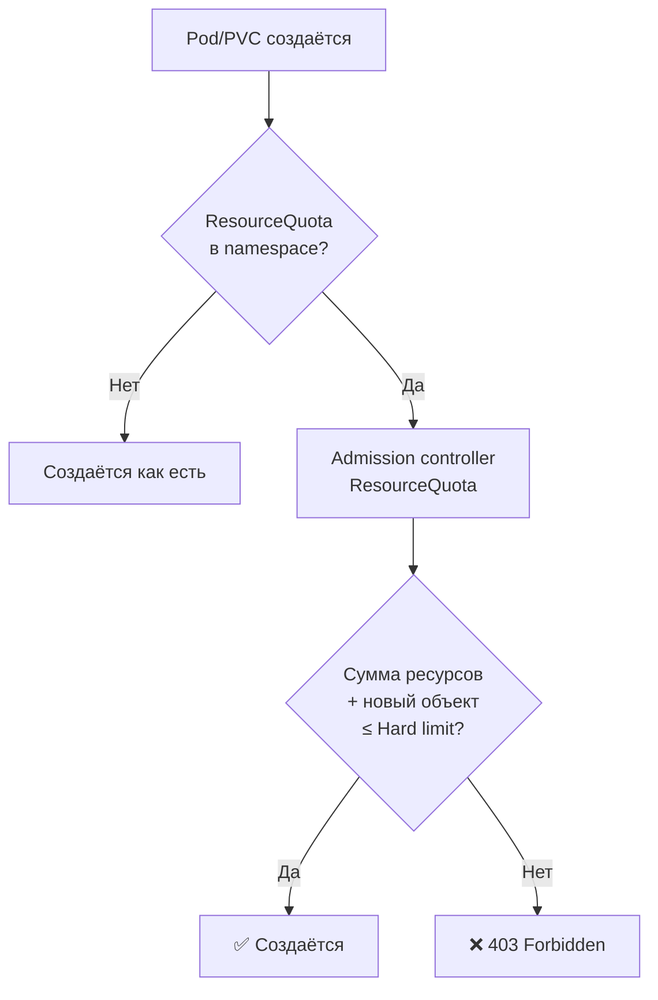

# ResourceQuota — квоты ресурсов на уровне namespace

> 📌 `ResourceQuota` ограничивает **совокупное** потребление ресурсов в namespace (сумма всех подов). 3 типа квот: (1) **compute** (CPU/memory), (2) **storage** (PVC), (3) **object counts** (количество объектов). Работает через admission controller. **Не влияет** на уже созданные ресурсы. Требует `requests`/`limits` в подах, если есть квота на cpu/memory.

---

## 🔹 Что такое ResourceQuota

| Аспект | Описание |
|--------|----------|
| **Scope** | Namespace |
| **Что ограничивает** | Суммарное потребление ресурсов **всех** подов в namespace |
| **Механизм** | Admission controller `ResourceQuota` |
| **Когда проверяется** | При create/update объектов |
| **Поведение при нарушении** | HTTP 403 Forbidden |
| **Влияние на running pods** | ❌ Не влияет (только на новые объекты) |



### 🆚 ResourceQuota vs LimitRange

| Характеристика | ResourceQuota | LimitRange |
|----------------|---------------|------------|
| **Scope** | Весь namespace (сумма) | Отдельный Pod/Container/PVC |
| **Что ограничивает** | "Весь namespace не более 10 CPU" | "Один под не более 2 CPU" |
| **Дефолты** | ❌ Не инжектит | ✅ Инжектит дефолты |
| **Когда использовать** | Защита от исчерпания quota | Защита от "монстров" |
| **Вместе?** | ✅ Да, дополняют друг друга | ✅ Да |

---

## 🔹 4 типа квот

### 1️⃣ Compute Resources (CPU/Memory)

| Resource | Описание |
|----------|----------|
| `requests.cpu` | Сумма requests CPU всех подов (в non-terminal state) |
| `requests.memory` | Сумма requests memory всех подов |
| `limits.cpu` | Сумма limits CPU всех подов |
| `limits.memory` | Сумма limits memory всех подов |
| `cpu` | Алиас для `requests.cpu` |
| `memory` | Алиас для `requests.memory` |
| `hugepages-<size>` | Huge pages определённого размера |

> ⚠️ **Важно**: если есть квота на `cpu` или `memory` — **все поды обязаны** указывать `requests` или `limits`. Иначе admission отклонит Pod.

### 2️⃣ Storage Resources

| Resource | Описание |
|----------|----------|
| `requests.storage` | Сумма storage requests всех PVC |
| `persistentvolumeclaims` | Количество PVC в namespace |
| `<storage-class>.storageclass.storage.k8s.io/requests.storage` | Storage по конкретному StorageClass |
| `<storage-class>.storageclass.storage.k8s.io/persistentvolumeclaims` | Количество PVC по StorageClass |
| `requests.ephemeral-storage` | Ephemeral storage (alpha) |
| `limits.ephemeral-storage` | Ephemeral storage limits (alpha) |

### 3️⃣ Object Counts

| Resource | Описание |
|----------|----------|
| `count/pods` | Количество подов (non-terminal) |
| `count/services` | Количество Service |
| `count/secrets` | Количество Secret |
| `count/configmaps` | Количество ConfigMap |
| `count/deployments.apps` | Количество Deployment |
| `count/replicasets.apps` | Количество ReplicaSet |
| `count/statefulsets.apps` | Количество StatefulSet |
| `count/jobs.batch` | Количество Job |
| `count/cronjobs.batch` | Количество CronJob |
| `services.loadbalancers` | Количество LoadBalancer Service |
| `services.nodeports` | Количество NodePort Service |

> 💡 **Синтаксис**: `count/<resource>.<group>` для non-core API, `count/<resource>` для core API.

### 4️⃣ Extended Resources (GPU и др.)

| Resource | Описание |
|----------|----------|
| `requests.nvidia.com/gpu` | Количество GPU в namespace |
| `requests.<extended-resource>` | Любой extended resource |

> ⚠️ Для extended resources **только `requests`** (overcommit не разрешён).

---

## 🔹 Примеры ResourceQuota

### 📝 Пример 1: Compute Quota

```yaml
apiVersion: v1
kind: ResourceQuota
metadata:
  name: compute-quota
  namespace: my-app
spec:
  hard:
    requests.cpu: "10"          # ← всего 10 CPU requests в namespace
    requests.memory: 20Gi       # ← всего 20Gi memory requests
    limits.cpu: "20"            # ← всего 20 CPU limits
    limits.memory: 40Gi         # ← всего 40Gi memory limits
```

### 📝 Пример 2: Storage Quota по StorageClass

```yaml
apiVersion: v1
kind: ResourceQuota
metadata:
  name: storage-quota
  namespace: my-app
spec:
  hard:
    requests.storage: 500Gi                              # ← общий лимит
    persistentvolumeclaims: "20"                         # ← макс 20 PVC
    gold.storageclass.storage.k8s.io/requests.storage: 200Gi    # ← gold класс
    gold.storageclass.storage.k8s.io/persistentvolumeclaims: "10"
    bronze.storageclass.storage.k8s.io/requests.storage: 300Gi  # ← bronze класс
    bronze.storageclass.storage.k8s.io/persistentvolumeclaims: "15"
```

### 📝 Пример 3: Object Counts

```yaml
apiVersion: v1
kind: ResourceQuota
metadata:
  name: object-counts
  namespace: my-app
spec:
  hard:
    count/pods: "50"
    count/services: "20"
    count/secrets: "30"
    count/configmaps: "50"
    count/deployments.apps: "20"
    count/replicasets.apps: "50"
    services.loadbalancers: "5"          # ← макс 5 LoadBalancer (дорого!)
    services.nodeports: "10"             # ← макс 10 NodePort
```

### 📝 Пример 4: GPU Quota

```yaml
apiVersion: v1
kind: ResourceQuota
metadata:
  name: gpu-quota
  namespace: ml-team
spec:
  hard:
    requests.nvidia.com/gpu: "4"         # ← макс 4 GPU в namespace
    requests.cpu: "32"
    requests.memory: 128Gi
```

### 📝 Пример 5: Комплексная квота

```yaml
apiVersion: v1
kind: ResourceQuota
metadata:
  name: comprehensive-quota
  namespace: my-app
spec:
  hard:
    # Compute
    requests.cpu: "10"
    requests.memory: 20Gi
    limits.cpu: "20"
    limits.memory: 40Gi
    
    # Storage
    requests.storage: 500Gi
    persistentvolumeclaims: "20"
    
    # Object counts
    count/pods: "50"
    count/services: "20"
    count/secrets: "30"
    count/configmaps: "50"
    services.loadbalancers: "3"
    
    # Extended resources
    requests.nvidia.com/gpu: "2"
```

---

## 🔹 Scopes — тонкая настройка квот

> Scopes позволяют применять квоту **только к определённым подам** (по QoS, priority, terminating status).

### 🎯 Доступные scopes (v1.36)

| Scope | Что отслеживает | Когда использовать |
|-------|-----------------|-------------------|
| **`BestEffort`** | Поды с QoS = BestEffort (без requests/limits) | Контроль "бесплатных" подов |
| **`NotBestEffort`** | Поды с QoS ≠ BestEffort (Burstable/Guaranteed) | Контроль "платных" подов |
| **`Terminating`** | Поды с `activeDeadlineSeconds` (Jobs) | Контроль batch-задач |
| **`NotTerminating`** | Поды без `activeDeadlineSeconds` | Контроль long-running workloads |
| **`PriorityClass`** | Поды с конкретным PriorityClass | Контроль по приоритетам |
| **`CrossNamespacePodAffinity`** | Поды с cross-namespace affinity | Контроль меж-namespace привязок |
| **`VolumeAttributesClass`** | PVC с конкретным VolumeAttributesClass | Контроль по классам томов |

### 📝 Пример: разные квоты для BestEffort и NotBestEffort

```yaml
# Квота для BestEffort подов (без requests/limits)
apiVersion: v1
kind: ResourceQuota
metadata:
  name: best-effort-quota
  namespace: my-app
spec:
  hard:
    pods: "5"              # ← макс 5 BestEffort подов
  scopes:
  - BestEffort
---
# Квота для NotBestEffort подов (с requests/limits)
apiVersion: v1
kind: ResourceQuota
metadata:
  name: not-best-effort-quota
  namespace: my-app
spec:
  hard:
    requests.cpu: "10"
    requests.memory: 20Gi
    limits.cpu: "20"
    limits.memory: 40Gi
    pods: "50"
  scopes:
  - NotBestEffort
```

### 📝 Пример: квота по PriorityClass

```yaml
# Разные квоты для разных приоритетов
apiVersion: v1
kind: ResourceQuota
metadata:
  name: high-priority-quota
  namespace: my-app
spec:
  hard:
    cpu: "100"
    memory: 200Gi
    pods: "10"
  scopeSelector:
    matchExpressions:
    - scopeName: PriorityClass
      operator: In
      values: ["high"]
---
apiVersion: v1
kind: ResourceQuota
metadata:
  name: low-priority-quota
  namespace: my-app
spec:
  hard:
    cpu: "10"
    memory: 20Gi
    pods: "50"
  scopeSelector:
    matchExpressions:
    - scopeName: PriorityClass
      operator: In
      values: ["low"]
```

### 📝 Пример: запрет cross-namespace affinity

```yaml
# Запретить подам использовать cross-namespace pod affinity
apiVersion: v1
kind: ResourceQuota
metadata:
  name: disable-cross-ns-affinity
  namespace: my-app
spec:
  hard:
    pods: "0"              # ← 0 = запрет
  scopeSelector:
    matchExpressions:
    - scopeName: CrossNamespacePodAffinity
      operator: Exists
```

### 🎯 scopeSelector operators

| Operator | Описание | Пример |
|----------|----------|--------|
| **`In`** | Значение в списке | `values: ["high", "medium"]` |
| **`NotIn`** | Значение не в списке | `values: ["low"]` |
| **`Exists`** | Поле существует | (без `values`) |
| **`DoesNotExist`** | Поле не существует | (без `values`) |

---

## 🔹 Практика: создание и проверка

### 🚀 Пошаговая настройка

```bash
# 1. Создать namespace
kubectl create namespace my-app

# 2. Создать ResourceQuota
kubectl apply -f - <<EOF
apiVersion: v1
kind: ResourceQuota
metadata:
  name: compute-quota
  namespace: my-app
spec:
  hard:
    requests.cpu: "4"
    requests.memory: 8Gi
    limits.cpu: "8"
    limits.memory: 16Gi
    count/pods: "20"
    persistentvolumeclaims: "10"
    requests.storage: 100Gi
EOF

# 3. Проверить, что квота создана
kubectl get resourcequota -n my-app
# NAME            AGE
# compute-quota   5s

# 4. Посмотреть детали
kubectl describe resourcequota compute-quota -n my-app
# Name:             compute-quota
# Namespace:        my-app
# Resource          Used  Hard
# --------          ----  ----
# count/pods        0     20
# limits.cpu        0     8
# limits.memory     0     16Gi
# persistentvolumeclaims  0     10
# requests.cpu      0     4
# requests.memory   0     8Gi
# requests.storage  0     100Gi

# 5. Создать Pod (должен указать resources!)
kubectl apply -n my-app -f - <<EOF
apiVersion: v1
kind: Pod
metadata:
  name: test-pod
spec:
  containers:
  - name: app
    image: nginx:1.25
    resources:
      requests:
        cpu: 500m
        memory: 1Gi
      limits:
        cpu: 1
        memory: 2Gi
EOF

# 6. Проверить, что квота обновилась
kubectl describe resourcequota compute-quota -n my-app
# Resource          Used  Hard
# --------          ----  ----
# requests.cpu      500m  4      ← увеличилось!
# requests.memory   1Gi   8Gi
# limits.cpu        1     8
# limits.memory     2Gi   16Gi
```

### 🧪 Тестирование ограничений

```bash
# ✅ OK: в пределах квоты
kubectl apply -n my-app -f - <<EOF
apiVersion: v1
kind: Pod
metadata:
  name: good-pod
spec:
  containers:
  - name: app
    image: nginx:1.25
    resources:
      requests:
        cpu: 1
        memory: 2Gi
      limits:
        cpu: 2
        memory: 4Gi
EOF
# pod/good-pod created

# ❌ Превышение квоты
kubectl apply -n my-app -f - <<EOF
apiVersion: v1
kind: Pod
metadata:
  name: bad-pod
spec:
  containers:
  - name: app
    image: nginx:1.25
    resources:
      requests:
        cpu: 5              # ❌ превысит квоту (4)
        memory: 2Gi
      limits:
        cpu: 10
        memory: 4Gi
EOF
# Error from server (Forbidden): pods "bad-pod" is forbidden: 
# exceeded quota: compute-quota, requested: requests.cpu=5, used: requests.cpu=1500m, limited: requests.cpu=4

# ❌ Pod без resources (если есть квота на cpu/memory)
kubectl apply -n my-app -f - <<EOF
apiVersion: v1
kind: Pod
metadata:
  name: no-resources-pod
spec:
  containers:
  - name: app
    image: nginx:1.25
    # resources НЕ указаны!
EOF
# Error from server (Forbidden): pods "no-resources-pod" is forbidden: 
# failed quota: compute-quota: must specify requests.cpu, requests.memory, limits.cpu, limits.memory
```

### 🔍 Отладка

```bash
# Посмотреть все квоты в namespace
kubectl get resourcequota -n my-app

# Детальная информация
kubectl describe resourcequota <name> -n my-app

# Посмотреть события namespace (ошибки квоты)
kubectl get events -n my-app --field-selector reason=FailedCreate

# Проверить, почему Pod не создаётся
kubectl describe pod bad-pod -n my-app | grep -A10 'Events:'
# Warning  FailedCreate  ...  Error creating: pods "bad-pod" is forbidden: 
# exceeded quota: compute-quota

# Посмотреть использование квоты в JSON
kubectl get resourcequota compute-quota -n my-app -o jsonpath='{.status}'
# {"hard":{"limits.cpu":"8","limits.memory":"16Gi",...},"used":{"limits.cpu":"3","limits.memory":"6Gi",...}}

# Сравнить с LimitRange
kubectl get limitranges -n my-app
kubectl describe limitranges -n my-app
```

### ⚠️ Частые ошибки

| Ошибка | Причина | Решение |
|--------|---------|---------|
| **Pod не создаётся** | Превышена квота | Увеличить квоту или уменьшить resources |
| **Pod без resources отклонён** | Есть квота на cpu/memory | Добавить resources или LimitRange для дефолтов |
| **Deployment создан, но 0 реплик** | Не хватает квоты для всех реплик | Увеличить квоту или уменьшить replicas |
| **Квота не обновилась** | Изменение не влияет на running pods | Пересоздать поды |
| **PVC не создаётся** | Превышена storage quota | Увеличить квоту или уменьшить PVC size |

---

## 🔹 Связь с LimitRange

> **Best practice**: используй **LimitRange + ResourceQuota** вместе.

### 🎯 Зачем вместе?

- **LimitRange** инжектит дефолты → поды всегда имеют resources
- **ResourceQuota** контролирует сумму → namespace не исчерпает ресурсы

### 📝 Пример: LimitRange + ResourceQuota

```yaml
# LimitRange: дефолты для подов без resources
apiVersion: v1
kind: LimitRange
metadata:
  name: default-limits
  namespace: my-app
spec:
  limits:
  - type: Container
    default:
      cpu: 500m
      memory: 512Mi
    defaultRequest:
      cpu: 100m
      memory: 128Mi
    max:
      cpu: "2"
      memory: 2Gi
    min:
      cpu: 50m
      memory: 64Mi
---
# ResourceQuota: общий лимит namespace
apiVersion: v1
kind: ResourceQuota
metadata:
  name: namespace-quota
  namespace: my-app
spec:
  hard:
    requests.cpu: "10"
    requests.memory: 20Gi
    limits.cpu: "20"
    limits.memory: 40Gi
    count/pods: "50"
```

**Результат**:
- Под без resources → LimitRange инжектит 100m request, 500m limit
- ResourceQuota считает эти значения в общую сумму
- Namespace не может превысить 10 CPU requests, 20 CPU limits

---

## 🔹 Квоты и capacity кластера

> ⚠️ **Важно**: ResourceQuota **не зависит** от capacity кластера.

### 🎯 Что это значит

```
Кластер: 32 CPU, 64Gi memory
Namespace A quota: 20 CPU, 40Gi
Namespace B quota: 10 CPU, 20Gi
Namespace C quota: 10 CPU, 20Gi
Сумма квот: 40 CPU, 80Gi  ← больше, чем capacity!
```

**Что произойдёт**:
- Квоты созданы успешно (не проверяется capacity)
- При создании подов — если capacity исчерпан, поды останутся в Pending
- **Конкуренция за ресурсы** решается через PriorityClass и preemption

### 📝 Advanced: динамические квоты

Для автоматической подстройки квот под capacity можно написать **custom controller**:

```
1. Controller мониторит capacity кластера
2. Смотрит использование квот в namespaces
3. Автоматически adjusts hard limits
4. Примеры: пропорциональное распределение, auto-scaling квот
```

> 💡 **Готовые решения**: некоторые cloud-providers (GKE, EKS) имеют встроенные механизмы.

---

## 🔹 Best Practices

### ✅ Делай

1. **LimitRange + ResourceQuota** — всегда вместе
2. **Указывай и requests, и limits** в манифестах подов
3. **Object counts** для защиты от DoS (слишком много secrets, pods)
4. **Scopes** для тонкой настройки (BestEffort vs NotBestEffort)
5. **PriorityClass scopes** для контроля системных workloads
6. **StorageClass-specific quotas** для контроля дорогих storage классов
7. **Мониторинг** использования квот (алерты на приближение к лимиту)
8. **Защити ResourceQuota** через RBAC (не давай обновлять/удалять)

### ❌ Не делай

```bash
# ❌ НЕ создавай квоты без LimitRange
# Пользователи забудут указать resources → поды отклоняются

# ❌ НЕ ставь слишком маленькие квоты
# Это сломает легаси-приложения

# ❌ НЕ ставь слишком большие квоты
# Это не защитит от исчерпания ресурсов

# ❌ НЕ забывай про object counts
# 10000 secrets в namespace = проблемы с etcd

# ❌ НЕ игнорируй services.loadbalancers
# LoadBalancer = деньги в облаке!

# ❌ НЕ давай обновлять/удалять ResourceQuota обычным пользователям
# Используй RBAC или ValidatingAdmissionPolicy
```

---

## 🔹 Чек-лист: настройка ResourceQuota

```bash
# ✅ 1. Определить требования
#    - Какие ресурсы ограничивать? (cpu, memory, storage, objects)
#    - Какие hard limits?
#    - Нужны ли scopes?
#    - Нужны ли StorageClass-specific квоты?

# ✅ 2. Создать LimitRange (для дефолтов)
kubectl apply -f limitrange.yaml

# ✅ 3. Создать ResourceQuota
kubectl apply -f - <<EOF
apiVersion: v1
kind: ResourceQuota
metadata:
  name: <name>
  namespace: <ns>
spec:
  hard:
    requests.cpu: "<value>"
    requests.memory: <value>
    limits.cpu: "<value>"
    limits.memory: <value>
    count/pods: "<value>"
    persistentvolumeclaims: "<value>"
    requests.storage: <value>
EOF

# ✅ 4. Проверить, что квота создана
kubectl get resourcequota -n <ns>
kubectl describe resourcequota <name> -n <ns>

# ✅ 5. Протестировать
kubectl apply -n <ns> -f good-pod.yaml    # должно работать
kubectl apply -n <ns> -f bad-pod.yaml     # должно быть Forbidden

# ✅ 6. Настроить мониторинг
#    - Метрики: kube_resourcequota{type="used"}
#    - Алерт на использование > 80% квоты
#    - Алерт на FailedCreate события

# ✅ 7. Защитить ResourceQuota через RBAC
#    - Только админы могут обновлять/удалять ResourceQuota
#    - Обычные пользователи — только read
```

> 💡 **Совет для конспекта**:
> 1. Создай файл `00_resourcequota_cheatsheet.md` с шпаргалкой по YAML.
> 2. Добавь блок «Частые ошибки»: «забыл resources в поде", "превышена квота", "нет LimitRange".
> 3. Веди список "Какие квоты у нас в кластере": namespace, тип, hard limits, текущее использование.

---

## 🔹 Ключевые выводы

1. **ResourceQuota** ограничивает **совокупное** потребление ресурсов в namespace.
2. **4 типа квот**: compute (CPU/memory), storage (PVC), object counts, extended resources (GPU).
3. **Scopes**: BestEffort, NotBestEffort, Terminating, PriorityClass, CrossNamespacePodAffinity — для тонкой настройки.
4. **scopeSelector**: `In`, `NotIn`, `Exists`, `DoesNotExist` — для выбора конкретных подов.
5. **Требует requests/limits** в подах, если есть квота на cpu/memory.
6. **LimitRange + ResourceQuota** — best practice: дефолты + контроль суммы.
7. **Не зависит от capacity** кластера — можно создать квоты больше, чем физически есть.
8. **Не влияет на running pods** — только на create/update.
9. **Object counts** защищают от DoS (слишком много secrets, pods, etc.).
10. **Мониторинг**: алерты на использование > 80% квоты, FailedCreate события.