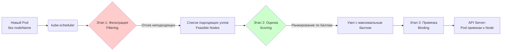

# Kubernetes Scheduler — планировщик подов

> 📌 `kube-scheduler` — компонент control plane, который находит лучший узел (Node) для запуска подов в статусе `Pending`. Процесс состоит из двух этапов: 
> **1. Фильтрация** (отсев неподходящих узлов), 
> **2. Оценка** (ранжирование подходящих узлов).

---

## 🔹 Что такое планирование в K8s

| Аспект | Описание |
|--------|----------|
| **Компонент** | `kube-scheduler` (часть control plane) |
| **Цель** | Сопоставить `Pending` поды с подходящими узлами, чтобы `kubelet` мог их запустить |
| **Триггер** | Появление пода без привязки к узлу (`spec.nodeName` пуст) |
| **Результат** | Привязка (Binding): обновление пода в API Server с указанием `nodeName` |
| **Кастомизация** | Можно написать свой планировщик или настроить встроенный через плагины |



> 💡 **Важно**: Если на этапе фильтрации список подходящих узлов пуст, под остается в статусе `Pending` до тех пор, пока в кластере не появятся подходящие ресурсы или условия.

---

## 🔹 Два этапа выбора узла

Планировщик принимает решение, последовательно применяя два набора правил.

### 1️⃣ Этап фильтрации (Filtering / Predicates)
**Вопрос:** *"Может ли этот узел запустить данный под?"* (Да/Нет)

Планировщик проверяет каждый узел кластера на соответствие жестким требованиям пода. Если узел не проходит хотя бы один фильтр, он исключается.

**Примеры фильтров:**
- `PodFitsResources`: Хватает ли на узле свободного CPU и памяти (с учетом `requests`)?
- `NodeSelector`: Совпадают ли лейблы узла с `nodeSelector` пода?
- `PodFitsHostPorts`: Свободен ли запрошенный порт на узле?
- `CheckNodeCondition`: Узел готов (`Ready`) и не имеет `NoSchedule` taints?

### 2️⃣ Этап оценки (Scoring / Priorities)
**Вопрос:** *"Насколько хорошо этот узел подходит для пода?"* (Оценка от 0 до 100)

Планировщик ранжирует узлы, прошедшие фильтрацию. Каждому узлу начисляются баллы по активным правилам. Узел с наибольшим суммарным баллом побеждает.

**Примеры правил оценки:**
- `NodeAffinity`: Узел предпочтителен из-за лейблов.
- `ImageLocality`: Образ контейнера уже скачан на этот узел (выше балл).
- `LeastRequested`: Узел имеет больше всего свободных ресурсов (балансировка нагрузки).
- `NodePreferAvoidPods`: Узел менее предпочтителен (например, из-за аннотаций).

> ⚖️ **Ничья**: Если несколько узлов набрали одинаковый максимальный балл, планировщик выбирает один из них **случайным образом**.

---

## 🔹 Факторы, влияющие на решение планировщика

При фильтрации и оценке планировщик учитывает:
1. **Ресурсы**: Индивидуальные и коллективные `requests` и `limits` (CPU, memory, ephemeral-storage).
2. **Ограничения**: `nodeSelector`, `nodeAffinity`, `podAffinity` / `podAntiAffinity`.
3. **Изоляция**: `Taints` и `Tolerations` узлов.
4. **Топология**: Распределение по зонам доступности (AZ), хостам, стойкам.
5. **Локальность данных**: Близость к Persistent Volume или кэшированным образам.
6. **Интерференция**: Избегание размещения "шумных соседей" на одном узле.

---

## 🔹 Настройка поведения планировщика

В современных версиях Kubernetes (1.18+) поведение `kube-scheduler` настраивается через **Профили планирования (Scheduling Profiles)**.

### 🆚 Старый vs Новый способ

| Способ | Описание | Статус |
|--------|----------|--------|
| **Scheduling Policies** | Настройка через JSON/YAML списки предикатов (фильтров) и приоритетов (оценок). | 🟡 Устаревает (Legacy) |
| **Scheduling Profiles** | Настройка через **плагины**, реализующие конкретные точки расширения (Extension Points). | ✅ **Рекомендуемый** |

### 🔌 Точки расширения (Extension Points)

Профиль позволяет включать, отключать или менять порядок выполнения плагинов на разных этапах:

1. **QueueSort**: Сортировка подов в очереди ожидания.
2. **PreFilter / Filter**: Фильтрация узлов.
3. **PreScore / Score**: Оценка узлов.
4. **Reserve**: Резервирование ресурсов до фактического запуска (чтобы избежать гонки условий).
5. **Permit**: Задержка привязки до получения одобрения (например, от внешнего веб-хука).
6. **PreBind / Bind / PostBind**: Финальная привязка пода к узлу в API Server.

> 💡 **Мульти-профильность**: Можно запустить `kube-scheduler` с несколькими профилями одновременно. Разные поды могут использовать разные профили через аннотацию `schedulerName: <profile-name>`.

---

## 🔹 Практика: отладка планирования

Самая частая задача администратора — понять, **почему под не запускается**.

### 🚀 Пошаговая диагностика

```bash
# 1. Найти поды в статусе Pending
kubectl get pods -A | grep Pending

# 2. Посмотреть события планирования (самый важный шаг!)
kubectl describe pod <pod-name> -n <namespace>

# Ищи секцию Events. Примеры частых ошибок:
# - 0/3 nodes are available: 3 Insufficient cpu.
# - 0/3 nodes are available: 1 node(s) had taint {node-role.kubernetes.io/master: }, that the pod didn't tolerate, 2 node(s) didn't match Pod's node affinity/selector.
# - 0/3 nodes are available: 3 node(s) didn't match pod anti-affinity rules.

# 3. Проверить ресурсы узла (если жалоба на Insufficient)
kubectl top nodes
kubectl describe node <node-name> | grep -A 10 "Allocated resources"

# 4. Проверить тейнты узлов (если жалоба на taints)
kubectl get nodes -o custom-columns="NAME:.metadata.name,TAINTS:.spec.taints"

# 5. Проверить, какой планировщик используется (если кастомный)
kubectl get pod <pod-name> -o jsonpath='{.spec.schedulerName}'
# Если пусто или "default-scheduler", используется стандартный kube-scheduler
```

### 🛠️ Как заставить под запуститься на конкретном узле (Anti-pattern)

Хотя планировщик работает автоматически, можно жестко указать узел. **Используй это только в крайних случаях** (например, для отладки или специфичного железа).

```yaml
apiVersion: v1
_kind: Pod
metadata:
  name: forced-node-pod
spec:
  nodeName: worker-node-1  # ← Жесткая привязка, планировщик игнорируется!
  containers:
  - name: app
    image: nginx
```
> ⚠️ **Риск**: Если `worker-node-1` будет недоступен или на нем не хватит ресурсов, под навсегда останется в `Pending`. Лучше использовать `nodeSelector` или `nodeAffinity`.

---

## 🔹 Чек-лист: понимание планировщика

```bash
# ✅ 1. Под не запускается? Сначала смотри `kubectl describe pod` (секция Events).
# ✅ 2. У пода указаны `resources.requests`? Без них планировщик не может корректно оценить загрузку узлов.
# ✅ 3. Проверь Taints на узлах: `kubectl get nodes -o jsonpath='{.items[*].spec.taints}'`.
# ✅ 4. Проверь Affinity/Anti-Affinity правила: не исключают ли они все узлы в кластере?
# ✅ 5. Для кастомной логики используй Scheduling Profiles (плагины), а не старые Policies.
```

---

## 🔹 Ключевые выводы

1. **`kube-scheduler`** — мозг распределения подов. Работает асинхронно, следит за новыми подами без `nodeName`.
2. **Два этапа**: **Фильтрация** (отсеивает невозможное) → **Оценка** (выбирает лучшее из возможного).
3. Если подходящих узлов нет, под висит в `Pending`. Планировщик будет периодически (или при изменении кластера) повторять попытки.
4. **Факторы**: ресурсы, аффинность, тейнты, локальность данных.
5. **Кастомизация**: Современный способ — **Scheduling Profiles** с плагинами (`Filter`, `Score`, `Bind` и др.).
6. **Отладка**: 99% проблем решаются через `kubectl describe pod` и анализ секции `Events`.