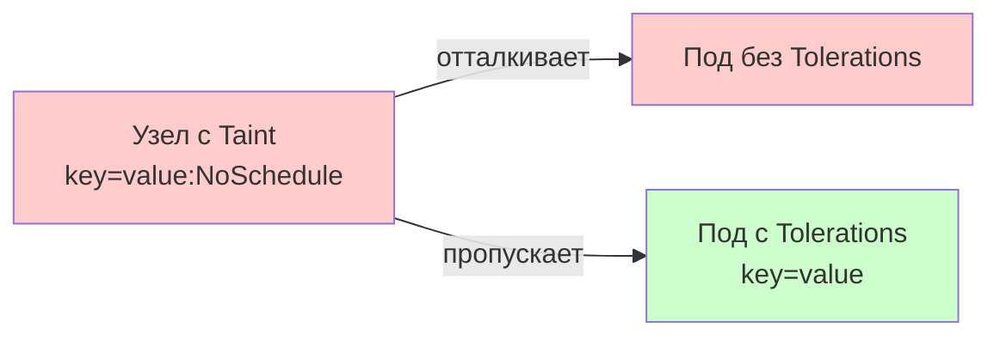
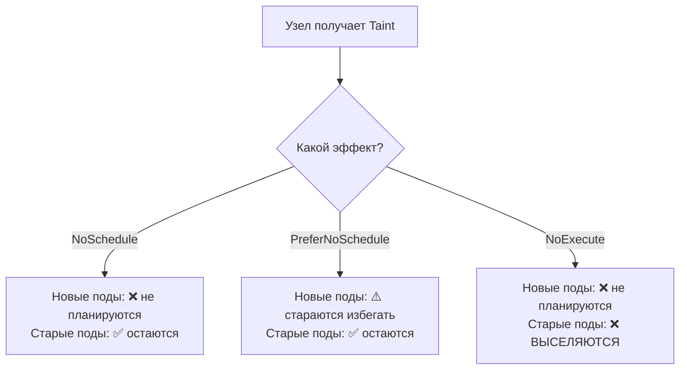

# Taints and Tolerations — управление нодами через "отталкивающие" метки

> 📌 **Taints** (загрязнения) — метки на узлах, которые **отталкивают** поды. 
> **Tolerations** (допуски) — свойства подов, которые позволяют игнорировать taints. 3 эффекта: `NoSchedule` (не планировать новые), `PreferNoSchedule` (мягкий запрет), `NoExecute` (выселяет запущенные). Используются для: выделенных нод, спец. оборудования (GPU), изоляции проблемных нод.

---

## 🔹 Концепция: Affinity vs Taints

| Механизм | На ком | Эффект | Аналогия |
|----------|--------|--------|----------|
| **Affinity** | Под | **Притягивает** под к узлам | "Мне нравятся эти узлы" |
| **Taints** | Узел | **Отталкивает** поды от узла | "Не подходи ко мне" |
| **Tolerations** | Под | Позволяет игнорировать taints | "Мне можно подойти" |



> 💡 **Ключевая идея**: Taints без Tolerations = под не запустится. Tolerations без Taints = допуск просто игнорируется.

---

## 🔹 3 эффекта Taints

| Эффект | Поведение | Когда использовать |
|--------|-----------|-------------------|
| **`NoSchedule`** | Новые поды **не планируются** на узел (если нет toleration). Уже запущенные поды **остаются**. | Выделенные ноды, спец. оборудование |
| **`PreferNoSchedule`** | "Мягкая" версия NoSchedule. Планировщик **старается избегать** узел, но не гарантирует. | Не строгие предпочтения |
| **`NoExecute`** | Новые поды не планируются + **уже запущенные поды ВЫСЕЛЯЮТСЯ** (если нет toleration). | Проблемные ноды (NotReady, unreachable) |



---

## 🔹 Синтаксис: создание Taints

### 🚀 Через kubectl

```bash
# Добавить taint
kubectl taint nodes worker-1 key1=value1:NoSchedule
# taint/node "worker-1" tainted

# Добавить несколько taints
kubectl taint nodes worker-1 key1=value1:NoSchedule
kubectl taint nodes worker-1 key1=value1:NoExecute
kubectl taint nodes worker-1 key2=value2:PreferNoSchedule

# Удалить taint (добавь `-` в конце)
kubectl taint nodes worker-1 key1=value1:NoSchedule-

# Удалить все taints с ключом key1 (независимо от значения/эффекта)
kubectl taint nodes worker-1 key1:NoSchedule-
kubectl taint nodes worker-1 key1:NoExecute-
```

### 📝 Посмотреть taints на узлах

```bash
# Все taints на всех узлах
kubectl get nodes -o custom-columns="NAME:.metadata.name,TAINTS:.spec.taints"

# Или через JSONPath
kubectl get nodes -o json | jq '.items[] | {name: .metadata.name, taints: .spec.taints}'

# Детали по конкретному узлу
kubectl describe node worker-1 | grep -A10 'Taints:'
# Taints: key1=value1:NoSchedule
#         key2=value2:NoExecute
```

---

## 🔹 Синтаксис: Tolerations в Pod

### 📝 Базовые примеры

```yaml
apiVersion: v1
kind: Pod
metadata:
  name: nginx
spec:
  containers:
  - name: nginx
    image: nginx:1.25
  tolerations:
  # Точное совпадение (operator: Equal — по умолчанию)
  - key: "key1"
    operator: "Equal"        # ← можно опустить (по умолчанию)
    value: "value1"
    effect: "NoSchedule"
  
  # Проверка существования ключа (значение не важно)
  - key: "key2"
    operator: "Exists"       # ← value не указывается
    effect: "NoExecute"
  
  # Пустой key = соответствует всем ключам (но effect обязателен)
  - operator: "Exists"
    effect: "NoSchedule"     # ← терпим ко всем NoSchedule taints
  
  # Пустой effect = соответствует всем эффектам
  - key: "key3"
    operator: "Equal"
    value: "value3"
    # effect не указан → терпим ко всем эффектам с key3=value3
```

### 🎯 Правила matching

Toleration соответствует taint, если:
- **`key`** совпадает (или пуст — тогда любой ключ)
- **`effect`** совпадает (или пуст — тогда любой эффект)
- **`operator`**:
  - `Equal`: `value` должно совпадать
  - `Exists`: `value` не указывается, главное — наличие ключа

### 📝 Пример: под с несколькими tolerations

```yaml
apiVersion: v1
kind: Pod
metadata:
  name: special-pod
spec:
  containers:
  - name: app
    image: my-app:latest
  tolerations:
  - key: "dedicated"
    operator: "Equal"
    value: "special-team"
    effect: "NoSchedule"
  - key: "gpu"
    operator: "Exists"
    effect: "NoSchedule"
```

---

## 🔹 Операторы в tolerations

| Оператор | Описание | Пример |
|----------|----------|--------|
| **`Equal`** (по умолчанию) | `key` и `value` должны совпадать | `key: "disk", value: "ssd"` |
| **`Exists`** | Только `key` должен существовать (value не важно) | `key: "gpu"` |
| **`Gt`** (alpha, v1.35+) | Значение taint > значения toleration (целые числа) | `value: "900"` |
| **`Lt`** (alpha, v1.35+) | Значение taint < значения toleration (целые числа) | `value: "1000"` |

### 🎯 Числовые операторы (alpha)

> ⚠️ Требует feature gate `TaintTolerationComparisonOperators=true`. Значения должны быть **целыми числами**.

```bash
# Taint на узле: SLA = 950
kubectl taint nodes node1 servicelevel.example/sla=950:NoSchedule
```

```yaml
# Toleration: принимаем узлы со SLA > 900
tolerations:
- key: "servicelevel.example/sla"
  operator: "Gt"
  value: "900"           # ← 950 > 900 → совпадает
  effect: "NoSchedule"

# Toleration: принимаем узлы со SLA < 1000
tolerations:
- key: "servicelevel.example/sla"
  operator: "Lt"
  value: "1000"          # ← 950 < 1000 → совпадает
```

**Когда использовать**: планирование по уровням SLA, надёжности, приоритетам.

---

## 🔹 tolerationSeconds — временный допуск для NoExecute

> Позволяет поду **оставаться на узле** ограниченное время после появления `NoExecute` taint.

### 📝 Пример

```yaml
tolerations:
- key: "node.kubernetes.io/unreachable"
  operator: "Exists"
  effect: "NoExecute"
  tolerationSeconds: 3600    # ← 1 час, потом выслать
```

**Поведение**:
- Taint появился → под остаётся на узле
- Прошло 3600 секунд, taint всё ещё есть → под **выселяется**
- Taint удалён до истечения 3600 секунд → под **остаётся**

### 🎯 Значения по умолчанию

K8s **автоматически** добавляет tolerations для подов (если не указаны явно):

```yaml
# Автоматически добавляется ко всем подам (кроме DaemonSet)
tolerations:
- key: "node.kubernetes.io/not-ready"
  operator: "Exists"
  effect: "NoExecute"
  tolerationSeconds: 300     # ← 5 минут

- key: "node.kubernetes.io/unreachable"
  operator: "Exists""
  effect: "NoExecute"
  tolerationSeconds: 300     # ← 5 минут
```

**Зачем**: если нода временно недоступна (сеть моргнула), поды не вылетают сразу — ждут 5 минут.

---

## 🔹 Логика обработки множественных taints

> Узел может иметь **несколько taints**, под — **несколько tolerations**. K8s обрабатывает их как фильтр.

### 🎯 Алгоритм

```
1. Собрать все taints узла
2. Для каждого taint проверить: есть ли у пода matching toleration?
3. Если toleration есть → taint "проигнорирован"
4. Если toleration НЕТ → taint применяется
5. Итоговый эффект = сумма всех "непроигнорированных" taints:
   - Есть хотя бы один NoExecute → под ВЫСЕЛЯЕТСЯ
   - Нет NoExecute, но есть NoSchedule → под НЕ ПЛАНИРУЕТСЯ
   - Нет NoExecute/NoSchedule, но есть PreferNoSchedule → планировщик старается избегать
```

### 📝 Пример

```bash
# На узле 3 taints
kubectl taint nodes node1 key1=value1:NoSchedule
kubectl taint nodes node1 key1=value1:NoExecute
kubectl taint nodes node1 key2=value2:NoSchedule
```

```yaml
# У пода 2 tolerations
tolerations:
- key: "key1"
  operator: "Equal"
  value: "value1"
  effect: "NoSchedule"
- key: "key1"
  operator: "Equal"
  value: "value1"
  effect: "NoExecute"
```

**Результат**:
- `key1=value1:NoSchedule` → ✅ проигнорирован (есть toleration)
- `key1=value1:NoExecute` → ✅ проигнорирован (есть toleration)
- `key2=value2:NoSchedule` → ❌ **не проигнорирован** (нет toleration)

**Итог**: под **не может быть запланирован** на этот узел (из-за `key2:NoSchedule`), но если уже запущен — **останется** (т.к. нет `NoExecute`).

---

## 🔹 Встроенные taints (от node conditions)

> K8s **автоматически** добавляет taints на узлы при проблемах.

### 🎯 Таблица встроенных taints

| Taint | Когда добавляется | Эффект |
|-------|-------------------|--------|
| `node.kubernetes.io/not-ready` | Node condition `Ready=False` | `NoExecute` |
| `node.kubernetes.io/unreachable` | Node condition `Ready=Unknown` | `NoExecute` |
| `node.kubernetes.io/memory-pressure` | Нехватка памяти | `NoSchedule` |
| `node.kubernetes.io/disk-pressure` | Нехватка диска | `NoSchedule` |
| `node.kubernetes.io/pid-pressure` | Нехватка PID | `NoSchedule` |
| `node.kubernetes.io/network-unavailable` | Сеть недоступна | `NoSchedule` |
| `node.kubernetes.io/unschedulable` | Узел cordoned (`kubectl cordon`) | `NoSchedule` |
| `node.cloudprovider.kubernetes.io/uninitialized` | Cloud controller не инициализирован | `NoSchedule` |

```bash
# Посмотреть conditions узла
kubectl describe node worker-1 | grep -A10 'Conditions:'

# Посмотреть taints
kubectl describe node worker-1 | grep -A10 'Taints:'
```

### 🎯 Специальное поведение DaemonSet

DaemonSet поды **автоматически** получают tolerations для встроенных taints:

```yaml
# Автоматически добавляется к DaemonSet подам
tolerations:
- key: "node.kubernetes.io/not-ready"
  operator: "Exists"
  effect: "NoExecute"              # ← без tolerationSeconds!
- key: "node.kubernetes.io/unreachable"
  operator: "Exists"
  effect: "NoExecute"              # ← без tolerationSeconds!
- key: "node.kubernetes.io/memory-pressure"
  operator: "Exists"
  effect: "NoSchedule"
- key: "node.kubernetes.io/disk-pressure"
  operator: "Exists"
  effect: "NoSchedule"
- key: "node.kubernetes.io/pid-pressure"
  operator: "Exists"
  effect: "NoSchedule"
- key: "node.kubernetes.io/unschedulable"
  operator: "Exists"
  effect: "NoSchedule"
- key: "node.kubernetes.io/network-unavailable"
  operator: "Exists"
  effect: "NoSchedule"             # ← только для hostNetwork подов
```

**Почему**: DaemonSet (например, monitoring, logging) должны работать на всех нодах, даже проблемных.

---

## 🔹 Практические сценарии

### 🎯 Сценарий 1: Выделенные ноды для команды

```bash
# 1. Пометить ноды как "выделенные" для команды backend
kubectl taint nodes worker-1 dedicated=backend:NoSchedule
kubectl taint nodes worker-2 dedicated=backend:NoSchedule

# 2. (Опционально) Пометить ноды лейблом для nodeAffinity
kubectl label nodes worker-1 dedicated=backend
kubectl label nodes worker-2 dedicated=backend
```

```yaml
# 3. Поды команды backend получают toleration + nodeAffinity
apiVersion: apps/v1
kind: Deployment
metadata:
  name: backend-app
spec:
  replicas: 3
  selector:
    matchLabels:
      app: backend
  template:
    metadata:
      labels:
        app: backend
    spec:
      tolerations:
      - key: "dedicated"
        operator: "Equal"
        value: "backend"
        effect: "NoSchedule"
      
      # Опционально: чтобы поды шли ТОЛЬКО на dedicated ноды
      affinity:
        nodeAffinity:
          requiredDuringSchedulingIgnoredDuringExecution:
            nodeSelectorTerms:
            - matchExpressions:
              - key: dedicated
                operator: In
                values: ["backend"]
      
      containers:
      - name: backend
        image: backend-app:latest
```

**Результат**:
- Поды backend → только на worker-1, worker-2
- Другие поды → не могут попасть на worker-1, worker-2 (без toleration)

---

### 🎯 Сценарий 2: Ноды с GPU

```bash
# Пометить GPU-ноды
kubectl taint nodes gpu-node-1 gpu=true:NoSchedule
kubectl taint nodes gpu-node-2 gpu=true:NoSchedule

kubectl label nodes gpu-node-1 gpu=true
kubectl label nodes gpu-node-2 gpu=true
```

```yaml
# ML-под с GPU
apiVersion: v1
kind: Pod
metadata:
  name: ml-training
spec:
  tolerations:
  - key: "gpu"
    operator: "Equal"
    value: "true"
    effect: "NoSchedule"
  
  affinity:
    nodeAffinity:
      requiredDuringSchedulingIgnoredDuringExecution:
        nodeSelectorTerms:
        - matchExpressions:
          - key: gpu
            operator: In
            values: ["true"]
  
  containers:
  - name: trainer
    image: tensorflow/tensorflow:latest-gpu
    resources:
      limits:
        nvidia.com/gpu: 1
```

**Результат**:
- ML-поды → только на GPU-нодах
- Обычные поды → не занимают GPU-ноды (освобождены для ML)

> 💡 **Альтернатива**: admission controller `ExtendedResourceToleration` автоматически добавляет tolerations для подов, запрашивающих extended resources (GPU, FPGA).

---

### 🎯 Сценарий 3: Вывод ноды из эксплуатации (drain)

```bash
# 1. Пометить ноду как "не планировать"
kubectl taint nodes worker-3 maintenance=true:NoSchedule

# 2. Выгнать поды (graceful)
kubectl drain worker-3 --ignore-daemonsets --delete-emptydir-data

# 3. После обслуживания — вернуть ноду
kubectl taint nodes worker-3 maintenance=true:NoSchedule-
kubectl uncordon worker-3
```

> 💡 `kubectl cordon` делает то же самое через taint `node.kubernetes.io/unschedulable:NoSchedule`.

---

### 🎯 Сценарий 4: Долгоживущие поды при проблемах ноды

```yaml
# StatefulSet с БД — не хотим выселять при кратковременных проблемах
apiVersion: apps/v1
kind: StatefulSet
metadata:
  name: postgres
spec:
  template:
    spec:
      tolerations:
      - key: "node.kubernetes.io/not-ready"
        operator: "Exists"
        effect: "NoExecute"
        tolerationSeconds: 3600    # ← ждём 1 час, а не 5 минут
      
      - key: "node.kubernetes.io/unreachable"
        operator: "Exists"
        effect: "NoExecute"
        tolerationSeconds: 3600
```

**Зачем**: БД с локальным хранилищем — лучше подождать восстановления ноды, чем переносить и терять данные.

---

## 🔹 nodeName vs Taints

> ⚠️ **Важно**: если в PodSpec указан `nodeName` — планировщик **игнорируется**, и taints **не проверяются** при планировании.

```yaml
spec:
  nodeName: worker-1    # ← жёсткая привязка
  # Taints на worker-1 игнорируются при планировании!
```

**НО**: если на узле есть `NoExecute` taint — kubelet **всё равно выселит** под (если нет toleration).

**Вывод**: `nodeName` — anti-pattern. Используй `nodeAffinity` + taints/tolerations.

---

## 🔹 Отладка

### 🚀 Диагностика

```bash
# 1. Под в Pending? Смотрим события
kubectl describe pod <pod-name> -n <namespace> | grep -A20 'Events:'
# Ищи:
# - 0/3 nodes are available: 1 node(s) had taint {key1: value1}, that the pod didn't tolerate.

# 2. Посмотреть taints на узлах
kubectl get nodes -o custom-columns="NAME:.metadata.name,TAINTS:.spec.taints"

# 3. Посмотреть tolerations пода
kubectl get pod <pod-name> -o jsonpath='{.spec.tolerations}' | jq

# 4. Проверить, какие taints "матчатся"
# Вручную: сравни key, value, effect между taints узлов и tolerations пода

# 5. Посмотреть, почему под был выселен
kubectl get events -n <namespace> --field-selector involvedObject.name=<pod-name> | grep -i taint
# Normal  TaintManagerEviction  ...  Marking for deletion Pod <pod-name> from Node <node>
```

### 🔍 Частые проблемы

| Проблема | Причина | Решение |
|----------|---------|---------|
| **Под в Pending** | Нет toleration для taint на узле | Добавить toleration или убрать taint |
| **Под выселен** | `NoExecute` taint без toleration | Добавить toleration с `tolerationSeconds` |
| **DaemonSet не запускается** | Нестандартный taint на ноде | Добавить toleration в DaemonSet spec |
| **Taint не удалился** | Опечатка в команде | Использовать `kubectl taint node <name> <key>:<effect>-` |
| **Под игнорирует taint** | Указан `nodeName` | Убрать `nodeName`, использовать `nodeAffinity` |

---

## 🔹 Чек-лист: настройка Taints and Tolerations

```bash
# ✅ 1. Определить цель
#    - Выделить ноды для команды? → NoSchedule + nodeAffinity
#    - Изолировать спец. оборудование? → NoSchedule + ExtendedResourceToleration
#    - Вывести ноду из эксплуатации? → NoSchedule + drain
#    - Проблемная нода? → NoExecute (автоматически)

# ✅ 2. Добавить taint к узлу
kubectl taint nodes <node> <key>=<value>:<effect>

# ✅ 3. Добавить toleration к поду
#    - operator: Equal (точное совпадение) или Exists (наличие ключа)
#    - effect: NoSchedule / PreferNoSchedule / NoExecute
#    - tolerationSeconds: только для NoExecute (если нужно ждать)

# ✅ 4. Проверить
kubectl get nodes -o custom-columns="NAME:.metadata.name,TAINTS:.spec.taints"
kubectl get pod <pod> -o jsonpath='{.spec.tolerations}'

# ✅ 5. Протестировать
kubectl apply -f pod.yaml
kubectl describe pod <pod> | grep -A20 'Events:'

# ✅ 6. Мониторинг
#    - Алерт на поды в Pending из-за taints
#    - Алерт на массовые evictions (NoExecute taints)
#    - Аудит taints на узлах
```

> 💡 **Совет для конспекта**:
> 1. Создай файл `00_taints_cheatsheet.md` с шпаргалкой по командам.
> 2. Добавь блок «Частые ошибки»: «забыл `-` при удалении taint", "использовал nodeName", "не добавил toleration к DaemonSet".
> 3. Веди список "Какие taints у нас в кластере": узел, ключ, значение, эффект, цель.

---

## 🔹 Ключевые выводы

1. **Taints** — на узлах, **Tolerations** — на подах. Работают в паре.
2. **3 эффекта**: `NoSchedule` (не планировать), `PreferNoSchedule` (мягкий запрет), `NoExecute` (выселять).
3. **Операторы**: `Equal` (точное совпадение), `Exists` (наличие ключа), `Gt`/`Lt` (числовые, alpha).
4. **tolerationSeconds** — только для `NoExecute`. Под ждёт N секунд, потом выселяется.
5. **Встроенные taints**: `not-ready`, `unreachable`, `memory-pressure`, `disk-pressure`, `pid-pressure`, `network-unavailable`, `unschedulable`.
6. **DaemonSet** автоматически получает tolerations для встроенных taints (без `tolerationSeconds`).
7. **Автоматические tolerations**: K8s добавляет 5-минутный допуск для `not-ready`/`unreachable` всем подам (кроме DaemonSet).
8. **Множественные taints**: под должен иметь toleration для **каждого** taint, иначе — не запустится/выселится.
9. **nodeName обходит taints** при планировании, но `NoExecute` всё равно выселит.
10. **Сценарии**: выделенные ноды, GPU, drain, долгоживущие поды при проблемах ноды.
11. **taint-eviction-controller** (v1.29+): отдельный компонент для eviction по taints (раньше был в node controller).