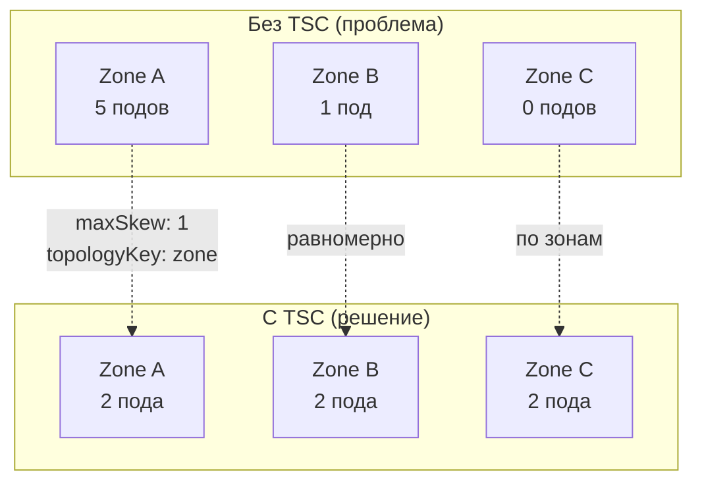

# Topology Spread Constraints — равномерное распределение подов

> 📌 **`topologySpreadConstraints`** — декларативный способ **равномерно распределить** поды по топологическим доменам (узлы, зоны, регионы). Ключевые параметры: `maxSkew` (макс. перекос), `topologyKey` (ключ метки узла), `whenUnsatisfiable` (DoNotSchedule / ScheduleAnyway). **Отличается от podAntiAffinity**: TSC контролирует **баланс**, anti-affinity — **изоляцию**.

---

## 🔹 Зачем нужны Topology Spread Constraints

### 🎯 Проблема

| Сценарий | Без TSC | С TSC |
|----------|---------|-------|
| **2 реплики в кластере из 20 нод** | Обе могут попасть на одну ноду → отказ ноды = downtime | Распределяются по разным нодам → HA |
| **15 реплик в 3 зонах** | Могут скучиться в одной зоне → межзонный трафик, задержка | Равномерно по зонам → низкая задержка, экономия |
| **Rolling update** | Новые поды могут скопиться на одной ноде | Равномерное распределение при обновлении |

### 🆚 TSC vs podAntiAffinity

| Характеристика | podAntiAffinity | topologySpreadConstraints |
|----------------|-----------------|---------------------------|
| **Цель** | Изоляция (не более 1 пода в домене) | Баланс (равномерное распределение) |
| **Гибкость** | Жёсткая: 0 или 1 под в домене | Гибкая: maxSkew контролирует перекос |
| **Масштабируемость** | Плохо для больших кластеров | Лучше для больших кластеров |
| **Когда использовать** | Строгая изоляция (БД, HA) | Баланс нагрузки, HA, экономия |



---

## 🔹 Основные поля

### 📋 Структура topologySpreadConstraints

```yaml
apiVersion: v1
kind: Pod
metadata:
  name: example-pod
spec:
  topologySpreadConstraints:
  - maxSkew: <integer>                    # ← макс. перекос (обязательно)
    minDomains: <integer>                 # ← мин. доменов (опционально)
    topologyKey: <string>                 # ← ключ метки узла (обязательно)
    whenUnsatisfiable: <string>           # ← DoNotSchedule / ScheduleAnyway
    labelSelector: <object>               # ← селектор подов для подсчёта
    matchLabelKeys: <list>                # ← доп. ключи меток (beta, v1.27+)
    nodeAffinityPolicy: Honor|Ignore      # ← учитывать nodeAffinity? (beta, v1.26+)
    nodeTaintsPolicy: Honor|Ignore        # ← учитывать taints? (beta, v1.26+)
```

### 🎯 Описание полей

| Поле | Обязательное | Описание | Пример |
|------|--------------|----------|--------|
| **`maxSkew`** | ✅ Да | Максимально допустимая разница между самым загруженным и самым свободным доменом | `1` (строго равномерно), `2` (допустим перекос в 2) |
| **`topologyKey`** | ✅ Да | Ключ метки узла, определяющий домен | `kubernetes.io/hostname`, `topology.kubernetes.io/zone` |
| **`whenUnsatisfiable`** | ✅ Да | Что делать, если не удается удовлетворить | `DoNotSchedule` (не планировать), `ScheduleAnyway` (планировать, но предпочитать лучшие) |
| **`labelSelector`** | ✅ Да | Селектор для поиска подов, которые считаются при расчёте перекоса | `matchLabels: {app: web}` |
| **`minDomains`** | ❌ Нет | Минимальное количество доменов, которые должны быть задействованы | `3` (минимум 3 зоны) |
| **`matchLabelKeys`** | ❌ Нет | Ключи меток пода для группировки (beta, v1.27+) | `[pod-template-hash]` |
| **`nodeAffinityPolicy`** | ❌ Нет | Учитывать ли nodeAffinity при расчёте (beta, v1.26+) | `Honor` (по умолчанию), `Ignore` |
| **`nodeTaintsPolicy`** | ❌ Нет | Учитывать ли taints при расчёте (beta, v1.26+) | `Ignore` (по умолчанию), `Honor` |

---

## 🔹 maxSkew — как считается перекос

### 🎯 Формула

```
skew = (макс. подов в домене) - (мин. подов в домене)

Если skew > maxSkew → нарушение ограничения
```

### 📝 Пример: maxSkew = 1

```
Исходное состояние:
Zone A: 2 пода
Zone B: 1 под
Zone C: 0 подов

Глобальный минимум = 0 (Zone C)
Глобальный максимум = 2 (Zone A)
Текущий skew = 2 - 0 = 2

Новый под:
- Если в Zone A → skew = 3 - 0 = 3 ❌ (нарушает maxSkew: 1)
- Если в Zone B → skew = 2 - 0 = 2 ❌ (нарушает maxSkew: 1)
- Если в Zone C → skew = 2 - 1 = 1 ✅ (удовлетворяет maxSkew: 1)

Результат: под запланирован в Zone C
```

### 🎯 whenUnsatisfiable

| Значение | Поведение | Когда использовать |
|----------|-----------|-------------------|
| **`DoNotSchedule`** (по умолчанию) | Под **не планируется**, если не удается удовлетворить maxSkew | Строгий баланс, HA |
| **`ScheduleAnyway`** | Под планируется, но планировщик **предпочитает** домены с меньшим перекосом | Мягкий баланс, лучше запустить, чем ждать |

---

## 🔹 topologyKey — определение доменов

> `topologyKey` — ключ метки узла. Узлы с **одинаковым значением** этого ключа считаются одним доменом.

### 🎯 Стандартные topologyKey

| topologyKey | Домен | Когда использовать |
|-------------|-------|-------------------|
| `kubernetes.io/hostname` | Узел | Распределение по нодам (HA на уровне ноды) |
| `topology.kubernetes.io/zone` | Зона доступности (AZ) | Распределение по зонам (HA на уровне AZ) |
| `topology.kubernetes.io/region` | Регион | Распределение по регионам (DR) |
| `node-pool` | Пул нод | Изоляция пулов |

### 📝 Пример: узлы с метками

```bash
# Узлы имеют метки zone
kubectl get nodes --show-labels | grep zone
# node1: zone=zoneA
# node2: zone=zoneA
# node3: zone=zoneB
# node4: zone=zoneB

# Логическая топология:
# zoneA: [node1, node2]
# zoneB: [node3, node4]
```

> ⚠️ **Важно**: если узел **не имеет** метки с ключом `topologyKey` — он **игнорируется** при расчёте перекоса.

---

## 🔹 Примеры использования

### 📝 Пример 1: Одно ограничение (распределение по зонам)

```yaml
apiVersion: v1
kind: Pod
metadata:
  name: mypod
  labels:
    app: web
spec:
  topologySpreadConstraints:
  - maxSkew: 1
    topologyKey: topology.kubernetes.io/zone    # ← домен = зона
    whenUnsatisfiable: DoNotSchedule
    labelSelector:
      matchLabels:
        app: web                                # ← считать поды с app=web
  containers:
  - name: nginx
    image: nginx:1.25
```

**Сценарий**:
```
Исходное состояние:
zoneA: [node1, node2] → 2 пода app=web
zoneB: [node3, node4] → 1 под app=web

Новый под mypod:
- Если в zoneA → skew = 3 - 1 = 2 ❌ (maxSkew: 1)
- Если в zoneB → skew = 2 - 2 = 0 ✅ (maxSkew: 1)

Результат: mypod запланирован в zoneB
```

---

### 📝 Пример 2: Множественные ограничения (зоны + ноды)

```yaml
apiVersion: v1
kind: Pod
metadata:
  name: mypod
  labels:
    app: web
spec:
  topologySpreadConstraints:
  # Ограничение 1: баланс по зонам
  - maxSkew: 1
    topologyKey: topology.kubernetes.io/zone
    whenUnsatisfiable: DoNotSchedule
    labelSelector:
      matchLabels:
        app: web
  
  # Ограничение 2: баланс по нодам
  - maxSkew: 1
    topologyKey: kubernetes.io/hostname
    whenUnsatisfiable: DoNotSchedule
    labelSelector:
      matchLabels:
        app: web
  containers:
  - name: nginx
    image: nginx:1.25
```

**Логика**: оба ограничения должны выполняться **одновременно** (AND).

```
Исходное состояние:
zoneA:
  node1: 2 пода app=web
  node2: 0 подов
zoneB:
  node3: 1 под app=web
  node4: 0 подов

Новый под mypod:
- Ограничение 1 (зоны): zoneA=2, zoneB=1 → предпочтительна zoneB
- Ограничение 2 (ноды): node1=2, node2=0, node3=1, node4=0 → предпочтительны node2 или node4
- Пересечение: zoneB + (node2 или node4) → node4

Результат: mypod запланирован на node4 в zoneB
```

---

### 📝 Пример 3: Противоречивые ограничения

```yaml
# Те же ограничения, но другая топология
# zoneA: node1 (3 пода), node2 (0 подов)
# zoneB: node3 (2 пода)

# Ограничение 1 (зоны): zoneA=3, zoneB=2 → предпочтительна zoneB
# Ограничение 2 (ноды): node1=3, node2=0, node3=2 → предпочтителен node2
# Пересечение: zoneB + node2 → ПУСТО (node2 в zoneA, а не в zoneB)

# Результат: под в Pending (если whenUnsatisfiable: DoNotSchedule)
```

**Решение**:
- Увеличить `maxSkew` (например, до 2)
- Изменить одно ограничение на `whenUnsatisfiable: ScheduleAnyway`
- Убрать одно из ограничений

---

### 📝 Пример 4: minDomains (минимум доменов)

```yaml
apiVersion: v1
kind: Pod
metadata:
  name: mypod
  labels:
    app: web
spec:
  topologySpreadConstraints:
  - maxSkew: 1
    topologyKey: topology.kubernetes.io/zone
    whenUnsatisfiable: DoNotSchedule
    minDomains: 3                          # ← минимум 3 зоны
    labelSelector:
      matchLabels:
        app: web
  containers:
  - name: nginx
    image: nginx:1.25
```

**Поведение**:
- Если в кластере < 3 зон → глобальный минимум считается как 0
- Под не будет запланирован, пока не появятся 3 зоны (если `DoNotSchedule`)

**Когда использовать**: гарантия, что workload распределён минимум по N зонам (HA).

---

### 📝 Пример 5: matchLabelKeys (группировка по ревизиям)

```yaml
apiVersion: apps/v1
kind: Deployment
metadata:
  name: web-app
spec:
  replicas: 6
  selector:
    matchLabels:
      app: web
  template:
    metadata:
      labels:
        app: web
    spec:
      topologySpreadConstraints:
      - maxSkew: 1
        topologyKey: topology.kubernetes.io/zone
        whenUnsatisfiable: DoNotSchedule
        labelSelector:
          matchLabels:
            app: web
        matchLabelKeys:
        - pod-template-hash              # ← учитывать только поды из той же ревизии
      containers:
      - name: nginx
        image: nginx:1.25
```

**Зачем**: при rolling update новые поды (с новым `pod-template-hash`) не учитывают старые поды при расчёте перекоса. Это позволяет плавно переходить на новую версию без violations.

---

### 📝 Пример 6: nodeAffinityPolicy и nodeTaintsPolicy

```yaml
apiVersion: v1
kind: Pod
metadata:
  name: mypod
  labels:
    app: web
spec:
  topologySpreadConstraints:
  - maxSkew: 1
    topologyKey: topology.kubernetes.io/zone
    whenUnsatisfiable: DoNotSchedule
    labelSelector:
      matchLabels:
        app: web
    nodeAffinityPolicy: Honor            # ← учитывать nodeAffinity при расчёте
    nodeTaintsPolicy: Ignore             # ← игнорировать taints при расчёте
  affinity:
    nodeAffinity:
      requiredDuringSchedulingIgnoredDuringExecution:
        nodeSelectorTerms:
        - matchExpressions:
          - key: zone
            operator: NotIn
            values: ["zoneC"]            # ← исключить zoneC
  containers:
  - name: nginx
    image: nginx:1.25
```

**Поведение**:
- `nodeAffinityPolicy: Honor` → при расчёте перекоса учитываются только узлы, соответствующие nodeAffinity (zoneA, zoneB, но не zoneC)
- `nodeTaintsPolicy: Ignore` → узлы с taints учитываются в расчёте (даже если под не может на них запуститься)

---

## 🔹 Взаимодействие с nodeAffinity и nodeSelector

> Если у пода есть `nodeSelector` или `nodeAffinity` — планировщик **исключает** несовпадающие узлы из расчёта перекоса.

### 📝 Пример

```yaml
spec:
  topologySpreadConstraints:
  - maxSkew: 1
    topologyKey: topology.kubernetes.io/zone
    whenUnsatisfiable: DoNotSchedule
    labelSelector:
      matchLabels:
        app: web
  
  affinity:
    nodeAffinity:
      requiredDuringSchedulingIgnoredDuringExecution:
        nodeSelectorTerms:
        - matchExpressions:
          - key: topology.kubernetes.io/zone
            operator: NotIn
            values: ["zoneC"]            # ← исключить zoneC
```

**Результат**: при расчёте перекоса учитываются только zoneA и zoneB (zoneC игнорируется).

---

## 🔹 Неявные соглашения

### ⚠️ Важные правила

| Правило | Описание |
|---------|----------|
| **Только свой namespace** | TSC учитывает поды только из **того же namespace**, что и входящий под |
| **Все topologyKey должны быть** | Узел должен иметь **все** метки, указанные в `topologyKey` всех ограничений. Иначе — игнорируется |
| **Поды без метки topologyKey** | Игнорируются при расчёте перекоса |
| **labelSelector должен совпадать** | Входящий под должен соответствовать своему `labelSelector`, иначе — "призрачные поды" (не учитываются в расчёте) |

### 🎯 Пример: "призрачные поды"

```yaml
# Плохо: labelSelector не совпадает с метками пода
spec:
  topologySpreadConstraints:
  - maxSkew: 1
    topologyKey: kubernetes.io/hostname
    labelSelector:
      matchLabels:
        app: web                          # ← ищем поды с app=web
  # Но у самого пода нет метки app=web!
  # → под не учитывается в расчёте → перекос не соблюдается
```

**Решение**: всегда добавляй метки, соответствующие `labelSelector`, в шаблон пода.

```yaml
metadata:
  labels:
    app: web                              # ← обязательно!
spec:
  topologySpreadConstraints:
  - labelSelector:
      matchLabels:
        app: web                          # ← совпадает
```

---

## 🔹 Дефолтные ограничения на уровне кластера

> Если под **не имеет** `topologySpreadConstraints`, но принадлежит к workload (Deployment, ReplicaSet, StatefulSet, Service) — применяются **дефолтные** ограничения.

### 🎯 Встроенные дефолты (v1.24+)

```yaml
# Автоматически применяются ко всем workload подам без TSC
defaultConstraints:
- maxSkew: 3
  topologyKey: kubernetes.io/hostname
  whenUnsatisfiable: ScheduleAnyway

- maxSkew: 5
  topologyKey: topology.kubernetes.io/zone
  whenUnsatisfiable: ScheduleAnyway
```

**Что это значит**:
- По нодам: перекос не более 3 (мягкий, `ScheduleAnyway`)
- По зонам: перекос не более 5 (мягкий, `ScheduleAnyway`)

### ⚙️ Кастомизация дефолтов

```yaml
# kube-scheduler configuration
apiVersion: kubescheduler.config.k8s.io/v1
kind: KubeSchedulerConfiguration
profiles:
- schedulerName: default-scheduler
  pluginConfig:
  - name: PodTopologySpread
    args:
      defaultingType: List
      defaultConstraints:
      - maxSkew: 1
        topologyKey: topology.kubernetes.io/zone
        whenUnsatisfiable: ScheduleAnyway
```

### 🚫 Отключение дефолтов

```yaml
apiVersion: kubescheduler.config.k8s.io/v1
kind: KubeSchedulerConfiguration
profiles:
- schedulerName: default-scheduler
  pluginConfig:
  - name: PodTopologySpread
    args:
      defaultingType: List
      defaultConstraints: []              # ← пустой список = нет дефолтов
```

---

## 🔹 Практика: создание и проверка

### 🚀 Пошаговая настройка

```bash
# 1. Проверить метки узлов (топологию)
kubectl get nodes --show-labels | grep -E 'topology.kubernetes.io/(zone|region)|kubernetes.io/hostname'

# 2. Создать Deployment с TSC
kubectl apply -f - <<EOF
apiVersion: apps/v1
kind: Deployment
metadata:
  name: web-app
spec:
  replicas: 6
  selector:
    matchLabels:
      app: web
  template:
    metadata:
      labels:
        app: web
    spec:
      topologySpreadConstraints:
      - maxSkew: 1
        topologyKey: topology.kubernetes.io/zone
        whenUnsatisfiable: DoNotSchedule
        labelSelector:
          matchLabels:
            app: web
      - maxSkew: 1
        topologyKey: kubernetes.io/hostname
        whenUnsatisfiable: DoNotSchedule
        labelSelector:
          matchLabels:
            app: web
      containers:
      - name: nginx
        image: nginx:1.25
        resources:
          requests:
            cpu: 100m
            memory: 128Mi
EOF

# 3. Проверить распределение подов
kubectl get pods -l app=web -o wide
# NAME                       READY   STATUS    NODE          ZONE
# web-app-6d4f5b6c7d-abc12   1/1     Running   node1         zoneA
# web-app-6d4f5b6c7d-def34   1/1     Running   node3         zoneB
# web-app-6d4f5b6c7d-ghi56   1/1     Running   node2         zoneA
# web-app-6d4f5b6c7d-jkl78   1/1     Running   node4         zoneB
# web-app-6d4f5b6c7d-mno90   1/1     Running   node1         zoneA
# web-app-6d4f5b6c7d-pqr12   1/1     Running   node3         zoneB

# 4. Проверить перекос
kubectl get pods -l app=web -o jsonpath='{range .items[*]}{.spec.nodeName}{"\n"}{end}' | sort | uniq -c
#       2 node1
#       1 node2
#       2 node3
#       1 node4
# Перекос по нодам: 2 - 1 = 1 ✅ (maxSkew: 1)

kubectl get pods -l app=web -o json | jq -r '.items[] | .metadata.labels."topology.kubernetes.io/zone"' | sort | uniq -c
#       3 zoneA
#       3 zoneB
# Перекос по зонам: 3 - 3 = 0 ✅ (maxSkew: 1)
```

### 🔍 Отладка

```bash
# Под в Pending? Смотрим события
kubectl describe pod <pod-name> | grep -A20 'Events:'
# Warning  FailedScheduling  ...  0/4 nodes are available: 4 node(s) didn't match 
# pod topology spread constraints.

# Посмотреть topologySpreadConstraints пода
kubectl get pod <pod-name> -o jsonpath='{.spec.topologySpreadConstraints}' | jq

# Посмотреть метки узлов
kubectl get nodes --show-labels

# Посмотреть, какие поды где запущены
kubectl get pods -A -o custom-columns="NAME:.metadata.name,NODE:.spec.nodeName,ZONE:.metadata.labels.topology\.kubernetes\.io/zone" | grep web

# Симулировать планирование (dry-run)
kubectl apply -f deployment.yaml --dry-run=server -o yaml | grep -A20 topologySpreadConstraints
```

### ⚠️ Частые проблемы

| Проблема | Причина | Решение |
|----------|---------|---------|
| **Под в Pending** | Невозможно удовлетворить maxSkew + DoNotSchedule | Увеличить maxSkew или изменить на ScheduleAnyway |
| **Противоречивые ограничения** | Несколько TSC не могут быть удовлетворены одновременно | Упростить ограничения или увеличить maxSkew |
| **Перекос не соблюдается** | Поды не соответствуют labelSelector | Проверить метки подов |
| **Узлы игнорируются** | Нет метки topologyKey | Добавить метку ко всем узлам |
| **Авто-масштабирование не работает** | Cluster Autoscaler не учитывает TSC | Использовать Cluster Autoscaler с поддержкой TSC |
| **После scale down перекос** | TSC не восстанавливает баланс при удалении подов | Использовать Descheduler |

---

## 🔹 Известные ограничения

| Ограничение | Описание | Обход |
|-------------|----------|-------|
| **Нет гарантии после scale down** | При удалении подов баланс может нарушиться | Использовать **Descheduler** для перебалансировки |
| **Узлы с taints учитываются** | TSC считает поды на tainted узлах, даже если новые поды не могут туда запуститься | Использовать `nodeTaintsPolicy: Honor` (beta) |
| **Нет предварительного знания топологии** | Планировщик не знает о зонах, пока не появятся узлы | Использовать Cluster Autoscaler с поддержкой TSC |
| **"Призрачные поды"** | Поды, не соответствующие labelSelector, не учитываются | Убедиться, что метки подов совпадают с labelSelector |
| **Производительность** | TSC требует больше вычислений, чем podAntiAffinity | Использовать для критичных workloads |

---

## 🔹 Чек-лист: настройка Topology Spread Constraints

```bash
# ✅ 1. Определить цель
#    - HA на уровне нод? → topologyKey: kubernetes.io/hostname
#    - HA на уровне зон? → topologyKey: topology.kubernetes.io/zone
#    - Баланс нагрузки? → maxSkew: 1, whenUnsatisfiable: DoNotSchedule
#    - Мягкий баланс? → maxSkew: 2-3, whenUnsatisfiable: ScheduleAnyway

# ✅ 2. Проверить метки узлов
kubectl get nodes --show-labels | grep topology
# Все узлы должны иметь метки topologyKey

# ✅ 3. Создать TSC в манифесте
#    - Указать maxSkew, topologyKey, whenUnsatisfiable, labelSelector
#    - Убедиться, что метки пода совпадают с labelSelector
#    - Опционально: minDomains, matchLabelKeys, nodeAffinityPolicy

# ✅ 4. Применить и проверить
kubectl apply -f deployment.yaml
kubectl get pods -l app=web -o wide
kubectl get pods -l app=web -o jsonpath='{range .items[*]}{.spec.nodeName}{"\n"}{end}' | sort | uniq -c

# ✅ 5. Проверить перекос
#    - По нодам: макс. подов на ноде - мин. подов на ноде ≤ maxSkew
#    - По зонам: макс. подов в зоне - мин. подов в зоне ≤ maxSkew

# ✅ 6. Мониторинг
#    - Алерт на поды в Pending из-за TSC
#    - Метрики: scheduler_pending_pods, scheduler_schedule_attempts_total
#    - Регулярная проверка перекоса

# ✅ 7. Использовать Descheduler (опционально)
#    - Для перебалансировки после scale down
#    - Для исправления drift
```

> 💡 **Совет для конспекта**:
> 1. Создай файл `00_tsc_cheatsheet.md` с шпаргалкой по синтаксису.
> 2. Добавь блок «Частые ошибки»: «labelSelector не совпадает с метками", "узлы без метки topologyKey", "противоречивые ограничения".
> 3. Веди список "Какие TSC у нас в кластере": workload, topologyKey, maxSkew, whenUnsatisfiable.

---

## 🔹 Ключевые выводы

1. **Topology Spread Constraints** — декларативный способ **равномерно распределить** поды по топологическим доменам (узлы, зоны, регионы).
2. **maxSkew** — макс. допустимая разница между самым загруженным и самым свободным доменом.
3. **topologyKey** — ключ метки узла, определяющий домен (`kubernetes.io/hostname`, `topology.kubernetes.io/zone`).
4. **whenUnsatisfiable**: `DoNotSchedule` (строгий баланс) vs `ScheduleAnyway` (мягкий баланс).
5. **labelSelector** — селектор подов, которые считаются при расчёте перекоса. **Должен совпадать** с метками пода.
6. **minDomains** — минимальное количество доменов, которые должны быть задействованы.
7. **matchLabelKeys** (beta, v1.27+) — группировка подов по ключам меток (например, `pod-template-hash` для rolling update).
8. **nodeAffinityPolicy / nodeTaintsPolicy** (beta, v1.26+) — учитывать ли nodeAffinity и taints при расчёте.
9. **Множественные TSC** — объединяются через AND (все должны выполняться).
10. **Дефолтные TSC** (v1.24+) — автоматически применяются к workload подам без TSC (maxSkew: 3 по нодам, 5 по зонам).
11. **Ограничения**: нет гарантии после scale down (используй Descheduler), узлы с taints учитываются, нет предварительного знания топологии.
12. **Отличие от podAntiAffinity**: TSC контролирует **баланс**, anti-affinity — **изоляцию**.