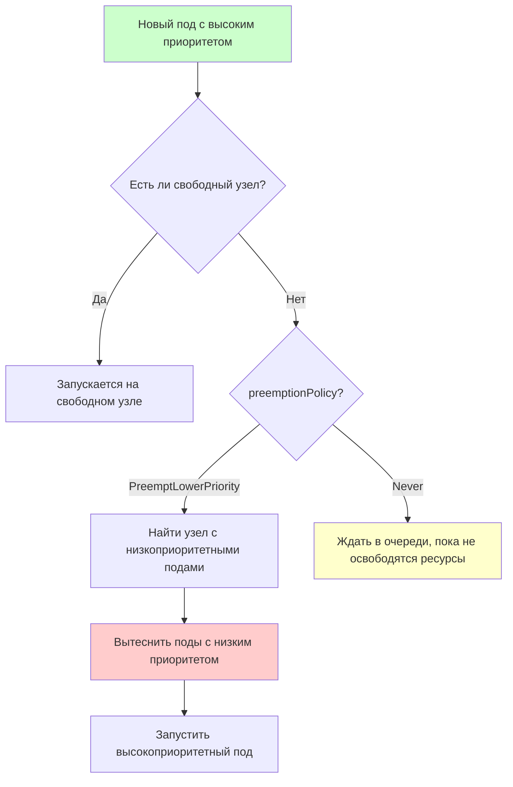

# Pod Priority and Preemption — приоритеты подов и вытеснение

> 📌 **PriorityClass** задаёт важность пода (число от -2B до 1B). Если кластер переполнен, планировщик может **вытеснить (preempt)** поды с низким приоритетом, чтобы запустить высокоприоритетные. `preemptionPolicy: Never` — под ждёт в очереди, но не вытесняет других. **Безопасность**: используй ResourceQuota, чтобы пользователи не создавали поды с высоким приоритетом.

---

## 🔹 Концепция

| Термин | Описание |
|--------|----------|
| **PriorityClass** | Не-namespace объект, маппит имя → целочисленный приоритет |
| **priorityClassName** | Поле в PodSpec, ссылается на PriorityClass |
| **priority** | Целочисленное значение приоритета пода (заполняется admission controller'ом) |
| **Preemption** | Вытеснение низкоприоритетных подов для запуска высокоприоритетного |
| **preemptionPolicy** | `PreemptLowerPriority` (по умолчанию) или `Never` (не вытеснять) |
| **nominatedNodeName** | Поле в PodStatus, показывает узел, выбранный для preemption |



---

## 🔹 PriorityClass

### 📋 Что это

- **Scope**: Cluster-wide (не namespace)
- **Диапазон значений**: от `-2147483648` до `1000000000`
- **Высокие значения** (> 1B) зарезервированы для системных подов (`system-cluster-critical`, `system-node-critical`)
- **Имя**: должно быть валидным DNS subdomain, **не может** начинаться с `system-`

### 📝 Создание PriorityClass

```yaml
apiVersion: scheduling.k8s.io/v1
kind: PriorityClass
metadata:
  name: high-priority
value: 1000000                    # ← целочисленный приоритет
preemptionPolicy: PreemptLowerPriority   # ← по умолчанию (можно опустить)
globalDefault: false              # ← использовать для подов без priorityClassName?
description: "Для критичных production-сервисов"
```

```bash
# Создать
kubectl apply -f priorityclass.yaml

# Посмотреть все PriorityClass
kubectl get priorityclasses
# NAME                      VALUE        GLOBAL-DEFAULT   AGE
# high-priority             1000000      False            1m
# system-cluster-critical   2000000000   False            10d
# system-node-critical      2000000050   False            10d

# Детали
kubectl describe priorityclass high-priority
```

### 🎯 globalDefault

```yaml
apiVersion: scheduling.k8s.io/v1
kind: PriorityClass
metadata:
  name: default-priority
value: 1000
globalDefault: true              # ← все поды без priorityClassName получат этот класс
description: "Дефолтный приоритет для всех подов"
```

> ⚠️ **Важно**: может быть только **один** PriorityClass с `globalDefault: true` в кластере. Если нет — поды без `priorityClassName` получают приоритет 0.

### 🎯 Встроенные PriorityClass

| Имя | Значение | Назначение |
|-----|----------|------------|
| `system-node-critical` | 2000001000 | Критичные для ноды (например, networking) |
| `system-cluster-critical` | 2000000000 | Критичные для кластера (например, CoreDNS) |

> 💡 Эти классы уже существуют в кластере. Используй их для системных workloads.

---

## 🔹 Использование priorityClassName в Pod

### 📝 Пример

```yaml
apiVersion: v1
kind: Pod
metadata:
  name: nginx
  labels:
    app: web
spec:
  priorityClassName: high-priority    # ← ссылка на PriorityClass
  containers:
  - name: nginx
    image: nginx:1.25
```

**Что произойдёт**:
1. Admission controller `PodPriority` проверит, что `high-priority` существует
2. Заполнит поле `spec.priority: 1000000`
3. Если PriorityClass не найден → под отклонён

### 📝 Пример с Deployment

```yaml
apiVersion: apps/v1
kind: Deployment
metadata:
  name: critical-app
spec:
  replicas: 3
  selector:
    matchLabels:
      app: critical
  template:
    metadata:
      labels:
        app: critical
    spec:
      priorityClassName: high-priority    # ← в шаблоне пода
      containers:
      - name: app
        image: my-app:latest
```

---

## 🔹 preemptionPolicy — Non-preempting PriorityClass

> Позволяет создать под с высоким приоритетом, который **не вытесняет** другие поды, а ждёт в очереди.

### 🎯 Два значения

| preemptionPolicy | Поведение | Когда использовать |
|------------------|-----------|-------------------|
| **`PreemptLowerPriority`** (по умолчанию) | Может вытеснять поды с низким приоритетом | Критичные workloads, которые должны запуститься немедленно |
| **`Never`** | Не вытесняет другие поды. Ждёт в очереди, пока не освободятся ресурсы | Batch-задачи, аналитика — важны, но не критичны |

### 📝 Пример: Non-preempting PriorityClass

```yaml
apiVersion: scheduling.k8s.io/v1
kind: PriorityClass
metadata:
  name: high-priority-nonpreempting
value: 1000000
preemptionPolicy: Never              # ← не вытеснять другие поды
globalDefault: false
description: "Для batch-задач: высокий приоритет, но не вытесняет другие поды"
```

**Поведение**:
- Под с этим классом будет **перед** подов с низким приоритетом в очереди
- Но **не будет** вытеснять запущенные поды
- Ждёт, пока ресурсы освободятся "естественным путём"
- Может быть вытеснен другими подами с ещё более высоким приоритетом

### 🎯 Сценарий использования

```
Сценарий: Аналитическая задача (batch job)

1. Пользователь запускает большую аналитическую задачу
2. Хочет, чтобы она запустилась раньше других batch-задач
3. Но не хочет прерывать уже работающие задачи (они могут быть долгоиграющими)

Решение: PriorityClass с preemptionPolicy: Never
- Задача получит высокий приоритет в очереди
- Не вытеснит другие поды
- Запустится, когда освободятся ресурсы
```

---

## 🔹 Как работает Preemption

### 🎯 Алгоритм

```
1. Планировщик берёт под P из очереди (с высоким приоритетом)
2. Пытается найти узел, где P может запуститься
3. Если такого узла нет → запускается логика preemption
4. Для каждого узла N:
   a. Проверяет: "Если удалить все поды с приоритетом < P, сможет ли P запуститься на N?"
   b. Если да → узел N — кандидат на preemption
5. Выбирает лучший узел (с наименьшим приоритетом жертв, с учётом PDB)
6. Вытесняет поды с низким приоритетом (жертвы)
7. Устанавливает nominatedNodeName = N для пода P
8. Ждёт, пока жертвы завершатся (graceful termination)
9. Запускает под P на узле N
```

### 🎯 nominatedNodeName

```yaml
status:
  nominatedNodeName: worker-1    # ← узел, выбранный для preemption
```

**Что это значит**:
- Планировщик выбрал `worker-1` для запуска пода P
- Жертвы вытесняются, но ещё не завершены (graceful termination)
- Под P **ещё не запущен** на `worker-1`
- Если появится другой узел, куда можно запустить P без preemption — планировщик может выбрать его
- Если появится под с ещё более высоким приоритетом — он может занять `worker-1`, и `nominatedNodeName` очистится

### 📝 Проверка nominatedNodeName

```bash
# Посмотреть поды с nominatedNodeName
kubectl get pods -o custom-columns="NAME:.metadata.name,NOMINATED:.status.nominatedNodeName,NODE:.spec.nodeName"
# NAME              NOMINATED   NODE
# critical-pod      worker-1    <none>     ← ждёт, пока жертвы завершатся
# low-priority-1    <none>      worker-1   ← будет вытеснен
# low-priority-2    <none>      worker-1   ← будет вытеснен

# Посмотреть события пода
kubectl describe pod critical-pod | grep -A10 'Events:'
# Normal  Preempted  ...  Marking for deletion Pod low-priority-1 from Node worker-1
# Normal  Preempted  ...  Marking for deletion Pod low-priority-2 from Node worker-1
```

---

## 🔹 Ограничения Preemption

### ⚠️ 1. Graceful Termination

> Жертвы получают **graceful termination period** (по умолчанию 30 секунд) для завершения работы.

**Проблема**:
- Планировщик вытеснил жертвы
- Ждёт, пока они завершатся (до 30 секунд)
- В это время может появиться другой узел или под с более высоким приоритетом
- Под P может быть запущен на другом узле, а не на `nominatedNodeName`

**Решение**:
- Установить короткий `terminationGracePeriodSeconds` для низкоприоритетных подов
- Или принять, что preemption не мгновенна

```yaml
spec:
  terminationGracePeriodSeconds: 5    # ← быстро завершаться
  containers:
  - name: low-priority-app
    image: my-app:latest
```

### ⚠️ 2. PodDisruptionBudget (PDB)

> Планировщик **старается** не нарушать PDB, но **не гарантирует**.

**Поведение**:
- Планировщик ищет жертвы, которые не нарушат PDB
- Если таких нет — всё равно вытесняет (PDB нарушается)
- Это **best effort**, не строгая гарантия

**Решение**:
- Использовать PDB для критичных workloads
- Но понимать, что при preemption PDB может быть нарушен

### ⚠️ 3. Inter-Pod Affinity

> Если под P имеет **podAffinity** к низкоприоритетным подам на узле N — preemption **не сработает**.

**Почему**:
- Если вытеснить низкоприоритетные поды → podAffinity не может быть удовлетворена
- Планировщик не может запустить P на узле N
- Ищет другой узел

**Решение**:
- Создавать podAffinity только к подам **равного или более высокого** приоритета

```yaml
# ❌ Плохо: podAffinity к низкоприоритетным подам
affinity:
  podAffinity:
    requiredDuringSchedulingIgnoredDuringExecution:
    - labelSelector:
        matchLabels:
          app: low-priority-app      # ← может быть вытеснен
      topologyKey: kubernetes.io/hostname

# ✅ Хорошо: podAffinity к равноприоритетным или высокоприоритетным подам
affinity:
  podAffinity:
    requiredDuringSchedulingIgnoredDuringExecution:
    - labelSelector:
        matchLabels:
          app: high-priority-app     # ← не будет вытеснен
      topologyKey: kubernetes.io/hostname
```

### ⚠️ 4. Cross-Node Preemption

> Планировщик **не выполняет** cross-node preemption.

**Пример**:
```
Под P на Node N
Под Q на Node M (в той же зоне)
Под P имеет podAntiAffinity к Q (topologyKey: zone)

Чтобы запустить P на N, нужно вытеснить Q на M.
Но планировщик НЕ будет вытеснять Q на другом узле.
→ Под P останется в Pending.
```

**Решение**:
- Избегать сложных cross-node зависимостей
- Или вручную управлять размещением

---

## 🔹 Выбор жертв для preemption

> Когда несколько узлов-кандидатов, планировщик выбирает **лучший** для preemption.

### 🎯 Алгоритм выбора

```
1. Найти все узлы, где preemption возможна
2. Для каждого узла:
   a. Посмотреть приоритеты жертв
   b. Проверить PDB
3. Выбрать узел с:
   - Наименьшим приоритетом жертв
   - Нарушением наименьшего числа PDB
   - Если всё равно — узел с наименьшим суммарным приоритетом жертв
```

### 📝 Пример

```
Узел A: 2 пода с приоритетом 100, PDB не нарушен
Узел B: 1 под с приоритетом 500, PDB не нарушен
Узел C: 3 пода с приоритетом 200, PDB нарушен

Выбор: Узел A (наименьший приоритет жертв, PDB не нарушен)
```

---

## 🔹 Priority vs QoS

> **Priority** и **QoS** — ортогональные характеристики.

| Характеристика | Priority | QoS |
|----------------|----------|-----|
| **Что определяет** | Важность пода (для preemption) | Качество обслуживания (для node-pressure eviction) |
| **Когда используется** | Preemption (планировщик) | Node-pressure eviction (kubelet) |
| **Значения** | Целое число (-2B до 1B) | Guaranteed, Burstable, BestEffort |
| **Взаимодействие** | Нет прямой связи | Нет прямой связи |

### 🎯 Node-pressure eviction (kubelet)

> Когда на ноде не хватает ресурсов (memory, disk, pid), kubelet вытесняет поды.

**Порядок вытеснения**:
1. Поды, использующие больше ресурсов, чем `requests`
2. По приоритету (низкоприоритетные первыми)
3. По объёму использования ресурсов относительно `requests`

**Важно**:
- Если под **не превышает** `requests` — он **не будет вытеснен** (даже если низкоприоритетный)
- Высокоприоритетный под, превышающий `requests`, может быть вытеснен раньше низкоприоритетного, не превышающего `requests`

---

## 🔹 Практика: создание и проверка

### 🚀 Пошаговая настройка

```bash
# 1. Создать PriorityClass
kubectl apply -f - <<EOF
apiVersion: scheduling.k8s.io/v1
kind: PriorityClass
metadata:
  name: high-priority
value: 1000000
preemptionPolicy: PreemptLowerPriority
globalDefault: false
description: "Для критичных production-сервисов"
EOF

# 2. Создать низкоприоритетный под
kubectl apply -f - <<EOF
apiVersion: v1
kind: Pod
metadata:
  name: low-priority-pod
spec:
  priorityClassName: low-priority    # ← предполагаем, что такой класс есть
  containers:
  - name: nginx
    image: nginx:1.25
    resources:
      requests:
        cpu: 500m
        memory: 512Mi
EOF

# 3. Создать высокоприоритетный под (который не помещается)
kubectl apply -f - <<EOF
apiVersion: v1
kind: Pod
metadata:
  name: high-priority-pod
spec:
  priorityClassName: high-priority
  containers:
  - name: nginx
    image: nginx:1.25
    resources:
      requests:
        cpu: 500m
        memory: 512Mi
EOF

# 4. Проверить, что низкоприоритетный под вытеснен
kubectl get pods
# NAME               READY   STATUS       RESTARTS   AGE
# high-priority-pod  1/1     Running      0          10s
# low-priority-pod   0/1     Terminating  0          5m

# 5. Посмотреть события
kubectl describe pod low-priority-pod | grep -A10 'Events:'
# Normal  Preempted  ...  Marking for deletion Pod low-priority-pod from Node worker-1

kubectl describe pod high-priority-pod | grep -A10 'Events:'
# Normal  Scheduled  ...  Successfully assigned default/high-priority-pod to worker-1
# Normal  Preempted  ...  Preempting pod default/low-priority-pod to make room for pod
```

### 🔍 Отладка

```bash
# Посмотреть все PriorityClass
kubectl get priorityclasses

# Посмотреть приоритет пода
kubectl get pod <pod-name> -o jsonpath='{.spec.priorityClassName}{"\n"}{.spec.priority}'
# high-priority
# 1000000

# Посмотреть nominatedNodeName
kubectl get pods -o custom-columns="NAME:.metadata.name,PRIORITY:.spec.priority,NOMINATED:.status.nominatedNodeName,NODE:.spec.nodeName"

# Посмотреть события preemption
kubectl get events --field-selector reason=Preempted --all-namespaces

# Посмотреть, почему под в Pending
kubectl describe pod <pod-name> | grep -A20 'Events:'
# Warning  FailedScheduling  ...  0/3 nodes are available: 3 Insufficient cpu.

# Проверить, что ResourceQuota не запрещает создание подов с высоким приоритетом
kubectl get resourcequota -n <namespace>
kubectl describe resourcequota <name> -n <namespace> | grep priorityclass
```

### ⚠️ Частые проблемы

| Проблема | Причина | Решение |
|----------|---------|---------|
| **Под в Pending** | Нет узлов, даже после preemption | Увеличить кластер или уменьшить requests |
| **Preemption не срабатывает** | PodDisruptionBudget запрещает | Проверить PDB, временно увеличить minAvailable |
| **Под вытеснен, но preemptor не запустился** | Появился под с ещё более высоким приоритетом | Проверить события, логи планировщика |
| **Пользователи создают поды с высоким приоритетом** | Нет ResourceQuota | Добавить ResourceQuota с ограничением priorityclass |
| **Inter-pod affinity блокирует preemption** | Affinity к низкоприоритетным подам | Изменить affinity к равноприоритетным или высокоприоритетным |

---

## 🔹 Безопасность: ResourceQuota для PriorityClass

> ⚠️ **Важно**: в multi-tenant кластере пользователи могут создавать поды с высоким приоритетом и вытеснять чужие workloads.

### 📝 Ограничение через ResourceQuota

```yaml
apiVersion: v1
kind: ResourceQuota
metadata:
  name: priority-quota
  namespace: team-a
spec:
  hard:
    # Ограничить использование PriorityClass
    high-priority: "0"              # ← запретить использование high-priority
    medium-priority: "5"            # ← макс 5 подов с medium-priority
    # low-priority не ограничен
```

```bash
# Применить
kubectl apply -f resourcequota.yaml

# Проверить
kubectl describe resourcequota priority-quota -n team-a
# Name:             priority-quota
# Namespace:        team-a
# Resource          Used  Hard
# --------          ----  ----
# high-priority     0     0       ← запрещено
# medium-priority   2     5
```

### 🎯 Ограничение через Admission Controller

Для более гибкого контроля можно использовать:
- **ValidatingAdmissionPolicy** (v1.26+) — декларативные правила валидации
- **OPA/Gatekeeper** — политики на основе Rego
- **Kyverno** — политики на основе YAML

---

## 🔹 Чек-лист: настройка Priority and Preemption

```
# ✅ 1. Определить PriorityClasses
#    - system-cluster-critical (уже есть) — для системных workloads
#    - system-node-critical (уже есть) — для системных workloads
#    - high-priority — для критичных production-сервисов
#    - medium-priority — для обычных production-сервисов
#    - low-priority — для batch-задач, dev/test

# ✅ 2. Создать PriorityClasses
kubectl apply -f priorityclass.yaml

# ✅ 3. Настроить ResourceQuota (для multi-tenant)
#    - Ограничить использование high-priority для обычных пользователей
#    - Разрешить только админам создавать поды с высоким приоритетом

# ✅ 4. Добавить priorityClassName в манифесты
#    - Критичные сервисы → high-priority
#    - Обычные сервисы → medium-priority
#    - Batch-задачи → low-priority или high-priority-nonpreempting

# ✅ 5. Настроить terminationGracePeriodSeconds
#    - Низкоприоритетные поды → короткий период (5-10 сек)
#    - Высокоприоритетные поды → стандартный период (30 сек)

# ✅ 6. Настроить PodDisruptionBudget
#    - Для критичных workloads → PDB с minAvailable
#    - Понимать, что PDB может быть нарушен при preemption

# ✅ 7. Избегать inter-pod affinity к низкоприоритетным подам
#    - Использовать affinity только к равноприоритетным или высокоприоритетным

# ✅ 8. Мониторинг
#    - Алерт на preemption события
#    - Метрики: scheduler_preemption_attempts_total, scheduler_preemption_victims
#    - Алерт на поды с nominatedNodeName (долго ждут)
```

> 💡 **Совет для конспекта**:
> 1. Создай файл `00_priority_cheatsheet.md` с шпаргалкой по PriorityClass и командам.
> 2. Добавь блок «Частые ошибки»: «забыл ResourceQuota", "podAffinity к низкоприоритетным подам", "не настроил terminationGracePeriodSeconds".
> 3. Веди список "Какие PriorityClasses у нас в кластере": имя, значение, preemptionPolicy, кто может использовать.

---

## 🔹 Ключевые выводы

1. **PriorityClass** — не-namespace объект, маппит имя → целочисленный приоритет (-2B до 1B).
2. **priorityClassName** — поле в PodSpec, ссылается на PriorityClass. Заполняется admission controller'ом.
3. **preemptionPolicy**: `PreemptLowerPriority` (по умолчанию, вытесняет) vs `Never` (не вытесняет, ждёт в очереди).
4. **globalDefault** — может быть только один PriorityClass с `globalDefault: true`.
5. **Preemption** — вытеснение низкоприоритетных подов для запуска высокоприоритетных.
6. **nominatedNodeName** — узел, выбранный для preemption. Под ещё не запущен, ждёт завершения жертв.
7. **Graceful termination** — жертвы получают время на завершение (по умолчанию 30 сек). Это создаёт задержку.
8. **PodDisruptionBudget** — планировщик старается не нарушать, но **не гарантирует**.
9. **Inter-pod affinity** — если affinity к низкоприоритетным подам → preemption не сработает.
10. **Cross-node preemption** — не поддерживается. Планировщик не вытесняет поды на других узлах.
11. **Priority vs QoS** — ортогональные характеристики. Priority для preemption, QoS для node-pressure eviction.
12. **Node-pressure eviction** — kubelet вытесняет поды при нехватке ресурсов на ноде. Учитывает priority и использование ресурсов.
13. **Безопасность**: используй ResourceQuota, чтобы пользователи не создавали поды с высоким приоритетом.
14. **Best practices**: короткие terminationGracePeriodSeconds для низкоприоритетных подов, PDB для критичных workloads, избегать affinity к низкоприоритетным подам.