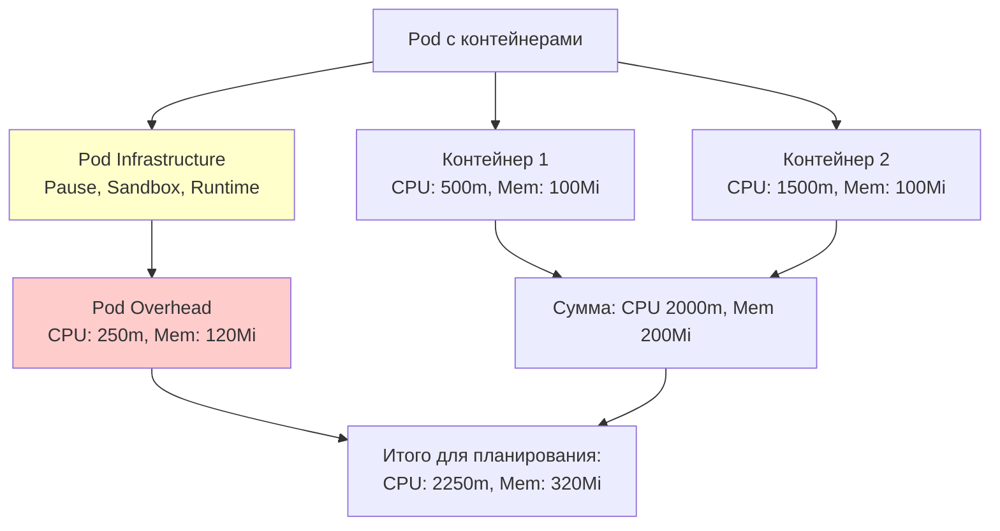

# Pod Overhead — учёт ресурсов инфраструктуры пода

> 📌 **TL;DR**: **Pod Overhead** — дополнительные ресурсы, которые потребляет **инфраструктура пода** (runtime, pause-контейнер, sandbox) сверх ресурсов контейнеров. Учитывается при **планировании**, **ResourceQuota** и **размере cgroup**. Настраивается через **RuntimeClass** (стабильно с v1.24).

---

## 🔹 Что такое Pod Overhead

| Концепция | Описание |
|-----------|----------|
| **Pod Overhead** | Дополнительные CPU/memory, которые потребляет runtime контейнеров для запуска пода |
| **Источники overhead** | Pause-контейнер, sandbox (gVisor, Kata, Firecracker), runtime-процессы |
| **Когда учитывается** | При планировании, ResourceQuota, создании cgroup, node-pressure eviction |
| **Где настраивается** | В `RuntimeClass.overhead.podFixed` |
| **Кто применяет** | Admission controller `RuntimeClass` автоматически добавляет overhead в PodSpec |



### 🎯 Зачем нужен

**Без Pod Overhead**:
- Планировщик видит: под требует 2 CPU, 200Mi memory
- На ноде есть 2 CPU, 200Mi → под запускается
- **НО**: runtime требует ещё 250m CPU, 120Mi memory → нода перегружена, OOM

**С Pod Overhead**:
- Планировщик видит: под требует 2.25 CPU, 320Mi memory (включая overhead)
- На ноде есть 2 CPU, 200Mi → под **не помещается**, ищется другая нода
- Нода не перегружена ✅

---

## 🔹 RuntimeClass с overhead

> Pod Overhead настраивается **только** через `RuntimeClass`.

### 📝 Создание RuntimeClass с overhead

```yaml
apiVersion: node.k8s.io/v1
kind: RuntimeClass
metadata:
  name: kata-fc                    # ← имя RuntimeClass
handler: kata-fc                   # ← handler в containerd/CRI
overhead:
  podFixed:                        # ← фиксированный overhead на под
    cpu: "250m"                    # ← 250 милли-CPU
    memory: "120Mi"                # ← 120 МиБ памяти
```

```bash
# Создать RuntimeClass
kubectl apply -f runtimeclass.yaml

# Посмотреть все RuntimeClass
kubectl get runtimeclasses
# NAME        HANDLER    AGE
# kata-fc     kata-fc    1m
# runc        runc       10d
# gvisor      runsc      5d

# Детали
kubectl describe runtimeclass kata-fc
# Name:         kata-fc
# Handler:      kata-fc
# Overhead:
#   Pod Fixed:
#     CPU:      250m
#     Memory:   120Mi
```

### 🎯 Типичные значения overhead

| Runtime | Overhead CPU | Overhead Memory | Комментарий |
|---------|--------------|-----------------|-------------|
| **runc** (стандартный) | 0 | 0 | Минимальный overhead (только pause-контейнер) |
| **gVisor** (runsc) | ~100m | ~50Mi | Sandbox для изоляции |
| **Kata Containers** | ~250m | ~120Mi | Виртуальная машина для пода |
| **Firecracker** | ~200m | ~100Mi | Легковесная VM |
| **Cloud Hypervisor** | ~250m | ~150Mi | VM для пода |

> 💡 **Важно**: точные значения зависят от конфигурации runtime. Измеряй в своём кластере!

---

## 🔹 Как работает Pod Overhead

### 🎯 1. Admission Controller

Когда создаётся под с `runtimeClassName`:

```yaml
apiVersion: v1
kind: Pod
metadata:
  name: test-pod
spec:
  runtimeClassName: kata-fc        # ← ссылка на RuntimeClass
  containers:
  - name: app
    image: nginx:1.25
    resources:
      limits:
        cpu: 500m
        memory: 100Mi
```

**Admission controller `RuntimeClass`**:
1. Находит RuntimeClass `kata-fc`
2. Читает `overhead.podFixed: {cpu: 250m, memory: 120Mi}`
3. Добавляет `spec.overhead` в PodSpec

```bash
# Проверить, что overhead добавлен
kubectl get pod test-pod -o jsonpath='{.spec.overhead}'
# map[cpu:250m memory:120Mi]
```

> ⚠️ **Важно**: если в PodSpec **уже есть** `spec.overhead` — под будет **отклонён**.

---

### 🎯 2. Планирование (kube-scheduler)

Планировщик учитывает overhead при поиске узла:

```
Контейнеры:
- Контейнер 1: CPU 500m, Memory 100Mi
- Контейнер 2: CPU 1500m, Memory 100Mi
Сумма контейнеров: CPU 2000m, Memory 200Mi

Overhead (из RuntimeClass):
- CPU: 250m
- Memory: 120Mi

Итого для планирования:
- CPU: 2250m
- Memory: 320Mi
```

```bash
# Посмотреть, как планировщик видит под
kubectl describe node worker-1 | grep -A10 'Allocated resources:'
# Non-terminated Pods:          (3 in total)
#   Namespace    Name        CPU Requests  CPU Limits   Memory Requests  Memory Limits
#   ---------    ----        ------------  ----------   ---------------  -------------
#   default      test-pod    2250m (56%)   2250m (56%)  320Mi (1%)       320Mi (1%)
#                                                  ↑ включает overhead!
```

---

### 🎯 3. ResourceQuota

Если в namespace есть ResourceQuota — overhead **учитывается** в квоте:

```yaml
apiVersion: v1
kind: ResourceQuota
metadata:
  name: compute-quota
  namespace: default
spec:
  hard:
    requests.cpu: "10"
    requests.memory: 10Gi
    limits.cpu: "20"
    limits.memory: 20Gi
```

**Под с overhead**:
- Контейнеры: CPU 2000m, Memory 200Mi
- Overhead: CPU 250m, Memory 120Mi
- **Итого в квоту**: CPU 2250m, Memory 320Mi

```bash
# Проверить использование квоты
kubectl describe resourcequota compute-quota -n default
# Name:             compute-quota
# Namespace:        default
# Resource          Used    Hard
# --------          ----    ----
# requests.cpu      2250m   10       ← включает overhead!
# requests.memory   320Mi   10Gi
```

---

### 🎯 4. Cgroup на ноде

Kubelet создаёт **cgroup для пода**, который включает overhead:

```
Pod cgroup:
- CPU limit: сумма limits контейнеров + overhead
- Memory limit: сумма limits контейнеров + overhead

Пример:
- Контейнер 1: CPU limit 500m, Memory limit 100Mi
- Контейнер 2: CPU limit 1500m, Memory limit 100Mi
- Overhead: CPU 250m, Memory 120Mi

Pod cgroup:
- CPU limit: 500m + 1500m + 250m = 2250m
- Memory limit: 100Mi + 100Mi + 120Mi = 320Mi
```

```bash
# Проверить cgroup на ноде (продвинутый уровень)
# 1. Найти Pod ID
POD_ID="$(sudo crictl pods --name test-pod -q)"

# 2. Найти путь к cgroup
sudo crictl inspectp -o=json $POD_ID | grep cgroupsPath
# "cgroupsPath": "/kubepods/podd7f4b509-cf94-4951-9417-d1087c92a5b2/..."

# 3. Проверить memory limit
cat /sys/fs/cgroup/memory/kubepods/podd7f4b509-cf94-4951-9417-d1087c92a5b2/memory.limit_in_bytes
# 335544320  ← 320 MiB (включая overhead)
```

---

## 🔹 Практика: создание и проверка

### 🚀 Пошаговая настройка

```bash
# 1. Создать RuntimeClass с overhead
kubectl apply -f - <<EOF
apiVersion: node.k8s.io/v1
kind: RuntimeClass
metadata:
  name: kata-fc
handler: kata-fc
overhead:
  podFixed:
    cpu: "250m"
    memory: "120Mi"
EOF

# 2. Создать под с runtimeClassName
kubectl apply -f - <<EOF
apiVersion: v1
kind: Pod
metadata:
  name: test-pod
spec:
  runtimeClassName: kata-fc
  containers:
  - name: busybox
    image: busybox:1.28
    command: ["sleep", "3600"]
    resources:
      limits:
        cpu: 500m
        memory: 100Mi
  - name: nginx
    image: nginx:1.25
    resources:
      limits:
        cpu: 1500m
        memory: 100Mi
EOF

# 3. Проверить, что overhead добавлен
kubectl get pod test-pod -o jsonpath='{.spec.overhead}'
# map[cpu:250m memory:120Mi]

# 4. Проверить, как планировщик видит под
kubectl describe node worker-1 | grep -A10 'Allocated resources:' | grep test-pod
# default   test-pod   2250m (56%)   2250m (56%)   320Mi (1%)   320Mi (1%)

# 5. Проверить ResourceQuota (если есть)
kubectl describe resourcequota compute-quota -n default | grep -A5 'Resource'
# Resource          Used    Hard
# --------          ----    ----
# requests.cpu      2250m   10       ← включает overhead!
# requests.memory   320Mi   10Gi
```

### 🔍 Отладка

```bash
# Под не запускается? Смотрим события
kubectl describe pod test-pod | grep -A20 'Events:'
# Warning  FailedScheduling  ...  0/3 nodes are available: 3 Insufficient cpu.
# ← планировщик учитывает overhead, поэтому видит нехватку ресурсов

# Проверить RuntimeClass
kubectl get runtimeclass kata-fc -o yaml
# Смотрим overhead.podFixed

# Проверить, что runtime установлен на ноде
kubectl get nodes -o custom-columns="NAME:.metadata.name,RUNTIMES:.status.nodeInfo.containerRuntimeVersion"
# NAME       RUNTIMES
# worker-1   containerd://1.7.0

# SSH на ноду и проверить, что handler существует
ssh worker-1
sudo crictl runtimeclass
# NAME        HANDLER
# kata-fc     kata-fc
# runc        runc

# Проверить cgroup на ноде
POD_ID="$(sudo crictl pods --name test-pod -q)"
sudo crictl inspectp -o=json $POD_ID | jq -r '.info.cgroupsPath'
```

### ⚠️ Частые проблемы

| Проблема | Причина | Решение |
|----------|---------|---------|
| **Под в Pending** | Overhead учтён, но на ноде не хватает ресурсов | Увеличить кластер или уменьшить overhead |
| **RuntimeClass не найден** | RuntimeClass не создан или опечатка в имени | Проверить `kubectl get runtimeclasses` |
| **Handler не найден на ноде** | Runtime не установлен на ноде | Установить runtime (Kata, gVisor) на все ноды |
| **Overhead не применяется** | Admission controller отключён | Проверить `--enable-admission-plugins` в kube-apiserver |
| **Под отклонён** | В PodSpec уже есть `spec.overhead` | Убрать `spec.overhead` из манифеста (admission добавит сам) |
| **ResourceQuota превышена** | Overhead учтён в квоте | Увеличить квоту или уменьшить overhead |

---

## 🔹 Наблюдаемость

### 📊 Метрики kube-state-metrics

```promql
# Overhead для пода
kube_pod_overhead_cpu_cores{pod="test-pod"}
# 0.25

kube_pod_overhead_memory_bytes{pod="test-pod"}
# 125829120  (120 MiB)

# Суммарный overhead по namespace
sum(kube_pod_overhead_memory_bytes{namespace="default"})
```

### 🎯 Алерты

```yaml
groups:
- name: pod-overhead
  rules:
  - alert: HighPodOverhead
    expr: kube_pod_overhead_memory_bytes > 200000000    # > 200 MiB
    for: 5m
    labels:
      severity: warning
    annotations:
      summary: "Высокий Pod Overhead"
      description: "Под {{ $labels.pod }} имеет overhead {{ $value | humanize1024 }}iB"
  
  - alert: PodOverheadExceedsRequests
    expr: kube_pod_overhead_cpu_cores > kube_pod_container_resource_requests{resource="cpu"} * 0.5
    for: 5m
    labels:
      severity: warning
    annotations:
      summary: "Pod Overhead превышает 50% от requests"
      description: "Overhead пода {{ $labels.pod }} слишком большой"
```

---

## 🔹 Сравнение: с overhead и без

### 📝 Пример: под с Kata Containers

```yaml
# RuntimeClass
apiVersion: node.k8s.io/v1
kind: RuntimeClass
metadata:
  name: kata-fc
handler: kata-fc
overhead:
  podFixed:
    cpu: "250m"
    memory: "120Mi"
---
# Pod
apiVersion: v1
kind: Pod
metadata:
  name: secure-app
spec:
  runtimeClassName: kata-fc
  containers:
  - name: app
    image: my-app:latest
    resources:
      requests:
        cpu: 500m
        memory: 256Mi
      limits:
        cpu: 1
        memory: 512Mi
```

### 📊 Что видит планировщик

| Компонент | CPU | Memory |
|-----------|-----|--------|
| Контейнер (requests) | 500m | 256Mi |
| Контейнер (limits) | 1 | 512Mi |
| **Overhead** | **250m** | **120Mi** |
| **Итого для планирования (requests)** | **750m** | **376Mi** |
| **Итого для cgroup (limits)** | **1.25** | **632Mi** |

### 🎯 Результат

**Без overhead**:
- Планировщик видит: 500m CPU, 256Mi memory
- Нода с 500m CPU, 256Mi memory → под запускается
- **НО**: runtime требует ещё 250m CPU, 120Mi → нода перегружена ❌

**С overhead**:
- Планировщик видит: 750m CPU, 376Mi memory
- Нода с 500m CPU, 256Mi memory → под **не помещается**
- Ищется нода с 750m CPU, 376Mi memory → под запускается ✅
- Нода не перегружена ✅

---

## 🔹 Чек-лист: настройка Pod Overhead

```bash
# ✅ 1. Определить overhead для runtime
#    - Измерить overhead в тестовом кластере
#    - Или использовать типичные значения (Kata: 250m/120Mi, gVisor: 100m/50Mi)

# ✅ 2. Создать RuntimeClass с overhead
kubectl apply -f runtimeclass.yaml
# Указать handler и overhead.podFixed

# ✅ 3. Проверить, что runtime установлен на нодах
kubectl get nodes -o custom-columns="NAME:.metadata.name,RUNTIME:.status.nodeInfo.containerRuntimeVersion"
ssh <node> sudo crictl runtimeclass

# ✅ 4. Создать под с runtimeClassName
kubectl apply -f pod.yaml
# Указать runtimeClassName: <name>

# ✅ 5. Проверить, что overhead добавлен
kubectl get pod <pod> -o jsonpath='{.spec.overhead}'

# ✅ 6. Проверить, как планировщик видит под
kubectl describe node <node> | grep -A10 'Allocated resources:' | grep <pod>

# ✅ 7. Проверить ResourceQuota (если есть)
kubectl describe resourcequota <name> -n <namespace>

# ✅ 8. Настроить мониторинг
#    - Метрики: kube_pod_overhead_cpu_cores, kube_pod_overhead_memory_bytes
#    - Алерты на высокий overhead
```

> 💡 **Совет для конспекта**:
> 1. Создай файл `00_pod_overhead_cheatsheet.md` с шпаргалкой по RuntimeClass и overhead.
> 2. Добавь блок «Частые ошибки»: «забыл overhead в RuntimeClass", "runtime не установлен на ноде", "overhead слишком большой".
> 3. Веди список "Какие RuntimeClass у нас в кластере": имя, handler, overhead (CPU/memory).

---

## 🔹 Ключевые выводы

1. **Pod Overhead** — дополнительные ресурсы, которые потребляет инфраструктура пода (runtime, sandbox).
2. **Настраивается** через `RuntimeClass.overhead.podFixed` (стабильно с v1.24).
3. **Учитывается** при планировании, ResourceQuota, создании cgroup, node-pressure eviction.
4. **Admission controller** автоматически добавляет `spec.overhead` в PodSpec при создании пода с `runtimeClassName`.
5. **Типичные значения**: runc (0/0), gVisor (~100m/50Mi), Kata (~250m/120Mi), Firecracker (~200m/100Mi).
6. **Планировщик** видит: сумма requests контейнеров + overhead.
7. **Cgroup** на ноде: сумма limits контейнеров + overhead.
8. **ResourceQuota** учитывает overhead в квоте.
9. **Наблюдаемость**: метрики `kube_pod_overhead_*` в kube-state-metrics.
10. **Best practice**: измерять overhead в своём кластере, настраивать алерты на высокий overhead.