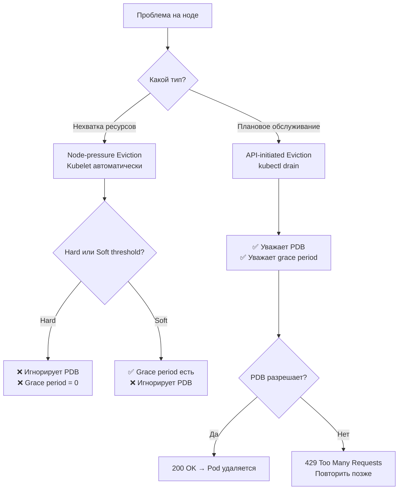

# Eviction — вытеснение подов при нехватке ресурсов

> 📌 В K8s есть **2 типа eviction**: 
> (1) **Node-pressure eviction** — kubelet автоматически вытесняет поды при нехватке ресурсов на ноде (memory, disk, pid). 
> (2) **API-initiated eviction** — ручное вытеснение через API (например, `kubectl drain`). 
> **Ключевое отличие**: node-pressure **игнорирует PDB** и `terminationGracePeriodSeconds` (для hard thresholds), API-eviction **уважает** PDB и grace period.

---

## 🔹 Два типа Eviction

| Характеристика | Node-pressure Eviction | API-initiated Eviction |
|----------------|------------------------|------------------------|
| **Кто инициирует** | Kubelet (автоматически) | Пользователь/контроллер (вручную) |
| **Триггер** | Нехватка ресурсов на ноде (memory, disk, pid) | `kubectl drain`, `kubectl delete`, API call |
| **PodDisruptionBudget** | ❌ **Игнорируется** | ✅ **Уважается** |
| **terminationGracePeriodSeconds** | ⚠️ Только для soft thresholds | ✅ **Уважается** |
| **Цель** | Спасти ноду от краха | Плановое обслуживание, rolling update |
| **Примеры** | OOM, disk full, inode exhaustion | `kubectl drain node-1`, cluster upgrade |



---

## 🔹 1. Node-pressure Eviction

### 🎯 Как работает

```
1. Kubelet мониторит ресурсы ноды (memory, disk, inode, pid)
2. Сравнивает текущие значения с порогами (thresholds)
3. Если порог достигнут:
   a. Пытается освободить ресурсы (GC мусора, удаление unused images)
   b. Если не помогло → начинает вытеснять поды
4. Выбирает жертв по приоритету и usage vs requests
5. Вытесняет поды (устанавливает status.phase: Failed)
6. Controller (Deployment, StatefulSet) создаёт новые поды на других нодах
```

### 🎯 Сигналы eviction

| Сигнал | Описание | Формула |
|--------|----------|---------|
| **`memory.available`** | Доступная память | `capacity[memory] - workingSet` |
| **`nodefs.available`** | Свободное место на nodefs | `fs.available` |
| **`nodefs.inodesFree`** | Свободные inode на nodefs | `fs.inodesFree` |
| **`imagefs.available`** | Свободное место на imagefs | `runtime.imagefs.available` |
| **`imagefs.inodesFree`** | Свободные inode на imagefs | `runtime.imagefs.inodesFree` |
| **`containerfs.available`** | Свободное место на containerfs (beta, v1.31+) | `runtime.containerfs.available` |
| **`containerfs.inodesFree`** | Свободные inode на containerfs (beta, v1.31+) | `runtime.containerfs.inodesFree` |
| **`pid.available`** | Свободные PID (Linux) | `maxpid - curproc` |

### 🎯 Файловые системы

| FS | Что хранит | Когда используется |
|----|------------|-------------------|
| **nodefs** | Основная FS ноды: `/var/lib/kubelet`, emptyDir, логи, writable layers | Всегда |
| **imagefs** | Образы контейнеров (read-only layers) | Опционально, отдельный диск |
| **containerfs** | Writable layers контейнеров | Опционально, отдельный диск (beta) |

**Типичные конфигурации**:
1. **Все на nodefs** (rootfs) — nodefs = imagefs = containerfs
2. **Separate disk** — imagefs + containerfs на отдельном диске, nodefs на корневом
3. **Separate image** — imagefs на отдельном диске, nodefs = containerfs на корневом

---

### 🎯 Пороги eviction

#### Hard thresholds (жёсткие)

> Немедленное вытеснение, **grace period = 0**, **PDB игнорируется**.

```bash
# Флаги kubelet
--eviction-hard=memory.available<100Mi,nodefs.available<10%,imagefs.available<15%,nodefs.inodesFree<5%
```

**Дефолты**:
```yaml
evictionHard:
  memory.available: "100Mi"       # Linux (500Mi для Windows)
  nodefs.available: "10%"
  imagefs.available: "15%"
  nodefs.inodesFree: "5%"         # Linux
  imagefs.inodesFree: "5%"        # Linux
```

#### Soft thresholds (мягкие)

> Вытеснение только если порог держится **grace period**, **уважает terminationGracePeriodSeconds**, **PDB всё равно игнорируется**.

```bash
# Флаги kubelet
--eviction-soft=memory.available<500Mi,nodefs.available<15%
--eviction-soft-grace-period=memory.available=1m30s,nodefs.available=2m
--eviction-max-pod-grace-period=30
```

```yaml
# KubeletConfiguration
evictionSoft:
  memory.available: "500Mi"
  nodefs.available: "15%"
evictionSoftGracePeriod:
  memory.available: "1m30s"       # ← порог должен держаться 1.5 минуты
  nodefs.available: "2m"          # ← порог должен держаться 2 минуты
evictionMaxPodGracePeriod: 30     # ← макс grace period для подов
```

**Логика**:
- Если `memory.available < 500Mi` держится **больше 1.5 минуты** → вытеснение
- Поды получают grace period (до `eviction-max-pod-grace-period` или их `terminationGracePeriodSeconds`, что меньше)

#### Minimum reclaim

> Чтобы избежать множественных вытеснений, kubelet может освобождать **минимальный объём** ресурса.

```yaml
evictionHard:
  nodefs.available: "1Gi"
evictionMinimumReclaim:
  nodefs.available: "500Mi"       # ← освободить минимум 500Mi сверх порога
```

**Поведение**: если `nodefs.available < 1Gi` → kubelet освобождает ресурсы, пока не станет `1Gi + 500Mi = 1.5Gi`.

---

### 🎯 Выбор жертв

> Kubelet ранжирует поды и вытесняет **наихудших** первыми.

#### Алгоритм

```
1. Поды, использующие БОЛЬШЕ, чем requests (BestEffort, Burstable с превышением)
   → сортируются по приоритету (низкий первый), затем по usage/requests ratio
   
2. Поды, использующие МЕНЬШЕ, чем requests (Guaranteed, Burstable в пределах)
   → сортируются только по приоритету (низкий первый)
```

#### Приоритет вытеснения

| QoS | Usage vs Requests | Порядок вытеснения |
|-----|-------------------|-------------------|
| **BestEffort** | Всегда > requests (нет requests) | 🔴 **Первыми** (по приоритету) |
| **Burstable** | Usage > requests | 🟠 **Вторыми** (по приоритету, затем по ratio) |
| **Burstable** | Usage ≤ requests | 🟡 **Третьими** (по приоритету) |
| **Guaranteed** | Usage ≤ requests (всегда) | 🟢 **Последними** (по приоритету) |

> ⚠️ **Guaranteed поды** вытесняются **только если** нет других вариантов (например, системные демоны жрут ресурсы).

#### Специальные случаи

| Ситуация | Поведение |
|----------|-----------|
| **Статические поды** | Kubelet пытается перезапустить их (учитывает priority) |
| **DaemonSet поды** | Вытесняются последними (обычно высокий приоритет) |
| **Inode/PID pressure** | Сортировка только по приоритету (нет requests для inode/pid) |
| **Disk pressure с imagefs** | Сортировка по usage writable layer (не по nodefs) |

---

### 🎯 Node conditions

> Kubelet обновляет status ноды, отражая давление.

| Condition | Сигнал | Описание |
|-----------|--------|----------|
| **`MemoryPressure`** | `memory.available` | Мало доступной памяти |
| **`DiskPressure`** | `nodefs.available`, `nodefs.inodesFree`, `imagefs.*`, `containerfs.*` | Мало места или inode |
| **`PIDPressure`** | `pid.available` | Мало свободных PID (Linux) |

```bash
# Проверить conditions ноды
kubectl describe node worker-1 | grep -A10 'Conditions:'
# Conditions:
#   Type             Status
#   ----             ------
#   MemoryPressure   False      ← OK
#   DiskPressure     True       ← Проблема!
#   PIDPressure      False      ← OK
#   Ready            True       ← OK

# Или через JSON
kubectl get node worker-1 -o jsonpath='{.status.conditions[?(@.type=="DiskPressure")].status}'
# True
```

**Автоматические taints**:
- `MemoryPressure` → taint `node.kubernetes.io/memory-pressure:NoSchedule`
- `DiskPressure` → taint `node.kubernetes.io/disk-pressure:NoSchedule`
- `PIDPressure` → taint `node.kubernetes.io/pid-pressure:NoSchedule`

---

### 🎯 OOM killer vs Eviction

> Если kubelet не успевает освободить память → ядро Linux вызывает **OOM killer**.

| Характеристика | Eviction | OOM Killer |
|----------------|----------|------------|
| **Кто вызывает** | Kubelet | Ядро Linux |
| **Когда** | До того, как память кончилась | Когда память кончилась |
| **Grace period** | Есть (для soft) или нет (для hard) | Нет (немедленно) |
| **PDB** | Игнорируется | Игнорируется |
| **Restart** | Controller создаёт новый под | Зависит от `restartPolicy` |
| **Цель** | Контейнер с наибольшим `oom_score` | Контейнер с наибольшим `oom_score` |

#### oom_score_adj

> Kubelet устанавливает `oom_score_adj` для каждого контейнера на основе QoS.

| QoS | oom_score_adj | Шанс быть убитым OOM |
|-----|---------------|---------------------|
| **Guaranteed** | `-997` | 🟢 Минимальный |
| **BestEffort** | `1000` | 🔴 Максимальный |
| **Burstable** | `2` до `999` (формула) | 🟡 Средний |
| **system-node-critical** | `-997` | 🟢 Минимальный |

**Формула для Burstable**:
```
oom_score_adj = min(max(2, 1000 - (1000 × memoryRequestBytes) / machineMemoryCapacityBytes), 999)
```

**Пример**:
- Нода: 16Gi memory
- Под Burstable с request 1Gi:
  - `oom_score_adj = 1000 - (1000 × 1Gi / 16Gi) = 1000 - 62 = 938`
  - Высокий шанс быть убитым OOM

---

### 🎯 Освобождение ресурсов (до вытеснения подов)

> Kubelet **сначала** пытается освободить ресурсы, **потом** вытесняет поды.

#### При DiskPressure

**Без imagefs** (всё на nodefs):
1. GC мёртвых подов и контейнеров
2. Удаление unused образов

**С imagefs**:
- Если `nodefs` под давлением → GC мёртвых подов/контейнеров
- Если `imagefs` под давлением → удаление unused образов

**С containerfs** (beta):
- Если `containerfs` под давлением → GC мёртвых подов/контейнеров
- Если `imagefs` под давлением → удаление unused образов

---

## 🔹 2. API-initiated Eviction

### 🎯 Как работает

```
1. Пользователь вызывает API eviction (kubectl drain, kubectl delete, API call)
2. API-сервер проверяет PodDisruptionBudget (PDB)
3. Если PDB разрешает → создаёт Eviction объект
4. Pod помечается для удаления (deletionTimestamp)
5. Kubelet начинает graceful shutdown (уважает terminationGracePeriodSeconds)
6. Pod удаляется из EndpointSlice (трафик больше не идёт)
7. После grace period → kubelet принудительно убивает под
8. API-сервер удаляет Pod ресурс
```

### 🎯 HTTP коды ответа

| Код | Значение | Что делать |
|-----|----------|------------|
| **200 OK** | Eviction разрешён | Pod удаляется |
| **429 Too Many Requests** | PDB запрещает | Повторить позже (retry) |
| **500 Internal Server Error** | Ошибка конфигурации (например, несколько PDB на один под) | Исправить конфигурацию |

### 📝 Пример API call

```bash
# Через curl
curl -v -H 'Content-type: application/json' \
  https://<api-server>/api/v1/namespaces/default/pods/my-pod/eviction \
  -d '{
    "apiVersion": "policy/v1",
    "kind": "Eviction",
    "metadata": {
      "name": "my-pod",
      "namespace": "default"
    }
  }'
```

```yaml
# Через kubectl (создаёт Eviction объект автоматически)
kubectl drain worker-1 --ignore-daemonsets --delete-emptydir-data

# Или просто удалить под (тоже создаёт Eviction)
kubectl delete pod my-pod
```

### 🎯 PodDisruptionBudget (PDB)

> PDB защищает поды от **voluntary disruptions** (API eviction, но НЕ node-pressure eviction).

```yaml
apiVersion: policy/v1
kind: PodDisruptionBudget
metadata:
  name: my-app-pdb
spec:
  minAvailable: 2              # ← минимум 2 пода должны быть доступны
  # или maxUnavailable: 1      # ← максимум 1 под может быть недоступен
  selector:
    matchLabels:
      app: my-app
```

**Поведение**:
- `kubectl drain` → проверяет PDB → если нарушает → 429 Too Many Requests
- Node-pressure eviction → **игнорирует** PDB → вытесняет

---

## 🔹 Практика: настройка и отладка

### 🚀 Настройка eviction thresholds

```bash
# 1. Отредактировать KubeletConfiguration
sudo vim /var/lib/kubelet/config.yaml

# Добавить/изменить:
evictionHard:
  memory.available: "500Mi"       # ← жёсткий порог памяти
  nodefs.available: "10%"         # ← жёсткий порог диска
  imagefs.available: "15%"        # ← жёсткий порог imagefs
  nodefs.inodesFree: "5%"         # ← жёсткий порог inode

evictionSoft:
  memory.available: "1Gi"         # ← мягкий порог памяти
  nodefs.available: "15%"         # ← мягкий порог диска

evictionSoftGracePeriod:
  memory.available: "2m"          # ← ждать 2 минуты перед вытеснением
  nodefs.available: "5m"          # ← ждать 5 минут перед вытеснением

evictionMaxPodGracePeriod: 60     # ← макс grace period для подов

evictionMinimumReclaim:
  memory.available: "0Mi"
  nodefs.available: "500Mi"       # ← освободить минимум 500Mi

# 2. Перезапустить kubelet
sudo systemctl restart kubelet

# 3. Проверить, что настройки применились
kubectl get node worker-1 -o jsonpath='{.status.conditions}' | jq
```

### 🔍 Отладка eviction

```bash
# 1. Проверить conditions ноды
kubectl describe node worker-1 | grep -A10 'Conditions:'
# Ищи: MemoryPressure, DiskPressure, PIDPressure

# 2. Посмотреть события ноды
kubectl get events --field-selector involvedObject.name=worker-1 --sort-by='.lastTimestamp'
# Normal  Starting     ...  Kubelet started
# Warning  FreeDiskSpace  ...  Freeing disk space
# Warning  EvictionThresholdMet  ...  Attempting to reclaim memory

# 3. Посмотреть события подов (кто был вытеснен)
kubectl get events --field-selector reason=Evicted --all-namespaces
# LAST SEEN   TYPE      REASON    OBJECT            MESSAGE
# 5m          Warning   Evicted   pod/my-app-abc12  The node was low on resource: [MemoryPressure].

# 4. Посмотреть статус вытесненного пода
kubectl get pod my-app-abc12 -o yaml | grep -A10 'status:'
# status:
#   phase: Failed              ← вытеснен
#   reason: Evicted            ← причина
#   message: "The node was low on resource: [MemoryPressure]."

# 5. Проверить, кто был жертвой
kubectl get pods --all-namespaces --field-selector=status.phase=Failed

# 6. Посмотреть, сколько ресурсов использовал под (до вытеснения)
kubectl top pod my-app-abc12 -n default    # ← если под ещё в метриках

# 7. Проверить PDB
kubectl get pdb -A
kubectl describe pdb my-app-pdb -n default
# Name:             my-app-pdb
# Min available:    2
# Current healthy:  3
# Disruptions allowed: 1    ← можно вытеснить 1 под

# 8. Проверить taints (автоматически добавляются при pressure)
kubectl describe node worker-1 | grep -A5 'Taints:'
# Taints: node.kubernetes.io/disk-pressure:NoSchedule
```

### 🧪 Тестирование eviction

```bash
# Тест MemoryPressure (осторожно!)
# 1. Создать под, который жрёт память
kubectl run memory-hog --image=polinux/stress --restart=Never -- stress --vm 1 --vm-bytes 10G --vm-hang 0

# 2. Наблюдать за conditions ноды
kubectl get node worker-1 -w

# 3. Посмотреть события
kubectl get events --field-selector involvedObject.name=worker-1 -w

# Тест DiskPressure
# 1. Заполнить диск на ноде
ssh worker-1
sudo dd if=/dev/zero of=/var/lib/kubelet/bigfile bs=1G count=50

# 2. Наблюдать за eviction
kubectl get events --field-selector reason=Evicted -w
```

### ⚠️ Частые проблемы

| Проблема | Причина | Решение |
|----------|---------|---------|
| **Поды вытесняются, но нода не восстанавливается** | Пороги слишком высокие | Уменьшить `eviction-hard` thresholds |
| **Множественные вытеснения** | Не хватает `eviction-minimum-reclaim` | Увеличить `evictionMinimumReclaim` |
| **OOM killer убивает поды до eviction** | Kubelet не успевает реагировать | Уменьшить пороги, включить `--kernel-memcg-notification` |
| **kubectl drain зависает** | PDB блокирует, поды не готовы | Проверить PDB, увеличить `timeout`, или `--disable-eviction` |
| **DaemonSet поды вытесняются** | Низкий приоритет | Добавить `priorityClassName: system-node-critical` |
| **Guaranteed поды вытесняются** | Системные демоны жрут ресурсы | Увеличить `--system-reserved` или `--kube-reserved` |
| **Node flapping (conditions меняются)** | Колебания вокруг порога | Увеличить `--eviction-pressure-transition-period` (по умолчанию 5m) |

---

## 🔹 Best Practices

### ✅ Делай

1. **Настрой system-reserved и kube-reserved**:
   ```bash
   --system-reserved=memory=1Gi,cpu=200m
   --kube-reserved=memory=1Gi,cpu=200m
   ```
   Это защитит системные процессы и kubelet от вытеснения.

2. **Используй soft thresholds** для graceful eviction:
   ```yaml
   evictionSoft:
     memory.available: "1Gi"
   evictionSoftGracePeriod:
     memory.available: "2m"
   ```

3. **Настрой eviction-minimum-reclaim**, чтобы избежать множественных вытеснений:
   ```yaml
   evictionMinimumReclaim:
     memory.available: "500Mi"
     nodefs.available: "1Gi"
   ```

4. **Используй PriorityClass для DaemonSet**:
   ```yaml
   priorityClassName: system-node-critical
   ```

5. **Мониторь node conditions**:
   ```promql
   # Алерт на MemoryPressure
   kube_node_status_condition{condition="MemoryPressure",status="true"} == 1
   
   # Алерт на DiskPressure
   kube_node_status_condition{condition="DiskPressure",status="true"} == 1
   ```

6. **Используй PDB для критичных workloads**:
   ```yaml
   minAvailable: "50%"    # ← минимум 50% подов должны быть доступны
   ```

7. **Настрой terminationGracePeriodSeconds** для важных подов:
   ```yaml
   terminationGracePeriodSeconds: 60    # ← дать время на graceful shutdown
   ```

### ❌ Не делай

```
# ❌ НЕ ставь пороги слишком низкими
# eviction-hard=memory.available<10Mi  ← слишком поздно, OOM killer уже работает

# ❌ НЕ игнорируй system-reserved
# Без system-reserved kubelet и системные демоны могут быть вытеснены

# ❌ НЕ используй BestEffort для критичных подов
# BestEffort вытесняются первыми

# ❌ НЕ забывай про inode pressure
# Даже если место есть, inode могут кончиться (много мелких файлов)

# ❌ НЕ полагайся только на eviction
# Используй ResourceQuota и LimitRange для предотвращения pressure

# ❌ НЕ делай drain без --ignore-daemonsets
# DaemonSet поды не могут быть вытеснены (они должны работать на всех нодах)
```

---

## 🔹 Известные проблемы

### ⚠️ 1. Kubelet не сразу отслеживает memory pressure

> Kubelet опрашивает cAdvisor с интервалом (по умолчанию 10s). Если память растёт быстро → OOM killer срабатывает раньше eviction.

**Решение**:
```bash
# Включить memcg notifications (мгновенные уведомления)
--kernel-memcg-notification=true
```

### ⚠️ 2. active_file не считается available memory

> В Linux `active_file` (кэш файлов в активном LRU) не считается доступной памятью. Для I/O-intensive workloads это может вызвать false positive MemoryPressure.

**Решение**:
- Установить memory limits/requests для I/O-intensive контейнеров
- Мониторить `active_file` отдельно

### ⚠️ 3. Eviction может не освободить достаточно ресурсов

> Если под вытеснен, но освободил мало ресурсов → kubelet снова достигает порога → множественные вытеснения.

**Решение**:
```yaml
evictionMinimumReclaim:
  memory.available: "500Mi"    # ← освободить минимум 500Mi
```

### ⚠️ 4. API eviction может зависнуть

> Если PDB блокирует eviction, а поды не становятся Ready → `kubectl drain` зависает.

**Решение**:
- Проверить PDB: `kubectl get pdb`
- Увеличить timeout: `kubectl drain worker-1 --timeout=300s`
- Или принудительно: `kubectl drain worker-1 --disable-eviction --force`

---

## 🔹 Чек-лист: настройка eviction

```
# ✅ 1. Настроить system-reserved и kube-reserved
#    - Выделить ресурсы для системы и kubelet
#    - Пример: --system-reserved=memory=1Gi,cpu=200m

# ✅ 2. Настроить eviction thresholds
#    - Hard thresholds: критичные пороги (немедленное вытеснение)
#    - Soft thresholds: мягкие пороги (с grace period)
#    - Пример: memory.available<500Mi, nodefs.available<10%

# ✅ 3. Настроить eviction-minimum-reclaim
#    - Избежать множественных вытеснений
#    - Пример: nodefs.available=1Gi

# ✅ 4. Настроить PriorityClass для DaemonSet
#    - system-node-critical для критичных daemonset
#    - Избежать вытеснения daemonset подов

# ✅ 5. Настроить PDB для критичных workloads
#    - minAvailable или maxUnavailable
#    - Защитить от API eviction (но не от node-pressure)

# ✅ 6. Настроить terminationGracePeriodSeconds
#    - Дать время на graceful shutdown
#    - Пример: 60s для важных подов

# ✅ 7. Мониторить node conditions
#    - Алерты на MemoryPressure, DiskPressure, PIDPressure
#    - Метрики: kube_node_status_condition

# ✅ 8. Мониторить eviction events
#    - Алерты на Evicted поды
#    - Метрики: kubelet_eviction_errors_total

# ✅ 9. Тестировать eviction
#    - Создать нагрузку, проверить, что eviction работает
#    - Проверить, что поды перезапускаются на других нодах

# ✅ 10. Документировать thresholds
#    - Какие пороги установлены
#    - Почему именно такие значения
#    - Как менять при необходимости
```

> 💡 **Совет для конспекта**:
> 1. Создай файл `00_eviction_cheatsheet.md` с шпаргалкой по thresholds и командам.
> 2. Добавь блок «Частые ошибки»: «забыл system-reserved", "пороги слишком низкие", "не настроил eviction-minimum-reclaim".
> 3. Веди список "Какие eviction thresholds у нас в кластере": нода, memory, disk, inode, pid.

---

## 🔹 Ключевые выводы

1. **2 типа eviction**: Node-pressure (kubelet, автоматически) и API-initiated (kubectl drain, вручную).
2. **Node-pressure игнорирует PDB**, API-eviction уважает PDB.
3. **Hard thresholds** → немедленное вытеснение, grace period = 0.
4. **Soft thresholds** → вытеснение после grace period, уважает terminationGracePeriodSeconds.
5. **Сигналы**: memory.available, nodefs.available, nodefs.inodesFree, imagefs.*, containerfs.*, pid.available.
6. **Выбор жертв**: сначала поды с usage > requests (BestEffort, Burstable), потом по приоритету.
7. **Guaranteed поды** вытесняются последними (только если нет других вариантов).
8. **Node conditions**: MemoryPressure, DiskPressure, PIDPressure → автоматические taints.
9. **OOM killer** vs **Eviction**: OOM срабатывает, когда память кончилась, eviction — до того.
10. **oom_score_adj**: Guaranteed = -997 (минимальный шанс), BestEffort = 1000 (максимальный).
11. **eviction-minimum-reclaim** — избежать множественных вытеснений.
12. **system-reserved и kube-reserved** — защитить системные процессы.
13. **PDB** защищает от API eviction, но не от node-pressure eviction.
14. **Мониторинг**: алерты на node conditions, eviction events, OOM kills.
15. **Best practices**: soft thresholds, minimum reclaim, PriorityClass для DaemonSet, PDB для критичных workloads.
