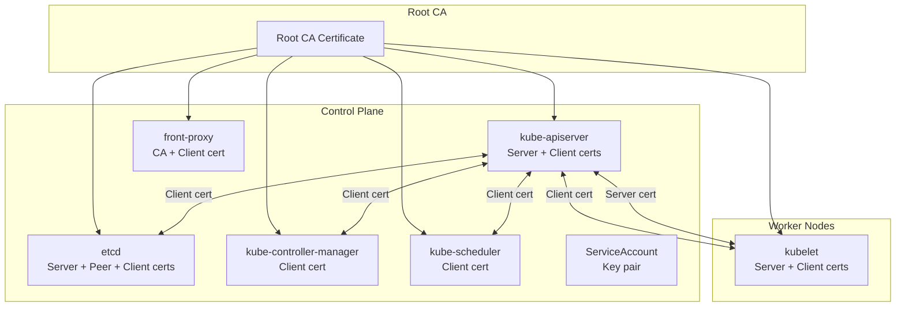

# Certificates — PKI и управление сертификатами в Kubernetes

> 📌 Kubernetes использует **PKI (Public Key Infrastructure)** для аутентификации и шифрования. Каждый компонент (apiserver, kubelet, etcd, controller-manager, scheduler) имеет свой сертификат. **kubeadm** генерирует их автоматически при `kubeadm init`. Для production важно понимать: (1) какие сертификаты есть, (2) как их ротировать, (3) как проверять срок действия. **cert-manager** — стандарт для автоматизации TLS в workload'ах.

---

## 🔹 Обзор PKI в Kubernetes

### 🎯 Какие сертификаты нужны кластеру

| Компонент | Тип сертификата | Назначение |
|-----------|-----------------|------------|
| **kube-apiserver** | Server cert | HTTPS для клиентов (kubectl, kubelet) |
| **kube-apiserver** | Client cert | Аутентификация перед kubelet |
| **kube-apiserver** | Front-proxy client cert | Аутентификация перед extension API servers |
| **kube-apiserver** | ServiceAccount key pair | Подпись service account токенов |
| **kubelet** | Server cert | HTTPS для apiserver (metrics, logs, exec) |
| **kubelet** | Client cert | Аутентификация перед apiserver |
| **etcd** | Server cert | HTTPS для клиентов |
| **etcd** | Peer cert | HTTPS между etcd членами (cluster) |
| **etcd** | Client cert | Аутентификация перед apiserver |
| **kube-controller-manager** | Client cert | Аутентификация перед apiserver |
| **kube-scheduler** | Client cert | Аутентификация перед apiserver |
| **front-proxy** | CA cert | Подпись extension API server сертификатов |
| **admin** | Client cert | Аутентификация админа (в kubeconfig) |



### 🎯 Где хранятся сертификаты (kubeadm)

```
/etc/kubernetes/pki/
├── ca.crt                    # Root CA certificate
├── ca.key                    # Root CA private key
├── apiserver.crt             # API server certificate
├── apiserver.key             # API server private key
├── apiserver-kubelet-client.crt
├── apiserver-kubelet-client.key
├── apiserver-etcd-client.crt
├── apiserver-etcd-client.key
├── front-proxy-ca.crt
├── front-proxy-ca.key
├── front-proxy-client.crt
├── front-proxy-client.key
├── etcd/
│   ├── ca.crt
│   ├── ca.key
│   ├── server.crt
│   ├── server.key
│   ├── peer.crt
│   └── peer.key
└── sa.key                    # ServiceAccount private key
    sa.pub                    # ServiceAccount public key
```

---

## 🔹 Способы генерации сертификатов

| Способ | Когда использовать | Сложность |
|--------|-------------------|-----------|
| **kubeadm** (автоматически) | Production, стандартный подход | 🟢 Низкая |
| **openssl** | Ручная генерация, кастомные требования | 🟡 Средняя |
| **easyrsa** | Простая ручная генерация | 🟢 Низкая |
| **cfssl** | Cloudflare tools, JSON-based | 🟡 Средняя |
| **cert-manager** | Автоматизация TLS в workload'ах | 🟢 Низкая |

> 💡 **Best practice**: используй **kubeadm** для кластера, **cert-manager** для workload'ов. Ручная генерация (openssl/cfssl) — только для специфичных случаев.

---

## 🔹 1. Генерация через openssl (универсальный способ)

### 🎯 Шаг 1: Создание CA (Certificate Authority)

```bash
# 1. Сгенерировать CA private key (2048-bit RSA)
openssl genrsa -out ca.key 2048

# 2. Сгенерировать CA certificate (self-signed, 10000 дней)
openssl req -x509 -new -nodes -key ca.key -subj "/CN=Kubernetes CA" -days 10000 -out ca.crt

# Проверить
openssl x509 -in ca.crt -text -noout
```

### 🎯 Шаг 2: Создание server certificate для kube-apiserver

```bash
# 1. Сгенерировать server private key
openssl genrsa -out server.key 2048

# 2. Создать конфигурационный файл для CSR
cat > csr.conf <<EOF
[ req ]
default_bits = 2048
prompt = no
default_md = sha256
req_extensions = req_ext
distinguished_name = dn

[ dn ]
C = US
ST = California
L = San Francisco
O = Kubernetes
OU = Engineering
CN = kubernetes

[ req_ext ]
subjectAltName = @alt_names

[ alt_names ]
DNS.1 = kubernetes
DNS.2 = kubernetes.default
DNS.3 = kubernetes.default.svc
DNS.4 = kubernetes.default.svc.cluster
DNS.5 = kubernetes.default.svc.cluster.local
DNS.6 = master-1
DNS.7 = master-2
DNS.8 = master-3
IP.1 = 127.0.0.1
IP.2 = 10.96.0.1           # ← MASTER_CLUSTER_IP (первый IP из service-cluster-ip-range)
IP.3 = 192.168.1.100       # ← MASTER_IP (внешний IP apiserver)
IP.4 = 192.168.1.101
IP.5 = 192.168.1.102

[ v3_ext ]
authorityKeyIdentifier = keyid,issuer:always
basicConstraints = CA:FALSE
keyUsage = keyEncipherment, dataEncipherment
extendedKeyUsage = serverAuth, clientAuth
subjectAltName = @alt_names
EOF

# 3. Сгенерировать CSR (Certificate Signing Request)
openssl req -new -key server.key -out server.csr -config csr.conf

# 4. Подписать CSR через CA
openssl x509 -req -in server.csr -CA ca.crt -CAkey ca.key \
    -CAcreateserial -out server.crt -days 10000 \
    -extensions v3_ext -extfile csr.conf -sha256

# 5. Проверить сертификат
openssl x509 -in server.crt -text -noout | grep -A5 "Subject Alternative Name"
```

### 🎯 Шаг 3: Создание client certificate для kubelet

```bash
# 1. Сгенерировать client private key
openssl genrsa -out kubelet-client.key 2048

# 2. Создать CSR для kubelet
cat > kubelet-csr.conf <<EOF
[ req ]
default_bits = 2048
prompt = no
default_md = sha256
distinguished_name = dn

[ dn ]
O = system:nodes              # ← Группа (важно для RBAC!)
CN = system:node:worker-1     # ← Имя узла (важно для аутентификации!)
EOF

openssl req -new -key kubelet-client.key -out kubelet-client.csr -config kubelet-csr.conf

# 3. Подписать CSR
openssl x509 -req -in kubelet-client.csr -CA ca.crt -CAkey ca.key \
    -CAcreateserial -out kubelet-client.crt -days 10000 -sha256
```

> ⚠️ **Важно**: для client certificate **O** (organization) и **CN** (common name) критичны:
> - `O` → группы пользователя (используются в RBAC)
> - `CN` → имя пользователя (например, `system:node:worker-1` для kubelet)

---

## 🔹 2. Генерация через easyrsa (простой способ)

```bash
# 1. Скачать и распаковать easyrsa
curl -LO https://dl.k8s.io/easy-rsa/easy-rsa.tar.gz
tar xzf easy-rsa.tar.gz
cd easy-rsa-master/easyrsa3

# 2. Инициализировать PKI
./easyrsa init-pki

# 3. Создать CA
./easyrsa --batch "--req-cn=kubernetes@$(date +%s)" build-ca nopass

# 4. Создать server certificate для apiserver
./easyrsa --subject-alt-name="IP:192.168.1.100,IP:10.96.0.1,DNS:kubernetes,DNS:kubernetes.default.svc.cluster.local" \
    --days=10000 \
    build-server-full server nopass

# 5. Создать client certificate для kubelet
./easyrsa --days=10000 build-client-full system:node:worker-1 nopass

# 6. Скопировать сертификаты
cp pki/ca.crt /etc/kubernetes/pki/
cp pki/issued/server.crt /etc/kubernetes/pki/apiserver.crt
cp pki/private/server.key /etc/kubernetes/pki/apiserver.key
```

---

## 🔹 3. Генерация через cfssl (JSON-based)

```bash
# 1. Скачать cfssl
curl -L https://github.com/cloudflare/cfssl/releases/download/v1.6.4/cfssl_1.6.4_linux_amd64 -o cfssl
curl -L https://github.com/cloudflare/cfssl/releases/download/v1.6.4/cfssljson_1.6.4_linux_amd64 -o cfssljson
chmod +x cfssl cfssljson

# 2. Создать CA config
cat > ca-config.json <<EOF
{
  "signing": {
    "default": { "expiry": "8760h" },
    "profiles": {
      "kubernetes": {
        "usages": ["signing", "key encipherment", "server auth", "client auth"],
        "expiry": "8760h"
      }
    }
  }
}
EOF

# 3. Создать CA CSR
cat > ca-csr.json <<EOF
{
  "CN": "Kubernetes CA",
  "key": { "algo": "rsa", "size": 2048 },
  "names": [{ "C": "US", "O": "Kubernetes" }]
}
EOF

# 4. Сгенерировать CA
cfssl gencert -initca ca-csr.json | cfssljson -bare ca

# 5. Создать server CSR
cat > server-csr.json <<EOF
{
  "CN": "kubernetes",
  "hosts": [
    "127.0.0.1",
    "192.168.1.100",
    "10.96.0.1",
    "kubernetes",
    "kubernetes.default.svc.cluster.local"
  ],
  "key": { "algo": "rsa", "size": 2048 },
  "names": [{ "C": "US", "O": "Kubernetes" }]
}
EOF

# 6. Сгенерировать server certificate
cfssl gencert -ca=ca.pem -ca-key=ca-key.pem \
    --config=ca-config.json -profile=kubernetes \
    server-csr.json | cfssljson -bare server
```

---

## 🔹 Распространение CA сертификата

> Клиенты (kubectl, браузеры) должны доверять CA кластера.

### 🎯 Linux

```bash
# Скопировать CA cert в доверенные
sudo cp ca.crt /usr/local/share/ca-certificates/kubernetes.crt
sudo update-ca-certificates

# Проверить
openssl verify -CAfile /etc/ssl/certs/ca-certificates.crt apiserver.crt
```

### 🎯 macOS

```bash
# Добавить в Keychain
sudo security add-trusted-cert -d -r trustRoot \
    -k /Library/Keychains/System.keychain ca.crt
```

### 🎯 Windows

```powershell
# Импортировать в Trusted Root Certification Authorities
Import-Certificate -FilePath .\ca.crt -CertStoreLocation Cert:\LocalMachine\Root
```

---

## 🔹 Certificates API (certificates.k8s.io)

> Позволяет запрашивать сертификаты через Kubernetes API (без доступа к CA key).

### 🎯 Как работает

```
1. Клиент создаёт CSR (Certificate Signing Request)
2. Клиент отправляет CSR в Kubernetes API (CertificateSigningRequest resource)
3. Админ (или controller) одобряет CSR
4. Kubernetes подписывает CSR через CA
5. Клиент получает подписанный сертификат
```

### 📝 Пример: запрос сертификата для kubelet

```bash
# 1. Сгенерировать private key
openssl genrsa -out kubelet.key 2048

# 2. Создать CSR
cat > kubelet.conf <<EOF
[req]
distinguished_name = req_distinguished_name
req_extensions = v3_req
prompt = no

[req_distinguished_name]
O = system:nodes
CN = system:node:worker-1

[v3_req]
keyUsage = digitalSignature, keyEncipherment
extendedKeyUsage = clientAuth, serverAuth
EOF

openssl req -new -key kubelet.key -out kubelet.csr -config kubelet.conf

# 3. Закодировать CSR в base64
CSR_B64=$(cat kubelet.csr | base64 | tr -d '\n')

# 4. Создать CertificateSigningRequest resource
cat > csr.yaml <<EOF
apiVersion: certificates.k8s.io/v1
kind: CertificateSigningRequest
metadata:
  name: worker-1-kubelet
spec:
  request: $CSR_B64
  signerName: kubernetes.io/kube-apiserver-client-kubelet
  usages:
  - digital signature
  - key encipherment
  - client auth
  - server auth
  expirationSeconds: 31536000    # 1 год
EOF

kubectl apply -f csr.yaml

# 5. Проверить статус CSR
kubectl get csr
# NAME                 AGE   SIGNERNAME                                           REQUESTOR          CONDITION
# worker-1-kubelet     5s    kubernetes.io/kube-apiserver-client-kubelet          admin              Pending

# 6. Одобрить CSR (требуются права!)
kubectl certificate approve worker-1-kubelet

# 7. Получить подписанный сертификат
kubectl get csr worker-1-kubelet -o jsonpath='{.status.certificate}' | base64 -d > kubelet.crt

# 8. Проверить сертификат
openssl x509 -in kubelet.crt -text -noout
```

### 🎯 Популярные signerName

| SignerName | Назначение |
|------------|------------|
| `kubernetes.io/kube-apiserver-client` | Client certificates для аутентификации перед apiserver |
| `kubernetes.io/kube-apiserver-client-kubelet` | Client certificates для kubelet |
| `kubernetes.io/kubelet-serving` | Server certificates для kubelet HTTPS |
| `kubernetes.io/legacy-unknown` | Устаревший, не рекомендуется |

### 🎯 Автоматическое одобрение CSR

> Kubelet автоматически запрашивает и получает server certificate для HTTPS.

```yaml
# Kubelet автоматически:
# 1. Генерирует private key
# 2. Создаёт CSR с signerName: kubernetes.io/kubelet-serving
# 3. Отправляет CSR в API
# 4. Controller автоматически одобряет (если node авторизован)
# 5. Kubelet получает certificate и использует его
```

---

## 🔹 Ротация сертификатов

### 🎯 Автоматическая ротация (kubelet)

> Kubelet **автоматически** ротирует свои client и server certificates.

```yaml
# KubeletConfiguration
serverTLSBootstrap: true    # ← включить автоматическую ротацию server cert
rotateCertificates: true    # ← включить ротацию client cert (включено по умолчанию)
```

**Процесс**:
```
1. Kubelet отслеживает срок действия своего сертификата
2. Когда остаётся < 20% срока жизни → начинает ротацию
3. Генерирует новый private key
4. Создаёт новый CSR
5. Отправляет CSR в API
6. Controller одобряет CSR
7. Kubelet получает новый certificate
8. Перезагружает certificate (без перезапуска kubelet)
```

### 🎯 Ротация сертификатов control plane (kubeadm)

```bash
# Проверить срок действия всех сертификатов
kubeadm certs check-expiration

# Компонент                      ЗАМЕЧАНИЯ                 СРОК ДЕЙСТВИЯ
# ------------                   ---------                 -------------
# administrator.conf                                       364d
# apiserver                                                364d
# apiserver-etcd-client                                    364d
# apiserver-kubelet-client                                 364d
# controller-manager.conf                                  364d
# etcd-healthcheck-client                                  364d
# etcd-peer                                              364d
# etcd-server                                            364d
# front-proxy-client                                     364d
# scheduler.conf                                         364d

# Ротировать все сертификаты
kubeadm certs renew all

# Ротировать конкретный сертификат
kubeadm certs renew apiserver

# После ротации — перезапустить control plane
sudo systemctl restart kubelet
# Или для static pods:
sudo crictl rm $(sudo crictl ps -q)
# kubelet автоматически перезапустит static pods
```

### 🎯 Ротация через cert-manager (для workload'ов)

```yaml
# cert-manager автоматически ротирует TLS сертификаты для Ingress
apiVersion: cert-manager.io/v1
kind: Certificate
metadata:
  name: my-app-tls
  namespace: default
spec:
  secretName: my-app-tls-secret
  issuerRef:
    name: letsencrypt-prod
    kind: ClusterIssuer
  commonName: myapp.example.com
  dnsNames:
  - myapp.example.com
  - www.myapp.example.com
  renewBefore: 720h              # ← обновлять за 30 дней до истечения
  duration: 2160h                # ← срок действия 90 дней
```

---

## 🔹 Проверка сертификатов

### 🎯 Основные команды openssl

```bash
# 1. Посмотреть детали сертификата
openssl x509 -in cert.crt -text -noout

# 2. Посмотреть срок действия
openssl x509 -in cert.crt -noout -dates
# notBefore=Jan  1 00:00:00 2024 GMT
# notAfter=Dec 31 23:59:59 2024 GMT

# 3. Посмотреть Subject Alternative Names (SAN)
openssl x509 -in cert.crt -text -noout | grep -A1 "Subject Alternative Name"
# X509v3 Subject Alternative Name:
#     DNS:kubernetes, DNS:kubernetes.default, IP Address:10.96.0.1, IP Address:192.168.1.100

# 4. Посмотреть Issuer (кто подписал)
openssl x509 -in cert.crt -noout -issuer
# issuer=C = US, O = Kubernetes, CN = Kubernetes CA

# 5. Посмотреть Subject (кому выдан)
openssl x509 -in cert.crt -noout -subject
# subject=C = US, O = Kubernetes, CN = kubernetes

# 6. Проверить, что сертификат подписан CA
openssl verify -CAfile ca.crt cert.crt
# cert.crt: OK

# 7. Посмотреть private key
openssl rsa -in key.key -check -noout
# RSA key ok

# 8. Сравнить modulus (убедиться, что key и cert подходят друг другу)
openssl x509 -noout -modulus -in cert.crt | openssl md5
openssl rsa -noout -modulus -in key.key | openssl md5
# Должны совпадать!
```

### 🎯 Проверка всех сертификатов кластера

```bash
# Проверить все сертификаты в /etc/kubernetes/pki/
for cert in /etc/kubernetes/pki/*.crt; do
    echo "=== $cert ==="
    openssl x509 -in $cert -noout -dates -subject | grep -E "notAfter|subject"
    echo
done

# Проверить сертификаты в kubeconfig
kubectl config view --raw -o jsonpath='{range .users[*]}{.name}{"\t"}{.user.client-certificate-data}{"\n"}{end}' | \
while read name cert; do
    echo "=== $name ==="
    echo $cert | base64 -d | openssl x509 -noout -dates -subject
    echo
done

# Проверить сертификаты нод
for node in $(kubectl get nodes -o name); do
    echo "=== $node ==="
    kubectl get $node -o jsonpath='{.status.certificates[0].certificate}' | base64 -d | openssl x509 -noout -dates
    echo
done
```

### 🎯 Мониторинг срока действия

```bash
# Prometheus query для alerting
# (если используешь kube-prometheus-stack)

# Алерт: сертификат истекает через 30 дней
- alert: CertificateExpiringSoon
  expr: kube_certificate_expiration_timestamp - time() < 30 * 24 * 3600
  for: 1h
  labels:
    severity: warning
  annotations:
    summary: "Сертификат {{ $labels.name }} истекает через {{ $value | humanizeDuration }}"

# Алерт: сертификат истёк
- alert: CertificateExpired
  expr: kube_certificate_expiration_timestamp - time() < 0
  for: 5m
  labels:
    severity: critical
  annotations:
    summary: "Сертификат {{ $labels.name }} истёк!"
```

---

## 🔹 Troubleshooting

### 🔍 Проблема 1: "x509: certificate signed by unknown authority"

**Причина**: клиент не доверяет CA кластера.

**Решение**:
```bash
# 1. Проверить, что CA cert правильный
openssl x509 -in /etc/kubernetes/pki/ca.crt -noout -subject

# 2. Проверить, что kubeconfig использует правильный CA
kubectl config view --raw | grep certificate-authority-data

# 3. Обновить kubeconfig
kubectl config set-cluster my-cluster \
    --certificate-authority=/etc/kubernetes/pki/ca.crt \
    --embed-certs=true \
    --server=https://192.168.1.100:6443

# 4. Или добавить CA в системные доверенные
sudo cp /etc/kubernetes/pki/ca.crt /usr/local/share/ca-certificates/kubernetes.crt
sudo update-ca-certificates
```

### 🔍 Проблема 2: "x509: certificate has expired or is not yet valid"

**Причина**: сертификат истёк или ещё не действителен.

**Решение**:
```bash
# 1. Проверить срок действия
openssl x509 -in /etc/kubernetes/pki/apiserver.crt -noout -dates

# 2. Если истёк — ротировать
kubeadm certs renew apiserver
sudo systemctl restart kubelet

# 3. Проверить время на сервере (может быть рассинхронизация)
date
sudo chronyc sources    # или ntpq -p
```

### 🔍 Проблема 3: "x509: certificate is valid for X, not Y"

**Причина**: клиент обращается по IP/DNS, который не указан в SAN сертификата.

**Решение**:
```bash
# 1. Проверить SAN сертификата
openssl x509 -in /etc/kubernetes/pki/apiserver.crt -text -noout | grep -A1 "Subject Alternative Name"

# 2. Если нужный IP/DNS отсутствует — перегенерировать сертификат
# (добавить IP/DNS в csr.conf и повторить генерацию)

# 3. Или использовать правильный IP/DNS из SAN
kubectl config set-cluster my-cluster --server=https://kubernetes.default.svc:443
```

### 🔍 Проблема 4: Kubelet не может подключиться к apiserver

**Причина**: проблема с client certificate kubelet.

**Решение**:
```bash
# 1. Проверить статус kubelet
systemctl status kubelet
journalctl -u kubelet -f

# 2. Проверить certificate kubelet
openssl x509 -in /var/lib/kubelet/pki/kubelet-client-current.pem -noout -dates -subject

# 3. Проверить CSR
kubectl get csr | grep worker-1

# 4. Если CSR pending — одобрить
kubectl certificate approve <csr-name>

# 5. Перезапустить kubelet
sudo systemctl restart kubelet
```

### 🔍 Проблема 5: etcd не стартует после ротации сертификатов

**Причина**: сертификаты etcd не совпадают или не доверяют CA.

**Решение**:
```bash
# 1. Проверить логи etcd
sudo crictl logs $(sudo crictl ps -q --name etcd)

# 2. Проверить сертификаты etcd
openssl verify -CAfile /etc/kubernetes/pki/etcd/ca.crt /etc/kubernetes/pki/etcd/server.crt
openssl verify -CAfile /etc/kubernetes/pki/etcd/ca.crt /etc/kubernetes/pki/etcd/peer.crt

# 3. Проверить, что все члены кластера используют один CA
for node in master-1 master-2 master-3; do
    ssh $node "openssl x509 -in /etc/kubernetes/pki/etcd/ca.crt -noout -fingerprint"
done
# Должны быть одинаковые fingerprints

# 4. Если нужно — перегенерировать сертификаты etcd
kubeadm certs renew etcd-server
kubeadm certs renew etcd-peer
sudo systemctl restart kubelet
```

---

## 🔹 Best Practices

### ✅ Делай

1. **Используй kubeadm** для генерации сертификатов кластера — это стандарт.
2. **Используй cert-manager** для workload'ов — автоматическая ротация.
3. **Мониторь срок действия** сертификатов — алерты за 30 дней до истечения.
4. **Ротируй сертификаты** регулярно (хотя бы раз в год).
5. **Храни CA key в безопасном месте** — если его украдут, злоумышленник может подписать любой сертификат.
6. **Используй разные CA** для разных целей (root CA, front-proxy CA, etcd CA).
7. **Бэкапь CA key и cert** — без них нельзя ротировать сертификаты.
8. **Проверяй SAN** — убедись, что все нужные IP/DNS включены.
9. **Используй короткие сроки действия** для workload'ов (90 дней) с автоматической ротацией.
10. **Документируй** все сертификаты и их расположение.

### ❌ Не делай

```bash
# ❌ НЕ храни CA key в Git
# Если CA key скомпрометирован — весь кластер под угрозой

# ❌ НЕ используй одинаковые сертификаты для всех нод
# Каждый kubelet должен иметь свой certificate с правильным CN

# ❌ НЕ забывай про SAN
# Без правильного SAN клиенты не смогут подключиться

# ❌ НЕ игнорируй алерты о истечении сертификатов
# Истёкший сертификат = downtime кластера

# ❌ НЕ ротируй все сертификаты одновременно
# Ротируй по одному, проверяй работу после каждой ротации

# ❌ НЕ используй self-signed certificates для production
# Используй Let's Encrypt или корпоративный CA

# ❌ НЕ храни private keys в plaintext
# Используй HSM (Hardware Security Module) или sealed secrets
```

---

## 🔹 Чек-лист: управление сертификатами

```bash
# ✅ 1. Проверить срок действия всех сертификатов
kubeadm certs check-expiration
for cert in /etc/kubernetes/pki/*.crt; do
    echo "=== $cert ==="
    openssl x509 -in $cert -noout -dates
done

# ✅ 2. Настроить мониторинг
#    - Prometheus: kube_certificate_expiration_timestamp
#    - Алерт за 30 дней до истечения
#    - Алерт при истечении

# ✅ 3. Настроить автоматическую ротацию
#    - Kubelet: serverTLSBootstrap: true
#    - cert-manager для workload'ов
#    - CronJob для ротации control plane сертификатов

# ✅ 4. Бэкапить CA key и cert
#    - Хранить в безопасном месте (не в Git!)
#    - Шифровать бэкапы
#    - Тестировать восстановление

# ✅ 5. Документировать
#    - Какие сертификаты есть в кластере
#    - Где они хранятся
#    - Как их ротировать
#    - Кто отвечает за ротацию

# ✅ 6. Тестировать ротацию в staging
#    - Перед ротацией в production
#    - Проверить, что все компоненты работают после ротации
#    - Иметь план отката

# ✅ 7. Проверять SAN
#    - Все нужные IP/DNS включены
#    - Особенно для apiserver (master IP, cluster IP, DNS names)

# ✅ 8. Проверять доверие CA
#    - Клиенты доверяют CA
#    - Все ноды используют один CA
#    - Нет рассинхронизации между членами etcd cluster
```

> 💡 **Совет для конспекта**:
> 1. Создай файл `00_certificates_cheatsheet.md` с шпаргалкой по openssl командам.
> 2. Добавь блок «Частые ошибки»: «забыл SAN", "CA key в Git", "не настроил мониторинг".
> 3. Веди список "Какие сертификаты у нас в кластере": имя, срок действия, где хранится, как ротировать.

---

## 🔹 Ключевые выводы

1. **PKI в Kubernetes** — каждый компонент имеет свой сертификат (server/client).
2. **kubeadm** автоматически генерирует все сертификаты при `kubeadm init`.
3. **openssl** — универсальный инструмент для ручной генерации (CA, server, client certs).
4. **easyrsa/cfssl** — альтернативы для ручной генерации (проще/JSON-based).
5. **SAN (Subject Alternative Name)** — критичен для server certificates (IP/DNS).
6. **Client certificate**: `O` (organization) → группы RBAC, `CN` → имя пользователя.
7. **Certificates API** — запрос сертификатов через Kubernetes API (без доступа к CA key).
8. **Автоматическая ротация**: kubelet ротирует свои сертификаты, cert-manager — для workload'ов.
9. **kubeadm certs renew** — ротация control plane сертификатов.
10. **Мониторинг**: алерты за 30 дней до истечения, проверка SAN, проверка доверия CA.
11. **Troubleshooting**: "unknown authority" → добавить CA в доверенные, "expired" → ротировать, "not valid for X" → проверить SAN.
12. **Best practices**: используй kubeadm + cert-manager, мониторь срок действия, бэкапь CA key, документируй