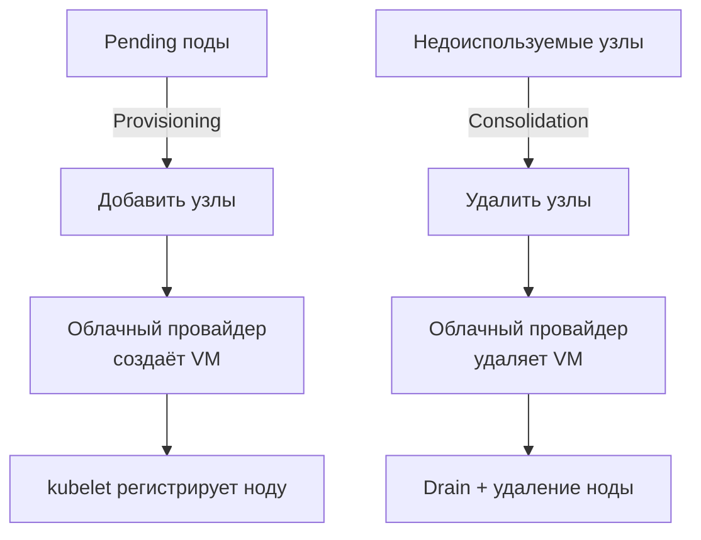

# Node Autoscaling — автомасштабирование узлов

> 📌 **Node Autoscaling** — автоматическое **добавление** узлов при нехватке ресурсов (pending поды) и **удаление** недоиспользуемых узлов для экономии. 2 основные реализации: **Cluster Autoscaler** (классика, работает с Node Groups) и **Karpenter** (современный, динамический выбор инстансов). **Важно**: автомаскалеры смотрят на `requests`, а не на реальное использование — поэтому их комбинируют с HPA/VPA.

---

## 🔹 Обзор концепции

### 🎯 Две основные операции

| Операция | Старое название | Триггер | Что делает |
|----------|-----------------|---------|------------|
| **Provisioning** | Scale up | Pending поды (не хватает ресурсов) | Добавляет новые узлы в кластер |
| **Consolidation** | Scale down | Недоиспользуемые узлы | Удаляет узлы, перенося поды на другие |



### 🎯 Архитектура

```
┌─────────────────────────────────────────────────────────┐
│                    Kubernetes Cluster                   │
│                                                         │
│  ┌──────────────┐    ┌──────────────┐                   │
│  │ Pending Pods │    │ Underused    │                   │
│  │              │    │ Nodes        │                   │
│  └──────┬───────┘    └──────┬───────┘                   │
│         │                   │                           │
│         └────────┬──────────┘                           │
│                  │                                      │
│         ┌────────▼────────┐                             │
│         │ Node Autoscaler │                             │
│         │(CA или Karpenter)                             │
│         └────────┬────────┘                             │
└──────────────────┼──────────────────────────────────────┘
                   │
                   ▼
         ┌─────────────────┐
         │ Cloud Provider  │
         │ API             │
         │ (AWS, GCP,      │
         │  Azure, Yandex) │
         └─────────────────┘
```

---

## 🔹 1. Provisioning (выделение узлов)

### 🎯 Как работает

```
1. Под не может запланироваться (Pending)
2. Autoscaler анализирует:
   - Какие ресурсы нужны поду (requests)
   - Какие ограничения есть (nodeSelector, affinity, tolerations)
   - Какие Node Groups/NodePool доступны
3. Выбирает оптимальную конфигурацию узла
4. Создаёт узел через Cloud Provider API
5. Ждёт регистрации ноды в K8s
6. Под планируется на новую ноду
```

### 🎯 Что учитывает autoscaler

| Фактор | Описание |
|--------|----------|
| **Resource requests** | CPU, memory, ephemeral-storage |
| **nodeSelector** | Требование конкретных лейблов |
| **nodeAffinity** | Требования к узлам |
| **podAffinity/podAntiAffinity** | Требования к размещению относительно других подов |
| **tolerations** | Совместимость с taints |
| **PVC requests** | Требования к хранилищу |
| **PodDisruptionBudget** | Защита от нарушения доступности |

### ⚠️ Ограничения

| Проблема | Причина | Решение |
|----------|---------|---------|
| **Под остаётся в Pending** | Нет Node Group, подходящего по требованиям | Добавить Node Group с нужными характеристиками |
| **Autoscaler не масштабируется** | Достигнут maxNodes лимит | Увеличить maxNodes |
| **Медленное добавление узлов** | Cloud provider throttling | Увеличить квоты в облаке |
| **Узел не регистрируется** | Проблема с kubelet/bootstrap | Проверить логи, user-data |

---

## 🔹 2. Consolidation (консолидация)

### 🎯 Как работает

```
1. Autoscaler находит недоиспользуемые узлы
2. Проверяет: можно ли перенести поды на другие узлы?
3. Если да:
   a. Помечает узел для удаления
   b. Evicts поды (graceful termination)
   c. Controller создаёт новые поды на других узлах
   d. Удаляет узел через Cloud Provider API
4. Если нет (поды некуда перенести) → узел остаётся
```

### 🎯 Типы узлов при консолидации

| Тип узла | Описание | Сложность удаления |
|----------|----------|-------------------|
| **Empty node** | Только DaemonSet + static pods | 🟢 Легко (просто удалить) |
| **Consolidatable node** | Поды можно перенести на другие узлы | 🟡 Средне (нужен drain) |
| **Unconsolidatable node** | Поды некуда перенести | 🔴 Нельзя удалить |

### ⚠️ Особенности консолидации

- **Смотрит на requests**, а не на реальное использование
- **Учитывает PDB** — не удалит узел, если нарушит minAvailable
- **Graceful termination** — поды получают время на завершение
- **Не гарантирует** — если во время консолидации появится новый под, он может остаться Pending

---

## 🔹 Cluster Autoscaler (CA)

> Классический автомаскалер от Kubernetes SIG. Работает с **Node Groups** (предопределёнными группами узлов).

### 🎯 Ключевые особенности

| Характеристика | Описание |
|----------------|----------|
| **Node Groups** | Работает с предопределёнными группами (AWS ASG, GCP MIG, Azure VMSS) |
| **Выбор Node Group** | Выбирает группу, которая лучше всего подходит для pending подов |
| **Consolidation** | Удаляет конкретные узлы, а не уменьшает размер группы |
| **Интеграция** | Часть проекта Kubernetes, много облачных провайдеров |
| **Конфигурация** | Статическая (нужно заранее создать Node Groups) |

### 📝 Пример: AWS EKS с Cluster Autoscaler

```yaml
# 1. Создать Node Group в EKS (через eksctl или Terraform)
# eksctl create nodegroup \
#   --cluster my-cluster \
#   --name ng-1 \
#   --node-type m5.large \
#   --nodes-min 2 \
#   --nodes-max 10 \
#   --nodes 3

# 2. Установить Cluster Autoscaler
helm repo add autoscaler https://kubernetes.github.io/autoscaler
helm install cluster-autoscaler autoscaler/cluster-autoscaler \
  --set autoDiscovery.clusterName=my-cluster \
  --set awsRegion=us-east-1 \
  --set rbac.serviceAccount.create=true \
  --set rbac.serviceAccount.annotations."eks\.amazonaws\.com/role-arn"=arn:aws:iam::123456789012:role/cluster-autoscaler
```

### ⚙️ Конфигурация Cluster Autoscaler

```yaml
# Helm values
extraArgs:
  # Балансировка узлов (распределение по AZ)
  balance-similar-node-groups: true
  
  # Игнорировать ноды с status "unknown"
  skip-nodes-with-system-pods: false
  
  # Игнорировать ноды с local storage
  skip-nodes-with-local-storage: false
  
  # Масштабировать с 0 узлов
  scale-down-delay-after-add: 10m
  scale-down-delay-after-delete: 10s
  scale-down-delay-after-failure: 3m
  scale-down-unneeded-time: 10m
  scale-down-unready-time: 20m
  
  # Максимальная утилизация перед добавлением узлов
  scale-down-utilization-threshold: 0.5
  
  # Новые узлы
  expander: least-waste
  # expander: priority        # приоритеты для разных Node Groups
  # expander: random          # случайный выбор
  # expander: most-pods       # максимум подов
  # expander: least-waste     # минимум wasted ресурсов (по умолчанию)
```

### 🎯 Expanders (стратегии выбора Node Group)

| Expander | Описание | Когда использовать |
|----------|----------|-------------------|
| **`random`** | Случайный выбор | Простые сценарии |
| **`most-pods`** | Группа, куда поместится больше всего подов | Много мелких подов |
| **`least-waste`** | Группа с минимальным wasted ресурсов | Оптимизация затрат |
| **`priority`** | Приоритеты для разных групп | Сложные сценарии с предпочтениями |
| **`price`** | Самая дешёвая группа | Оптимизация стоимости |

### 📝 Пример: Priority Expander

```yaml
# ConfigMap для priority expander
apiVersion: v1
kind: ConfigMap
metadata:
  name: cluster-autoscaler-priority-expander
  namespace: kube-system
data:
  priorities: |-
    10:
      - ng-spot.*           # Spot инстансы (дешевле)
    20:
      - ng-ondemand.*       # On-demand инстансы (надёжнее)
```

---

## 🔹 Karpenter

> Современный автомаскалер от AWS. **Динамически** выбирает инстансы, не требует предопределённых Node Groups.

### 🎯 Ключевые особенности

| Характеристика | Описание |
|----------------|----------|
| **NodePool** | Декларативное описание допустимых узлов (не предопределённые группы) |
| **Динамический выбор** | Выбирает инстанс на основе pending подов |
| **NodeClaim** | Ресурс, представляющий запрос на создание узла |
| **Consolidation** | Агрессивная консолидация (включая замену узлов) |
| **Drift** | Автоматическое обновление узлов при изменении NodePool |
| **Интеграция** | AWS, Azure (меньше провайдеров, чем CA) |

### 📝 Пример: Karpenter на EKS

```yaml
# 1. Установить Karpenter
helm repo add karpenter https://charts.karpenter.sh
helm install karpenter karpenter/karpenter \
  --set settings.clusterName=my-cluster \
  --set settings.clusterEndpoint=https://... \
  --set controller.resources.requests.cpu=1 \
  --set controller.resources.requests.memory=1Gi \
  --namespace karpenter \
  --create-namespace

# 2. Создать NodePool
apiVersion: karpenter.sh/v1beta1
kind: NodePool
metadata:
  name: default
spec:
  template:
    spec:
      # Требования к узлам
      requirements:
        - key: kubernetes.io/arch
          operator: In
          values: ["amd64"]
        - key: kubernetes.io/os
          operator: In
          values: ["linux"]
        - key: karpenter.sh/capacity-type
          operator: In
          values: ["spot", "on-demand"]    # ← Spot или On-demand
        - key: node.kubernetes.io/instance-type
          operator: In
          values: ["m5.large", "m5.xlarge", "m6i.large", "m6i.xlarge"]
        - key: topology.kubernetes.io/zone
          operator: In
          values: ["us-east-1a", "us-east-1b", "us-east-1c"]
      
      # NodeClass (специфично для облака)
      nodeClassRef:
        name: default
      
      # Expire после 720 часов (30 дней) — для ротации
      expireAfter: 720h
  
  # Лимиты
  limits:
    cpu: "100"
    memory: 200Gi
  
  # Приоритет (если несколько NodePool)
  weight: 10
---
# 3. Создать EC2NodeClass (специфично для AWS)
apiVersion: karpenter.k8s.aws/v1beta1
kind: EC2NodeClass
metadata:
  name: default
spec:
  amiFamily: AL2
  role: "KarpenterNodeRole-my-cluster"
  subnetSelectorTerms:
    - tags:
        karpenter.sh/discovery: my-cluster
  securityGroupSelectorTerms:
    - tags:
        karpenter.sh/discovery: my-cluster
  blockDeviceMappings:
    - deviceName: /dev/xvda
      ebs:
        volumeSize: 100Gi
        volumeType: gp3
        encrypted: true
```

### 🎯 Ключевые концепции Karpenter

| Концепт | Описание |
|---------|----------|
| **NodePool** | Декларативное описание допустимых узлов (аналог Node Group, но гибче) |
| **NodeClaim** | Запрос на создание узла (создаётся Karpenter) |
| **NodeClass** | Облачно-специфичная конфигурация (AMI, security groups, subnets) |
| **Drift** | Автоматическая замена узлов при изменении NodePool/NodeClass |
| **Consolidation** | Агрессивная консолидация (включая замену на более дешёвые инстансы) |
| **Expiration** | Автоматическая ротация узлов после N часов |

### 🎯 Karpenter vs Cluster Autoscaler

| Характеристика | Cluster Autoscaler | Karpenter |
|----------------|-------------------|-----------|
| **Подход** | Node Groups (предопределённые) | NodePool (динамический выбор) |
| **Выбор инстанса** | Из предопределённых типов | Динамически из сотен типов |
| **Spot инстансы** | Через отдельные Node Groups | Через требования в NodePool |
| **Consolidation** | Удаление узлов | Замена на более дешёвые + удаление |
| **Drift** | ❌ Нет | ✅ Да (автоматическое обновление) |
| **Expiration** | ❌ Нет | ✅ Да (ротация по времени) |
| **Поддержка облаков** | Много (AWS, GCP, Azure, Yandex, etc.) | Меньше (AWS, Azure) |
| **Зрелость** | Зрелый (много лет) | Молодой, но быстро развивается |
| **Сообщество** | Kubernetes SIG | AWS + сообщество |

### 🎯 Когда что выбрать

| Сценарий | Рекомендация |
|----------|--------------|
| **On-premise / bare-metal** | Cluster Autoscaler (или вообще не нужен) |
| **Yandex Cloud** | Cluster Autoscaler (Karpenter не поддерживает) |
| **AWS, нужна гибкость** | Karpenter |
| **AWS, нужна простота** | Cluster Autoscaler |
| **Spot инстансы** | Karpenter (проще настроить) |
| **Много разных workload'ов** | Karpenter (динамический выбор) |
| **Нужна ротация узлов** | Karpenter (Drift + Expiration) |
| **GCP** | Cluster Autoscaler (Karpenter не поддерживает) |

---

## 🔹 Комбинация с HPA и VPA

### 🎯 HPA + Node Autoscaling

```
Приложение получает нагрузку
    ↓
HPA увеличивает replicas (добавляет поды)
    ↓
Поды не помещаются на существующих узлах (Pending)
    ↓
Node Autoscaler добавляет узлы
    ↓
Поды запускаются на новых узлах

При снижении нагрузки:
    ↓
HPA уменьшает replicas (удаляет поды)
    ↓
Узлы становятся недоиспользованными
    ↓
Node Autoscaler удаляет узлы (consolidation)
```

### 🎯 VPA + Node Autoscaling

```
VPA анализирует реальное использование ресурсов
    ↓
VPA корректирует requests подов
    ↓
Node Autoscaler видит изменённые requests
    ↓
Node Autoscaler добавляет/удаляет узлы

⚠️ Ограничение:
- VPA не должен управлять DaemonSet подами
- Node Autoscaler должен предсказывать ресурсы DaemonSet подов
- VPA может сделать прогнозы ненадёжными
```

### 📝 Пример: HPA + Cluster Autoscaler

```yaml
# 1. HPA для приложения
apiVersion: autoscaling/v2
kind: HorizontalPodAutoscaler
metadata:
  name: my-app-hpa
spec:
  scaleTargetRef:
    apiVersion: apps/v1
    kind: Deployment
    name: my-app
  minReplicas: 2
  maxReplicas: 50
  metrics:
  - type: Resource
    resource:
      name: cpu
      target:
        type: Utilization
        averageUtilization: 70

# 2. Cluster Autoscaler настроен на добавление узлов при Pending подах
# (автоматически, не требует дополнительной конфигурации)

# 3. Deployment с resource requests (обязательно!)
apiVersion: apps/v1
kind: Deployment
metadata:
  name: my-app
spec:
  replicas: 2
  selector:
    matchLabels:
      app: my-app
  template:
    metadata:
      labels:
        app: my-app
    spec:
      containers:
      - name: my-app
        image: my-app:latest
        resources:
          requests:
            cpu: 500m        # ← обязательно для HPA и Node Autoscaler
            memory: 512Mi
          limits:
            cpu: 1
            memory: 1Gi
```

---

## 🔹 Практика: настройка и проверка

### 🚀 Проверка Cluster Autoscaler

```bash
# 1. Проверить, что CA запущен
kubectl get pods -n kube-system | grep cluster-autoscaler

# 2. Посмотреть логи CA
kubectl logs -n kube-system deployment/cluster-autoscaler -f

# 3. Проверить статус CA (ConfigMap)
kubectl get configmap -n kube-system cluster-autoscaler-status -o yaml
# Смотрим: ClusterWide, NodeGroups, ScaleUp, ScaleDown

# 4. Проверить аннотации Node Groups (AWS)
kubectl get nodegroup -o yaml | grep -A5 autoscaling

# 5. Проверить события нод
kubectl get events --field-selector reason=TriggeredScaleUp
kubectl get events --field-selector reason=ScaleDown

# 6. Проверить метрики CA
kubectl get --raw /api/v1/nodes/<node>/proxy/metrics | grep cluster_autoscaler
```

### 🚀 Проверка Karpenter

```bash
# 1. Проверить, что Karpenter запущен
kubectl get pods -n karpenter

# 2. Посмотреть логи Karpenter
kubectl logs -n karpenter deployment/karpenter -f

# 3. Проверить NodePool
kubectl get nodepools
kubectl describe nodepool default

# 4. Проверить NodeClaim (запросы на создание узлов)
kubectl get nodeclaims
kubectl describe nodeclaim <name>

# 5. Проверить узлы, созданные Karpenter
kubectl get nodes -l karpenter.sh/provisioner-name=default
kubectl get nodes -L karpenter.sh/capacity-type    # spot или on-demand

# 6. Проверить события
kubectl get events --field-selector reason=Provisioned
kubectl get events --field-selector reason=Consolidated

# 7. Проверить метрики Karpenter
kubectl get --raw /api/v1/namespaces/karpenter/services/karpenter:metrics/proxy/metrics
```

### 🔍 Отладка: поды в Pending

```bash
# 1. Проверить, почему под в Pending
kubectl describe pod <pod-name> | grep -A20 'Events:'
# Warning  FailedScheduling  ...  0/5 nodes are available: 5 Insufficient cpu.

# 2. Проверить логи autoscaler
kubectl logs -n kube-system deployment/cluster-autoscaler | grep -i "scale up"
kubectl logs -n karpenter deployment/karpenter | grep -i "provisioning"

# 3. Проверить, есть ли подходящий Node Group / NodePool
kubectl get nodegroups    # для CA
kubectl get nodepools     # для Karpenter

# 4. Проверить, достигнут ли лимит
kubectl describe nodepool default | grep -A10 "Limits"
# Limits:
#   cpu: 100
#   memory: 200Gi

# 5. Проверить квоты в облаке
# AWS: EC2 Dashboard → Limits
# GCP: IAM & Admin → Quotas
# Yandex: Quotas в консоли

# 6. Проверить, что узел создался
kubectl get nodes -w
# NAME        STATUS   ROLES    AGE   VERSION
# ip-10-0-1-5 Ready    <none>   1m    v1.28
```

### 🔍 Отладка: узлы не удаляются

```bash
# 1. Проверить, почему узел не удаляется
kubectl describe node <node-name> | grep -A10 'Taints:'
# Taints: node.kubernetes.io/unschedulable:NoSchedule    ← помечен для удаления

# 2. Проверить, какие поды на узле
kubectl get pods --all-namespaces --field-selector spec.nodeName=<node-name>

# 3. Проверить PDB
kubectl get pdb -A
kubectl describe pdb <pdb-name> | grep -A5 "Disruptions allowed"

# 4. Проверить логи autoscaler
kubectl logs -n kube-system deployment/cluster-autoscaler | grep -i "scale down"
kubectl logs -n karpenter deployment/karpenter | grep -i "consolidation"

# 5. Проверить, есть ли DaemonSet поды (они не препятствуют удалению)
kubectl get pods --all-namespaces --field-selector spec.nodeName=<node-name> | grep -i daemonset

# 6. Проверить local storage
kubectl get pods --all-namespaces --field-selector spec.nodeName=<node-name> -o json | jq '.items[] | select(.spec.volumes[]?.emptyDir != null or .spec.volumes[]?.hostPath != null)'
```

---

## 🔹 Best Practices

### ✅ Делай

1. **Всегда указывай resource requests** — без них autoscaler не работает.
2. **Используй Spot инстансы** для stateless workloads (экономия до 90%).
3. **Настрой PDB** для критичных workloads — защити от неожиданного удаления.
4. **Используй несколько зон доступности** — для HA.
5. **Мониторь метрики autoscaler** — алерты на ошибки, throttling.
6. **Тестируй в staging** — перед включением в production.
7. **Используй VPA** для оптимизации requests — чтобы autoscaler принимал правильные решения.
8. **Настрой grace period** для консолидации — дай время на перенос подов.
9. **Используй priority expander** — для предпочтения Spot инстансов.
10. **Документируй** конфигурацию autoscaler — какие Node Groups/NodePool, лимиты, стратегии.

### ❌ Не делай

```bash
# ❌ НЕ запускай autoscaler без resource requests
# Autoscaler не сможет принимать решения

# ❌ НЕ используй только Spot инстансы для stateful workloads
# Spot могут быть прерваны в любой момент

# ❌ НЕ ставь слишком низкие лимиты
# Autoscaler не сможет масштабироваться при пиковых нагрузках

# ❌ НЕ игнорируй алерты от autoscaler
# Ошибки масштабирования = downtime или перерасход

# ❌ НЕ используй VPA для DaemonSet подов
# Это сломает прогнозы autoscaler

# ❌ НЕ удаляй узлы вручную, если работает autoscaler
# Autoscaler может попытаться создать новые узлы

# ❌ НЕ забывай про квоты в облаке
# Autoscaler не сможет создать узлы, если квоты исчерпаны
```

---

## 🔹 Мониторинг и алерты

### 📊 Метрики Cluster Autoscaler

```promql
# Масштабирование вверх
cluster_autoscaler_scaled_up_nodes_total

# Масштабирование вниз
cluster_autoscaler_scaled_down_nodes_total

# Ошибки масштабирования
cluster_autoscaler_failed_scale_ups_total

# Длина очереди pending подов
cluster_autoscaler_unschedulable_pods_count

# Время до добавления узла
cluster_autoscaler_scale_up_duration_seconds
```

### 📊 Метрики Karpenter

```promql
# Созданные узлы
karpenter_nodes_created_total

# Удалённые узлы
karpenter_nodes_terminated_total

# Duration provisioning
karpenter_provisioner_scheduling_duration_seconds

# Consolidation decisions
karpenter_consolidation_decisions_total

# Drift (узлы, требующие замены)
karpenter_drift_count
```

### 🎯 Примеры алертов

```yaml
groups:
- name: node-autoscaling
  rules:
  - alert: NodeAutoscalerFailedScaleUp
    expr: increase(cluster_autoscaler_failed_scale_ups_total[5m]) > 0
    for: 5m
    labels:
      severity: critical
    annotations:
      summary: "Autoscaler не может добавить узлы"
      description: "{{ $value }} ошибок масштабирования за последние 5 минут"
  
  - alert: PodsPendingTooLong
    expr: kube_pod_status_phase{phase="Pending"} == 1 and (time() - kube_pod_created) > 600
    for: 10m
    labels:
      severity: warning
    annotations:
      summary: "Поды в Pending > 10 минут"
      description: "Под {{ $labels.pod }} не может запланироваться"
  
  - alert: NodeAutoscalerAtMaxLimit
    expr: cluster_autoscaler_nodes_count == cluster_autoscaler_max_nodes_count
    for: 5m
    labels:
      severity: warning
    annotations:
      summary: "Autoscaler достиг лимита узлов"
      description: "Достигнут максимум {{ $value }} узлов"
```

---

## 🔹 Чек-лист: настройка Node Autoscaling

```
# ✅ 1. Выбрать autoscaler
#    - AWS + нужна гибкость → Karpenter
#    - AWS + нужна простота → Cluster Autoscaler
#    - Yandex/GCP → Cluster Autoscaler
#    - On-premise → Cluster Autoscaler (или не нужен)

# ✅ 2. Настроить IAM роли
#    - Autoscaler должен иметь права на создание/удаление узлов
#    - Использовать IRSA (AWS) или Workload Identity (GCP)

# ✅ 3. Настроить Node Groups / NodePool
#    - Указать min/max узлов
#    - Указать типы инстансов
#    - Указать зоны доступности
#    - Настроить Spot/On-demand mix

# ✅ 4. Настроить resource requests для всех подов
#    - CPU и memory requests обязательны
#    - Использовать VPA для оптимизации requests

# ✅ 5. Настроить PDB для критичных workloads
#    - minAvailable или maxUnavailable
#    - Защитить от неожиданного удаления узлов

# ✅ 6. Настроить мониторинг
#    - Метрики autoscaler
#    - Алерты на ошибки масштабирования
#    - Алерты на pending поды
#    - Алерты на достижение лимитов

# ✅ 7. Протестировать
#    - Создать нагрузку → проверить, что узлы добавляются
#    - Убрать нагрузку → проверить, что узлы удаляются
#    - Проверить логи autoscaler
#    - Проверить, что поды не теряются при консолидации

# ✅ 8. Документировать
#    - Какие Node Groups / NodePool настроены
#    - Какие лимиты установлены
#    - Какие стратегии используются
#    - Кто отвечает за обслуживание
```

> 💡 **Совет для конспекта**:
> 1. Создай файл `00_node_autoscaling_cheatsheet.md` с шпаргалкой по командам.
> 2. Добавь блок «Частые ошибки»: «нет resource requests", "достигнут лимит облака", "PDB блокирует консолидацию".
> 3. Веди список "Какие Node Groups / NodePool у нас в кластере": имя, min/max, типы инстансов, spot/on-demand.

---

## 🔹 Ключевые выводы

1. **Node Autoscaling** — автоматическое добавление/удаление узлов для оптимизации затрат и производительности.
2. **2 операции**: Provisioning (добавление при pending подах) и Consolidation (удаление недоиспользуемых узлов).
3. **Cluster Autoscaler** — классика, работает с Node Groups, много облачных провайдеров.
4. **Karpenter** — современный, динамический выбор инстансов, агрессивно консолидирует, поддерживает Drift и Expiration.
5. **Выбор**: Karpenter для AWS + гибкость, CA для других облаков или простоты.
6. **Autoscaler смотрит на requests**, а не на реальное использование — комбинируй с HPA/VPA.
7. **Resource requests обязательны** — без них autoscaler не работает.
8. **PDB защищает** от неожиданного удаления узлов с критичными подами.
9. **Spot инстансы** — экономия до 90%, но для stateless workloads.
10. **Мониторинг**: метрики autoscaler, алерты на ошибки, pending поды, достижение лимитов.
11. **Troubleshooting**: логи autoscaler, события нод, проверка квот в облаке, проверка PDB.
12. **Best practices**: resource requests, PDB, Spot для stateless, мониторинг, документация.