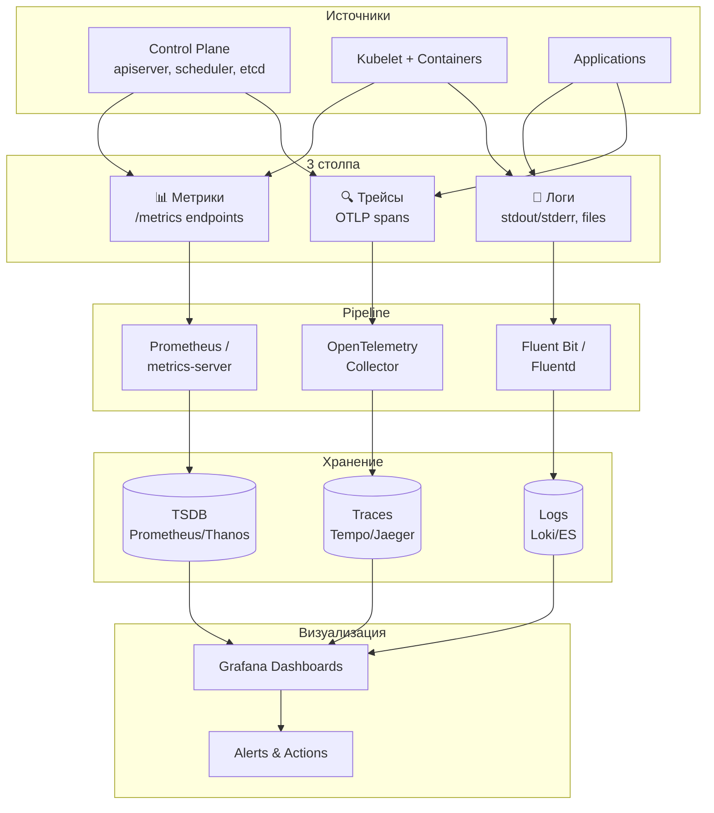
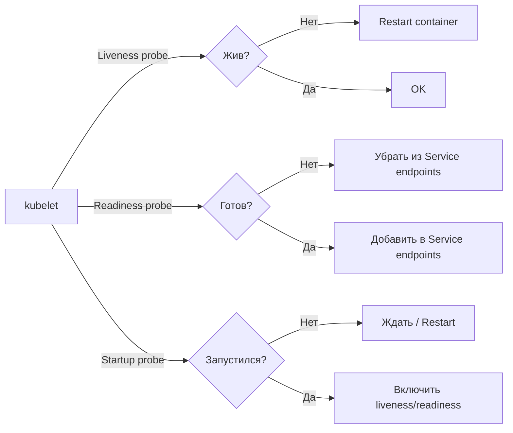

# Observability — наблюдаемость в Kubernetes

> 📌 Наблюдаемость в K8s строится на **3 столпах**: 
> (1) **Метрики** — числовые данные (Prometheus, metrics-server, kube-state-metrics).
> (2) **Логи** — хронологические записи событий (stdout/stderr → Fluent Bit → Loki/ES). 
> (3) **Трейсы** — распределённая трассировка запросов (OpenTelemetry). Плюс **Health Checks** (probes) — встроенный механизм проверки состояния подов.

---

## 🔹 Три столпа наблюдаемости

| Столп | Что это | Формат | Хранение | Примеры инструментов |
|-------|---------|--------|----------|---------------------|
| **Метрики** | Числовые данные во времени | Prometheus format | TSDB (Prometheus, Thanos, Mimir) | Prometheus, Grafana |
| **Логи** | Хронологические записи событий | Текст/JSON | Index (Loki, Elasticsearch) | Fluent Bit, Loki, Grafana |
| **Трейсы** | Путь запроса через компоненты | Spans (OTLP) | Tracing backend (Tempo, Jaeger) | OpenTelemetry, Jaeger |



---

## 🔹 1. Метрики

### 🎯 Endpoints компонентов K8s

Каждый компонент control plane и kubelet exposes метрики в формате **Prometheus** через HTTP endpoint `/metrics`.

| Компонент | Endpoint | Что измеряет |
|-----------|----------|--------------|
| **kube-apiserver** | `/metrics` | Запросы API, latency, ошибки |
| **kube-scheduler** | `/metrics` | Queue length, scheduling latency |
| **kube-controller-manager** | `/metrics` | Workqueue depth, reconciliation latency |
| **kubelet** | `/metrics` | Pod status, container stats |
| **kubelet** | `/metrics/cadvisor` | Container CPU, memory, network (через cAdvisor) |
| **kubelet** | `/metrics/resource` | Resource usage (requests vs actual) |
| **kubelet** | `/metrics/probes` | Probe results (liveness, readiness) |
| **kube-proxy** | `/metrics` | Connection tracking, sync rules |
| **etcd** | `/metrics` | DB size, leader changes, latency |

### 🎯 Типы метрик в K8s

| Тип метрик | Источник | Описание |
|------------|----------|----------|
| **Control plane metrics** | apiserver, scheduler, etcd | Состояние control plane |
| **Kubelet metrics** | kubelet (cAdvisor) | Использование ресурсов контейнерами |
| **kube-state-metrics** | kube-state-metrics (add-on) | Состояние K8s объектов (Deployments, Pods, etc.) |
| **Custom metrics** | Приложения | Бизнес-метрики (через Prometheus adapter) |
| **External metrics** | Внешние источники | Очереди, облачные метрики |

### 🎯 Типичный pipeline метрик

```
1. Prometheus (или аналог) периодически (каждые 15-60 сек) скрейпит /metrics endpoints
2. Сохраняет в Time Series Database (TSDB)
3. Grafana визуализирует через dashboards
4. Alertmanager отправляет алерты при нарушениях thresholds
5. Для multi-cluster / long-term storage: Thanos или Cortex
```

### 📝 Пример: установка Prometheus + Grafana

```bash
# Через kube-prometheus-stack (Helm)
helm repo add prometheus-community https://prometheus-community.github.io/helm-charts
helm install kube-prometheus prometheus-community/kube-prometheus-stack \
  --namespace monitoring --create-namespace

# Проверить
kubectl get pods -n monitoring
# kube-prometheus-kube-prome-operator-...   1/1   Running
# kube-prometheus-grafana-...               1/1   Running
# kube-prometheus-kube-state-metrics-...    1/1   Running
# prometheus-kube-prometheus-prometheus-0   2/2   Running

# Доступ к Grafana (port-forward)
kubectl port-forward -n monitoring svc/kube-prometheus-grafana 3000:80
# Логин: admin / prom-operator
```

### 🎯 Ключевые метрики для мониторинга

#### Control Plane

```promql
# API server latency (99-й перцентиль)
histogram_quantile(0.99, rate(apiserver_request_duration_seconds_bucket[5m]))

# API server error rate
sum(rate(apiserver_request_total{code=~"5.."}[5m])) / sum(rate(apiserver_request_total[5m]))

# etcd DB size
etcd_mvcc_db_total_size_in_bytes

# Scheduler queue length
scheduler_pending_pods

# Controller manager workqueue depth
workqueue_depth{name=~".*"}
```

#### Nodes

```promql
# CPU utilization по ноде
100 - (avg by(instance) (rate(node_cpu_seconds_total{mode="idle"}[5m])) * 100)

# Memory utilization по ноде
(1 - node_memory_MemAvailable_bytes / node_memory_MemTotal_bytes) * 100

# Disk pressure
node_filesystem_avail_bytes{mountpoint="/"} / node_filesystem_size_bytes{mountpoint="/"}

# Pod count на ноде
kubelet_running_pods
```

#### Pods (через kube-state-metrics)

```promql
# Pod status
kube_pod_status_phase{phase="Running"}
kube_pod_status_phase{phase="Failed"}
kube_pod_status_phase{phase="Pending"}

# Restarts
increase(kube_pod_container_status_restarts_total[1h]) > 5

# OOM kills
kube_pod_container_status_last_terminated_reason{reason="OOMKilled"}

# Resource usage vs requests
sum by(pod) (container_memory_working_set_bytes) / sum by(pod) (kube_pod_container_resource_requests{resource="memory"})
```

---

## 🔹 2. Логи

### 🎯 Источники логов в K8s

| Источник | Где хранится | Как получить |
|----------|--------------|--------------|
| **Container stdout/stderr** | `/var/log/containers/*.log` (JSON format) | `kubectl logs <pod>` |
| **kubelet** | journald или `/var/log/kubelet.log` | `journalctl -u kubelet` |
| **Container runtime** (containerd) | journald или `/var/log/containerd.log` | `journalctl -u containerd` |
| **Control plane** (static pods) | `/var/log/pods/` или `/var/log/` | `kubectl logs -n kube-system <pod>` |
| **Audit logs** | `/var/log/kubernetes/audit.log` | Настроен через apiserver flags |

### 🎯 Формат логов контейнеров (CRI)

Kubelet сохраняет логи контейнеров в формате JSON:

```json
{"log":"2024-01-01T12:00:00Z INFO Starting application\n","stream":"stdout","time":"2024-01-01T12:00:00.123456789Z"}
{"log":"2024-01-01T12:00:01Z ERROR Failed to connect to DB\n","stream":"stderr","time":"2024-01-01T12:00:01.123456789Z"}
```

**Структура**:
- `log` — содержимое строки лога
- `stream` — `stdout` или `stderr`
- `time` — timestamp в RFC3339Nano

### 🎯 Типичный pipeline логов

```
1. Контейнеры пишут в stdout/stderr
2. Container runtime сохраняет в /var/log/containers/*.log (CRI format)
3. Node-level агент (Fluent Bit/Fluentd) читает эти файлы
4. Агент обогащает логи метаданными (pod name, namespace, container name)
5. Отправляет в центральное хранилище (Loki, Elasticsearch, Splunk)
6. Grafana / Kibana визуализирует
```

### 📝 Пример: установка Loki + Promtail (через Helm)

```bash
# Установить Loki stack
helm repo add grafana https://grafana.github.io/helm-charts
helm install loki grafana/loki-stack \
  --namespace logging --create-namespace

# Проверить
kubectl get pods -n logging
# loki-0           1/1   Running
# loki-promtail-... 1/1   Running   ← DaemonSet, на каждой ноде

# В Grafana добавить Loki data source
# URL: http://loki:3100
```

### 🎯 Полезные LogQL запросы (Loki)

```logql
# Все логи пода
{namespace="default", pod="my-app-abc12"}

# Логи с ошибкой
{namespace="default", pod=~"my-app.*"} |= "ERROR"

# Логи за последние 5 минут
{namespace="default"} |= "ERROR" [5m]

# Частота ошибок
sum by(pod) (rate({namespace="default"} |= "ERROR" [5m]))

# JSON логи с парсингом
{namespace="default"} | json | level="error"
```

### 🎯 Ротация логов

> ⚠️ **Важно**: логи на ноде могут занимать много места. Нужна ротация!

```bash
# Проверить текущую конфигурацию containerd
cat /etc/containerd/config.toml | grep -A5 log

# Пример настройки ротации в containerd
[plugins."io.containerd.grpc.v1.cri".containerd.runtimes.runc.options]
  SystemdCgroup = true

[plugins."io.containerd.grpc.v1.cri"]
  sandbox_image = "registry.k8s.io/pause:3.9"

[plugins."io.containerd.grpc.v1.cri".containerd.runtimes.runc]
  [plugins."io.containerd.grpc.v1.cri".containerd.runtimes.runc.options]
    # Ротация логов контейнеров
    [plugins."io.containerd.grpc.v1.cri".containerd.runtimes.runc.options.log]
      max_size = "100Mi"      # макс размер файла
      max_files = "5"         # макс файлов
```

---

## 🔹 3. Трейсы

### 🎯 Что такое трейсинг

**Трейс** — это путь одного запроса через все компоненты системы. Состоит из **spans** — отдельных операций с таймингами.

```
Клиент → Ingress → Service → Pod A → Pod B → Database
  |        |         |        |        |         |
  └────────┴─────────┴────────┴────────┴─────────┘
              Один трейс с несколькими spans
```

### 🎯 OpenTelemetry в K8s (v1.36+)

K8s может экспортировать трейсы control plane через **OTLP** (OpenTelemetry Protocol).

```yaml
# kube-apiserver configuration
apiVersion: apiserver.config.k8s.io/v1
kind: apiserver.config
tracing:
  - url: http://otel-collector:4317    # ← OTLP gRPC endpoint
    samplingRatePerMillion: 100000     # ← 10% sampling
```

### 🎯 Типичный pipeline трейсов

```
1. Компоненты K8s (apiserver, scheduler) экспортируют spans через OTLP
2. OpenTelemetry Collector принимает, обрабатывает (sampling, enrichment)
3. Отправляет в tracing backend (Tempo, Jaeger, Zipkin)
4. Визуализация через Jaeger UI, Grafana Tempo
```

### 📝 Пример: установка OpenTelemetry Collector + Tempo

```bash
# Установить OpenTelemetry Collector
helm repo add open-telemetry https://open-telemetry.github.io/opentelemetry-helm-charts
helm install otel-collector open-telemetry/opentelemetry-collector \
  --namespace observability --create-namespace

# Установить Grafana Tempo
helm repo add grafana https://grafana.github.io/helm-charts
helm install tempo grafana/tempo \
  --namespace observability
```

---

## 🔹 4. Health Checks (Probes)

> **Важная часть observability** — встроенный механизм проверки состояния подов.

### 🎯 3 типа probes

| Probe | Назначение | Действие при провале |
|-------|------------|---------------------|
| **Liveness** | "Под жив?" | **Перезапуск** контейнера |
| **Readiness** | "Под готов принимать трафик?" | **Убрать из Service** (не слать трафик) |
| **Startup** | "Под запустился?" | **Перезапуск** контейнера (пока не пройдёт) |



### 🎯 Типы проверок

| Тип | Как работает | Когда использовать |
|-----|--------------|-------------------|
| **httpGet** | HTTP GET на порт/path, статус 200-399 = OK | HTTP-сервисы |
| **tcpSocket** | TCP connection на порт | TCP-сервисы (БД) |
| **exec** | Выполнить команду в контейнере, exit 0 = OK | Кастомные проверки |
| **grpc** | gRPC HealthCheck | gRPC-сервисы |

### 📝 Пример: все 3 probe

```yaml
apiVersion: v1
kind: Pod
metadata:
  name: my-app
spec:
  containers:
  - name: app
    image: my-app:latest
    ports:
    - containerPort: 8080
    
    # Startup: ждём, пока приложение запустится (может быть долгим)
    startupProbe:
      httpGet:
        path: /healthz
        port: 8080
      failureThreshold: 30        # ← 30 × 10s = 5 минут на запуск
      periodSeconds: 10
    
    # Liveness: проверяем, что приложение живо
    livenessProbe:
      httpGet:
        path: /healthz
        port: 8080
      initialDelaySeconds: 0      # ← startup probe уже проверил запуск
      periodSeconds: 10
      failureThreshold: 3         # ← 3 провала = restart
      timeoutSeconds: 2
    
    # Readiness: проверяем, что можно слать трафик
    readinessProbe:
      httpGet:
        path: /ready
        port: 8080
      periodSeconds: 5
      failureThreshold: 2
      timeoutSeconds: 1
```

### 🎯 Best practices для probes

| Правило | Почему |
|---------|--------|
| **Всегда используй startupProbe для медленных приложений** | Избежишь restart'ов во время запуска |
| **Readiness != Liveness** | Readiness проверяет готовность (БД подключена?), Liveness — что процесс жив |
| **Не делай liveness слишком агрессивным** | `failureThreshold: 1` + `periodSeconds: 1` = постоянные restart'ы |
| **Используй отдельные endpoints** | `/healthz` для liveness, `/ready` для readiness |
| **Учитывай dependencies в readiness** | БД, кэш, внешние сервисы должны быть доступны |
| **Не проверяй в liveness то, что не исправится restart'ом** | Например, недоступный внешний сервис — restart не поможет |

### 🔍 Отладка probes

```bash
# Посмотреть статус probes
kubectl describe pod my-app | grep -A20 'Containers:'
# Containers:
#   app:
#     ...
#     Liveness:   http-get http://:8080/healthz delay=0s timeout=2s period=10s #success=1 #failure=3
#     Readiness:  http-get http://:8080/ready delay=0s timeout=1s period=5s #success=1 #failure=2
#     Startup:    http-get http://:8080/healthz delay=0s timeout=1s period=10s #success=1 #failure=3

# Посмотреть события (probe failures)
kubectl get events --field-selector involvedObject.name=my-app --sort-by='.lastTimestamp'
# Warning  Unhealthy  ...  Liveness probe failed: HTTP probe failed with statuscode: 503
# Normal   Killing    ...  Container app failed liveness probe, will be restarted

# Посмотреть метрики probes
kubectl get --raw /api/v1/nodes/<node>/proxy/metrics/probes | grep probe
# kubelet_liveness_probe_total{result="success"} 150
# kubelet_liveness_probe_total{result="failure"} 5
# kubelet_readiness_probe_total{result="success"} 300

# Ручная проверка probe
kubectl exec my-app -- curl -s http://localhost:8080/healthz
kubectl exec my-app -- curl -s http://localhost:8080/ready
```

---

## 🔹 metrics-server

> Встроенный агрегатор метрик ресурсов (CPU, memory) для `kubectl top` и HPA.

### 📝 Установка

```bash
kubectl apply -f https://github.com/kubernetes-sigs/metrics-server/releases/latest/download/components.yaml

# Проверить
kubectl get pods -n kube-system | grep metrics-server
kubectl top nodes
kubectl top pods -A
```

### 🎯 Что даёт metrics-server

- `kubectl top nodes` — использование CPU/memory на нодах
- `kubectl top pods` — использование CPU/memory подами
- Источник данных для **HPA** (автоскейлинг по CPU/memory)

### ⚠️ Ограничения

- **Не хранит историю** — только текущие значения
- **Не для мониторинга** — используй Prometheus для долгосрочного хранения
- **Не для billing** — точность недостаточна

---

## 🔹 kube-state-metrics

> Add-on, который экспортирует **состояние K8s объектов** в формате Prometheus.

### 🎯 Что экспортирует

```
kube_deployment_status_replicas{deployment="my-app"} 3
kube_pod_status_phase{pod="my-app-abc12",phase="Running"} 1
kube_pod_container_status_restarts_total{pod="my-app-abc12"} 5
kube_node_status_condition{node="worker-1",condition="Ready"} 1
kube_persistentvolumeclaim_status_phase{persistentvolumeclaim="data"} 1
```

### 🎯 Примеры полезных метрик

```promql
# Количество подов по статусу
count by(phase) (kube_pod_status_phase)

# Поды в CrashLoopBackOff
kube_pod_container_status_waiting_reason{reason="CrashLoopBackOff"}

# Deployments с недоступными репликами
kube_deployment_status_replicas_unavailable > 0

# PVC в Pending
kube_persistentvolumeclaim_status_phase{phase="Pending"}

# Nodes не в Ready состоянии
kube_node_status_condition{condition="Ready",status="true"} == 0
```

---

## 🔹 Обзор инструментов

### 📊 Метрики

| Инструмент | Описание | Когда использовать |
|------------|----------|-------------------|
| **Prometheus** | Стандарт де-факто, pull-based, TSDB | Production, standalone |
| **Thanos** | Расширение Prometheus: HA, long-term storage, global view | Multi-cluster, long-term |
| **Cortex** | Горизонтально масштабируемый Prometheus | Large scale, multi-tenant |
| **Grafana Mimir** | От Grafana Labs, multi-tenant Prometheus | Grafana stack |
| **VictoriaMetrics** | Быстрая альтернатива Prometheus | High performance |

### 📝 Логи

| Инструмент | Описание | Когда использовать |
|------------|----------|-------------------|
| **Loki** | От Grafana, label-based, лёгкий | Grafana stack, cost-effective |
| **Elasticsearch** | Полнотекстовый поиск, мощный | Complex queries, enterprise |
| **OpenSearch** | Fork Elasticsearch, open source | AWS, open source |
| **Fluent Bit** | Лёгкий агент, low resource | Node-level agent |
| **Fluentd** | Мощный роутинг, много плагинов | Complex pipelines |
| **Vector** | От Datadog, быстрый, на Rust | High performance |

### 🔍 Трейсы

| Инструмент | Описание | Когда использовать |
|------------|----------|-------------------|
| **OpenTelemetry Collector** | Стандарт, принимает/обрабатывает/экспортирует | Все сценарии |
| **Jaeger** | CNCF project, визуализация, поиск | Open source, CNCF stack |
| **Grafana Tempo** | От Grafana, scalable,低成本 | Grafana stack |
| **Zipkin** | От Twitter, простой | Legacy, simple setups |

### 🎯 Готовые стеки

| Стек | Состав | Когда использовать |
|------|--------|-------------------|
| **kube-prometheus-stack** | Prometheus + Grafana + Alertmanager + kube-state-metrics | Стандартный мониторинг |
| **LGTM** | Loki + Grafana + Tempo + Mimir | Полный observability от Grafana |
| **EFK/ELK** | Elasticsearch + Fluentd + Kibana | Enterprise logging |
| **OpenTelemetry** | Collector + backend (Tempo/Jaeger) | Трейсинг |

---

## 🔹 Практика: базовая настройка observability

### 🚀 Установка полного стека (kube-prometheus + Loki + Tempo)

```bash
# 1. Создать namespace
kubectl create namespace observability

# 2. Установить kube-prometheus-stack (метрики)
helm repo add prometheus-community https://prometheus-community.github.io/helm-charts
helm install kube-prometheus prometheus-community/kube-prometheus-stack \
  --namespace observability \
  --set grafana.enabled=true \
  --set alertmanager.enabled=true

# 3. Установить Loki (логи)
helm repo add grafana https://grafana.github.io/helm-charts
helm install loki grafana/loki-stack \
  --namespace observability \
  --set promtail.enabled=true \
  --set loki.enabled=true

# 4. Установить Tempo (трейсы)
helm repo add grafana https://grafana.github.io/helm-charts
helm install tempo grafana/tempo \
  --namespace observability

# 5. Проверить
kubectl get pods -n observability
# kube-prometheus-grafana-...              1/1   Running
# kube-prometheus-kube-state-metrics-...   1/1   Running
# prometheus-kube-prometheus-prometheus-0  2/2   Running
# loki-0                                   1/1   Running
# loki-promtail-...                        1/1   Running   ← DaemonSet
# tempo-...                                1/1   Running

# 6. Настроить Grafana data sources
# - Prometheus: http://kube-prometheus-kube-prome-prometheus:9090
# - Loki: http://loki:3100
# - Tempo: http://tempo:3100
```

### 🔍 Полезные команды для observability

```bash
# Метрики
kubectl top nodes
kubectl top pods -A --sort-by=cpu
kubectl top pods -A --sort-by=memory

# Логи
kubectl logs <pod> -n <namespace>
kubectl logs <pod> -n <namespace> --previous         # логи предыдущего контейнера
kubectl logs <pod> -n <namespace> -f                 # follow
kubectl logs <pod> -n <namespace> --since=1h         # за последний час
kubectl logs -l app=my-app -n <namespace>            # по лейблу
kubectl logs -l app=my-app -n <namespace> --all-containers  # все контейнеры

# События (важно для отладки!)
kubectl get events -n <namespace> --sort-by='.lastTimestamp'
kubectl get events --field-selector involvedObject.name=<pod>

# Health checks
kubectl describe pod <pod> | grep -A10 'Conditions:'
kubectl get pods -o custom-columns="NAME:.metadata.name,READY:.status.conditions[?(@.type=='Ready')].status,RESTARTS:.status.containerStatuses[0].restartCount"

# Debug через ephemeral containers
kubectl debug -it <pod> --image=busybox --target=<container>
```

---

## 🔹 Best Practices

### ✅ Делай

1. **Используй единый стек** (например, Grafana stack: Prometheus + Loki + Tempo + Grafana) — упрощает correlation.
2. **Настрой алерты на критичные метрики**:
   - Pod CrashLoopBackOff
   - Node NotReady
   - High CPU/memory utilization (>80%)
   - PVC почти заполнен
   - API server latency > 1s
3. **Добавь labels ко всем метрикам**: namespace, pod, container — для удобной фильтрации.
4. **Используй structured logging** (JSON) — упрощает парсинг и поиск.
5. **Настрой retention policies**: метрики 30-90 дней, логи 7-30 дней, трейсы 7 дней.
6. **Используй startupProbe** для медленных приложений — избежишь restart'ов.
7. **Разделяй liveness и readiness** — разные endpoints, разные thresholds.
8. **Мониторь сам мониторинг** — alert на "Prometheus down", "Loki down".
9. **Документируй dashboards** — что показывает, для кого, кто владелец.
10. **Ротируй логи** — настрой max size и max files для container logs.

### ❌ Не делай

```
# ❌ НЕ храни логи только на ноде
# Нода упадёт → логи потеряны. Используй central log store.

# ❌ НЕ используй metrics-server для долгосрочного мониторинга
# Он не хранит историю. Используй Prometheus.

# ❌ НЕ делай liveness probe слишком агрессивным
# failureThreshold: 1 + periodSeconds: 1 = постоянные restart'ы

# ❌ НЕ проверяй в liveness внешние зависимости
# Если БД недоступна — restart пода не поможет. Это для readiness.

# ❌ НЕ игнорируй audit logs
# Критично для security и compliance.

# ❌ НЕ собирай все логи без фильтрации
# Будет слишком дорого. Фильтруй по namespace, severity.

# ❌ НЕ забывай про resource limits для monitoring stack
# Prometheus может сожрать много памяти при большом количестве метрик.

# ❌ НЕ храни секреты в логах
# Маскируй passwords, tokens, PII.
```

---

## 🔹 Чек-лист: настройка observability

```
# ✅ 1. Метрики
#    - Установить metrics-server (для kubectl top и HPA)
#    - Установить Prometheus (или аналог) для долгосрочного хранения
#    - Установить kube-state-metrics для метрик объектов
#    - Настроить Grafana dashboards
#    - Настроить алерты на критичные метрики

# ✅ 2. Логи
#    - Настроить ротацию логов на нодах
#    - Установить node-level агент (Fluent Bit/Promtail)
#    - Установить central log store (Loki/Elasticsearch)
#    - Настроить парсинг structured logs
#    - Настроить retention policies

# ✅ 3. Трейсы (опционально)
#    - Установить OpenTelemetry Collector
#    - Установить tracing backend (Tempo/Jaeger)
#    - Настроить sampling (не все трейсы, а 1-10%)
#    - Инструментировать приложения через OpenTelemetry SDK

# ✅ 4. Health checks
#    - Добавить startupProbe для медленных приложений
#    - Настроить livenessProbe (проверка, что процесс жив)
#    - Настроить readinessProbe (проверка готовности принимать трафик)
#    - Использовать отдельные endpoints (/healthz, /ready)

# ✅ 5. Алерты
#    - Pod CrashLoopBackOff / OOMKilled
#    - Node NotReady / DiskPressure / MemoryPressure
#    - High CPU/memory utilization
#    - API server latency / error rate
#    - PVC почти заполнен
#    - Monitoring stack down

# ✅ 6. Мониторинг мониторинга
#    - Алерт на "Prometheus down"
#    - Алерт на "Loki down"
#    - Алерт на high cardinality (слишком много метрик)
#    - Алерт на ingestion errors

# ✅ 7. Документация
#    - Список всех dashboards и их владельцев
#    - Runbook для частых алертов
#    - Схема observability stack
#    - Контакты on-call
```

> 💡 **Совет для конспекта**:
> 1. Создай файл `00_observability_cheatsheet.md` с шпаргалкой по командам kubectl и PromQL/LogQL.
> 2. Добавь блок «Частые ошибки»: «liveness проверяет БД", "нет startupProbe", "логи не ротируются".
> 3. Веди список "Какие dashboards у нас есть": имя, что показывает, владелец.

---

## 🔹 Ключевые выводы

1. **Observability = Метрики + Логи + Трейсы** — три столпа для полного понимания состояния системы.
2. **Метрики**: Prometheus-формат, endpoints `/metrics` у всех компонентов K8s.
3. **metrics-server** — для `kubectl top` и HPA. **kube-state-metrics** — для состояния K8s объектов.
4. **Логи**: stdout/stderr → CRI format → node agent (Fluent Bit) → central store (Loki/ES).
5. **Трейсы**: OpenTelemetry + OTLP → Collector → backend (Tempo/Jaeger).
6. **Health checks**: 3 типа probes — `startup` (запуск), `liveness` (жив), `readiness` (готов).
7. **Liveness vs Readiness**: liveness → restart, readiness → убрать из Service.
8. **startupProbe** — обязателен для медленных приложений, чтобы избежать restart'ов во время запуска.
9. **Готовые стеки**: kube-prometheus-stack, LGTM (Loki+Grafana+Tempo+Mimir), EFK/ELK.
10. **Best practices**: единый стек, structured logging, retention policies, мониторинг мониторинга.
11. **Алерты**: Pod CrashLoop, Node NotReady, high utilization, monitoring stack down.
12. **Отладка**: `kubectl describe pod`, `kubectl logs`, `kubectl get events`, ручная проверка probes.