# Logging Architecture — архитектура логирования в Kubernetes

> 📌 В K8s логи контейнеров пишутся в **stdout/stderr** → container runtime сохраняет их в `/var/log/pods/` (CRI format) → kubelet ротирует (по умолчанию 10MB × 5 файлов). Для **cluster-level logging** есть 3 подхода: (1) **Node-level agent** (DaemonSet, рекомендуется), (2) **Sidecar со streaming** (для легаси приложений), (3) **Sidecar с агентом** (гибкость, но overhead). K8s **не предоставляет** встроенное хранилище логов — нужен внешний бэкенд (Loki, ES, Splunk).

---

## 🔹 Базовое логирование в K8s

### 🎯 Как работают логи контейнеров

```
1. Контейнер пишет в stdout/stderr
2. Container runtime (containerd/CRI-O) перехватывает вывод
3. Сохраняет в /var/log/pods/<pod-uid>/<container>/<n>.log (CRI format)
4. Kubelet ротирует логи (по умолчанию 10MB × 5 файлов)
5. Доступ через kubectl logs (читает файлы через API)
```

### 📝 Пример: простой под с логами

```yaml
apiVersion: v1
kind: Pod
metadata:
  name: counter
spec:
  containers:
  - name: count
    image: busybox:1.28
    args: [/bin/sh, -c, 'i=0; while true; do echo "$i: $(date)"; i=$((i+1)); sleep 1; done']
```

```bash
# Создать под
kubectl apply -f counter-pod.yaml

# Посмотреть логи
kubectl logs counter
# 0: Fri Apr  1 11:42:23 UTC 2022
# 1: Fri Apr  1 11:42:24 UTC 2022
# 2: Fri Apr  1 11:42:25 UTC 2022

# Логи предыдущего контейнера (после restart)
kubectl logs counter --previous

# Для multi-container pod — указать контейнер
kubectl logs counter -c count

# Follow логи (как tail -f)
kubectl logs counter -f

# Логи за последний час
kubectl logs counter --since=1h

# Последние 100 строк
kubectl logs counter --tail=100

# Логи всех подов с лейблом
kubectl logs -l app=my-app --all-containers=true
```

---

## 🔹 CRI Log Format

> Container Runtime Interface (CRI) стандартизирует формат логов для всех runtime.

### 📝 Формат строки лога

```json
{"log":"2024-01-01T12:00:00.123456789Z stdout F Hello World\n","stream":"stdout","time":"2024-01-01T12:00:00.123456789Z"}
```

**Структура**:
- `log` — содержимое строки (с `\n` в конце)
- `stream` — `stdout` или `stderr`
- `time` — timestamp в RFC3339Nano
- `F` (опционально) — флаг partial (для длинных строк, разбитых на части)

### 📂 Структура файлов логов на ноде

```
/var/log/pods/
├── default_counter_abc123-def456/
│   ├── count/
│   │   ├── 0.log          # текущий лог
│   │   ├── 0.log.1        # ротированный (старый)
│   │   ├── 0.log.2
│   │   └── ...
│   └── sidecar/
│       └── 0.log
└── kube-system_coredns-xyz789/
    └── coredns/
        └── 0.log
```

---

## 🔹 Ротация логов (Log Rotation)

> ⚠️ **Критично**: без ротации логи займут весь диск!

### 🎯 Параметры ротации в kubelet

```yaml
# KubeletConfiguration
apiVersion: kubelet.config.k8s.io/v1beta1
kind: KubeletConfiguration
containerLogMaxSize: "10Mi"        # ← макс размер одного файла (по умолчанию 10MB)
containerLogMaxFiles: 5            # ← макс количество файлов (по умолчанию 5)
containerLogMaxWorkers: 1          # ← параллельные ротации (alpha, v1.29+)
containerLogMonitorInterval: "10s" # ← интервал проверки (alpha, v1.29+)
```

### 🎯 Как работает ротация

```
1. Kubelet мониторит размер файлов логов
2. Когда файл достигает containerLogMaxSize (10MB):
   a. Переименовывает 0.log → 0.log.1
   b. Создаёт новый 0.log
3. Если файлов больше containerLogMaxFiles (5):
   a. Удаляет самый старый (0.log.5)
   b. Сдвигает остальные (0.log.4 → 0.log.5, ...)
```

### ⚠️ Ограничения

| Ограничение | Описание |
|-------------|----------|
| **kubectl logs видит только текущий файл** | Не может прочитать ротированные файлы (0.log.1, 0.log.2) |
| **Нет глобального лимита** | Лимит на контейнер, не на ноду. 100 контейнеров × 50MB = 5GB |
| **Нет retention по времени** | Только по размеру/количеству файлов |

### 🎯 Best practices для ротации

```bash
# ✅ Увеличить лимиты для high-log-volume приложений
containerLogMaxSize: "100Mi"
containerLogMaxFiles: 10

# ✅ Настроить отдельный диск для логов
# Монтировать /var/log/pods на отдельный диск
# Избежать заполнения корневого диска

# ✅ Мониторить использование диска
# Алерт на node_filesystem_avail_bytes{mountpoint="/var/log"} < 10%
```

---

## 🔹 Логи системных компонентов

### 🎯 Где хранятся

| Компонент | Где работает | Где логи |
|-----------|--------------|----------|
| **kubelet** | На ноде (не в контейнере) | journald или `/var/log/kubelet.log` |
| **containerd/CRI-O** | На ноде (не в контейнере) | journald или `/var/log/containerd.log` |
| **kube-apiserver** | Static pod | `/var/log/pods/kube-system_kube-apiserver-*/` |
| **kube-scheduler** | Static pod | `/var/log/pods/kube-system_kube-scheduler-*/` |
| **kube-controller-manager** | Static pod | `/var/log/pods/kube-system_kube-controller-manager-*/` |
| **etcd** | Static pod или на ноде | `/var/log/pods/kube-system_etcd-*/` или `/var/log/etcd.log` |
| **kube-proxy** | DaemonSet pod | `/var/log/pods/kube-system_kube-proxy-*/` |

### 📝 Доступ к логам системных компонентов

```bash
# Логи kubelet (systemd)
journalctl -u kubelet -f
journalctl -u kubelet --since "1 hour ago"

# Логи containerd (systemd)
journalctl -u containerd -f

# Логи static pods (через kubectl)
kubectl logs -n kube-system kube-apiserver-master-1
kubectl logs -n kube-system etcd-master-1

# Логи DaemonSet (kube-proxy)
kubectl logs -n kube-system -l k8s-app=kube-proxy
```

---

## 🔹 Потоки логов (stdout/stderr separation) — alpha

> **v1.32+ (alpha)**: возможность получать отдельно stdout и stderr через API.

### 📝 Пример

```yaml
apiVersion: v1
kind: Pod
metadata:
  name: counter-err
spec:
  containers:
  - name: count
    image: busybox:1.28
    args: [/bin/sh, -c, 'i=0; while true; do echo "$i: $(date)"; echo "$i: err" >&2; i=$((i+1)); sleep 1; done']
```

```bash
# Включить feature gate в kubelet
# --feature-gates=PodLogsQuerySplitStreams=true

# Получить только stdout
kubectl get --raw "/api/v1/namespaces/default/pods/counter-err/log?stream=Stdout"

# Получить только stderr
kubectl get --raw "/api/v1/namespaces/default/pods/counter-err/log?stream=Stderr"
```

> ⚠️ **Alpha**: не для production. В production используй structured logging с полем `level`.

---

## 🔹 Cluster-Level Logging Architectures

> K8s **не предоставляет** встроенное хранилище логов. Нужен внешний бэкенд.

### 🎯 3 основных подхода

```mermaid
graph TB
    subgraph "Подход 1: Node-level agent (рекомендуется)"
        A1[Container stdout/stderr] --> B1[/var/log/pods/]
        B1 --> C1[DaemonSet Agent<br/>Fluent Bit/Promtail]
        C1 --> D1[Central Store<br/>Loki/ES]
    end
    
    subgraph "Подход 2: Sidecar со streaming"
        A2[App пишет в файл] --> B2[Shared Volume]
        B2 --> C2[Sidecar: tail -f]
        C2 --> D2[Sidecar stdout]
        D2 --> E2[Node agent]
        E2 --> F2[Central Store]
    end
    
    subgraph "Подход 3: Sidecar с агентом"
        A3[App пишет в файл] --> B3[Shared Volume]
        B3 --> C3[Sidecar Agent<br/>Fluentd]
        C3 --> D3[Central Store]
    end
```



---

## 🔹 1. Node-level Logging Agent (рекомендуется)

> **Самый популярный подход**: один агент на каждую ноду (DaemonSet), собирает логи всех контейнеров.

### 🎯 Как работает

```
1. Контейнеры пишут в stdout/stderr
2. Container runtime сохраняет в /var/log/pods/
3. DaemonSet агент (Fluent Bit/Promtail) на каждой ноде:
   - Читает файлы логов
   - Обогащает метаданными (pod name, namespace, container)
   - Отправляет в central store (Loki/ES)
4. Grafana/Kibana визуализирует
```

### 📝 Пример: установка Promtail + Loki

```bash
# Установить Loki stack
helm repo add grafana https://grafana.github.io/helm-charts
helm install loki grafana/loki-stack \
  --namespace logging --create-namespace \
  --set promtail.enabled=true

# Проверить
kubectl get pods -n logging
# loki-0              1/1   Running
# loki-promtail-abc   1/1   Running   ← DaemonSet, на каждой ноде

# Promtail автоматически:
# - Монтирует /var/log и /var/lib/docker/containers
# - Читает логи всех контейнеров
# - Отправляет в Loki
```

### 🎯 Преимущества

| Преимущество | Описание |
|--------------|----------|
| **Простота** | Не нужно менять приложения |
| **Эффективность** | Один агент на ноду, не на под |
| **Централизация** | Все логи в одном месте |
| **Масштабируемость** | DaemonSet автоматически добавляется на новые ноды |

### 🎯 Популярные агенты

| Агент | Особенности | Когда использовать |
|-------|-------------|-------------------|
| **Fluent Bit** | Лёгкий, low resource, C | Стандартный выбор, resource-constrained |
| **Promtail** | От Grafana, оптимизирован для Loki | Grafana stack |
| **Fluentd** | Мощный, много плагинов, Ruby | Complex pipelines |
| **Vector** | От Datadog, быстрый, Rust | High performance |

---

## 🔹 2. Sidecar Container со Streaming

> **Для легаси приложений**, которые пишут в файлы, а не в stdout/stderr.

### 🎯 Как работает

```
1. Main контейнер пишет логи в файлы (через shared volume)
2. Sidecar контейнер делает tail -f на эти файлы
3. Sidecar выводит в свой stdout/stderr
4. Node-level agent собирает логи sidecar (как обычные контейнерные логи)
```

### 📝 Пример

```yaml
apiVersion: v1
kind: Pod
metadata:
  name: counter
spec:
  containers:
  # Main приложение пишет в файлы
  - name: count
    image: busybox:1.28
    args:
    - /bin/sh
    - -c
    - >
      i=0;
      while true;
      do
        echo "$i: $(date)" >> /var/log/1.log;
        echo "$(date) INFO $i" >> /var/log/2.log;
        i=$((i+1));
        sleep 1;
      done
    volumeMounts:
    - name: varlog
      mountPath: /var/log
  
  # Sidecar 1: стримит 1.log в stdout
  - name: count-log-1
    image: busybox:1.28
    args: [/bin/sh, -c, 'tail -n+1 -F /var/log/1.log']
    volumeMounts:
    - name: varlog
      mountPath: /var/log
  
  # Sidecar 2: стримит 2.log в stdout
  - name: count-log-2
    image: busybox:1.28
    args: [/bin/sh, -c, 'tail -n+1 -F /var/log/2.log']
    volumeMounts:
    - name: varlog
      mountPath: /var/log
  
  volumes:
  - name: varlog
    emptyDir: {}
```

```bash
# Теперь можно использовать kubectl logs для каждого потока
kubectl logs counter count-log-1
# 0: Fri Apr  1 11:42:26 UTC 2022
# 1: Fri Apr  1 11:42:27 UTC 2022

kubectl logs counter count-log-2
# Fri Apr  1 11:42:29 UTC 2022 INFO 0
# Fri Apr  1 11:42:30 UTC 2022 INFO 0
```

### ⚠️ Недостатки

| Недостаток | Описание |
|------------|----------|
| **Overhead** | Дополнительные контейнеры потребляют CPU/memory |
| **Дублирование** | Логи пишутся в файл + стримятся в stdout = 2× место |
| **Сложность** | Нужно управлять sidecar контейнерами |

### 🎯 Когда использовать

- Легаси приложение **не может** писать в stdout/stderr
- Нужно **разделить** логи из разных файлов в разные потоки
- **Временное решение** до миграции на stdout/stderr

---

## 🔹 3. Sidecar Container с Logging Agent

> **Максимальная гибкость**: sidecar контейнер с полноценным агентом логирования.

### 🎯 Как работает

```
1. Main контейнер пишет логи в файлы (через shared volume)
2. Sidecar контейнер с агентом (Fluentd/Fluent Bit):
   - Читает файлы
   - Парсит, фильтрует, обогащает
   - Отправляет напрямую в central store
```

### 📝 Пример

```yaml
# ConfigMap с конфигурацией Fluentd
apiVersion: v1
kind: ConfigMap
metadata:
  name: fluentd-config
data:
  fluentd.conf: |
    <source>
      type tail
      format none
      path /var/log/1.log
      pos_file /var/log/1.log.pos
      tag count.format1
    </source>
    
    <source>
      type tail
      format none
      path /var/log/2.log
      pos_file /var/log/2.log.pos
      tag count.format2
    </source>
    
    <match **>
      @type elasticsearch
      host elasticsearch.logging.svc
      port 9200
      logstash_format true
    </match>
---
# Pod с sidecar агентом
apiVersion: v1
kind: Pod
metadata:
  name: counter
spec:
  containers:
  # Main приложение
  - name: count
    image: busybox:1.28
    args:
    - /bin/sh
    - -c
    - >
      i=0;
      while true;
      do
        echo "$i: $(date)" >> /var/log/1.log;
        echo "$(date) INFO $i" >> /var/log/2.log;
        i=$((i+1));
        sleep 1;
      done
    volumeMounts:
    - name: varlog
      mountPath: /var/log
  
  # Sidecar с Fluentd
  - name: count-agent
    image: fluentd:v1.16-1
    env:
    - name: FLUENTD_ARGS
      value: -c /etc/fluentd-config/fluentd.conf
    volumeMounts:
    - name: varlog
      mountPath: /var/log
    - name: config-volume
      mountPath: /etc/fluentd-config
  
  volumes:
  - name: varlog
    emptyDir: {}
  - name: config-volume
    configMap:
      name: fluentd-config
```

### ⚠️ Недостатки

| Недостаток | Описание |
|------------|----------|
| **Высокий overhead** | Полноценный агент в каждом поде |
| **Нет kubectl logs** | Логи не проходят через kubelet |
| **Сложность управления** | Нужно конфигурировать агент для каждого пода |
| **Resource limits** | Нужно выделять CPU/memory для sidecar |

### 🎯 Когда использовать

- Нужна **сложная обработка** логов (парсинг, фильтрация, enrichment)
- Логи нужно отправлять в **разные бэкенды**
- **Legacy приложения** с нестандартными форматами логов
- **Compliance требования** (аудит, шифрование)

---

## 🔹 4. Прямая отправка из приложения

> Приложение само отправляет логи в central store (без kubelet).

### 🎯 Как работает

```
1. Приложение пишет логи
2. Приложение само отправляет в Loki/ES/Splunk через SDK
3. Kubelet не участвует
```

### ⚠️ Недостатки

| Недостаток | Описание |
|------------|----------|
| **Нет kubectl logs** | Логи недоступны через стандартный API |
| **Coupling** | Приложение зависит от logging backend |
| **Сложность** | Нужно реализовывать retry, buffering в приложении |
| **Нет стандартизации** | Каждый app делает по-своему |

### 🎯 Когда использовать

- **Никогда** в K8s (антипаттерн)
- Только если приложение **уже** отправляет логи напрямую и нет времени на миграцию

---

## 🔹 Сравнение подходов

| Подход | Сложность | Overhead | kubectl logs | Когда использовать |
|--------|-----------|----------|--------------|-------------------|
| **Node-level agent** | 🟢 Низкая | 🟢 Низкий | ✅ Да | **Стандартный выбор** |
| **Sidecar со streaming** | 🟡 Средняя | 🟡 Средний | ✅ Да | Легаси приложения с файлами |
| **Sidecar с агентом** | 🔴 Высокая | 🔴 Высокий | ❌ Нет | Сложная обработка, compliance |
| **Прямая отправка** | 🔴 Высокая | 🟢 Низкий | ❌ Нет | **Не рекомендуется** |

---

## 🔹 Structured Logging

> **Best practice**: писать логи в JSON формате с полями `level`, `message`, `timestamp`.

### 📝 Пример: JSON logs

```json
{"level":"info","ts":"2024-01-01T12:00:00Z","msg":"Request processed","method":"GET","path":"/api/users","status":200,"duration_ms":45}
{"level":"error","ts":"2024-01-01T12:00:01Z","msg":"Database connection failed","error":"connection refused","retry":3}
```

### 🎯 Преимущества

| Преимущество | Описание |
|--------------|----------|
| **Парсинг** | Легко парсить автоматически |
| **Фильтрация** | Можно фильтровать по `level`, `method`, etc. |
| **Агрегация** | Легко агрегировать (count errors, avg duration) |
| **Корреляция** | Можно коррелировать по `trace_id`, `request_id` |

### 📝 Пример: LogQL запросы для JSON логов

```logql
# Все ошибки
{app="my-app"} | json | level="error"

# Ошибки с конкретным сообщением
{app="my-app"} | json | level="error" | msg="Database connection failed"

# Запросы с высокой задержкой
{app="my-app"} | json | duration_ms > 1000

# Агрегация по статусу
sum by(status) (rate({app="my-app"} | json | status_code[5m]))

# Топ 10 самых медленных запросов
topk(10, max_over_time({app="my-app"} | json | unwrap duration_ms[5m]))
```

---

## 🔹 Best Practices

### ✅ Делай

1. **Пиши в stdout/stderr** — стандартный подход, работает с kubectl logs.
2. **Используй structured logging** (JSON) — упрощает парсинг и анализ.
3. **Добавляй контекст** в логи: `request_id`, `user_id`, `trace_id`.
4. **Настрой ротацию** — `containerLogMaxSize: 100Mi`, `containerLogMaxFiles: 10`.
5. **Используй node-level agent** (DaemonSet) — стандартный подход.
6. **Фильтруй логи** на уровне агента — не отправляй debug логи в production.
7. **Настрой retention policies** — логи 7-30 дней, audit логи 1 год.
8. **Маскируй секреты** — passwords, tokens, PII не должны попадать в логи.
9. **Мониторь сам logging stack** — алерты на "Loki down", "high ingestion rate".
10. **Используй labels** — namespace, pod, container для удобной фильтрации.

### ❌ Не делай

```bash
# ❌ НЕ пиши логи только в файлы (без stdout/stderr)
# Потеряешь kubectl logs, усложнишь сбор

# ❌ НЕ храни логи только на ноде
# Нода упадёт → логи потеряны. Используй central store.

# ❌ НЕ пиши секреты в логи
# Passwords, tokens, PII должны быть замаскированы.

# ❌ НЕ игнорируй ротацию
# Без ротации логи займут весь диск.

# ❌ НЕ отправляй все логи в production
# Фильтруй debug логи, отправляй только info/warning/error.

# ❌ НЕ используй sidecar agent без необходимости
# Высокий overhead. Используй node-level agent.

# ❌ НЕ пиши логи в один файл с разными форматами
# Усложнит парсинг. Разделяй потоки или используй structured logging.

# ❌ НЕ забывай про resource limits для logging stack
# Prometheus/Loki могут сожрать много памяти.
```

---

## 🔹 Практика: настройка logging

### 🚀 Установка Loki stack (рекомендуемый подход)

```bash
# 1. Создать namespace
kubectl create namespace logging

# 2. Установить Loki + Promtail
helm repo add grafana https://grafana.github.io/helm-charts
helm install loki grafana/loki-stack \
  --namespace logging \
  --set promtail.enabled=true \
  --set loki.enabled=true \
  --set grafana.enabled=false    # ← если уже есть Grafana

# 3. Проверить
kubectl get pods -n logging
# loki-0              1/1   Running
# loki-promtail-abc   1/1   Running   ← DaemonSet

# 4. Добавить Loki data source в Grafana
# URL: http://loki.logging.svc:3100

# 5. Проверить логи
kubectl logs -n logging deployment/loki-promtail
```

### 🔍 Отладка логирования

```bash
# 1. Проверить, что логи пишутся на ноде
ssh <node>
ls -lh /var/log/pods/<namespace>_<pod-name>_<pod-uid>/<container>/
# 0.log  0.log.1  0.log.2

# 2. Проверить содержимое лога
tail -f /var/log/pods/<namespace>_<pod-name>_<pod-uid>/<container>/0.log

# 3. Проверить, что агент собирает логи
kubectl logs -n logging daemonset/loki-promtail
# level=info msg="Promtail started"

# 4. Проверить, что логи попадают в Loki
# В Grafana → Explore → Loki
# {namespace="default", pod="my-app-abc12"}

# 5. Проверить ротацию
kubectl exec -n <namespace> <pod> -- ls -lh /var/log/
# Если логи ротируются — увидишь 0.log, 0.log.1, etc.

# 6. Проверить использование диска
kubectl top node
ssh <node> df -h /var/log
```

### ⚠️ Частые проблемы

| Проблема | Причина | Решение |
|----------|---------|---------|
| **Логи не попадают в central store** | Агент не запущен или misconfigured | Проверить логи агента, конфигурацию |
| **Логи обрезаны** | Ротация удалила старые файлы | Увеличить `containerLogMaxFiles` |
| **Диск заполнен** | Нет ротации или слишком высокие лимиты | Настроить ротацию, отдельный диск для логов |
| **kubectl logs не работает** | Pod удалён или контейнер перезапущен | Использовать central store для истории |
| **Слишком много логов** | Debug логи в production | Фильтровать на уровне агента |
| **Секреты в логах** | Приложение пишет sensitive data | Маскировать в приложении или на уровне агента |

---

## 🔹 Чек-лист: настройка логирования

```bash
# ✅ 1. Выбрать подход
#    - Node-level agent (рекомендуется) → DaemonSet
#    - Sidecar streaming → для легаси приложений
#    - Sidecar agent → для сложной обработки

# ✅ 2. Настроить ротацию логов
#    - containerLogMaxSize: 100Mi
#    - containerLogMaxFiles: 10
#    - Отдельный диск для /var/log/pods (опционально)

# ✅ 3. Установить central log store
#    - Loki (Grafana stack, cost-effective)
#    - Elasticsearch (enterprise, complex queries)
#    - Splunk (enterprise, compliance)

# ✅ 4. Установить node-level agent
#    - Promtail (для Loki)
#    - Fluent Bit (лёгкий, универсальный)
#    - Fluentd (мощный, много плагинов)

# ✅ 5. Настроить structured logging
#    - JSON формат с полями level, message, timestamp
#    - Добавить контекст: request_id, trace_id
#    - Маскировать секреты

# ✅ 6. Настроить фильтрацию
#    - Не отправлять debug логи в production
#    - Фильтровать по namespace, severity
#    - Exclude системные логи (если не нужны)

# ✅ 7. Настроить retention policies
#    - Логи приложений: 7-30 дней
#    - Audit логи: 1 год (compliance)
#    - Метрики: 30-90 дней

# ✅ 8. Настроить мониторинг logging stack
#    - Алерт на "Loki down"
#    - Алерт на high ingestion rate
#    - Алерт на high disk usage

# ✅ 9. Документировать
#    - Какие логи собираются
#    - Где хранятся
#    - Как искать
#    - Кто отвечает

# ✅ 10. Тестировать
#    - Создать под с логами
#    - Проверить, что логи попадают в central store
#    - Проверить поиск и фильтрацию
#    - Проверить ротацию
```

> 💡 **Совет для конспекта**:
> 1. Создай файл `00_logging_cheatsheet.md` с шпаргалкой по kubectl logs и LogQL.
> 2. Добавь блок «Частые ошибки»: «логи не ротируются", "секреты в логах", "агент не запущен".
> 3. Веди список "Какие logging агенты у нас в кластере": тип, namespace, central store.

---

## 🔹 Ключевые выводы

1. **K8s не предоставляет** встроенное хранилище логов — нужен внешний бэкенд.
2. **Логи контейнеров** пишутся в stdout/stderr → container runtime сохраняет в `/var/log/pods/` (CRI format).
3. **Kubelet ротирует** логи: по умолчанию 10MB × 5 файлов на контейнер.
4. **kubectl logs** читает только текущий файл (не ротированные).
5. **3 подхода** к cluster-level logging: node-level agent (рекомендуется), sidecar streaming, sidecar agent.
6. **Node-level agent** (DaemonSet) — стандартный подход: один агент на ноду, собирает логи всех контейнеров.
7. **Sidecar streaming** — для легаси приложений, которые пишут в файлы.
8. **Sidecar agent** — для сложной обработки, но высокий overhead.
9. **Structured logging** (JSON) — best practice: упрощает парсинг, фильтрацию, агрегацию.
10. **Ротация критична** — без неё логи займут весь диск.
11. **Мониторинг logging stack** — алерты на "Loki down", high ingestion rate, disk usage.
12. **Best practices**: stdout/stderr, structured logging, фильтрация, retention policies, маскирование секретов.

