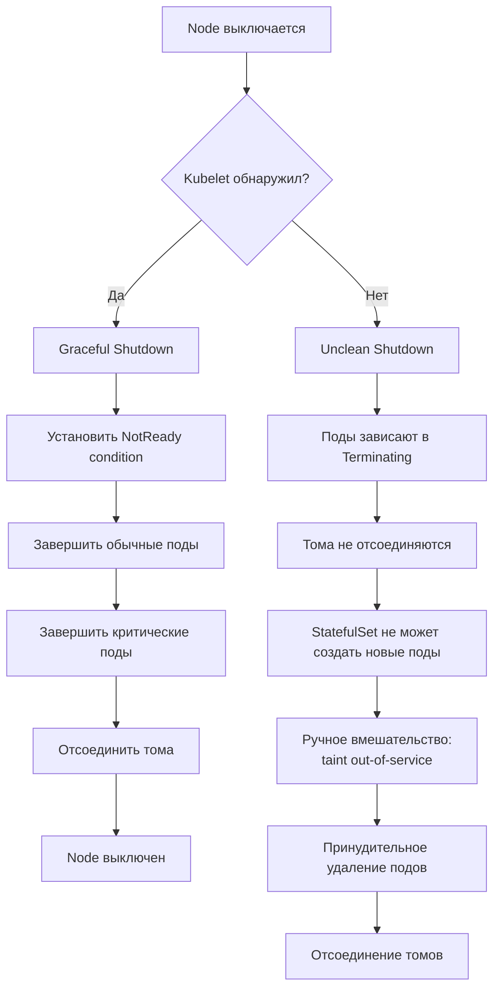

# Node Shutdowns — корректное завершение работы нод

> 📌 При выключении ноды kubelet может **gracefully** завершить поды (если настроено). 
> Есть 2 режима: 
> (1) **Graceful Node Shutdown** (v1.21+) — 2 этапа: обычные поды → критические поды, 
> (2) **By Priority** (v1.24+) — многоэтапное завершение по PriorityClass. При **некорректном shutdown** (power loss) — используй taint `node.kubernetes.io/out-of-service` для принудительного удаления подов и отсоединения томов.

---

## 🔹 Обзор: Graceful vs Unclean Shutdown

| Тип | Причина | Kubelet обнаруживает? | Поды завершаются? | Тома отсоединяются? |
|-----|---------|----------------------|-------------------|---------------------|
| **Graceful** | `shutdown`, `reboot`, planned maintenance | ✅ Да | ✅ Да (graceful termination) | ✅ Да |
| **Unclean** | Power loss, kernel panic, hardware failure | ❌ Нет | ❌ Нет (зависают в Terminating) | ❌ Нет (требует ручного вмешательства) |



---

## 🔹 1. Graceful Node Shutdown (базовый)

> **v1.21+ (beta, включено по умолчанию)**. Kubelet обнаруживает shutdown системы и корректно завершает поды.

### 🎯 Как работает

```
1. Система получает сигнал shutdown (systemd)
2. Kubelet получает уведомление через systemd inhibitor
3. Kubelet устанавливает Node condition: NotReady (reason: "node is shutting down")
4. Планировщик перестаёт планировать новые поды на эту ноду
5. Kubelet завершает поды в 2 этапа:
   a. Этап 1: Обычные поды (shutdownGracePeriod - shutdownGracePeriodCriticalPods секунд)
   b. Этап 2: Критические поды (shutdownGracePeriodCriticalPods секунд)
6. Тома отсоединяются
7. Node выключается
```

### ⚙️ Конфигурация kubelet

```yaml
# /var/lib/kubelet/config.yaml
apiVersion: kubelet.config.k8s.io/v1beta1
kind: KubeletConfiguration
shutdownGracePeriod: "30s"              # ← общее время на shutdown
shutdownGracePeriodCriticalPods: "10s"  # ← время на критические поды
```

**Логика**:
- `shutdownGracePeriod = 30s` — всего 30 секунд на shutdown
- `shutdownGracePeriodCriticalPods = 10s` — последние 10 секунд для критических подов
- **Обычные поды**: 30s - 10s = **20 секунд** на завершение
- **Критические поды**: **10 секунд** на завершение

### 🎯 Какие поды считаются "критическими"?

> Kubelet завершает поды в обратном порядке приоритета (низкоприоритетные первыми).

| PriorityClass | Значение | Критический? |
|---------------|----------|--------------|
| `system-node-critical` | 2000001000 | ✅ Да |
| `system-cluster-critical` | 2000000000 | ✅ Да |
| Обычные поды | 0 | ❌ Нет |

### 📝 Пример: shutdown ноды

```bash
# 1. Настроить kubelet (на ноде)
sudo vim /var/lib/kubelet/config.yaml
# Добавить:
# shutdownGracePeriod: "60s"
# shutdownGracePeriodCriticalPods: "15s"

# 2. Перезапустить kubelet
sudo systemctl restart kubelet

# 3. Выключить ноду (graceful)
sudo shutdown -h now

# 4. Наблюдать за процессом (на control plane)
kubectl get nodes -w
# NAME      STATUS   ROLES    AGE   VERSION
# worker-1  Ready    <none>   10d   v1.28
# worker-1  NotReady <none>   10d   v1.28   ← node is shutting down

kubectl get pods -o wide --field-selector spec.nodeName=worker-1
# NAME        READY   STATUS       RESTARTS   AGE
# app-abc12   1/1     Terminating  0          5m    ← обычный под завершается
# coredns-xyz 1/1     Running      0          10d   ← критический под ещё работает

# 5. Проверить события подов
kubectl describe pod app-abc12 | grep -A5 'Reason:'
# Reason:         Terminated
# Message:        Pod was terminated in response to imminent node shutdown.
```

### ⚠️ Важные замечания

| Проблема | Описание | Решение |
|----------|----------|---------|
| **Debian unattended-upgrades** | Конфликтует с graceful shutdown (max delay 30s) | Отключить: `sudo ln -sf /dev/null /etc/systemd/logind.conf.d/unattended-upgrades-logind.conf` |
| **Требует systemd** | Работает только на системах с systemd | Проверить: `systemctl --version` |
| **По умолчанию отключено** | Параметры = 0s | Установить ненулевые значения |
| **Отмена shutdown** | Если shutdown отменён, поды не восстанавливаются | Поды нужно пересоздать вручную |

---

## 🔹 2. Graceful Node Shutdown по приоритету

> **v1.24+ (beta, включено по умолчанию)**. Многоэтапное завершение подов на основе PriorityClass.

### 🎯 Как работает

```
1. Kubelet получает shutdown сигнал
2. Группирует поды по PriorityClass
3. Завершает поды поэтапно (от высокого приоритета к низкому):
   - Этап 1: Поды с priority >= 100000 → 10 секунд
   - Этап 2: Поды с priority >= 10000 → 180 секунд
   - Этап 3: Поды с priority >= 1000 → 120 секунд
   - Этап 4: Поды с priority >= 0 → 60 секунд
4. Если в диапазоне нет подов → пропускает этап
5. Тома отсоединяются
6. Node выключается
```

### ⚙️ Конфигурация kubelet

```yaml
# /var/lib/kubelet/config.yaml
apiVersion: kubelet.config.k8s.io/v1beta1
kind: KubeletConfiguration
shutdownGracePeriodByPodPriority:
  - priority: 2000000000          # system-cluster-critical
    shutdownGracePeriodSeconds: 5
  - priority: 1000000             # Высокий приоритет
    shutdownGracePeriodSeconds: 30
  - priority: 100000              # Средний приоритет
    shutdownGracePeriodSeconds: 60
  - priority: 0                   # Обычные поды
    shutdownGracePeriodSeconds: 120
```

**Логика**:
- **system-cluster-critical** (priority >= 2B): 5 секунд
- **Высокий приоритет** (priority >= 1M): 30 секунд
- **Средний приоритет** (priority >= 100K): 60 секунд
- **Обычные поды** (priority >= 0): 120 секунд
- **Общее время**: 5 + 30 + 60 + 120 = **215 секунд**

### 📝 Пример: PriorityClass и shutdown

```yaml
# 1. Создать PriorityClass
apiVersion: scheduling.k8s.io/v1
kind: PriorityClass
metadata:
  name: high-priority
value: 1000000
globalDefault: false
description: "Высокий приоритет для критичных сервисов"
---
# 2. Создать под с высоким приоритетом
apiVersion: v1
kind: Pod
metadata:
  name: critical-app
spec:
  priorityClassName: high-priority
  containers:
  - name: app
    image: my-app:latest
---
# 3. Создать под с обычным приоритетом
apiVersion: v1
kind: Pod
metadata:
  name: regular-app
spec:
  containers:
  - name: app
    image: my-app:latest
```

**При shutdown**:
- `regular-app` (priority = 0) → завершается **первым** (120 секунд)
- `critical-app` (priority = 1000000) → завершается **последним** (30 секунд)

### 🎯 Преимущества

| Преимущество | Описание |
|--------------|----------|
| **Гибкость** | Можно настроить разные времена для разных приоритетов |
| **Контроль** | Критичные поды получают больше времени на shutdown |
| **Предсказуемость** | Порядок завершения определён явно |

---

## 🔹 3. Unclean Node Shutdown

> **v1.28+ (stable, включено по умолчанию)**. Решение для случаев, когда kubelet не обнаружил shutdown.

### 🎯 Проблема

```
1. Node выключается внезапно (power loss, kernel panic)
2. Kubelet не успевает обработать shutdown
3. Поды зависают в статусе Terminating
4. StatefulSet не может создать новые поды (имя занято)
5. Тома не отсоединяются (VolumeAttachment остаётся)
6. Новые поды не могут запуститься (тома заняты)
```

### 🎯 Решение: taint `node.kubernetes.io/out-of-service`

```bash
# 1. Убедиться, что нода действительно выключена (не перезагружается!)
kubectl get nodes
# NAME      STATUS     ROLES    AGE   VERSION
# worker-1  NotReady   <none>   10d   v1.28

# 2. Добавить taint out-of-service
kubectl taint nodes worker-1 node.kubernetes.io/out-of-service=true:NoExecute

# 3. Проверить, что поды удалились
kubectl get pods --field-selector spec.nodeName=worker-1
# (пусто — поды удалены)

# 4. Проверить, что тома отсоединились
kubectl get volumeattachments
# (VolumeAttachment для worker-1 удалён)

# 5. StatefulSet создаёт новые поды на другой ноде
kubectl get pods -l app=my-stateful-app
# NAME              READY   STATUS    RESTARTS   AGE
# my-app-0          1/1     Running   0          1m    ← на другой ноде
# my-app-1          1/1     Running   0          5m

# 6. УДАЛИТЬ taint после восстановления (опционально)
kubectl taint nodes worker-1 node.kubernetes.io/out-of-service-
```

### ⚠️ Важные замечания

| Правило | Описание |
|---------|----------|
| **Только для выключенных нод** | Не применяй к нодам, которые перезагружаются! |
| **Принудительное удаление** | Поды удаляются без graceful termination |
| **Отсоединение томов** | VolumeAttachment удаляется немедленно |
| **Риск потери данных** | Если на ноде ещё работает workload — данные могут повредиться |
| **Ручное удаление taint** | После восстановления ноды — удали taint вручную |

### 📝 Пример: восстановление StatefulSet

```bash
# Сценарий: StatefulSet с 3 репликами, нода worker-1 выключилась

# 1. Проверить статус
kubectl get pods -l app=my-db
# NAME      READY   STATUS        RESTARTS   AGE
# my-db-0   1/1     Running       0          10d   ← на worker-2
# my-db-1   0/1     Terminating   0          10d   ← на worker-1 (завис)
# my-db-2   1/1     Running       0          10d   ← на worker-3

kubectl get volumeattachments
# NAME                                         ATTACHER   PV         NODE      ATTACHED   AGE
# pvc-abc123                                   csi.driver pv-my-db-1 worker-1  true       10d   ← не отсоединён

# 2. Применить taint out-of-service
kubectl taint nodes worker-1 node.kubernetes.io/out-of-service=true:NoExecute
# node/worker-1 tainted

# 3. Подождать 30-60 секунд
sleep 30

# 4. Проверить, что под удалён
kubectl get pods -l app=my-db
# NAME      READY   STATUS    RESTARTS   AGE
# my-db-0   1/1     Running   0          10d
# my-db-1   1/1     Running   0          1m    ← пересоздан на worker-2
# my-db-2   1/1     Running   0          10d

# 5. Проверить, что том отсоединился
kubectl get volumeattachments
# NAME                                         ATTACHER   PV         NODE      ATTACHED   AGE
# pvc-abc123                                   csi.driver pv-my-db-1 worker-2  true       1m    ← на новой ноде

# 6. (Опционально) Удалить taint, если нода восстановлена
kubectl taint nodes worker-1 node.kubernetes.io/out-of-service-
```

---

## 🔹 4. Force Detach Storage (автоматический)

> Если под не удаляется за **6 минут** — Kubernetes принудительно отсоединяет том.

### 🎯 Как работает

```
1. Node становится NotReady (kubelet не отвечает)
2. Kubelet не удаляет поды (недоступен)
3. Ждём 6 минут (по умолчанию)
4. Kube-controller-manager принудительно удаляет VolumeAttachment
5. Том отсоединяется
6. StatefulSet создаёт новый под на другой ноде
7. Новый под подключает том
```

### ⚠️ Риски

| Риск | Описание |
|------|----------|
| **Потеря данных** | Если на старой ноде ещё работает workload — данные могут повредиться |
| **Нарушение CSI spec** | ControllerUnpublishVolume вызывается без NodeUnpublishVolume |
| **Filesystem corruption** | Если том был смонтирован на старой ноде |

### ⚙️ Отключение force detach

```yaml
# kube-controller-manager configuration
apiVersion: kubescheduler.config.k8s.io/v1
kind: KubeControllerManagerConfiguration
attachDetachController:
  disableForceDetachOnTimeout: true    # ← отключить автоматический force detach
```

> 💡 **Рекомендация**: используй **taint out-of-service** вместо force detach — больше контроля.

---

## 🔹 Метрики graceful shutdown

> Kubelet экспортирует метрики для мониторинга shutdown.

### 📊 Доступные метрики

```promql
# Время начала shutdown
kubelet_graceful_shutdown_start_time_seconds

# Время завершения shutdown
kubelet_graceful_shutdown_end_time_seconds

# Длительность shutdown
kubelet_graceful_shutdown_end_time_seconds - kubelet_graceful_shutdown_start_time_seconds
```

### 🎯 Пример: алерт на долгий shutdown

```yaml
groups:
- name: node-shutdown
  rules:
  - alert: NodeShutdownTooLong
    expr: (kubelet_graceful_shutdown_end_time_seconds - kubelet_graceful_shutdown_start_time_seconds) > 300
    for: 1m
    labels:
      severity: warning
    annotations:
      summary: "Shutdown ноды {{ $labels.node }} занял > 5 минут"
      description: "Graceful shutdown занял {{ $value }} секунд"
```

---

## 🔹 Troubleshooting

### 🔍 Проблема 1: Graceful shutdown не работает

```bash
# 1. Проверить конфигурацию kubelet
ssh worker-1
cat /var/lib/kubelet/config.yaml | grep -A5 shutdown
# shutdownGracePeriod: "30s"
# shutdownGracePeriodCriticalPods: "10s"

# 2. Проверить, что systemd работает
systemctl --version

# 3. Проверить логи kubelet
journalctl -u kubelet -f | grep -i shutdown
# "Received shutdown signal"
# "Starting graceful node shutdown"

# 4. Проверить feature gates (для старых версий)
kubectl get nodes worker-1 -o jsonpath='{.status.conditions}' | jq
```

### 🔍 Проблема 2: Поды зависают в Terminating

```bash
# 1. Проверить статус ноды
kubectl get nodes
# NAME      STATUS     ROLES    AGE   VERSION
# worker-1  NotReady   <none>   10d   v1.28

# 2. Проверить, что kubelet недоступен
kubectl describe node worker-1 | grep -A10 'Conditions:'
# Ready   False   KubeletNotReady   container runtime is down

# 3. Применить taint out-of-service
kubectl taint nodes worker-1 node.kubernetes.io/out-of-service=true:NoExecute

# 4. Подождать 30-60 секунд
sleep 30

# 5. Проверить, что поды удалились
kubectl get pods --field-selector spec.nodeName=worker-1
```

### 🔍 Проблема 3: Тома не отсоединяются

```bash
# 1. Проверить VolumeAttachment
kubectl get volumeattachments
# NAME              ATTACHER   PV         NODE      ATTACHED   AGE
# pvc-abc123        csi.driver pv-data    worker-1  true       10d

# 2. Применить taint out-of-service
kubectl taint nodes worker-1 node.kubernetes.io/out-of-service=true:NoExecute

# 3. Подождать
sleep 60

# 4. Проверить, что VolumeAttachment удалён
kubectl get volumeattachments
# (пусто или на другой ноде)

# 5. Если не помогло — удалить вручную (осторожно!)
kubectl delete volumeattachment pvc-abc123
```

### 🔍 Проблема 4: StatefulSet не создаёт новые поды

```bash
# 1. Проверить, что старые поды в Terminating
kubectl get pods -l app=my-stateful
# NAME      READY   STATUS        RESTARTS   AGE
# my-db-0   0/1     Terminating   0          10d

# 2. Проверить события StatefulSet
kubectl describe statefulset my-db | grep -A10 'Events:'
# Warning  FailedCreate  ...  pod "my-db-0" already exists

# 3. Применить taint out-of-service
kubectl taint nodes worker-1 node.kubernetes.io/out-of-service=true:NoExecute

# 4. Подождать
sleep 30

# 5. Проверить, что новые поды создались
kubectl get pods -l app=my-stateful
# NAME      READY   STATUS    RESTARTS   AGE
# my-db-0   1/1     Running   0          1m
```

---

## 🔹 Best Practices

### ✅ Делай

1. **Всегда настраивай graceful shutdown** — `shutdownGracePeriod: "60s"`, `shutdownGracePeriodCriticalPods: "15s"`.
2. **Используй PriorityClass** для критичных workloads — они получат больше времени на shutdown.
3. **Тестируй shutdown** в staging перед production.
4. **Мониторь метрики** graceful shutdown — алерты на долгий shutdown.
5. **Используй taint out-of-service** для unclean shutdown — больше контроля, чем force detach.
6. **Проверяй, что нода действительно выключена** перед применением taint.
7. **Документируй процедуру** восстановления после unclean shutdown.
8. **Настрой PDB** для критичных workloads — защити от неожиданного удаления.
9. **Используй terminationGracePeriodSeconds** в подах — дай время на graceful shutdown.
10. **Ротируй ноды планово** — cordon → drain → shutdown → replace.

### ❌ Не делай

```bash
# ❌ НЕ выключай ноды без graceful shutdown
# Поды зависнут, тома не отсоединятся

# ❌ НЕ применяй taint out-of-service к перезагружающимся нодам
# Это принудительно удалит поды и отсоединит тома

# ❌ НЕ удаляй VolumeAttachment вручную без крайней необходимости
# Риск потери данных

# ❌ НЕ игнорируй алерты на unclean shutdown
# StatefulSet не сможет восстановиться

# ❌ НЕ используй force detach без необходимости
# Риск повреждения данных

# ❌ НЕ забывай удалять taint out-of-service после восстановления
# Нода останется непригодной для планирования

# ❌ НЕ настраивай shutdownGracePeriod < terminationGracePeriodSeconds
# Поды не успеют завершиться

# ❌ НЕ выключай все ноды одновременно
# Cluster станет недоступен
```

---

## 🔹 Чек-лист: настройка graceful shutdown

```bash
# ✅ 1. Настроить kubelet на всех нодах
#    - shutdownGracePeriod: "60s"
#    - shutdownGracePeriodCriticalPods: "15s"
#    - Или shutdownGracePeriodByPodPriority для гибкости

# ✅ 2. Создать PriorityClass для критичных workloads
kubectl apply -f priorityclass.yaml
# system-cluster-critical, high-priority, etc.

# ✅ 3. Настроить terminationGracePeriodSeconds в подах
#    - Дать время на graceful shutdown
#    - Пример: 30s для обычных, 60s для критичных

# ✅ 4. Настроить PDB для критичных workloads
kubectl apply -f pdb.yaml
# minAvailable: 2 для StatefulSet

# ✅ 5. Настроить мониторинг
#    - Метрики: kubelet_graceful_shutdown_*
#    - Алерты на долгий shutdown
#    - Алерты на unclean shutdown

# ✅ 6. Документировать процедуру восстановления
#    - Как применить taint out-of-service
#    - Как проверить, что поды удалились
#    - Как проверить, что тома отсоединились
#    - Как удалить taint после восстановления

# ✅ 7. Тестировать в staging
#    - Graceful shutdown (shutdown -h now)
#    - Unclean shutdown (power off)
#    - Проверить восстановление StatefulSet

# ✅ 8. Настроить плановую ротацию нод
#    - cordon → drain → shutdown → replace
#    - Использовать Cluster Autoscaler или Karpenter

# ✅ 9. Проверить Debian unattended-upgrades
#    - Отключить конфликт с graceful shutdown
#    - sudo ln -sf /dev/null /etc/systemd/logind.conf.d/unattended-upgrades-logind.conf

# ✅ 10. Мониторить volume attachments
#    - Алерт на зависшие VolumeAttachment
#    - Автоматическое восстановление через taint out-of-service
```

> 💡 **Совет для конспекта**:
> 1. Создай файл `00_node_shutdown_cheatsheet.md` с шпаргалкой по командам.
> 2. Добавь блок «Частые ошибки»: «забыл настроить shutdownGracePeriod", "применил taint к перезагружающейся ноде", "не удалил taint после восстановления".
> 3. Веди список "Какие PriorityClass у нас в кластере": имя, значение, shutdownGracePeriodSeconds.

---

## 🔹 Ключевые выводы

1. **Graceful Node Shutdown** (v1.21+) — kubelet обнаруживает shutdown и корректно завершает поды.
2. **2 этапа**: обычные поды (shutdownGracePeriod - shutdownGracePeriodCriticalPods) → критические поды (shutdownGracePeriodCriticalPods).
3. **By Priority** (v1.24+) — многоэтапное завершение по PriorityClass, более гибкий контроль.
4. **Unclean Shutdown** — kubelet не обнаружил shutdown, поды зависают в Terminating.
5. **Taint out-of-service** — решение для unclean shutdown: принудительное удаление подов и отсоединение томов.
6. **Force Detach** (6 минут) — автоматическое отсоединение томов, но риск потери данных.
7. **Метрики**: `kubelet_graceful_shutdown_start_time_seconds`, `kubelet_graceful_shutdown_end_time_seconds`.
8. **Требует systemd** — работает только на системах с systemd.
9. **Debian unattended-upgrades** — конфликтует с graceful shutdown, нужно отключить.
10. **Best practices**: настрой graceful shutdown, используй PriorityClass, тестируй в staging, документируй процедуру восстановления.
11. **Troubleshooting**: проверяй конфигурацию kubelet, логи kubelet, применяй taint out-of-service для unclean shutdown.
12. **Осторожно с taint out-of-service**: применяй только к действительно выключенным нодам, удаляй после восстановления.
