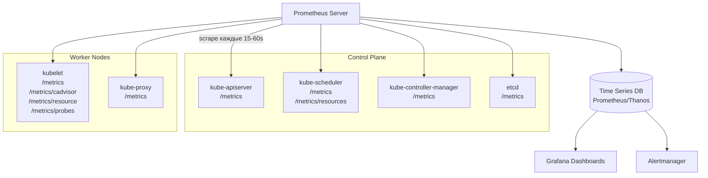
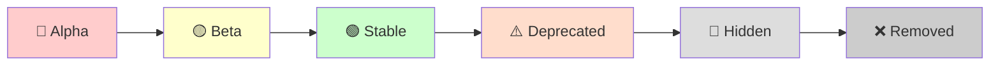

# Metrics For Kubernetes System Components — метрики control plane

> 📌 Все компоненты K8s (apiserver, scheduler, controller-manager, kubelet, kube-proxy, etcd) экспортируют метрики в **Prometheus-формате** через endpoint `/metrics`. Метрики проходят жизненный цикл: **Alpha → Beta → Stable → Deprecated → Hidden → Removed**. Для production нужен **Prometheus Server** (или Thanos/Mimir) для сбора и хранения. Новые фичи: **PSI metrics** (v1.36, Pressure Stall Information) для мониторинга resource contention, **cardinality control** для защиты от high-cardinality метрик.

---

## 🔹 Обзор: endpoints компонентов

### 🎯 Где найти метрики

| Компонент | Endpoint | Что измеряет |
|-----------|----------|--------------|
| **kube-apiserver** | `/metrics` | API requests, latency, errors, admission webhooks |
| **kube-scheduler** | `/metrics` | Scheduling latency, queue length, preemptions |
| **kube-scheduler** | `/metrics/resources` | Resource requests/limits по подам (beta, v1.21+) |
| **kube-controller-manager** | `/metrics` | Workqueues, reconciliations, cloud provider API |
| **kubelet** | `/metrics` | Pod/container stats, runtime operations |
| **kubelet** | `/metrics/cadvisor` | Container CPU/memory/network (через cAdvisor) |
| **kubelet** | `/metrics/resource` | Resource usage vs requests |
| **kubelet** | `/metrics/probes` | Probe results (liveness/readiness) |
| **kube-proxy** | `/metrics` | Sync rules, conntrack, packet drop |
| **etcd** | `/metrics` | DB size, leader changes, backend latency |



### ⚙️ Включение endpoints (если закрыты)

> По умолчанию некоторые компоненты **не открывают** `/metrics` наружу. Нужно указать `--bind-address`.

```yaml
# kube-scheduler configuration
apiVersion: kubescheduler.config.k8s.io/v1
kind: KubeSchedulerConfiguration
clientConnection:
  kubeconfig: /etc/kubernetes/scheduler.conf
# Метрики доступны на 0.0.0.0:10259 (по умолчанию только 127.0.0.1)
```

```bash
# Или через флаг (для статических подов)
# В манифесте /etc/kubernetes/manifests/kube-scheduler.yaml
- --bind-address=0.0.0.0
```

---

## 🔹 Доступ к метрикам

### 🔐 RBAC для чтения метрик

> Если в кластере включён RBAC — нужен ClusterRole для доступа к `/metrics`.

```yaml
apiVersion: rbac.authorization.k8s.io/v1
kind: ClusterRole
metadata:
  name: prometheus-k8s
rules:
- nonResourceURLs:
  - "/metrics"
  - "/metrics/resources"      # для scheduler resource metrics
  verbs: ["get"]
---
apiVersion: rbac.authorization.k8s.io/v1
kind: ClusterRoleBinding
metadata:
  name: prometheus-k8s
roleRef:
  apiGroup: rbac.authorization.k8s.io
  kind: ClusterRole
  name: prometheus-k8s
subjects:
- kind: ServiceAccount
  name: prometheus
  namespace: monitoring
```

### 🔍 Получение метрик через kubectl proxy

```bash
# Запустить proxy
kubectl proxy --port=8001 &

# Получить метрики apiserver
curl http://localhost:8001/metrics

# Получить метрики scheduler
curl http://localhost:8001/metrics/scheduler

# Получить метрики controller-manager
curl http://localhost:8001/metrics/controller-manager

# Получить метрики kubelet (через node proxy)
curl http://localhost:8001/api/v1/nodes/worker-1/proxy/metrics
curl http://localhost:8001/api/v1/nodes/worker-1/proxy/metrics/cadvisor
curl http://localhost:8001/api/v1/nodes/worker-1/proxy/metrics/resource
curl http://localhost:8001/api/v1/nodes/worker-1/proxy/metrics/probes

# Получить PSI metrics (v1.36+)
curl http://localhost:8001/api/v1/nodes/worker-1/proxy/metrics/cadvisor | grep pressure
```

---

## 🔹 Жизненный цикл метрик

> Метрики проходят **6 стадий** с разными гарантиями стабильности.



### 📊 Таблица стадий

| Стадия | Гарантии | Когда использовать |
|--------|----------|-------------------|
| **🔴 Alpha** | Может быть изменена/удалена в любом релизе | Эксперименты, не для production |
| **🟡 Beta** | Метки нельзя удалять, можно добавлять | Можно использовать, но с осторожностью |
| **🟢 Stable** | **Не изменится**: ни имя, ни тип, ни семантика | ✅ Production-ready |
| **⚠️ Deprecated** | Ещё доступна, но помечена как устаревшая | Мигрировать на новую метрику |
| **👻 Hidden** | Не публикуется, но можно включить | Временное решение при миграции |
| **❌ Removed** | Полностью удалена | Использовать замену |

### 🎯 Timelines для Hidden

| Стабильность | Когда становится Hidden |
|--------------|------------------------|
| **Stable** | Через **3 релиза** или **9 месяцев** (что дольше) |
| **Beta** | Через **1 релиз** или **4 месяца** (что дольше) |
| **Alpha** | Может быть скрыта/удалена в **том же релизе** |

### 📝 Пример: deprecated метрика

**До deprecated**:
```
# HELP some_counter this counts things
# TYPE some_counter counter
some_counter 0
```

**После deprecated**:
```
# HELP some_counter (Deprecated since 1.29.0) this counts things
# TYPE some_counter counter
some_counter 0
```

---

## 🔹 Show Hidden Metrics

> Если ты пропустил миграцию и метрика уже hidden — можно временно включить её через флаг.

### ⚙️ Флаг `--show-hidden-metrics-for-version`

```bash
# Показать метрики, скрытые в версии 1.29
--show-hidden-metrics-for-version=1.29
```

### 🎯 Правила

- Принимает **только предыдущую minor версию** (нельзя `1.27`, если текущая `1.30`)
- Версия указывается как `x.y` (patch не нужен)
- Это **временное решение** — мигрируй на новые метрики!

### 📝 Пример: timeline для метрики A

| Стабильность метрики A | Deprecated в | Hidden в | Флаг для показа |
|------------------------|--------------|----------|-----------------|
| **Alpha** | 1.29 | 1.29 (тот же релиз) | `--show-hidden-metrics-for-version=1.28` |
| **Beta** | 1.29 | 1.30 (минимум) | `--show-hidden-metrics-for-version=1.29` |
| **Stable** | 1.29 | 1.32 (минимум) | `--show-hidden-metrics-for-version=1.31` |

---

## 🔹 Метрики по компонентам

### 🎯 kube-apiserver

```promql
# Requests per second (по кодам ответа)
sum(rate(apiserver_request_total[5m])) by (code, verb)

# Latency (99-й перцентиль) по ресурсам
histogram_quantile(0.99, 
  sum(rate(apiserver_request_duration_seconds_bucket{verb!="WATCH"}[5m])) by (le, resource, verb)
)

# Error rate (5xx)
sum(rate(apiserver_request_total{code=~"5.."}[5m])) / 
sum(rate(apiserver_request_total[5m]))

# Inflight requests
apiserver_current_inflight_requests

# Admission webhook latency
histogram_quantile(0.99, 
  sum(rate(apiserver_admission_webhook_admission_duration_seconds_bucket[5m])) by (le, name)
)

# Etcd request latency
histogram_quantile(0.99, 
  sum(rate(etcd_request_duration_seconds_bucket[5m])) by (le, operation)
)
```

### 🎯 kube-scheduler

```promql
# Pending pods в очереди
scheduler_pending_pods

# Scheduling latency (99-й перцентиль)
histogram_quantile(0.99, 
  sum(rate(scheduler_e2e_scheduling_duration_seconds_bucket[5m])) by (le)
)

# Scheduling attempts
sum(rate(scheduler_schedule_attempts_total[5m])) by (result)

# Preemption attempts
sum(rate(scheduler_preemption_attempts_total[5m]))

# Preemption victims
sum(rate(scheduler_preemption_victims[5m]))

# Queue incoming rate
sum(rate(scheduler_incoming_pods_total[5m])) by (queue)
```

#### 📊 Resource metrics (v1.21+, `/metrics/resources`)

> Показывает **requested** и **limit** ресурсы для всех запущенных подов.

```promql
# Resource requests по namespace
sum(kube_pod_resource_request{resource="cpu"}) by (namespace)

# Resource limits по namespace
sum(kube_pod_resource_limit{resource="memory"}) by (namespace)

# Топ-10 подов по CPU request
topk(10, kube_pod_resource_request{resource="cpu"})
```

**Labels**: `namespace`, `pod`, `node`, `priority`, `scheduler`, `resource`, `unit`

> ⚠️ Метрика исчезает, когда под завершается (Succeeded/Failed/Deleted).

### 🎯 kube-controller-manager

```promql
# Workqueue depth (очередь reconciliations)
workqueue_depth{name=~".*"}

# Workqueue add rate
sum(rate(workqueue_adds_total[5m])) by (name)

# Workqueue latency (99-й перцентиль)
histogram_quantile(0.99, 
  sum(rate(workqueue_queue_duration_seconds_bucket[5m])) by (le, name)
)

# Reconciliation errors
sum(rate(controller_runtime_reconcile_errors_total[5m])) by (controller)

# Cloud provider API latency (GCE)
histogram_quantile(0.99, 
  sum(rate(cloudprovider_gce_api_request_duration_seconds_bucket[5m])) by (le, request)
)

# Persistent volume operations
sum(rate(cloudprovider_gce_api_request_duration_seconds_count{request=~"disk_.*"}[5m])) by (request)
```

### 🎯 kubelet

```promql
# Running pods на ноде
kubelet_running_pods

# Container start latency
histogram_quantile(0.99, 
  sum(rate(kubelet_container_start_duration_seconds_bucket[5m])) by (le)
)

# Pod start latency
histogram_quantile(0.99, 
  sum(rate(kubelet_pod_start_duration_seconds_bucket[5m])) by (le)
)

# Volume operations
sum(rate(kubelet_volume_stats_capacity_bytes[5m])) by (persistentvolumeclaim)

# Runtime operations
sum(rate(kubelet_runtime_operations_total[5m])) by (operation_type)
sum(rate(kubelet_runtime_operations_errors_total[5m])) by (operation_type)

# PLEG (Pod Lifecycle Event Generator) relist latency
histogram_quantile(0.99, 
  sum(rate(kubelet_pleg_relist_duration_seconds_bucket[5m])) by (le)
)
```

### 🎯 kube-proxy

```promql
# Sync rules duration
histogram_quantile(0.99, 
  sum(rate(kubeproxy_sync_proxy_rules_duration_seconds_bucket[5m])) by (le)
)

# Conntrack entries
kubeproxy_conntrack_current_count

# Conntrack max
kubeproxy_conntrack_max_count

# Packet drop rate
sum(rate(kubeproxy_sync_proxy_rules_conntrack_stale_total[5m]))

# iptables rules count
kubeproxy_sync_proxy_rules_iptables_total
```

### 🎯 etcd

```promql
# DB size
etcd_mvcc_db_total_size_in_bytes
etcd_mvcc_db_total_size_in_use_in_bytes

# Leader changes
rate(etcd_server_leader_changes_seen_total[1h])

# Backend commit latency
histogram_quantile(0.99, 
  sum(rate(etcd_disk_backend_commit_duration_seconds_bucket[5m])) by (le)
)

# WAL fsync latency
histogram_quantile(0.99, 
  sum(rate(etcd_disk_wal_fsync_duration_seconds_bucket[5m])) by (le)
)

# gRPC requests
sum(rate(grpc_server_handled_total[5m])) by (grpc_method, grpc_code)

# Proposals failed
rate(etcd_server_proposals_failed_total[5m])
```

---

## 🔹 PSI Metrics (Pressure Stall Information) — v1.36+

> **Stable с v1.36**. Новые метрики kubelet для мониторинга **resource contention** в реальном времени на уровне node/pod/container.

### 🎯 Что такое PSI

**PSI (Pressure Stall Information)** — фича ядра Linux (4.20+), которая отслеживает время, когда задачи **приостановлены** из-за нехватки ресурсов (CPU, memory, I/O).

**Два типа метрик**:
- **`some`** — хотя бы одна задача приостановлена (частичная потеря производительности)
- **`full`** — **все** задачи приостановлены (полная остановка работы)

### 🎯 Доступные метрики

| Метрика | Описание |
|---------|----------|
| `container_pressure_cpu_stalled_seconds_total` | Cumulative CPU stall time |
| `container_pressure_cpu_waiting_seconds_total` | Cumulative CPU wait time |
| `container_pressure_memory_stalled_seconds_total` | Cumulative memory stall time |
| `container_pressure_memory_waiting_seconds_total` | Cumulative memory wait time |
| `container_pressure_io_stalled_seconds_total` | Cumulative I/O stall time |
| `container_pressure_io_waiting_seconds_total` | Cumulative I/O wait time |

### 🎯 Endpoints

| Endpoint | Формат | Описание |
|----------|--------|----------|
| `/metrics/cadvisor` | Prometheus | Cumulative counters (итоговые значения) |
| `/stats/summary` | JSON | Cumulative + sliding averages (avg10, avg60, avg300) |
| `/proc/pressure/*` | Kernel | Нативные PSI файлы на ноде |

### 📝 Пример: получение PSI через API

```bash
# Получить PSI для всех контейнеров на ноде
kubectl get --raw "/api/v1/nodes/worker-1/proxy/stats/summary" | \
  jq '.pods[].containers[] | {name: .name, cpu: .cpu.psi, memory: .memory.psi, io: .io.psi}'
```

**Результат**:
```json
{
  "name": "my-app",
  "cpu": {
    "full": { "total": 0, "avg10": 0, "avg60": 0, "avg300": 0 },
    "some": { "total": 35232438, "avg10": 0.74, "avg60": 0.52, "avg300": 0.21 }
  },
  "memory": {
    "full": { "total": 539105, "avg10": 0, "avg60": 0, "avg300": 0 },
    "some": { "total": 658164, "avg10": 0.01, "avg60": 0.01, "avg300": 0.00 }
  },
  "io": {
    "full": { "total": 33190987, "avg10": 0.31, "avg60": 0.22, "avg300": 0.05 },
    "some": { "total": 40809937, "avg10": 0.52, "avg60": 0.45, "avg300": 0.12 }
  }
}
```

### 🎯 Интерпретация

| Метрика | Значение | Что означает |
|---------|----------|--------------|
| **`cpu.some.avg10 = 0.74`** | 0.74% времени | За последние 10 сек хотя бы одна задача ждала CPU |
| **`cpu.some.avg300 = 0.21`** | 0.21% времени | За последние 5 мин среднее ожидание CPU |
| **`avg10 >> avg300`** | — | **Недавний spike** (не долгосрочная проблема) |
| **`cpu.full = 0`** | 0% | Контейнер в целом работает (нет полной остановки) |
| **`cpu.full > 0`** | > 0% | **Серьёзная проблема** — все задачи остановлены |
| **`io.some` высокий, `memory.some` низкий** | — | Приложение ждёт диск, а не память |

### 🎯 Примеры PromQL для PSI

```promql
# CPU pressure spike (avg10 > avg300 × 3)
(
  container_pressure_cpu_waiting_seconds_total{type="some", avg="avg10"}
  > 3 * container_pressure_cpu_waiting_seconds_total{type="some", avg="avg300"}
)

# Memory pressure (full > 0 — критично!)
container_pressure_memory_stalled_seconds_total{type="full"} > 0

# I/O pressure
container_pressure_io_waiting_seconds_total{type="some", avg="avg60"} > 0.1

# Top-10 контейнеров по CPU pressure
topk(10, rate(container_pressure_cpu_waiting_seconds_total[5m]))
```

### ⚙️ Требования

| Требование | Описание |
|------------|----------|
| **Linux kernel** | 4.20+ |
| **cgroup** | v2 |
| **Feature gate** | Включено по умолчанию в v1.36 |

```bash
# Проверить версию ядра
uname -r
# 5.15.0-87-generic  ← OK

# Проверить cgroup v2
stat -fc %T /sys/fs/cgroup/
# cgroup2fs  ← OK

# Проверить PSI в ядре
cat /proc/pressure/cpu
# some avg10=0.00 avg60=0.00 avg300=0.00 total=0
# full avg10=0.00 avg60=0.00 avg300=0.00 total=0
```

---

## 🔹 Отключение метрик

> Если метрика вызывает проблемы с производительностью — можно её отключить.

### ⚙️ Флаг `--disabled-metrics`

```bash
# Отключить конкретные метрики
--disabled-metrics=metric1,metric2,metric3

# Пример
--disabled-metrics=apiserver_request_total,etcd_request_duration_seconds_bucket
```

### ⚙️ Через конфигурационный файл

```yaml
# kube-apiserver configuration
apiVersion: apiserver.config.k8s.io/v1
kind: apiserver.config
metrics:
  disabledMetrics:
  - apiserver_request_total
  - etcd_request_duration_seconds_bucket
```

### 🎯 Когда использовать

- Метрика имеет **высокую cardinality** (много уникальных комбинаций labels)
- Метрика **не используется** в алертах/dashboards
- Метрика вызывает **OOM** компонента

---

## 🔹 Cardinality Control (контроль мощности)

> Защита от **high-cardinality метрик** — когда слишком много уникальных комбинаций labels.

### ⚙️ Флаг `--allow-metric-labels`

```bash
# Ограничить значения labels для конкретной метрики
--allow-metric-labels <metric_name>,<label_name>='<value1,value2,...'

# Пример
--allow-metric-labels \
  number_count_metric,odd_number='1,3,5', \
  number_count_metric,even_number='2,4,6', \
  date_gauge_metric,weekend='Saturday,Sunday'
```

### ⚙️ Через манифест

```bash
# Указать путь к файлу с ограничениями
--allow-metric-labels-manifest=/etc/kubernetes/metric-labels.json
```

**Файл `/etc/kubernetes/metric-labels.json`**:
```json
{
  "metric1,label2": "v1,v2,v3",
  "metric2,label1": "v1,v2,v3"
}
```

### 🎯 Мониторинг cardinality violations

```promql
# Метрики с неожиданными категориями (превысили лимит)
cardinality_enforcement_unexpected_categorizations_total
```

### 🎯 Когда использовать

- Метрика имеет label с **высокой cardinality** (user_id, request_id, pod_name)
- Prometheus потребляет **слишком много памяти**
- Нужно **защитить** Prometheus от OOM

---

## 🔹 Практика: настройка сбора метрик

### 🚀 Установка Prometheus через kube-prometheus-stack

```bash
# Добавить Helm repo
helm repo add prometheus-community https://prometheus-community.github.io/helm-charts
helm repo update

# Установить stack
helm install kube-prometheus prometheus-community/kube-prometheus-stack \
  --namespace monitoring --create-namespace \
  --set prometheus.prometheusSpec.serviceMonitorSelectorNilUsesHelmValues=false \
  --set prometheus.prometheusSpec.podMonitorSelectorNilUsesHelmValues=false

# Проверить
kubectl get pods -n monitoring
# kube-prometheus-kube-prome-operator-...   1/1   Running
# kube-prometheus-grafana-...               1/1   Running
# prometheus-kube-prometheus-prometheus-0   2/2   Running

# Port-forward к Grafana
kubectl port-forward -n monitoring svc/kube-prometheus-grafana 3000:80
# Логин: admin / prom-operator
```

### 🔍 Проверка, что метрики собираются

```bash
# Проверить targets в Prometheus
kubectl port-forward -n monitoring svc/prometheus-kube-prometheus-prometheus 9090:9090
# Открыть http://localhost:9090/targets

# Должны быть targets:
# - kube-apiserver
# - kube-scheduler
# - kube-controller-manager
# - kubelet (на каждой ноде)
# - kube-proxy (на каждой ноде)
# - etcd

# Проверить метрики в Prometheus UI
# http://localhost:9090/graph
# Ввести: apiserver_request_total
# Должны появиться данные
```

### 🎯 Настройка ServiceMonitor для кастомного компонента

```yaml
apiVersion: monitoring.coreos.com/v1
kind: ServiceMonitor
metadata:
  name: my-app
  namespace: monitoring
  labels:
    release: kube-prometheus
spec:
  selector:
    matchLabels:
      app: my-app
  namespaceSelector:
    matchNames:
    - default
  endpoints:
  - port: metrics
    interval: 15s
    path: /metrics
```

---

## 🔹 Алерты на системные метрики

### 📝 Примеры критичных алертов

```yaml
groups:
- name: kubernetes-system
  rules:
  
  # API server high error rate
  - alert: APIServerHighErrorRate
    expr: |
      sum(rate(apiserver_request_total{code=~"5.."}[5m])) /
      sum(rate(apiserver_request_total[5m])) > 0.05
    for: 5m
    labels:
      severity: critical
    annotations:
      summary: "API server error rate > 5%"
      description: "{{ $value | humanizePercentage }} запросов завершаются с ошибкой"
  
  # API server high latency
  - alert: APIServerHighLatency
    expr: |
      histogram_quantile(0.99, 
        sum(rate(apiserver_request_duration_seconds_bucket{verb!="WATCH"}[5m])) by (le)
      ) > 1
    for: 5m
    labels:
      severity: warning
    annotations:
      summary: "API server p99 latency > 1s"
  
  # Scheduler queue length
  - alert: SchedulerQueueLength
    expr: scheduler_pending_pods > 100
    for: 5m
    labels:
      severity: warning
    annotations:
      summary: "В очереди scheduler > 100 подов"
  
  # Etcd DB size approaching limit
  - alert: EtcdDBSizeHigh
    expr: etcd_mvcc_db_total_size_in_bytes / etcd_server_quota_backend_bytes > 0.8
    for: 10m
    labels:
      severity: warning
    annotations:
      summary: "Etcd DB size > 80% от лимита"
  
  # Etcd leader changes
  - alert: EtcdLeaderChanges
    expr: increase(etcd_server_leader_changes_seen_total[1h]) > 3
    for: 5m
    labels:
      severity: critical
    annotations:
      summary: "Etcd leader changes > 3 за час"
  
  # Kubelet pod start latency
  - alert: KubeletPodStartLatencyHigh
    expr: |
      histogram_quantile(0.99, 
        sum(rate(kubelet_pod_start_duration_seconds_bucket[5m])) by (le)
      ) > 30
    for: 10m
    labels:
      severity: warning
    annotations:
      summary: "Kubelet pod start p99 latency > 30s"
  
  # CPU pressure (PSI)
  - alert: HighCPUPressure
    expr: container_pressure_cpu_waiting_seconds_total{type="full", avg="avg60"} > 0.1
    for: 5m
    labels:
      severity: warning
    annotations:
      summary: "Высокое CPU pressure (full stall) на контейнере {{ $labels.container }}"
  
  # Workqueue depth
  - alert: ControllerManagerWorkqueueDepth
    expr: workqueue_depth{name=~".*"} > 100
    for: 10m
    labels:
      severity: warning
    annotations:
      summary: "Workqueue depth > 100 для контроллера {{ $labels.name }}"
```

---

## 🔹 Troubleshooting

### 🔍 Проблема 1: Метрики не собираются

```bash
# 1. Проверить, что endpoint доступен
kubectl proxy --port=8001 &
curl http://localhost:8001/metrics

# 2. Проверить RBAC
kubectl auth can-i get /metrics --as=system:serviceaccount:monitoring:prometheus
# yes

# 3. Проверить ServiceMonitor
kubectl get servicemonitor -n monitoring
kubectl describe servicemonitor kube-apiserver -n monitoring

# 4. Проверить Prometheus targets
kubectl port-forward -n monitoring svc/prometheus-kube-prometheus-prometheus 9090:9090
# Открыть http://localhost:9090/targets
# Ищи DOWN targets

# 5. Проверить логи Prometheus
kubectl logs -n monitoring prometheus-kube-prometheus-prometheus-0 -c prometheus
```

### 🔍 Проблема 2: Prometheus OOM из-за high cardinality

```bash
# 1. Найти метрики с высокой cardinality
# В Prometheus UI: http://localhost:9090/tsdb-status
# Или через API:
curl -s http://localhost:9090/api/v1/status/tsdb | jq '.data.seriesCountByMetricName' | sort -rn | head -20

# 2. Отключить проблемные метрики
# В манифесте компонента добавить:
--disabled-metrics=apiserver_request_total

# 3. Ограничить cardinality
--allow-metric-labels=apiserver_request_total,verb='GET,POST,PUT,DELETE'

# 4. Перезапустить компонент
sudo systemctl restart kubelet
```

### 🔍 Проблема 3: Deprecated метрика исчезла

```bash
# 1. Проверить, в какой версии метрика deprecated
kubectl logs -n kube-system kube-apiserver-master-1 | grep -i deprecated

# 2. Временно включить hidden метрику
# В манифесте apiserver добавить:
--show-hidden-metrics-for-version=1.29

# 3. Найти замену в документации
# https://kubernetes.io/docs/reference/instrumentation/metrics/

# 4. Мигрировать на новую метрику в dashboards и alerts
```

### 🔍 Проблема 4: PSI метрики не работают

```bash
# 1. Проверить версию ядра
uname -r
# Должна быть >= 4.20

# 2. Проверить cgroup v2
stat -fc %T /sys/fs/cgroup/
# Должно быть cgroup2fs

# 3. Проверить PSI в ядре
cat /proc/pressure/cpu
# Должны быть строки "some" и "full"

# 4. Проверить kubelet логи
journalctl -u kubelet | grep -i psi

# 5. Проверить feature gate
kubectl get nodes worker-1 -o jsonpath='{.status.conditions}' | jq
```

---

## 🔹 Best Practices

### ✅ Делай

1. **Используй stable метрики** — alpha/beta могут измениться.
2. **Мониторь cardinality** — следи за `cardinality_enforcement_unexpected_categorizations_total`.
3. **Настрой алерты на критичные метрики**:
   - API server error rate > 5%
   - API server p99 latency > 1s
   - Scheduler queue length > 100
   - Etcd DB size > 80%
   - Etcd leader changes > 3/hour
4. **Используй PSI метрики** (v1.36+) для детекции resource contention.
5. **Храни метрики долго** — Thanos/Mimir для long-term storage (90+ дней).
6. **Документируй метрики** — что измеряет, кто владелец, какие алерты.
7. **Тестируй алерты** — проверяй, что алерты срабатывают в staging.
8. **Используй recording rules** — для сложных PromQL запросов.
9. **Мигрируй с deprecated метрик** — не жди, пока их удалят.
10. **Мониторь сам мониторинг** — алерты на "Prometheus down", "high ingestion rate".

### ❌ Не делай

```bash
# ❌ НЕ используй alpha метрики в production
# Они могут измениться в следующем релизе

# ❌ НЕ игнорируй cardinality warnings
# Prometheus может упасть с OOM

# ❌ НЕ храни все метрики вечно
# Настрой retention: 30-90 дней для детальных, 1 год для агрегированных

# ❌ НЕ создавай алерты на каждую метрику
# Только на критичные — иначе alert fatigue

# ❌ НЕ забывай про RBAC
# /metrics может содержать sensitive информацию

# ❌ НЕ используй hidden метрики постоянно
# Это временное решение — мигрируй на новые

# ❌ НЕ игнорируй deprecated warnings в логах
# Мигрируй заранее, пока метрика не удалена

# ❌ НЕ собирай метрики чаще чем раз в 15 секунд
# Это создаёт лишнюю нагрузку на control plane
```

---

## 🔹 Чек-лист: настройка мониторинга системных метрик

```bash
# ✅ 1. Установить Prometheus stack
helm install kube-prometheus prometheus-community/kube-prometheus-stack \
  --namespace monitoring --create-namespace

# ✅ 2. Проверить, что все targets UP
# http://localhost:9090/targets
# Должны быть: apiserver, scheduler, controller-manager, kubelet, kube-proxy, etcd

# ✅ 3. Настроить RBAC для Prometheus
kubectl apply -f prometheus-rbac.yaml

# ✅ 4. Настроить ServiceMonitor для кастомных приложений
kubectl apply -f servicemonitor.yaml

# ✅ 5. Настроить алерты на критичные метрики
# - API server error rate / latency
# - Scheduler queue length
# - Etcd DB size / leader changes
# - Kubelet pod start latency
# - Workqueue depth

# ✅ 6. Настроить Grafana dashboards
# - Control plane overview
# - Etcd health
# - Scheduler performance
# - Kubelet performance
# - Node resource usage

# ✅ 7. Настроить long-term storage (опционально)
# - Thanos или Mimir для хранения > 30 дней
# - Retention policies: 90 дней детальных, 1 год агрегированных

# ✅ 8. Настроить cardinality control
# - --allow-metric-labels для метрик с высокой cardinality
# - Мониторить cardinality_enforcement_unexpected_categorizations_total

# ✅ 9. Настроить мониторинг мониторинга
# - Алерт на "Prometheus down"
# - Алерт на high ingestion rate
# - Алерт на high memory usage Prometheus

# ✅ 10. Документировать
# - Список всех системных метрик
# - Какие алерты настроены
# - Кто отвечает за мониторинг
# - Runbook для частых проблем
```

> 💡 **Совет для конспекта**:
> 1. Создай файл `00_system_metrics_cheatsheet.md` с шпаргалкой по PromQL запросам.
> 2. Добавь блок «Частые ошибки»: «использую alpha метрики", "не настроил cardinality control", "забыл RBAC".
> 3. Веди список "Какие системные метрики мы мониторим": имя, что измеряет, алерт, владелец.

---

## 🔹 Ключевые выводы

1. **Все компоненты K8s** экспортируют метрики в Prometheus-формате через `/metrics`.
2. **Endpoints**: apiserver, scheduler, controller-manager, kubelet (4 endpoint'а), kube-proxy, etcd.
3. **Жизненный цикл**: Alpha → Beta → Stable → Deprecated → Hidden → Removed.
4. **Stable метрики** гарантированно не изменятся — используй их в production.
5. **Show hidden metrics** (`--show-hidden-metrics-for-version`) — временное решение при миграции.
6. **kube-scheduler `/metrics/resources`** — resource requests/limits по подам (v1.21+).
7. **PSI metrics** (v1.36+) — мониторинг resource contention на уровне node/pod/container.
8. **PSI требует**: Linux 4.20+, cgroup v2.
9. **Disabled metrics** (`--disabled-metrics`) — отключение проблемных метрик.
10. **Cardinality control** (`--allow-metric-labels`) — защита от high-cardinality метрик.
11. **RBAC** — нужен ClusterRole для доступа к `/metrics`.
12. **kubectl proxy** — удобный способ получить метрики без прямого доступа.
13. **Критичные алерты**: API server error rate/latency, scheduler queue, etcd DB size/leader changes.
14. **Best practices**: stable метрики, cardinality control, long-term storage, мониторинг мониторинга.
15. **Troubleshooting**: проверка targets, RBAC, ServiceMonitor, логи Prometheus.