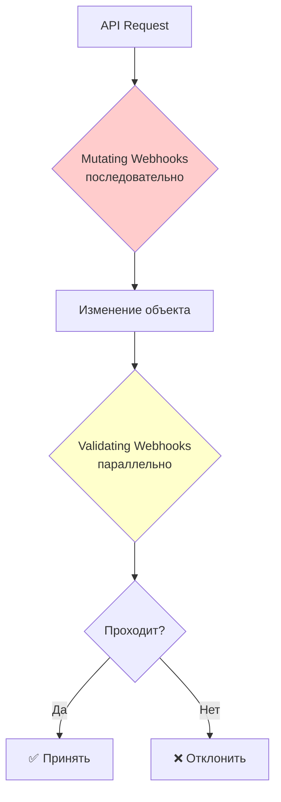

Принято. Переработал материал по Admission Webhook Good Practices в формат «золотой середины». Сохраняй как **`40_k8s_admission_webhooks.md`**.

# Admission Webhook Good Practices — лучшие практики веб-хуков допуска

> 📌 Admission webhooks — мощный механизм расширения K8s API, но **плохо спроектированные веб-хуки = кластер ломается**. Ключевые правила: 
> 1) **Низкая задержка** — объединяй хуки, маленький timeout, 
> 2) **Идемпотентность** — хук можно вызвать многократно без побочных эффектов, 
> 3) **Failure policy** — mutating хуки должны "fail open" (Ignore), 
> 4) **Самоизоляция** — хук не должен проверять свои собственные поды, 
> 5) **Фильтрация** — исключай kube-system, kube-node-lease, системные объекты. **Альтернатива**: CEL-based AdmissionPolicy (v1.26+) — проще, быстрее, без отдельного сервера.

---

## 🔹 Обзор: типы admission control

### 🎯 4 механизма контроля доступа

| Механизм | Тип | Когда использовать | Сложность |
|----------|-----|-------------------|-----------|
| **Mutating Webhook** | Изменение | Сложные изменения, внешние API | 🔴 Высокая |
| **Validating Webhook** | Проверка | Сложные политики, внешние проверки | 🔴 Высокая |
| **Mutating Admission Policy** (CEL) | Изменение | Простые изменения (labels, replicas) | 🟢 Низкая |
| **Validating Admission Policy** (CEL) | Проверка | Простые политики на CEL | 🟢 Низкая |



### 🎯 Рекомендация проекта Kubernetes

> **Используй CEL-based Admission Policy, когда это возможно** — проще, быстрее, нет отдельного сервера.

**Когда webhook необходим**:
- Сложная логика (вызов внешних API, БД)
- Критичные изменения до допуска
- Интеграция с внешними системами

---

## 🔹 Проверка: какие веб-хуки есть в кластере

```bash
# Mutating webhooks
kubectl get mutatingwebhookconfigurations
# NAME                      WEBHOOKS   AGE
# cert-manager-webhook      1          30d
# pod-security-webhook      1          30d

# Validating webhooks
kubectl get validatingwebhookconfigurations
# NAME                      WEBHOOKS   AGE
# gatekeeper-webhook        1          30d
# pod-security-webhook      1          30d

# Детали конкретного webhook
kubectl describe mutatingwebhookconfiguration cert-manager-webhook
```

---

## 🔹 1. Производительность и задержка

### 🎯 Почему это важно

- **Mutating webhooks** вызываются **последовательно** — каждый добавляет задержку
- **Validating webhooks** вызываются **параллельно** — задержка = max(timeout)
- Плохой webhook = **весь кластер тормозит**

### ✅ Best practices для производительности

| Правило | Почему |
|---------|--------|
| **Объединяй webhook'и** | Один сервер с несколькими правилами < много серверов |
| **Минимум API calls** | Каждый вызов API = задержка |
| **Узкий scope** | Фильтруй запросы — не вызывай webhook зря |
| **Маленький timeout** | По умолчанию 10s — слишком много. Ставь 1-5s |
| **Load balancer** | Несколько реплик webhook сервера за Service |
| **Fail open для mutating** | `failurePolicy: Ignore` — кластер не встанет |

### 📝 Пример: оптимизированная конфигурация

```yaml
apiVersion: admissionregistration.k8s.io/v1
kind: MutatingWebhookConfiguration
metadata:
  name: my-webhook
webhooks:
- name: my-webhook.example.com
  # Узкий scope
  rules:
  - apiGroups: ["apps"]
    apiVersions: ["v1"]
    operations: ["CREATE", "UPDATE"]
    resources: ["deployments"]
  
  # Фильтрация по namespace
  namespaceSelector:
    matchExpressions:
    - key: kubernetes.io/metadata.name
      operator: NotIn
      values: ["kube-system", "kube-node-lease"]
  
  # Дополнительная фильтрация по labels
  objectSelector:
    matchExpressions:
    - key: env
      operator: In
      values: ["prod", "staging"]
  
  # Match conditions (CEL) — тонкая фильтрация
  matchConditions:
  - name: exclude-system
    expression: "!object.metadata.name.startsWith('system-')"
  
  # Маленький timeout
  timeoutSeconds: 2
  
  # Fail open для mutating
  failurePolicy: Ignore
  
  # Side effects
  sideEffects: None
  
  # CA bundle для TLS
  clientConfig:
    service:
      namespace: webhook-system
      name: my-webhook-service
      path: /mutate
    caBundle: <base64-encoded-ca>
  
  # Match all API versions
  matchPolicy: Equivalent
  
  # Порядок вызова (если несколько webhook)
  reinvocationPolicy: IfNeeded
```

---

## 🔹 2. Фильтрация запросов

### 🎯 Что НЕЛЬЗЯ трогать

| Объект | Почему |
|--------|--------|
| **kube-system namespace** | Системные компоненты — сломаешь кластер |
| **kube-node-lease** | Node leases — обновление нод сломается |
| **TokenReview** | Только для чтения, аутентификация |
| **SubjectAccessReview** | Только для чтения, авторизация |
| **Mirror pods** | Статические поды — аннотация `kubernetes.io/config.mirror` |

### 📝 Пример: правильная фильтрация

```yaml
webhooks:
- name: my-webhook.example.com
  # Исключаем системные namespaces
  namespaceSelector:
    matchExpressions:
    - key: kubernetes.io/metadata.name
      operator: NotIn
      values:
      - kube-system
      - kube-node-lease
      - kube-public
      - webhook-system    # ← свой namespace тоже!
  
  # Исключаем системные объекты
  objectSelector:
    matchExpressions:
    - key: kubernetes.io/config.mirror
      operator: DoesNotExist    # ← не трогать mirror pods
    - key: app
      operator: NotIn
      values: ["my-webhook"]    # ← не трогать себя
```

### 🎯 Match conditions (CEL) — тонкая фильтрация

```yaml
matchConditions:
# Только для Deployments с > 1 репликой
- name: multi-replica
  expression: "object.spec.replicas > 1"

# Только для namespace с лейблом env=prod
- name: prod-only
  expression: "namespaceObject.metadata.labels['env'] == 'prod'"

# Исключить объекты с аннотацией skip-webhook
- name: no-skip
  expression: "!('skip-webhook' in object.metadata.annotations)"
```

---

## 🔹 3. Мутации: best practices

### ✅ Делай

| Правило | Пример |
|---------|--------|
| **Меняй только нужные поля** | Не перезаписывай весь объект |
| **Не перезаписывай массивы** | Используй `add`, а не `replace` |
| **Избегай побочных эффектов** | `sideEffects: None` или `NoneOnDryRun` |
| **Идемпотентность** | Повторный вызов = тот же результат |
| **Проверяй конечное состояние** | Validating webhook после mutating |
| **Не трогай неизменяемые поля** | Mirror pods, status fields |

### ❌ Не делай

```yaml
# ❌ ПЛОХО: перезапись массива
# Было: env: [{name: "A", value: "1"}]
# Стало: env: [{name: "B", value: "2"}]  # ← потеряли A!

# ✅ ХОРОШО: добавление в массив
# Было: env: [{name: "A", value: "1"}]
# Стало: env: [{name: "A", value: "1"}, {name: "B", value: "2"}]

# ❌ ПЛОХО: неидемпотентная мутация
# Добавляем sidecar с уникальным именем
containers:
- name: sidecar-{{timestamp}}  # ← каждый раз новое имя!

# ✅ ХОРОШО: идемпотентная мутация
# Добавляем sidecar, только если его нет
if not exists(container.name == "my-sidecar"):
  add container "my-sidecar"
```

### 🎯 Примеры идемпотентных мутаций

```python
# ✅ Идемпотентно: установить значение, только если не задано
if not pod.spec.securityContext.runAsNonRoot:
    pod.spec.securityContext.runAsNonRoot = True

# ✅ Идемпотентно: установить default limits, только если не заданы
for container in pod.spec.containers:
    if not container.resources.limits:
        container.resources.limits = {"cpu": "500m", "memory": "512Mi"}

# ✅ Идемпотентно: добавить sidecar, только если его нет
if not any(c.name == "foo-sidecar" for c in pod.spec.containers):
    pod.spec.containers.append(sidecar_container)
```

### 🎯 Примеры НЕидемпотентных мутаций

```python
# ❌ Неидемпотентно: sidecar с уникальным именем
pod.spec.containers.append({
    "name": f"foo-sidecar-{timestamp}",  # ← каждый раз новое имя!
    ...
})

# ❌ Неидемпотентно: conditional mutation
if "env" not in pod.metadata.labels:
    pod.metadata.labels["env"] = "prod"
# ← второй вызов увидит "env" и не сделает ничего, но первый уже изменил

# ❌ Неидемпотентно: добавление без проверки
pod.spec.containers.append(sidecar_container)
# ← если вызвать дважды — будет 2 sidecar'а
```

---

## 🔹 4. Избегай циклов и deadlock'ов

### 🎯 Проблема 1: Webhook проверяет свои собственные поды

```
1. Webhook pod падает
2. Deployment пытается создать новый pod
3. Webhook (старые поды) проверяет новый pod
4. Webhook отклоняет pod (нет лейбла env: prod)
5. Deployment не может создать pod
6. Webhook не может восстановиться
7. DEADLOCK!
```

**Решение**: исключить свой namespace

```yaml
namespaceSelector:
  matchExpressions:
  - key: kubernetes.io/metadata.name
    operator: NotIn
    values: ["webhook-system"]    # ← свой namespace
```

### 🎯 Проблема 2: Два webhook проверяют друг друга

```
Webhook A проверяет поды Webhook B
Webhook B проверяет поды Webhook A

Если оба упадут → никто не восстановится
```

**Решение**: webhook'и не должны проверять друг друга

### 🎯 Проблема 3: Конфликт с другими контроллерами

```
1. Webhook добавляет label "managed-by: webhook"
2. Другой контроллер удаляет этот label
3. Webhook видит отсутствие label → добавляет снова
4. ЦИКЛ!
```

**Решение**: используй audit logs для детекции циклов

```yaml
# Audit policy для детекции циклов
apiVersion: audit.k8s.io/v1
kind: Policy
rules:
- level: RequestResponse
  verbs: ["patch"]
  omitStages: ["RequestReceived"]
  resources:
  - group: ""
    resources: ["pods"]
```

---

## 🔹 5. Failure policy: fail open vs fail closed

### 🎯 Два подхода

| Policy | Поведение | Когда использовать |
|--------|-----------|-------------------|
| **`Fail`** (по умолчанию для validating) | Отклонить запрос, если webhook недоступен | Критичные проверки безопасности |
| **`Ignore`** (рекомендуется для mutating) | Принять запрос, если webhook недоступен | Мутации, не критичные для безопасности |

### 📝 Рекомендуемая стратегия

```yaml
# Mutating webhook — fail open
apiVersion: admissionregistration.k8s.io/v1
kind: MutatingWebhookConfiguration
metadata:
  name: my-mutating-webhook
webhooks:
- name: mutate.example.com
  failurePolicy: Ignore    # ← если webhook down — принять запрос
  ...

# Validating webhook — fail closed (для критичных проверок)
apiVersion: admissionregistration.k8s.io/v1
kind: ValidatingWebhookConfiguration
metadata:
  name: my-validating-webhook
webhooks:
- name: validate.example.com
  failurePolicy: Fail      # ← если webhook down — отклонить запрос
  ...
```

### 🎯 Преимущества "fail open" для mutating

1. **Webhook down** → мутации не применяются, но запросы проходят
2. **Validating webhook** проверяет конечное состояние
3. **Кластер не ломается** при падении webhook

---

## 🔹 6. Side effects

### 🎯 Что такое side effects

**Side effect** — действие webhook'а, которое **не отражено** в AdmissionReview response.

**Примеры**:
- Создание Event объекта
- Запись в БД
- Вызов внешнего API
- Отправка уведомления

### ⚙️ Настройка side effects

```yaml
webhooks:
- name: my-webhook.example.com
  # Нет side effects
  sideEffects: None
  
  # Или: side effects только при dryRun=false
  sideEffects: NoneOnDryRun
```

### 🎯 Dry run

```bash
# Dry run — проверить, что будет, но не применять
kubectl apply -f pod.yaml --dry-run=server

# Webhook получит AdmissionReview с dryRun=true
# Если sideEffects: NoneOnDryRun — side effects не выполняются
```

---

## 🔹 7. Тестирование webhook'ов

### 🚀 Пошаговое тестирование

```bash
# 1. Тестировать в staging кластере
# Используй minikube или kind для локального тестирования
minikube start
kubectl apply -f webhook.yaml

# 2. Проверить, что webhook работает
kubectl get pods -n webhook-system
kubectl logs -n webhook-system deployment/my-webhook

# 3. Тестировать с dry run
kubectl apply -f test-pod.yaml --dry-run=server -o yaml
# Посмотреть, как webhook изменил объект

# 4. Проверить audit logs
kubectl get events -n webhook-system --sort-by='.lastTimestamp'

# 5. Тестировать failure scenarios
kubectl scale -n webhook-system deployment/my-webhook --replicas=0
kubectl apply -f test-pod.yaml
# Должно работать (failurePolicy: Ignore)

# 6. Тестировать производительность
# Создать 100 подов одновременно
for i in {1..100}; do kubectl apply -f test-pod-$i.yaml & done
# Проверить latency в логах webhook

# 7. Тестировать upgrade
# Обновить K8s версию в staging
# Проверить, что webhook продолжает работать
```

### 🔍 Проверка идемпотентности

```bash
# Применить объект дважды
kubectl apply -f test-pod.yaml
kubectl apply -f test-pod.yaml

# Проверить, что объект не изменился
kubectl get pod test-pod -o yaml > first.yaml
kubectl apply -f test-pod.yaml
kubectl get pod test-pod -o yaml > second.yaml
diff first.yaml second.yaml
# Должно быть пусто (или только resourceVersion)
```

---

## 🔹 8. Развертывание webhook'ов

### 🚀 Пошаговое развертывание

```bash
# 1. Развернуть webhook сервер
kubectl apply -f webhook-deployment.yaml
kubectl apply -f webhook-service.yaml

# 2. Создать webhook конфигурацию с failurePolicy: Ignore
kubectl apply -f - <<EOF
apiVersion: admissionregistration.k8s.io/v1
kind: MutatingWebhookConfiguration
metadata:
  name: my-webhook
webhooks:
- name: my-webhook.example.com
  failurePolicy: Ignore          # ← fail open
  namespaceSelector:
    matchExpressions:
    - key: kubernetes.io/metadata.name
      operator: In
      values: ["test-namespace"]  # ← только test namespace
  ...
EOF

# 3. Тестировать в test namespace
kubectl apply -n test-namespace -f test-pod.yaml
kubectl logs -n webhook-system deployment/my-webhook

# 4. Расширить scope постепенно
# Добавить ещё namespaces
kubectl patch mutatingwebhookconfiguration my-webhook --type='json' -p='[
  {"op": "replace", "path": "/webhooks/0/namespaceSelector/matchExpressions/0/values", "value": ["test-namespace", "staging"]}
]'

# 5. Мониторить ошибки
kubectl get events -A --field-selector reason=FailedAdmission
kubectl logs -n webhook-system deployment/my-webhook | grep error

# 6. Переключить на production scope
kubectl patch mutatingwebhookconfiguration my-webhook --type='json' -p='[
  {"op": "replace", "path": "/webhooks/0/namespaceSelector/matchExpressions/0/values", "value": ["prod", "staging"]}
]'

# 7. (Опционально) Переключить failurePolicy на Fail
# Только если webhook стабилен и критичен
kubectl patch mutatingwebhookconfiguration my-webhook --type='json' -p='[
  {"op": "replace", "path": "/webhooks/0/failurePolicy", "value": "Fail"}
]'
```

### 🔐 RBAC для webhook конфигураций

```yaml
# Ограничить доступ к редактированию webhook конфигураций
apiVersion: rbac.authorization.k8s.io/v1
kind: ClusterRole
metadata:
  name: webhook-admin
rules:
- apiGroups: ["admissionregistration.k8s.io"]
  resources: ["mutatingwebhookconfigurations", "validatingwebhookconfigurations"]
  verbs: ["get", "list", "watch"]    # ← только чтение для обычных пользователей
---
apiVersion: rbac.authorization.k8s.io/v1
kind: ClusterRoleBinding
metadata:
  name: webhook-admin
roleRef:
  apiGroup: rbac.authorization.k8s.io
  kind: ClusterRole
  name: webhook-admin
subjects:
- kind: Group
  name: webhook-admins    # ← только админы могут менять
  apiGroup: rbac.authorization.k8s.io
```

---

## 🔹 9. Troubleshooting

### 🔍 Проблема 1: Webhook не вызывается

```bash
# 1. Проверить, что webhook конфигурация существует
kubectl get mutatingwebhookconfigurations
kubectl get validatingwebhookconfigurations

# 2. Проверить правила (rules)
kubectl describe mutatingwebhookconfiguration my-webhook | grep -A20 'Rules'

# 3. Проверить namespace/object selector
kubectl describe mutatingwebhookconfiguration my-webhook | grep -A10 'Selector'

# 4. Проверить, что webhook сервер доступен
kubectl get endpoints -n webhook-system my-webhook-service
# Должны быть IP addresses

# 5. Проверить логи webhook сервера
kubectl logs -n webhook-system deployment/my-webhook

# 6. Проверить TLS сертификат
kubectl get secret -n webhook-system webhook-tls
# Должен быть валидный сертификат
```

### 🔍 Проблема 2: Webhook отклоняет все запросы

```bash
# 1. Проверить логи webhook сервера
kubectl logs -n webhook-system deployment/my-webhook | grep reject

# 2. Проверить events
kubectl get events -A --field-selector reason=FailedAdmission --sort-by='.lastTimestamp'

# 3. Проверить, что webhook не в цикле
kubectl get events -n webhook-system | grep -i loop

# 4. Временно отключить webhook
kubectl patch mutatingwebhookconfiguration my-webhook --type='json' -p='[
  {"op": "replace", "path": "/webhooks/0/failurePolicy", "value": "Ignore"}
]'

# 5. Проверить, что запросы проходят
kubectl apply -f test-pod.yaml
```

### 🔍 Проблема 3: Кластер тормозит из-за webhook

```bash
# 1. Проверить latency webhook
kubectl logs -n webhook-system deployment/my-webhook | grep duration

# 2. Проверить timeout
kubectl describe mutatingwebhookconfiguration my-webhook | grep timeout

# 3. Уменьшить timeout
kubectl patch mutatingwebhookconfiguration my-webhook --type='json' -p='[
  {"op": "replace", "path": "/webhooks/0/timeoutSeconds", "value": 2}
]'

# 4. Проверить количество вызовов
kubectl logs -n webhook-system deployment/my-webhook | wc -l

# 5. Узить scope (добавить фильтрацию)
kubectl patch mutatingwebhookconfiguration my-webhook --type='json' -p='[
  {"op": "add", "path": "/webhooks/0/matchConditions", "value": [
    {"name": "exclude-system", "expression": "!object.metadata.name.startsWith('system-')"}
  ]}
]'

# 6. Масштабировать webhook сервер
kubectl scale -n webhook-system deployment/my-webhook --replicas=3
```

### 🔍 Проблема 4: Webhook ломается после upgrade K8s

```bash
# 1. Проверить changelog K8s
# https://kubernetes.io/docs/setup/release/notes/

# 2. Проверить deprecated API
kubectl get mutatingwebhookconfiguration my-webhook -o yaml | grep apiVersion

# 3. Тестировать в staging перед production upgrade
# Обновить K8s в staging, проверить webhook

# 4. Использовать matchPolicy: Equivalent
# Это гарантирует, что webhook вызывается для всех версий API
kubectl patch mutatingwebhookconfiguration my-webhook --type='json' -p='[
  {"op": "replace", "path": "/webhooks/0/matchPolicy", "value": "Equivalent"}
]'
```

---

## 🔹 10. Альтернативы: CEL-based Admission Policy

> **v1.26+ (beta), v1.30+ (stable)**. Встроенный механизм валидации без отдельного сервера.

### 🎯 Преимущества

| Преимущество | Описание |
|--------------|----------|
| **Нет отдельного сервера** | Не нужно деплоить, масштабировать, мониторить |
| **Низкая задержка** | Выполняется в apiserver |
| **Проще** | CEL выражения вместо кода |
| **Безопаснее** | Нет риска сломать кластер |

### 📝 Пример: ValidatingAdmissionPolicy

```yaml
apiVersion: admissionregistration.k8s.io/v1
kind: ValidatingAdmissionPolicy
metadata:
  name: require-labels
spec:
  failurePolicy: Fail
  paramKind:
    apiVersion: v1
    kind: ConfigMap
  matchConstraints:
    resourceRules:
    - apiGroups: ["apps"]
      apiVersions: ["v1"]
      operations: ["CREATE", "UPDATE"]
      resources: ["deployments"]
  validations:
  - expression: "has(object.metadata.labels) && 'app' in object.metadata.labels"
    message: "Deployment must have label 'app'"
  - expression: "object.spec.replicas >= 2"
    message: "Deployment must have at least 2 replicas"
---
apiVersion: admissionregistration.k8s.io/v1
kind: ValidatingAdmissionPolicyBinding
metadata:
  name: require-labels-binding
spec:
  policyName: require-labels
  validationActions: [Deny]
  matchResources:
    namespaceSelector:
      matchExpressions:
      - key: env
        operator: In
        values: ["prod"]
```

### 🎯 Когда использовать CEL vs Webhook

| Сценарий | Рекомендация |
|----------|--------------|
| Простая валидация (labels, replicas) | ✅ CEL |
| Сложная логика (внешние API) | ✅ Webhook |
| Мутации (добавление sidecar) | ✅ Webhook (MutatingAdmissionPolicy в v1.32+) |
| Интеграция с OPA/Gatekeeper | ✅ Webhook |
| Высокая производительность | ✅ CEL |

---

## 🔹 Best Practices

### ✅ Делай

1. **Используй CEL-based Admission Policy**, когда возможно — проще, быстрее.
2. **Fail open для mutating webhook'ов** — `failurePolicy: Ignore`.
3. **Fail closed для validating webhook'ов** — `failurePolicy: Fail` (для критичных проверок).
4. **Исключай системные namespaces** — kube-system, kube-node-lease, kube-public.
5. **Исключай свой namespace** — webhook не должен проверять свои поды.
6. **Маленький timeout** — 2-5 секунд, не 10.
7. **Идемпотентность** — повторный вызов = тот же результат.
8. **Side effects: None** — избегай побочных эффектов.
9. **Load balancer** — несколько реплик webhook сервера.
10. **Тестируй в staging** — перед production.
11. **Мониторь latency** — алерты на высокий timeout.
12. **Ограничивай RBAC** — только админы могут менять webhook конфигурации.
13. **Используй matchConditions** — тонкая фильтрация запросов.
14. **Проверяй конечное состояние** — validating webhook после mutating.
15. **Документируй** — какие webhook'и есть, что делают, кто владелец.

### ❌ Не делай

```
# ❌ НЕ трогай kube-system
# Сломаешь control plane

# ❌ НЕ проверяй свои собственные поды
# Deadlock при падении webhook

# ❌ НЕ используй failurePolicy: Fail для mutating
# Кластер встанет при падении webhook

# ❌ НЕ делай webhook неидемпотентным
# Повторный вызов сломает объект

# ❌ НЕ игнорируй timeout
# 10 секунд — слишком много, кластер тормозит

# ❌ НЕ добавляй side effects без необходимости
# Усложняет отладку, может сломать dry run

# ❌ НЕ перезаписывай массивы
# Потеряешь данные

# ❌ НЕ полагайся на порядок вызова webhook'ов
# Порядок не гарантирован

# ❌ НЕ создавай циклы зависимостей
# Webhook A проверяет B, B проверяет A → deadlock

# ❌ НЕ разворачивай webhook без gradual rollout
# Сначала test namespace, потом prod
```

---

## 🔹 Чек-лист: развертывание admission webhook

```
# ✅ 1. Выбрать механизм
#    - Простая валидация → CEL-based AdmissionPolicy
#    - Сложная логика → Webhook
#    - Мутации → Mutating Webhook

# ✅ 2. Спроектировать webhook
#    - Идемпотентность
#    - Нет side effects (или NoneOnDryRun)
#    - Низкая задержка (< 100ms)
#    - Fail open для mutating

# ✅ 3. Настроить фильтрацию
#    - Исключить kube-system, kube-node-lease
#    - Исключить свой namespace
#    - Использовать objectSelector и matchConditions
#    - matchPolicy: Equivalent

# ✅ 4. Настроить TLS
#    - Валидный сертификат
#    - CA bundle в webhook конфигурации
#    - Автоматическая ротация (cert-manager)

# ✅ 5. Развернуть в staging
#    - Webhook сервер (Deployment + Service)
#    - Webhook конфигурация (failurePolicy: Ignore)
#    - Namespace selector: только test namespace

# ✅ 6. Тестировать
#    - Dry run: kubectl apply --dry-run=server
#    - Идемпотентность: применить дважды
#    - Failure scenarios: масштабировать webhook до 0
#    - Производительность: 100 подов одновременно

# ✅ 7. Мониторить
#    - Latency webhook
#    - Количество вызовов
#    - Ошибки в логах
#    - Алерты на высокий timeout

# ✅ 8. Gradual rollout
#    - Добавить staging namespace
#    - Добавить prod namespace
#    - (Опционально) Переключить failurePolicy на Fail

# ✅ 9. Настроить RBAC
#    - Только админы могут менять webhook конфигурации
#    - Ограничить доступ к namespace webhook сервера

# ✅ 10. Документировать
#    - Какие webhook'и есть в кластере
#    - Что делают
#    - Кто владелец
#    - Runbook для troubleshooting
```

> 💡 **Совет для конспекта**:
> 1. Создай файл `00_webhook_cheatsheet.md` с шпаргалкой по конфигурации.
> 2. Добавь блок «Частые ошибки»: «webhook проверяет свои поды", "неидемпотентная мутация", "timeout 10s".
> 3. Веди список "Какие webhook'и у нас в кластере": имя, тип, namespace scope, failurePolicy, владелец.

---

## 🔹 Ключевые выводы

1. **Admission webhooks** — мощный механизм, но **плохо спроектированные = кластер ломается**.
2. **4 механизма**: Mutating Webhook, Validating Webhook, Mutating Admission Policy (CEL), Validating Admission Policy (CEL).
3. **Рекомендация K8s**: используй CEL-based Admission Policy, когда возможно.
4. **Mutating webhooks** вызываются **последовательно** — каждый добавляет задержку.
5. **Validating webhooks** вызываются **параллельно** — задержка = max(timeout).
6. **Failure policy**: `Ignore` для mutating (fail open), `Fail` для validating (fail closed).
7. **Идемпотентность** — повторный вызов webhook = тот же результат.
8. **Side effects**: `None` или `NoneOnDryRun` — избегай побочных эффектов.
9. **Фильтрация**: исключай kube-system, kube-node-lease, свой namespace, mirror pods.
10. **Match conditions** (CEL) — тонкая фильтрация запросов.
11. **Timeout**: 2-5 секунд, не 10.
12. **Самоизоляция**: webhook не должен проверять свои собственные поды.
13. **Циклы зависимостей**: webhook A проверяет B, B проверяет A → deadlock.
14. **Gradual rollout**: сначала test namespace, потом staging, потом prod.
15. **RBAC**: только админы могут менять webhook конфигурации.
16. **Тестирование**: dry run, идемпотентность, failure scenarios, производительность.
17. **Мониторинг**: latency, количество вызовов, ошибки, алерты.
18. **Troubleshooting**: проверяй правила, селекторы, TLS, логи, events.
19. **CEL vs Webhook**: CEL проще и быстрее, Webhook для сложной логики.
20. **Best practices**: fail open, идемпотентность, узкий scope, маленький timeout, gradual rollout