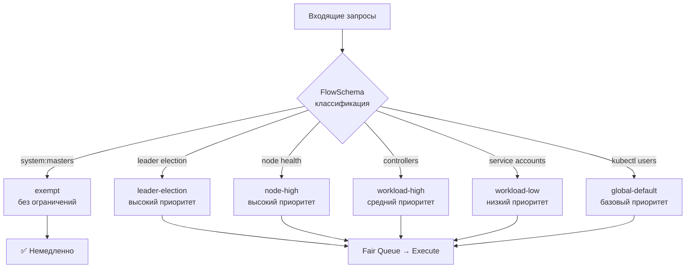
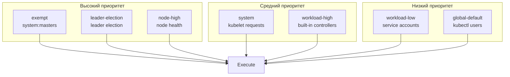

# API Priority and Fairness (APF) — защита API-сервера от перегрузки

> 📌 APF (stable с v1.29, включено по умолчанию) — механизм защиты kube-apiserver от перегрузки. Заменяет старые флаги `--max-requests-inflight` / `--max-mutating-requests-inflight`. 
> **Ключевые идеи**: 
> (1) **PriorityLevelConfiguration** — уровни приоритета с квотами "seats", 
> (2) **FlowSchema** — правила классификации запросов, 
> (3) **Fair queuing** — справедливое распределение внутри уровня, 
> (4) **Borrowing** — уровни могут "одалживать" seats друг у друга. 
> **Цель**: критичные запросы (leader election, node health) не голодают из-за шумных клиентов.

---

## 🔹 Зачем нужен APF

### 🎯 Проблема без APF

```
kube-apiserver имеет ограниченный бюджет параллельных запросов:
- --max-requests-inflight (read-only)
- --max-mutating-requests-inflight (write)

Проблема: все запросы равны!
- Шумный под делает 1000 LIST events/сек
- Leader election контроллера не получает ответы
- Контроллер перезапускается → ещё больше трафика
- Кластер деградирует
```

### 🎯 Решение: APF

```
APF добавляет:
1. Классификацию запросов по приоритетам (FlowSchema)
2. Отдельные квоты для каждого приоритета (PriorityLevelConfiguration)
3. Fair queuing внутри приоритета (один клиент не голодает других)
4. Borrowing — уровни могут одалживать seats друг у друга
5. Очереди для сглаживания burst'ов
```



---

## 🔹 Ключевые концепции

### 🎯 PriorityLevelConfiguration — уровень приоритета

> Определяет **квоту seats** (параллельных запросов) и **параметры очереди**.

```yaml
apiVersion: flowcontrol.apiserver.k8s.io/v1
kind: PriorityLevelConfiguration
metadata:
  name: workload-high
spec:
  type: Limited                    # Limited (с очередью) или Exempt (без ограничений)
  limited:
    nominalConcurrencyShares: 40   # ← доля от общего бюджета (пропорционально)
    lendablePercent: 50            # ← сколько можно "одолжить" другим уровням (%)
    limitResponse:
      type: Queue                  # Queue (в очередь) или Reject (отклонить с 429)
      queuing:
        queues: 64                 # ← количество очередей (больше = лучше изоляция)
        handSize: 6                # ← размер "ладони" для shuffle sharding
        queueLengthLimit: 50       # ← макс длина одной очереди
```


**Ключевые поля**:

| Поле                            | Описание                                                      |
| ------------------------------- | ------------------------------------------------------------- |
| **`type`**                      | `Limited` (с очередью) или `Exempt` (без ограничений)         |
| **`nominalConcurrencyShares`**  | Доля от общего бюджета seats (пропорционально другим уровням) |
| **`lendablePercent`**           | Сколько seats можно одолжить другим уровням (0-100%)          |
| **`borrowingLimitPercent`**     | Сколько можно занять у других (не указано = без лимита)       |
| **`limitResponse.type`**        | `Queue` (в очередь) или `Reject` (429 Too Many Requests)      |
| **`queuing.queues`**            | Количество очередей (больше = лучше изоляция потоков)         |
| **`queuing.handSize`**          | Размер "ладони" для shuffle sharding                          |
| a**`queuing.queueLengthLimit`** | Макс длина одной очереди                                      |

### 🎯 FlowSchema — правило классификации

> Сопоставляет входящие запросы с PriorityLevelConfiguration.

```yaml
apiVersion: flowcontrol.apiserver.k8s.io/v1
kind: FlowSchema
metadata:
  name: workload-high
spec:
  priorityLevelConfiguration:
    name: workload-high              # ← ссылка на PriorityLevelConfiguration
  matchingPrecedence: 8000           # ← приоритет правила (меньше = раньше проверяется)
  distinguisherMethod:
    type: ByUser                     # ByUser, ByNamespace, или нет (один поток)
  rules:
  - subjects:
    - kind: ServiceAccount
      serviceAccount:
        name: "*"                    # ← все service accounts
        namespace: "*"
    resourceRules:
    - apiGroups: ["*"]
      resources: ["*"]
      verbs: ["get", "list", "watch"]
      namespaces: ["*"]
    nonResourceRules: []             # ← для URL типа /healthz, /metrics
```

**Ключевые поля**:
| Поле | Описание |
|------|----------|
| **`priorityLevelConfiguration.name`** | На какой уровень приоритета направлять |
| **`matchingPrecedence`** | Приоритет правила (меньше = раньше проверяется, 1-10000) |
| **`distinguisherMethod.type`** | Как разделять на потоки: `ByUser`, `ByNamespace`, или нет |
| **`rules[].subjects`** | Кто: `User`, `Group`, `ServiceAccount` |
| **`rules[].resourceRules`** | Какие ресурсы: apiGroups, resources, verbs, namespaces |
| **`rules[].nonResourceRules`** | Какие URL: nonResourceURLs, verbs |

### 🎯 Seats — единица параллелизма

> Запрос занимает **1 или более seats** в зависимости от "веса".

| Тип запроса | Seats | Почему |
|-------------|-------|--------|
| **GET, POST, PUT, PATCH, DELETE** | 1 seat | Обычный запрос |
| **LIST** (большой результат) | N seats (пропорционально объектам) | Тяжёлый для сервера |
| **WATCH** | 1 seat (после начальной синхронизации) | Долгоживущий, но лёгкий |
| **LIST (streaming, v1.27+)** | N seats (как LIST) | Тяжёлый начальный burst |

> 💡 **Оптимизация**: используй **WATCH** вместо **LIST** для мониторинга — WATCH занимает 1 seat после начальной синхронизации.

### 🎯 Fair Queuing — справедливая очередь

> Внутри одного PriorityLevel запросы распределяются **справедливо** между потоками.

**Алгоритм**:
1. Запрос классифицируется в FlowSchema
2. Определяется "поток" (flow) по `distinguisherMethod`:
   - `ByUser` → каждый пользователь = отдельный поток
   - `ByNamespace` → каждый namespace = отдельный поток
   - Нет → все запросы в одном потоке
3. Запрос попадает в одну из очередей (shuffle sharding)
4. Очереди обслуживаются **fairly** — ни один поток не голодает

**Shuffle sharding**:
- `queues: 64` — 64 очереди
- `handSize: 6` — каждый поток "выбирает" 6 случайных очередей
- Вероятность, что 2 потока попадут в одну очередь — низкая
- Больше `handSize` → меньше коллизий, но больше задержка

---

## 🔹 Встроенные уровни приоритета

### 🎯 Обязательные (exempt)

| Уровень | Назначение | Seats |
|---------|------------|-------|
| **`exempt`** | Запросы от `system:masters` | ∞ (без ограничений) |
| **`catch-all`** | Всё, что не попало в другие правила | Очень мало (не полагайся на него) |

### 🎯 Рекомендуемые (по умолчанию)

| Уровень | Назначение | Примеры |
|---------|------------|---------|
| **`leader-election`** | Leader election контроллеров | Endpoints, ConfigMaps, Leases от `system:kube-controller-manager`, `system:kube-scheduler` |
| **`node-high`** | Health checks от kubelet | `/healthz`, `/readyz` от `system:nodes` |
| **`system`** | Запросы от `system:nodes` (не health) | Kubelet → API server |
| **`workload-high`** | Встроенные контроллеры | ReplicaSet, Deployment контроллеры |
| **`workload-low`** | Service accounts из подов | Все SA в `kube-system` и других namespaces |
| **`global-default`** | Всё остальное | `kubectl` от обычных пользователей |



---

## 🔹 Borrowing — заимствование seats

> Уровни могут **одалживать** seats друг у друга для эффективного использования.

### 🎯 Как работает

```
PriorityLevel "workload-high":
- nominalConcurrencyShares: 40
- lendablePercent: 50          ← может одолжить 50% своих seats
- borrowingLimitPercent: 100   ← может занять до 100% от номинала

Если workload-high не использует все seats:
- Другие уровни могут занять свободные seats
- Когда workload-high нужен трафик → seats возвращаются
```

### ⚙️ Настройка borrowing

```yaml
apiVersion: flowcontrol.apiserver.k8s.io/v1
kind: PriorityLevelConfiguration
metadata:
  name: workload-high
spec:
  type: Limited
  limited:
    nominalConcurrencyShares: 40
    lendablePercent: 50            # ← можно одолжить 50%
    borrowingLimitPercent: 100     # ← можно занять до 100%
```

**Поля**:
| Поле | Описание |
|------|----------|
| **`lendablePercent`** | Сколько seats можно одолжить другим (0-100%, по умолчанию 0) |
| **`borrowingLimitPercent`** | Сколько можно занять у других (не указано = без лимита) |

---

## 🔹 Рекурсивные сценарии

> ⚠️ **Опасно**: webhook'и и aggregated API servers могут создавать **рекурсивные вызовы**.

### 🎯 Пример: Webhook → API Server → Webhook

```
1. Пользователь создаёт Pod
2. kube-apiserver вызывает Mutating Webhook (сервер B)
3. Сервер B делает запрос обратно в kube-apiserver (например, GET ConfigMap)
4. kube-apiserver классифицирует запрос от сервера B
5. Если запрос от сервера B имеет ВЫСШИЙ приоритет → инверсия приоритетов!
6. DEADLOCK или starvation
```

### 🎯 Решения

| Решение | Когда использовать |
|---------|-------------------|
| **Исключить webhook из APF** | Сервер B не kube-apiserver |
| **Низкий приоритет для дочерних запросов** | Дочерние запросы классифицируются ниже |
| **Отключить APF на сервере B** | Сервер B — не kube-apiserver |
| **FlowSchema с exempt** | Для критичных webhook'ов |

### 📝 Пример: исключить webhook из APF

```yaml
apiVersion: flowcontrol.apiserver.k8s.io/v1
kind: FlowSchema
metadata:
  name: webhook-exempt
spec:
  priorityLevelConfiguration:
    name: exempt                    # ← exempt уровень (без ограничений)
  matchingPrecedence: 100
  rules:
  - subjects:
    - kind: ServiceAccount
      serviceAccount:
        name: webhook-server
        namespace: webhook-system
    resourceRules:
    - apiGroups: ["*"]
      resources: ["*"]
      verbs: ["get", "list"]
```

---

## 🔹 Метрики APF

### 🎯 Критичные метрики (Beta, стабильные)

| Метрика | Тип | Что измеряет |
|---------|-----|--------------|
| **`apiserver_flowcontrol_rejected_requests_total`** | Counter | Отклонённые запросы (labels: flow_schema, priority_level, reason) |
| **`apiserver_flowcontrol_dispatched_requests_total`** | Counter | Отправленные на выполнение запросы |
| **`apiserver_flowcontrol_current_inqueue_requests`** | Gauge | Запросы в очереди прямо сейчас |
| **`apiserver_flowcontrol_current_executing_requests`** | Gauge | Запросы, выполняющиеся прямо сейчас |
| **`apiserver_flowcontrol_current_executing_seats`** | Gauge | Seats, занятые прямо сейчас |
| **`apiserver_flowcontrol_request_wait_duration_seconds`** | Histogram | Время ожидания в очереди |
| **`apiserver_flowcontrol_nominal_limit_seats`** | Gauge | Номинальный лимит seats для каждого уровня |

### 🎯 Расширенные метрики (Alpha)

| Метрика | Тип | Что измеряет |
|---------|-----|--------------|
| `apiserver_flowcontrol_request_queue_length_after_enqueue` | Histogram | Длина очереди после добавления запроса |
| `apiserver_flowcontrol_priority_level_seat_utilization` | Histogram | Утилизация seats по уровням |
| `apiserver_flowcontrol_demand_seats` | Histogram | Спрос на seats |
| `apiserver_flowcontrol_current_limit_seats` | Gauge | Динамический лимит seats (с учётом borrowing) |
| `apiserver_flowcontrol_request_execution_seconds` | Histogram | Время выполнения запроса |

### 🎯 Reasons для rejected requests

| Reason | Описание |
|--------|----------|
| **`queue-full`** | Очередь переполнена |
| **`concurrency-limit`** | PriorityLevel настроен на `Reject` (не `Queue`) |
| **`time-out`** | Запрос слишком долго ждал в очереди |
| **`cancelled`** | Клиент отменил запрос |

### 📝 Примеры PromQL

```promql
# Отклонённые запросы за последние 5 минут
sum(rate(apiserver_flowcontrol_rejected_requests_total[5m])) by (priority_level, reason)

# Запросы в очереди прямо сейчас
sum(apiserver_flowcontrol_current_inqueue_requests) by (priority_level)

# Среднее время ожидания в очереди
histogram_quantile(0.99, 
  sum(rate(apiserver_flowcontrol_request_wait_duration_seconds_bucket[5m])) by (le, priority_level)
)

# Утилизация seats (>80% = проблема)
apiserver_flowcontrol_current_executing_seats / apiserver_flowcontrol_nominal_limit_seats

# Длина очереди (выбросы = один поток перегружает)
histogram_quantile(0.99, 
  sum(rate(apiserver_flowcontrol_request_queue_length_after_enqueue_bucket[5m])) by (le, flow_schema)
)
```

---

## 🔹 Практика: диагностика проблем

### 🔍 Проблема 1: Запросы отклоняются с 429

```bash
# 1. Проверить метрики отклонений
kubectl get --raw /metrics | grep apiserver_flowcontrol_rejected_requests_total
# Или через Prometheus:
# sum(rate(apiserver_flowcontrol_rejected_requests_total[5m])) by (priority_level, reason)

# 2. Найти, какой priority level отклоняет
kubectl get --raw /metrics | grep apiserver_flowcontrol_rejected_requests_total | grep -v '"0"'

# 3. Проверить, заполнены ли очереди
kubectl get --raw /metrics | grep apiserver_flowcontrol_current_inqueue_requests
# apiserver_flowcontrol_current_inqueue_requests{priority_level="workload-low"} 150

# 4. Проверить, сколько seats занято
kubectl get --raw /metrics | grep apiserver_flowcontrol_current_executing_seats
# apiserver_flowcontrol_current_executing_seats{priority_level="workload-low"} 40

# 5. Проверить номинальный лимит
kubectl get --raw /metrics | grep apiserver_flowcontrol_nominal_limit_seats
# apiserver_flowcontrol_nominal_limit_seats{priority_level="workload-low"} 40

# 6. Если seats = limit → увеличить nominalConcurrencyShares
kubectl get prioritylevelconfiguration workload-low -o yaml
# Увеличить nominalConcurrencyShares
```

### 🔍 Проблема 2: Высокая задержка в очереди

```bash
# 1. Проверить время ожидания
kubectl get --raw /metrics | grep apiserver_flowcontrol_request_wait_duration_seconds
# Или через Prometheus:
# histogram_quantile(0.99, rate(apiserver_flowcontrol_request_wait_duration_seconds_bucket[5m]))

# 2. Найти, какой flow_schema вызывает задержку
kubectl get --raw /metrics | grep apiserver_flowcontrol_request_wait_duration_seconds_bucket | grep -v 'le="0"'

# 3. Проверить, кто делает много запросов
kubectl get --raw /metrics | grep apiserver_flowcontrol_request_dispatched_requests_total | sort -k2 -nr | head -10

# 4. Создать FlowSchema для изоляции шумного клиента
kubectl apply -f - <<EOF
apiVersion: flowcontrol.apiserver.k8s.io/v1
kind: FlowSchema
metadata:
  name: isolate-noisy-client
spec:
  priorityLevelConfiguration:
    name: catch-all              # ← низкий приоритет
  matchingPrecedence: 9000
  distinguisherMethod:
    type: ByUser
  rules:
  - subjects:
    - kind: ServiceAccount
      serviceAccount:
        name: noisy-client
        namespace: default
    resourceRules:
    - apiGroups: ["*"]
      resources: ["events"]
      verbs: ["list"]
EOF
```

### 🔍 Проблема 3: Leader election fails

```bash
# 1. Проверить, что leader-election уровень имеет достаточно seats
kubectl get --raw /metrics | grep apiserver_flowcontrol_current_executing_seats | grep leader-election

# 2. Проверить, не отклоняются ли запросы leader election
kubectl get --raw /metrics | grep apiserver_flowcontrol_rejected_requests_total | grep leader-election

# 3. Если отклоняются → увеличить nominalConcurrencyShares для leader-election
kubectl get prioritylevelconfiguration leader-election -o yaml
# Увеличить nominalConcurrencyShares

# 4. Проверить, что FlowSchema правильно классифицирует leader election
kubectl get flowschema -o yaml | grep -A20 'name: leader-election'
```

---

## 🔹 Настройка APF

### 🚀 Увеличить seats для критичного уровня

```bash
# 1. Отключить auto-update для рекомендуемого объекта
kubectl annotate prioritylevelconfiguration workload-high \
  apf.kubernetes.io/autoupdate-spec=false

# 2. Увеличить nominalConcurrencyShares
kubectl patch prioritylevelconfiguration workload-high --type='merge' -p='
{
  "spec": {
    "limited": {
      "nominalConcurrencyShares": 80
    }
  }
}'

# 3. Проверить
kubectl get prioritylevelconfiguration workload-high -o yaml | grep nominalConcurrencyShares
```

### 🚀 Изолировать шумный клиент

```bash
# 1. Создать FlowSchema для шумного клиента
kubectl apply -f - <<EOF
apiVersion: flowcontrol.apiserver.k8s.io/v1
kind: FlowSchema
metadata:
  name: isolate-noisy-client
spec:
  priorityLevelConfiguration:
    name: catch-all              # ← низкий приоритет
  matchingPrecedence: 9000       # ← ниже, чем у workload-low (10000)
  distinguisherMethod:
    type: ByUser                 # ← разделять по пользователям
  rules:
  - subjects:
    - kind: ServiceAccount
      serviceAccount:
        name: noisy-client
        namespace: default
    resourceRules:
    - apiGroups: [""]
      resources: ["events"]
      verbs: ["list", "watch"]
EOF

# 2. Проверить, что FlowSchema применяется
kubectl get flowschema isolate-noisy-client -o yaml
```

### 🚀 Включить borrowing

```bash
# 1. Разрешить уровню одалживать seats
kubectl patch prioritylevelconfiguration workload-high --type='merge' -p='
{
  "spec": {
    "limited": {
      "lendablePercent": 50,
      "borrowingLimitPercent": 100
    }
  }
}'

# 2. Проверить
kubectl get prioritylevelconfiguration workload-high -o yaml | grep -A5 lendablePercent
```

### 🚓 Увеличить общий бюджет seats

```bash
# Увеличить --max-requests-inflight и --max-mutating-requests-inflight
# В манифесте kube-apiserver (static pod):
# /etc/kubernetes/manifests/kube-apiserver.yaml

spec:
  containers:
  - command:
    - kube-apiserver
    - --max-requests-inflight=800          # ← было 400
    - --max-mutating-requests-inflight=400 # ← было 200
```

> 💡 **APF суммирует** эти два флага и распределяет между уровнями приоритета.

---

## 🔹 Health checks для неаутентифицированных запросов

> По умолчанию health checks (`/healthz`, `/livez`, `/readyz`) от неаутентифицированных пользователей попадают в `global-default` — могут быть отклонены при перегрузке.

### 📝 Решение: exempt для health checks

```yaml
apiVersion: flowcontrol.apiserver.k8s.io/v1
kind: FlowSchema
metadata:
  name: health-for-strangers
spec:
  matchingPrecedence: 1000
  priorityLevelConfiguration:
    name: exempt                    # ← exempt уровень (без ограничений)
  rules:
  - nonResourceRules:
    - nonResourceURLs:
      - "/healthz"
      - "/livez"
      - "/readyz"
      verbs: ["*"]
    subjects:
    - kind: Group
      group:
        name: "system:unauthenticated"
```

> ⚠️ **Безопасность**: это позволяет любому делать health checks без аутентификации. Если API server доступен из интернета — настрой firewall.

---

## 🔹 Troubleshooting

### 🔍 APF отключён

```bash
# Проверить, включён ли APF
kubectl get --raw /metrics | grep apiserver_flowcontrol
# Если пусто → APF отключён

# Проверить флаг kube-apiserver
kubectl get pod kube-apiserver-master-1 -n kube-system -o yaml | grep enable-priority-and-fairness
# Должно быть: --enable-priority-and-fairness=true (или отсутствовать, т.к. по умолчанию true)
```

### 🔍 FlowSchema не применяется

```bash
# 1. Проверить matchingPrecedence
kubectl get flowschema -o custom-columns="NAME:.metadata.name,PRECEDENCE:.spec.matchingPrecedence" | sort -k2 -n
# Меньшее значение проверяется первым!

# 2. Проверить, что правила совпадают
kubectl describe flowschema my-schema
# Смотрим: Subjects, ResourceRules, NonResourceRules

# 3. Проверить, что priorityLevelConfiguration существует
kubectl get prioritylevelconfiguration <name>
```

### 🔍 PriorityLevelConfiguration не обновляется

```bash
# Проверить аннотацию autoupdate-spec
kubectl get prioritylevelconfiguration workload-high -o yaml | grep autoupdate-spec
# apf.kubernetes.io/autoupdate-spec: "true"  ← сервер управляет
# apf.kubernetes.io/autoupdate-spec: "false" ← пользователь управляет

# Если "true" → сервер перезапишет изменения
# Решение: установить аннотацию в "false"
kubectl annotate prioritylevelconfiguration workload-high \
  apf.kubernetes.io/autoupdate-spec=false
```

---

## 🔹 Best Practices

### ✅ Делай

1. **Мониторь метрики APF** — алерты на `rejected_requests_total`, `request_wait_duration_seconds`.
2. **Используй WATCH вместо LIST** — WATCH занимает 1 seat после начальной синхронизации.
3. **Ограничивай LIST запросы** — используй pagination (`limit=` параметр).
4. **Изолируй шумных клиентов** — создавай FlowSchema с низким приоритетом.
5. **Включай borrowing** — для эффективного использования seats.
6. **Настрой health checks в exempt** — чтобы не отклонялись при перегрузке.
7. **Тестируй в staging** — перед изменением APF в production.
8. **Документируй FlowSchema** — что классифицирует, какой приоритет, почему.
9. **Используй distinguisherMethod** — `ByUser` или `ByNamespace` для fair queuing.
10. **Увеличивай `--max-requests-inflight`** — если seats не хватает.

### ❌ Не делай

```bash
# ❌ НЕ отключай APF
# Потеряешь защиту от перегрузки

# ❌ НЕ полагайся на catch-all
# У него очень мало seats, запросы будут отклоняться

# ❌ НЕ ставь одинаковый matchingPrecedence
# Будет непредсказуемое поведение

# ❌ НЕ игнорируй метрики rejected_requests_total
# Это сигнал, что кластер перегружен

# ❌ НЕ делай LIST без pagination
# LIST может занять много seats

# ❌ НЕ забывай про distinguisherMethod
# Без него все запросы в одном потоке → starvation

# ❌ НЕ изменяй рекомендуемые объекты без autoupdate-spec=false
# Сервер перезапишет изменения

# ❌ НЕ создавай рекурсивные webhook'и без exempt
# Deadlock или starvation
```

---

## 🔹 Чек-лист: настройка APF

```bash
# ✅ 1. Проверить, что APF включён
kubectl get --raw /metrics | grep apiserver_flowcontrol
# Должны быть метрики

# ✅ 2. Настроить мониторинг
#    - Алерт на rejected_requests_total > 0
#    - Алерт на request_wait_duration_seconds p99 > 1s
#    - Алерт на current_inqueue_requests > 100
#    - Dashboard с утилизацией seats

# ✅ 3. Проверить встроенные FlowSchema
kubectl get flowschema
# Должны быть: exempt, catch-all, leader-election, node-high, system, workload-high, workload-low, global-default

# ✅ 4. Проверить PriorityLevelConfiguration
kubectl get prioritylevelconfiguration
# Должны быть те же имена

# ✅ 5. Настроить health checks в exempt (опционально)
kubectl apply -f health-for-strangers.yaml

# ✅ 6. Изолировать шумных клиентов
kubectl apply -f isolate-noisy-client.yaml

# ✅ 7. Включить borrowing (опционально)
kubectl patch prioritylevelconfiguration workload-high --type='merge' -p='{"spec":{"limited":{"lendablePercent":50}}}'

# ✅ 8. Увеличить общий бюджет seats (если нужно)
# Отредактировать /etc/kubernetes/manifests/kube-apiserver.yaml
# --max-requests-inflight=800
# --max-mutating-requests-inflight=400

# ✅ 9. Тестировать в staging
#    - Создать нагрузку
#    - Проверить метрики
#    - Проверить, что критичные запросы не отклоняются

# ✅ 10. Документировать
#    - Какие FlowSchema есть
#    - Какие PriorityLevelConfiguration
#    - Кто владелец
#    - Runbook для troubleshooting
```

> 💡 **Совет для конспекта**:
> 1. Создай файл `00_apf_cheatsheet.md` с шпаргалкой по метрикам и командам.
> 2. Добавь блок «Частые ошибки»: «APF отключён", "matchingPrecedence конфликт", "не настроил distinguisherMethod".
> 3. Веди список "Какие FlowSchema у нас в кластере": имя, priority level, matchingPrecedence, что классифицирует.

---

## 🔹 Ключевые выводы

1. **APF** (stable с v1.29) — механизм защиты kube-apiserver от перегрузки, включён по умолчанию.
2. **Заменяет** старые флаги `--max-requests-inflight` / `--max-mutating-requests-inflight`.
3. **PriorityLevelConfiguration** — уровень приоритета с квотой seats и параметрами очереди.
4. **FlowSchema** — правило классификации запросов (кто, что, куда).
5. **Seats** — единица параллелизма. LIST/WATCH могут занимать >1 seat.
6. **Fair queuing** — внутри уровня запросы распределяются справедливо между потоками.
7. **Borrowing** — уровни могут одалживать seats друг у друга (`lendablePercent`, `borrowingLimitPercent`).
8. **Встроенные уровни**: exempt, catch-all, leader-election, node-high, system, workload-high, workload-low, global-default.
9. **matchingPrecedence** — приоритет правила (меньше = раньше проверяется).
10. **distinguisherMethod** — как разделять на потоки: `ByUser`, `ByNamespace`, или нет.
11. **Рекурсивные сценарии** (webhook'и, aggregated API) — опасность deadlock/starvation.
12. **Метрики**: `rejected_requests_total`, `current_inqueue_requests`, `request_wait_duration_seconds`, `nominal_limit_seats`.
13. **Reasons для rejected**: `queue-full`, `concurrency-limit`, `time-out`, `cancelled`.
14. **Health checks** — по умолчанию в `global-default`, можно перенести в `exempt`.
15. **autoupdate-spec** — аннотация для контроля над рекомендуемыми объектами.
16. **Best practices**: WATCH вместо LIST, pagination, изоляция шумных клиентов, borrowing, мониторинг метрик.
17. **Troubleshooting**: проверяй метрики, matchingPrecedence, priorityLevelConfiguration, autoupdate-spec.