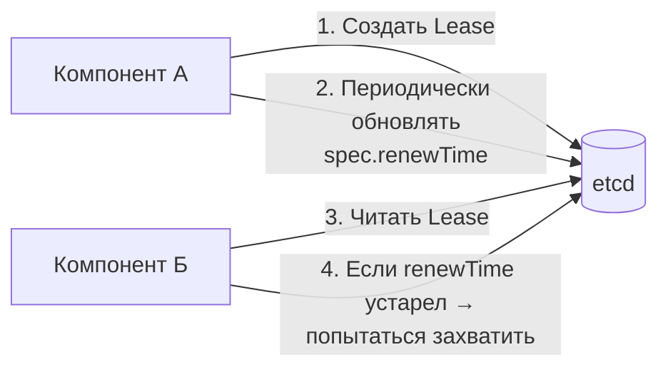

>Аренда (Lease) — это механизм координации в распределённых системах, который в Kubernetes реализован через объекты `Lease` в группе `coordination.k8s.io`. Критически важно для отказоустойчивости и выбора лидера.

Переработал в формате «золотой середины». Сохраняй как **`17_k8s_lease.md`**.
# Аренда (Lease) в Kubernetes — Координация и выбор лидера

> 📌 **TL;DR**: **Lease** = легковесный объект для координации в распределённых системах. В K8s используется для: (1) сердечных ритмов нод (вместо тяжёлых обновлений `.status`), (2) выбора лидера в HA-кластерах, (3) идентификации экземпляров `kube-apiserver`. Работает по принципу «обновил метку времени → владеешь ресурсом».

---

## 🔹 Что такое Lease

| Аспект | Описание |
|--------|----------|
| **Группа API** | `coordination.k8s.io/v1` |
| **Тип ресурса** | `Lease` |
| **Назначение** | Механизм «мягкой блокировки» для координации между компонентами |
| **Ключевое поле** | `spec.renewTime` — метка времени последнего обновления |
| **Принцип работы** | Владелец периодически обновляет `renewTime`; если перестал → аренда истекает → другой может захватить |



> 💡 **Аналогия**: как «аренда велосипеда в прокате». Пока ты каждые 15 минут подтверждаешь, что ещё пользуешься — велосипед твой. Перестал подтверждать → его может взять другой.

---

## 🔹 Сценарий 1: Сердцебиение узлов (Node Heartbeats)

### 🔄 Проблема старых подходов
```
Раньше: kubelet обновлял весь .status узла каждые 10 секунд
• Большой объём данных (адреса, образы, условия, ресурсы)
• Высокая нагрузка на etcd при масштабировании
• Частые конфликты записи (multiple writers)
```

### ✅ Решение через Lease
```
Сейчас: для каждого узла создаётся легковесный Lease-объект

Расположение:
• Неймспейс: kube-node-lease
• Имя: совпадает с именем узла (например, node-1)

Структура:
apiVersion: coordination.k8s.io/v1
kind: Lease
metadata:
  name: node-1
  namespace: kube-node-lease
spec:
  holderIdentity: "node-1"           # Кто владеет
  leaseDurationSeconds: 40           # TTL аренды
  renewTime: "2024-06-05T12:00:00Z"  # ← Обновляется kubelet'ом каждые ~10с
```

### 🎯 Как это работает
```
1. При регистрации узла: создаётся Lease-объект
2. kubelet каждые ~10 секунд:
   • Обновляет spec.renewTime в своём Lease
   • Это дёшево: одно поле, маленький объект
3. Node Controller каждые ~40 секунд:
   • Проверяет: renewTime < now - leaseDuration?
   • Если да → узел считается недоступным → помечает условия, эвиктит поды
```

### 🔍 Проверка и отладка
```bash
# Посмотреть Lease всех нод
kubectl get lease -n kube-node-lease

# Детали по конкретной ноде
kubectl describe lease node-1 -n kube-node-lease

# Найти ноды с устаревшими сердечными ритмами
kubectl get lease -n kube-node-lease -o json | jq '
  .items[] | 
  select(.spec.renewTime < (now - 40) | tostring) | 
  .metadata.name'

# Сравнить: когда обновлялся статус узла vs его Lease
kubectl get node node-1 -o jsonpath='{.status.conditions[?(@.type=="Ready")].lastHeartbeatTime}'
kubectl get lease node-1 -n kube-node-lease -o jsonpath='{.spec.renewTime}'
```

> 💡 **Преимущества**:
> - Снижение нагрузки на etcd на ~90% для больших кластеров
> - Меньше конфликтов записи
> - Более быстрое обнаружение сбоев нод

---

## 🔹 Сценарий 2: Выбор лидера (Leader Election)

### 🎯 Зачем нужно
В высокодоступных (HA) кластерах несколько экземпляров компонентов (`kube-controller-manager`, `kube-scheduler`) работают параллельно, но **активным должен быть только один**.

### 🔄 Алгоритм выбора лидера
```
1. Все экземпляры компонента пытаются создать/обновить один и тот же Lease:
   • Неймспейс: kube-system (или кастомный)
   • Имя: <component-name>-leader (например, kube-scheduler-leader)

2. Захват аренды:
   • Если Lease не существует или истёк → записываю свой идентификатор в .spec.holderIdentity
   • Обновляю renewTime каждые ~10 секунд

3. Удержание лидерства:
   • Пока успеваю обновлять renewTime до истечения leaseDuration → я лидер
   • Выполняю «лидерскую» логику (обработка очередей, принятие решений)

4. Потеря лидерства:
   • Если не успел обновить → другой экземпляр захватывает аренду
   • Я перехожу в режим «наблюдателя» (только мониторю, не действую)
```

### 📋 Пример конфигурации (упрощённо)
```yaml
# Флаги компонента для HA:
--leader-elect=true
--leader-elect-lease-duration=15s      # TTL аренды
--leader-elect-renew-deadline=10s      # Обновлять не реже, чем за 10с до истечения
--leader-elect-resource-name=kube-scheduler
--leader-elect-resource-namespace=kube-system
```

### 🔍 Проверка текущего лидера
```bash
# Кто сейчас лидер у kube-scheduler?
kubectl get lease kube-scheduler -n kube-system -o jsonpath='{.spec.holderIdentity}'

# Детальная информация
kubectl describe lease kube-scheduler -n kube-system

# История смены лидеров (через события)
kubectl get events -n kube-system --field-selector involvedObject.name=kube-scheduler | grep -i leader

# Мониторинг в реальном времени
watch -n 5 'kubectl get lease kube-scheduler -n kube-system -o jsonpath="{.spec.holderIdentity} {.spec.renewTime}{"\n"}'
```

### ⚡ Оптимизация: ControllerManagerReleaseLeaderElectionLockOnExit
> 🧩 **Статус**: alpha с K8s 1.36 (по умолчанию отключено)

```
Проблема: при завершении работы лидера
• Старый лидер просто перестаёт обновлять Lease
• Новый лидер ждёт истечения leaseDuration (например, 15с)
• 15 секунд простоя в обработке задач!

Решение: фича-гейт ControllerManagerReleaseLeaderElectionLockOnExit
• При корректном завершении: лидер явно «освобождает» аренду
• Новый лидер может захватить сразу, не дожидаясь TTL
• Сокращает время переключения с ~15с до ~1с
```

```bash
# Включить фичу (в манифесте kube-controller-manager):
--feature-gates=ControllerManagerReleaseLeaderElectionLockOnExit=true

# Проверить, включена ли фича:
kubectl get pods -n kube-system -l component=kube-controller-manager -o jsonpath='{.items[0].spec.containers[0].command}' | grep -o 'ControllerManagerReleaseLeaderElectionLockOnExit'
```

---

## 🔹 Сценарий 3: Идентификация API Server

> 🧩 **Статус**: beta с K8s 1.26 (по умолчанию включено)

### 🎯 Зачем нужно
В HA-кластере несколько экземпляров `kube-apiserver` обрабатывают запросы. Полезно знать:
- Сколько экземпляров активно?
- Какие именно (для отладки, балансировки, аудита)?

### 🔄 Как работает
```
Каждый kube-apiserver при старте:
1. Генерирует уникальный идентификатор на основе:
   • Хоста ОС (kubernetes.io/hostname)
   • UUID экземпляра
2. Создаёт/обновляет Lease в kube-system:
   • Имя: apiserver-<sha256-hostname>
   • Метка: apiserver.kubernetes.io/identity=kube-apiserver
3. Периодически обновляет renewTime

Новые экземпляры:
• Видят существующие Lease'ы
• Удаляют «мёртвые» (старше 1 часа) для очистки
```

### 🔍 Проверка экземпляров API Server
```bash
# Список всех активных экземпляров
kubectl get lease -n kube-system -l apiserver.kubernetes.io/identity=kube-apiserver

# Детали по конкретному экземпляру
kubectl get lease -n kube-system apiserver-abc123 -o yaml

# Извлечь читаемую информацию
kubectl get lease -n kube-system -l apiserver.kubernetes.io/identity=kube-apiserver \
  -o jsonpath='{range .items[*]}{.metadata.name}{"\t"}{.metadata.labels.kubernetes\.io/hostname}{"\t"}{.spec.holderIdentity}{"\n"}{end}'

# Пример вывода:
# apiserver-07a5ea9b9b072c4a5f3d1c3702    master-1    apiserver-07a5ea9b9b072c4a5f3d1c3702_0c8914f7-...
# apiserver-7be9e061c59d368b3ddaf1376e    master-2    apiserver-7be9e061c59d368b3ddaf1376e_84f2a85d-...
```

### ⚙️ Управление фичей
```bash
# Отключить публикацию идентичности (если нужно):
--feature-gates=APIServerIdentity=false

# Проверить, включена ли фича в кластере:
kubectl get --raw /apis/coordination.k8s.io/v1/namespaces/kube-system/leases?labelSelector=apiserver.kubernetes.io/identity=kube-apiserver | jq '.items | length'
```

> 💡 **Будущее использование**: эта механика открывает возможности для:
> - Координации между экземплярами API Server (например, распределённый кэш)
> - Более умной балансировки запросов
> - Аудита: какой экземпляр обработал конкретный запрос

---

## 🔹 Сценарий 4: Пользовательские контроллеры и координация

Ты можешь использовать Lease для собственных задач координации.

### 🎯 Пример: кастомный контроллер с выбором лидера

```yaml
# lease.yaml — объект аренды для твоего контроллера
apiVersion: coordination.k8s.io/v1
kind: Lease
metadata:
  name: my-backup-controller-leader  # ← Уникальное, понятное имя
  namespace: my-operators
  labels:
    app.kubernetes.io/name: my-backup-controller
spec:
  leaseDurationSeconds: 15
  # holderIdentity и renewTime заполняются контроллером динамически
```

### 🧩 Паттерн использования в коде (псевдокод)

```go
// Инициализация
leaseName := "my-backup-controller-leader"
myIdentity := generateUniqueID() // hostname + UUID

for {
    // Попытка захватить или удержать лидерство
    acquired := tryAcquireLease(leaseName, myIdentity, leaseDuration=15s)
    
    if acquired {
        // Я лидер → выполняю «тяжёлую» логику
        runBackupJobs()
        
        // Периодически обновляю аренду (в отдельной горутине)
        go renewLeasePeriodically(leaseName, myIdentity, interval=5s)
    } else {
        // Я не лидер → только мониторю, не действую
        log.Info("Waiting for leadership")
        sleep(2s)
    }
}
```

### ✅ Best Practices для пользовательских Lease

| Правило | Почему важно | Пример |
|---------|-------------|--------|
| **🏷️ Уникальные имена** | Избегай конфликтов между разными компонентами | `myapp-backup-leader`, а не просто `leader` |
| **📦 Префиксы для мультитенант** | Если оператор может быть развёрнут несколько раз | `myapp-{instance-id}-leader` |
| **⏱️ Адекватный leaseDuration** | Баланс между быстрым переключением и стабильностью | 10-30 секунд для большинства задач |
| **🔄 Обрабатывай потерю лидерства** | Контроллер должен корректно переходить в режим «наблюдателя» | Остановить фоновые задачи, освободить соединения |
| **📊 Логируй смену лидера** | Для отладки и аудита | `log.Info("Lost leadership", "reason", "lease expired")` |

### 🔍 Отладка пользовательских Lease

```bash
# Посмотреть все Lease в неймспейсе
kubectl get lease -n my-operators

# Проверить, кто владеет конкретным ресурсом
kubectl get lease my-backup-controller-leader -n my-operators \
  -o jsonpath='{.spec.holderIdentity}{"\n"}{.spec.renewTime}'

# Найти «осиротевшие» Lease (обновление старше TTL)
kubectl get lease -n my-operators -o json | jq '
  .items[] | 
  select(.spec.renewTime < (now - .spec.leaseDurationSeconds) | tostring) | 
  {name: .metadata.name, lastRenew: .spec.renewTime}'

# Мониторить смену лидера в реальном времени
kubectl get lease my-backup-controller-leader -n my-operators -w \
  -o jsonpath='{.spec.holderIdentity}{" at "}{.spec.renewTime}{"\n"}'
```

---

## 🔹 Сравнение сценариев использования Lease

| Сценарий | Неймспейс | Имя шаблона | Кто обновляет | Частота | leaseDuration |
|----------|-----------|-------------|--------------|---------|--------------|
| **❤️ Node heartbeat** | `kube-node-lease` | `<node-name>` | `kubelet` | ~10 сек | 40 сек |
| **👑 Leader election** | `kube-system` | `<component>-leader` | Контроллер (активный экземпляр) | ~10 сек | 15 сек |
| **🆔 API Server identity** | `kube-system` | `apiserver-<sha256-host>` | `kube-apiserver` | ~1 час | 1 час |
| **🔧 Пользовательский контроллер** | Кастомный | `<app>-<role>-leader` | Твой контроллер | 5-10 сек | 10-30 сек |

> 💡 **Общее правило**: `renew interval` ≈ `leaseDuration / 3` — даёт запас на задержки сети и перезапуски.

---

## 🔹 Чек-лист: работа с Lease

### ✅ При использовании встроенных механизмов
```bash
# • Не редактируй вручную Lease в kube-node-lease или kube-system
#   → это может сломать обнаружение сбоев или выбор лидера

# • Проверяй, что ноды регулярно обновляют свои Lease
kubectl get lease -n kube-node-lease --sort-by='.spec.renewTime' | tail -10

# • При отладке проблем с лидерством: смотри события и время последнего обновления
kubectl describe lease kube-scheduler -n kube-system | grep -E 'Holder|Renew|Events'

# • Убедись, что часы на нодах синхронизированы (NTP)
#   → Lease чувствительны к рассинхронизации времени
```

### ✅ При написании своего контроллера с координацией
```bash
# • Используй клиентские библиотеки с встроенной поддержкой leader election
#   Go: client-go/tools/leaderelection
#   Python: kopf, pykube с кастомной логикой

# • Генерируй уникальный holderIdentity: hostname + UUID
#   → чтобы избежать конфликтов при перезапуске на той же ноде

# • Обрабатывай ошибки сети с повторными попытками (exponential backoff)
#   → временные сбои не должны приводить к частой смене лидера

# • Логируй ключевые события: захват, удержание, потеря лидерства
#   → упростит отладку в production

# • Тестируй сценарии:
#   • Запуск нескольких экземпляров одновременно
#   • Принудительное завершение лидера (kill -9)
#   • Сетевое разделение (partition) между экземплярами
```

### ✅ При отладке проблем
```bash
# 1. Проверить, существует ли Lease и кто владелец
kubectl get lease <name> -n <namespace> -o jsonpath='{.spec.holderIdentity}'

# 2. Убедиться, что renewTime обновляется
watch -n 5 'kubectl get lease <name> -n <namespace> -o jsonpath="{.spec.renewTime}{"\n"}'

# 3. Проверить права доступа к координации
kubectl auth can-i update leases --as=system:serviceaccount:my-ns:my-controller

# 4. Посмотреть логи компонента на предмет ошибок обновления аренды
kubectl logs -n kube-system -l component=kube-scheduler | grep -i "lease\|leader"

# 5. Проверить рассинхронизацию времени между нодами
# (частая причина «мерцающего» лидерства)
kubectl debug node/<node> -it --image=alpine -- chroot /host date
```

### ❌ Чего избегать
```bash
# ❌ Не используй слишком короткий leaseDuration (<5 сек)
#   → повышенная нагрузка на etcd, риск ложных переключений

# ❌ Не обновляй Lease синхронно с основной логикой
#   → выноси обновление в отдельную горутину/поток

# ❌ Не полагайся на мгновенное распространение изменений в etcd
#   → добавляй небольшой буфер при проверке «я ещё лидер?»

# ❌ Не создавай Lease без меток и понятных имён
#   → усложнит отладку и мониторинг в будущем

# ❌ Не игнорируй потерю лидерства
#   → контроллер должен корректно останавливать «лидерские» задачи
```

---

## 🔹 Ключевые выводы

1. **Lease = легковесная координация**: маленькое поле `renewTime` вместо тяжёлых обновлений всего объекта.
2. **Три основных сценария в K8s**: heartbeats нод, выбор лидера, идентификация API Server.
3. **Принцип «обновил → владеешь»**: простой, но эффективный механизм для распределённых систем.
4. **Настройка таймингов критична**: баланс между быстрым переключением и стабильностью.
5. **Для своих контроллеров**: используй уникальные имена, логируй смену лидера, тестируй сценарии сбоев.
6. **Мониторь аренду**: просроченные Lease — первый признак проблем с компонентом или сетью.