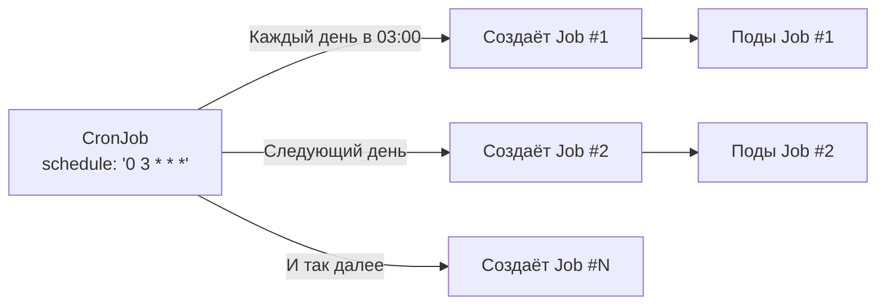

# CronJob — Задачи по расписанию в Kubernetes

> 📌 **TL;DR**: `CronJob` создаёт `Job` по расписанию (как crontab в Unix). **Стабильно с v1.21**. Используется для бэкапов, отчётов, очистки, синхронизации. Один CronJob = одна строка в crontab.

---

## 🔹 Что такое CronJob

| Аспект | Описание |
|--------|----------|
| **Назначение** | Запуск `Job` по повторяющемуся расписанию |
| **Типичные задачи** | Бэкапы БД, генерация отчётов, очистка логов, синхронизация данных, рассылки |
| **Связь с Job** | CronJob — это «обёртка» над Job, которая создаёт Job по расписанию |
| **Формат расписания** | Cron-синтаксис: 5 полей (минута, час, день, месяц, день недели) |
| **Часовые пояса** | Поддержка `timeZone` (стабильно с v1.27) |



---

## 🔹 Минимальный пример

```yaml
apiVersion: batch/v1
kind: CronJob
metadata:
  name: hello
spec:
  schedule: "* * * * *"              # ← каждую минуту
  jobTemplate:                       # ← шаблон Job (как у обычного Job)
    spec:
      template:
        spec:
          containers:
          - name: hello
            image: busybox:1.28
            command:
            - /bin/sh
            - -c
            - date; echo "Hello from Kubernetes"
          restartPolicy: OnFailure
```

```bash
# Создать CronJob
kubectl apply -f cronjob.yaml

# Проверить статус
kubectl get cronjobs
# NAME    SCHEDULE    SUSPEND   ACTIVE   LAST SCHEDULE   AGE
# hello   * * * * *   False     0        45s             1m

# Посмотреть созданные Job
kubectl get jobs --selector=job-name=hello-28894200
# NAME               COMPLETIONS   DURATION   AGE
# hello-28894200     1/1           3s         1m

# Посмотреть логи последнего Job
kubectl logs job/hello-28894200
# Wed Jun  5 12:00:00 UTC 2024
# Hello from Kubernetes
```

---

## 🔹 Синтаксис расписания

### 📋 Формат cron (5 полей)

```
# ┌───────────── минута (0 - 59)
# │ ┌───────────── час (0 - 23)
# │ │ ┌───────────── день месяца (1 - 31)
# │ │ │ ┌───────────── месяц (1 - 12) или jan,feb,mar...
# │ │ │ │ ┌───────────── день недели (0 - 6) или sun,mon,tue...
# │ │ │ │ │
# * * * * *
```

### 📊 Примеры расписаний

| Расписание | Описание | Когда использовать |
|------------|----------|-------------------|
| `* * * * *` | Каждую минуту | Тестирование, отладка |
| `*/5 * * * *` | Каждые 5 минут | Мониторинг, health-check |
| `0 * * * *` | Каждый час (в 00 минут) | Почасовая синхронизация |
| `0 0 * * *` | Каждый день в полночь | Ежедневные бэкапы, отчёты |
| `0 3 * * 1` | Каждый понедельник в 03:00 | Еженедельные задачи |
| `0 0 1 * *` | Первый день каждого месяца в 00:00 | Месячные отчёты, очистка |
| `0 9-17 * * 1-5` | Каждый час с 9 до 17, пн-пт | Рабочие задачи |
| `0 0 1 1 *` | 1 января каждый год | Годовые задачи |

### 🎯 Макросы (удобные сокращения)

| Макрос | Описание | Эквивалент |
|--------|----------|------------|
| `@yearly` / `@annually` | Раз в год (1 января, 00:00) | `0 0 1 1 *` |
| `@monthly` | Раз в месяц (1-е число, 00:00) | `0 0 1 * *` |
| `@weekly` | Раз в неделю (воскресенье, 00:00) | `0 0 * * 0` |
| `@daily` / `@midnight` | Раз в день (00:00) | `0 0 * * *` |
| `@hourly` | Раз в час (в 00 минут) | `0 * * * *` |

### 🧪 Расширенный синтаксис (Vixie cron)

```bash
# Шаг значений: */2 = каждые 2
*/2 * * * *          # Каждые 2 минуты
0 */2 * * *          # Каждые 2 часа

# Диапазон с шагом: 0-23/2 = 0,2,4,...,22
0 0-23/2 * * *       # Каждые 2 часа (альтернатива */2)

# Список значений: 1,3,5
0 1,3,5 * * *        # В 01:00, 03:00, 05:00

# Вопросительный знак: ? = * (любой)
0 0 ? * *            # Эквивалентно 0 0 * * *
```

> 💡 **Инструмент**: для проверки расписания используй [crontab.guru](https://crontab.guru/) — вводишь выражение, получаешь описание на человеческом языке.

---

## 🔹 Ключевые поля спецификации

| Поле | Обязательное | По умолчанию | Описание |
|------|--------------|--------------|----------|
| **`schedule`** | ✅ | — | Cron-расписание (5 полей) |
| **`jobTemplate`** | ✅ | — | Шаблон Job (как у обычного Job) |
| **`timeZone`** | ❌ | Часовой пояс контроллера | Часовой пояс для расписания (v1.27+) |
| **`startingDeadlineSeconds`** | ❌ | ∞ (нет дедлайна) | Макс. задержка запуска после пропусков |
| **`concurrencyPolicy`** | ❌ | `Allow` | Политика параллельного выполнения |
| **`suspend`** | ❌ | `false` | Приостановка расписания |
| **`successfulJobsHistoryLimit`** | ❌ | `3` | Сколько успешных Job хранить |
| **`failedJobsHistoryLimit`** | ❌ | `1` | Сколько проваленных Job хранить |

---

## 🔹 `concurrencyPolicy` — политика параллельности

> Определяет, что делать, если пришло время нового запуска, а предыдущий Job ещё работает.

| Политика | Поведение | Когда использовать |
|----------|-----------|-------------------|
| **`Allow`** (по умолчанию) | Разрешает параллельное выполнение нескольких Job | Независимые задачи, идемпотентные |
| **`Forbid`** | Пропускает новый запуск, если предыдущий ещё работает | Задачи, которые нельзя дублировать (бэкапы) |
| **`Replace`** | Заменяет текущий Job новым (отменяет старый) | Когда важнее свежий запуск, чем завершение старого |

### 📊 Примеры поведения

```
Сценарий: CronJob запускается каждую минуту (*/1 * * * *)
Job выполняется 3 минуты

Время      | Allow          | Forbid         | Replace
-----------|----------------|----------------|----------------
12:00:00   | Job #1 создан  | Job #1 создан  | Job #1 создан
12:01:00   | Job #2 создан  | Пропущен ⏭️    | Job #1 отменён, Job #2 создан
12:02:00   | Job #3 создан  | Пропущен ⏭️    | Job #2 отменён, Job #3 создан
12:03:00   | Job #1 завершён, Job #4 создан | Job #1 завершён, Job #2 создан | Job #3 завершён, Job #4 создан
```

### 📝 Пример с `Forbid`

```yaml
apiVersion: batch/v1
kind: CronJob
metadata:
  name: backup-db
spec:
  schedule: "0 2 * * *"          # ← каждый день в 02:00
  concurrencyPolicy: Forbid      # ← не запускать новый, если старый работает
  jobTemplate:
    spec:
      template:
        spec:
          containers:
          - name: backup
            image: postgres:15
            command: ["pg_dump", "-h", "db-host", "mydb"]
          restartPolicy: OnFailure
```

> ⚠️ **Важно**: `concurrencyPolicy` применяется только к Job, созданным **одним** CronJob. Если у тебя два CronJob с одинаковым расписанием — они могут выполняться параллельно.

---

## 🔹 `startingDeadlineSeconds` — дедлайн запуска

> Максимальное время (в секундах), в течение которого пропущенный запуск ещё может быть выполнен.

### 📊 Как работает

```
Сценарий: CronJob должен запуститься в 12:00:00
Но контроллер был недоступен с 11:55:00 до 12:05:00

startingDeadlineSeconds | Поведение
------------------------|--------------------------------------------------
Не указан               | Пропущенные запуски считаются, но не выполняются
200                     | Если прошло < 200 сек → выполнить, иначе пропустить
10                      | Если прошло < 10 сек → выполнить (часто слишком мало)
```

### 📝 Пример

```yaml
apiVersion: batch/v1
kind: CronJob
metadata:
  name: daily-report
spec:
  schedule: "0 8 * * *"              # ← каждый день в 08:00
  startingDeadlineSeconds: 14400     # ← 4 часа (14400 секунд)
  concurrencyPolicy: Forbid
  jobTemplate:
    spec:
      template:
        spec:
          containers:
          - name: report
            image: my-report:latest
          restartPolicy: OnFailure
```

> 💡 **Когда использовать**:
> - Бэкапы: если бэкап опоздал на 8 часов — он бесполезен, лучше дождаться следующего
> - Синхронизация: если опоздала на 1 час — ещё можно выполнить
> - Мониторинг: если опоздал на 5 минут — лучше пропустить, данные уже устарели

> ⚠️ **Важно**: если `startingDeadlineSeconds < 10`, CronJob может не запуститься, потому что контроллер проверяет расписание каждые 10 секунд.

---

## 🔹 Приостановка расписания (`suspend`)

```yaml
apiVersion: batch/v1
kind: CronJob
metadata:
  name: maintenance-job
spec:
  schedule: "0 3 * * *"
  suspend: true                    # ← приостановить выполнение
  jobTemplate:
    spec:
      template:
        spec:
          containers:
          - name: worker
            image: busybox
            command: ["echo", "Maintenance"]
          restartPolicy: OnFailure
```

```bash
# Приостановить CronJob
kubectl patch cronjob maintenance-job -p '{"spec":{"suspend":true}}'

# Возобновить
kubectl patch cronjob maintenance-job -p '{"spec":{"suspend":false}}'

# Проверить статус
kubectl get cronjob maintenance-job
# NAME              SCHEDULE    SUSPEND   ACTIVE   LAST SCHEDULE   AGE
# maintenance-job   0 3 * * *   True      0        1d              7d
```

**Что происходит**:
- Уже запущенные Job продолжают работать
- Новые Job не создаются
- При возобновлении: если `startingDeadlineSeconds` не указан, все пропущенные запуски выполняются сразу

> ⚠️ **Важно**: если при приостановке были пропущены запуски, и `startingDeadlineSeconds` не указан — при возобновлении CronJob попытается выполнить все пропущенные запуски сразу. Это может создать нагрузку.

---

## 🔹 История задач

### 📋 Поля для контроля истории

| Поле | По умолчанию | Описание |
|------|--------------|----------|
| **`successfulJobsHistoryLimit`** | `3` | Сколько успешных Job хранить |
| **`failedJobsHistoryLimit`** | `1` | Сколько проваленных Job хранить |

### 📝 Пример

```yaml
apiVersion: batch/v1
kind: CronJob
metadata:
  name: cleanup-job
spec:
  schedule: "0 * * * *"
  successfulJobsHistoryLimit: 5    # ← хранить 5 успешных Job
  failedJobsHistoryLimit: 3        # ← хранить 3 проваленных Job
  jobTemplate:
    spec:
      template:
        spec:
          containers:
          - name: cleanup
            image: busybox
            command: ["echo", "Cleanup"]
          restartPolicy: OnFailure
```

### 🎯 Специальные значения

| Значение | Поведение | Когда использовать |
|----------|-----------|-------------------|
| **`0`** | Не хранить Job | Если логи отправляются в централизованное хранилище |
| **`> 0`** | Хранить N Job | Стандартный сценарий |
| **Не указано** | По умолчанию (3/1) | Если не знаешь, что указать |

> 💡 **Совет**: если используешь `ttlSecondsAfterFinished` в Job — CronJob всё равно будет хранить историю (ссылки на Job), но сами Job будут удалены TTL-контроллером.

---

## 🔹 Часовые пояса (`timeZone`)

> **Стабильно с v1.27**. Позволяет указать часовой пояс для расписания.

### 📝 Пример

```yaml
apiVersion: batch/v1
kind: CronJob
metadata:
  name: daily-backup
spec:
  schedule: "0 3 * * *"
  timeZone: "Europe/Moscow"        # ← 03:00 по Москве (00:00 UTC)
  jobTemplate:
    spec:
      template:
        spec:
          containers:
          - name: backup
            image: postgres:15
            command: ["pg_dump", "mydb"]
          restartPolicy: OnFailure
```

### 📊 Популярные часовые пояса

| Часовой пояс | Описание | Смещение от UTC |
|--------------|----------|-----------------|
| `Etc/UTC` | Всемирное координированное время | +0 |
| `Europe/Moscow` | Москва | +3 |
| `Europe/Berlin` | Берлин | +1 / +2 (лето) |
| `America/New_York` | Нью-Йорк | -5 / -4 (лето) |
| `Asia/Tokyo` | Токио | +9 |

### ⚠️ Важные правила

```yaml
# ❌ НЕЛЬЗЯ: указывать часовой пояс в schedule
spec:
  schedule: "CRON_TZ=Europe/Moscow 0 3 * * *"  # ← ошибка валидации!
  schedule: "TZ=UTC 0 3 * * *"                  # ← ошибка валидации!

# ✅ ПРАВИЛЬНО: использовать поле timeZone
spec:
  schedule: "0 3 * * *"
  timeZone: "Europe/Moscow"
```

> 💡 **Если не указан `timeZone`**: CronJob использует часовой пояс `kube-controller-manager`. Это может быть неожиданно, если контроллер работает в другом часовом поясе.

---

## 🔹 Ограничения и подводные камни

### ⚠️ 1. CronJob не гарантирует ровно один запуск

```
Проблема:
- CronJob создаёт Job "примерно" по расписанию
- В некоторых случаях может создать 2 Job или не создать ни одного

Причины:
- Контроллер CronJob перезапустился
- Сетевые задержки
- Высокая нагрузка на API Server

Решение:
- Задачи должны быть идемпотентными (повторный запуск не ломает данные)
- Использовать concurrencyPolicy: Forbid, если нельзя дублировать
```

### ⚠️ 2. Лимит пропущенных запусков (100)

```
Проблема:
- Если пропущено > 100 запусков → CronJob останавливается с ошибкой
- Ошибка: "too many missed start times. Set or decrease .spec.startingDeadlineSeconds or check clock skew"

Пример:
- CronJob запускается каждую минуту
- Контроллер был недоступен с 08:29:00 до 10:21:00 (112 минут)
- Пропущено 112 запусков > 100 → CronJob останавливается

Решение 1: Указать startingDeadlineSeconds
spec:
  startingDeadlineSeconds: 200  # ← считать пропуски только за последние 200 секунд

Решение 2: Исправить рассинхронизацию часов (NTP)
Решение 3: Увеличить интервал между запусками
```

### ⚠️ 3. Изменение CronJob не влияет на запущенные Job

```
Проблема:
- Ты изменил CronJob (например, образ контейнера)
- Уже запущенные Job продолжают работать со старым образом
- Новые Job будут использовать новый образ

Решение:
- Дождаться завершения текущих Job
- Или вручную удалить текущие Job: kubectl delete job <name>
```

### ⚠️ 4. Имя CronJob ограничено 52 символами

```
Проблема:
- CronJob добавляет 11 символов к имени Job (timestamp)
- Job ограничивает имя 63 символами
- Итого: имя CronJob ≤ 52 символа

Пример:
# ✅ OK (10 символов)
name: backup-db

# ❌ ОШИБКА (53 символа)
name: very-long-cronjob-name-that-exceeds-the-limit-of-fifty-two-chars

Решение:
- Использовать короткие имена
- Или использовать generateName в jobTemplate
```

### ⚠️ 5. `startingDeadlineSeconds < 10` может не сработать

```
Проблема:
- Контроллер CronJob проверяет расписание каждые 10 секунд
- Если startingDeadlineSeconds < 10 → запуск может быть пропущен

Пример:
spec:
  schedule: "* * * * *"
  startingDeadlineSeconds: 5  # ← может не сработать!

Решение:
- Указывать startingDeadlineSeconds ≥ 10
- Или не указывать вообще (∞)
```

---

## 🔹 Практика: работа с CronJob

### 🚀 Создание и проверка

```bash
# Создать CronJob
kubectl apply -f cronjob.yaml

# Проверить статус
kubectl get cronjobs
# NAME    SCHEDULE    SUSPEND   ACTIVE   LAST SCHEDULE   AGE
# hello   * * * * *   False     1        30s             2m

# Детальная информация
kubectl describe cronjob hello

# Посмотреть созданные Job
kubectl get jobs --selector=job-name=hello-28894200

# Посмотреть логи последнего Job
kubectl logs job/hello-28894200

# Создать Job вручную (для тестирования)
kubectl create job --from=cronjob/hello hello-manual
```

### 🔍 Отладка

```bash
# Проверить, почему CronJob не запускается
kubectl describe cronjob my-cronjob | grep -A20 'Events:'

# Посмотреть пропущенные запуски
kubectl get cronjob my-cronjob -o yaml | grep -A5 'status:'

# Проверить активные Job
kubectl get jobs --selector=job-name=my-cronjob --field-selector=status.active>0

# Найти CronJob с пропущенными запусками
kubectl get cronjobs -o json | jq -r '.items[] | select(.status.lastScheduleTime == null) | .metadata.name'
```

### 🧪 Тестирование расписания

```bash
# Создать CronJob с расписанием каждую минуту
kubectl apply -f - <<EOF
apiVersion: batch/v1
kind: CronJob
metadata:
  name: test-cronjob
spec:
  schedule: "* * * * *"
  successfulJobsHistoryLimit: 1
  failedJobsHistoryLimit: 1
  jobTemplate:
    spec:
      template:
        spec:
          containers:
          - name: test
            image: busybox
            command: ["echo", "Test run at $(date)"]
          restartPolicy: OnFailure
EOF

# Подождать 2 минуты
sleep 120

# Проверить, что Job создались
kubectl get jobs --selector=job-name=test-cronjob

# Посмотреть логи
kubectl logs job/test-cronjob-28894200

# Очистить тест
kubectl delete cronjob test-cronjob
```

### 🧹 Ручная очистка старых Job

```bash
# Удалить все Job старше 7 дней, созданные CronJob
kubectl get jobs -o json | jq -r '.items[] | select(.metadata.ownerReferences[]?.kind == "CronJob") | select(.status.completionTime != null) | select(.status.completionTime | fromdateiso8601 < (now - 604800)) | .metadata.name' | xargs -r kubectl delete job

# Или через successfulJobsHistoryLimit
kubectl patch cronjob my-cronjob -p '{"spec":{"successfulJobsHistoryLimit":0}}'
```

---

## 🔹 Чек-лист: создание CronJob

```bash
# ✅ 1. Определить расписание (используй crontab.guru для проверки)
# ✅ 2. Выбрать concurrencyPolicy:
#    - Allow: если задачи независимы
#    - Forbid: если нельзя дублировать (бэкапы)
#    - Replace: если важнее свежий запуск
# ✅ 3. Указать startingDeadlineSeconds (если нужно ограничить задержку)
# ✅ 4. Указать timeZone (если важен часовой пояс)
# ✅ 5. Настроить историю задач:
#    - successfulJobsHistoryLimit: 3-5 (или 0, если логи в централизованном хранилище)
#    - failedJobsHistoryLimit: 1-3 (для отладки)
# ✅ 6. Убедиться, что задача идемпотентна (повторный запуск не ломает данные)
# ✅ 7. Имя CronJob ≤ 52 символа
# ✅ 8. Проверить dry-run перед применением
kubectl apply -f cronjob.yaml --dry-run=server -o yaml

# ✅ 9. Применить и проверить статус
kubectl apply -f cronjob.yaml
kubectl get cronjobs
kubectl describe cronjob <name>

# ✅ 10. Настроить мониторинг и алертинг:
#    - Алерт, если CronJob не запускается
#    - Алерт, если Job провалился
#    - Алерт, если пропущено > 10 запусков
```

> 💡 **Совет для конспекта**:
> 1. Создай файл `00_cronjob_templates.md` с готовыми манифестами для частых задач (бэкап, отчёт, очистка).
> 2. Добавь блок «Частые ошибки»: например, «забыл `concurrencyPolicy: Forbid` для бэкапов», «указал часовой пояс в `schedule` вместо `timeZone`».
> 3. Веди список «Какие CronJob у нас в кластере»: имя, расписание, назначение, последний статус.

---

## 🔹 Сравнение с альтернативами

| Подход | Плюсы | Минусы | Когда использовать |
|--------|-------|--------|-------------------|
| **CronJob** ✅ | Встроенный в K8s, управление через API, история задач | Лимит 100 пропусков, не гарантирует ровно один запуск | **Стандарт для задач по расписанию** |
| **Внешний cron** (на ноде) | Простота, не зависит от K8s | Нет централизованного управления, сложно масштабировать | Legacy-системы |
| **Airflow / Argo Workflows** | Сложные DAG, зависимости между задачами | Дополнительная инфраструктура, сложность | Сложные пайплайны |
| **Cloud Scheduler** (AWS/GCP/Azure) | Managed-сервис, высокая надёжность | Зависимость от облака, стоимость | Облачные сценарии |

---

## 🔹 Ключевые выводы

1. **CronJob = Job по расписанию**: создаёт Job по cron-синтаксису. **Стабильно с v1.21**.
2. **`concurrencyPolicy`**: `Allow` (параллельно), `Forbid` (пропуск), `Replace` (замена) — выбирай в зависимости от задачи.
3. **`startingDeadlineSeconds`**: ограничивает задержку запуска, но не должен быть < 10 секунд.
4. **Лимит 100 пропусков**: если пропущено > 100 запусков — CronJob останавливается. Решается через `startingDeadlineSeconds`.
5. **`timeZone`**: указывай явно, иначе используется часовой пояс контроллера. **Стабильно с v1.27**.
6. **Идемпотентность**: задачи должны быть идемпотентными, потому что CronJob не гарантирует ровно один запуск.
7. **Имя CronJob ≤ 52 символа**: иначе не хватит места для timestamp в имени Job.
8. **История задач**: настраивай `successfulJobsHistoryLimit` и `failedJobsHistoryLimit`, иначе API Server засорится.