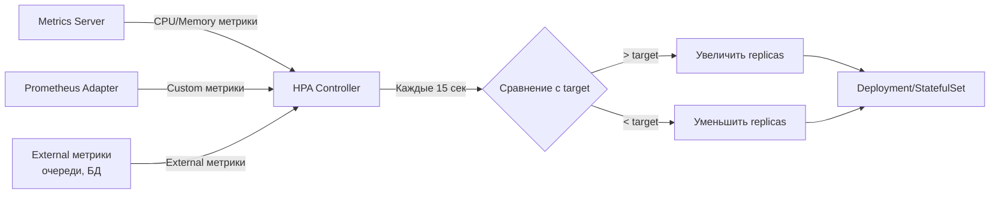

# HorizontalPodAutoscaler (HPA) — Детальный разбор

> 📌 **TL;DR**: `HPA` автоматически изменяет количество реплик подов на основе метрик (CPU, memory, custom). Работает с `Deployment`, `StatefulSet`, `ReplicaSet`. **Не работает** с `DaemonSet`. Требует `Metrics Server` и `resources.requests` в подах.

---

## 🔹 Что такое HPA

| Аспект | Описание |
|--------|----------|
| **Назначение** | Автоматическое масштабирование количества реплик подов |
| **Тип масштабирования** | Горизонтальное (добавляет/удаляет поды) |
| **API версия** | `autoscaling/v2` (стабильно с v1.23) |
| **Работает с** | `Deployment`, `StatefulSet`, `ReplicaSet`, `ReplicationController` |
| **Не работает с** | `DaemonSet` (нельзя масштабировать) |
| **Требования** | `Metrics Server`, `resources.requests` в подах |



---

## 🔹 Как работает HPA (упрощённо)

### 🎯 Базовый алгоритм

```
1. HPA запрашивает метрики каждые 15 секунд (настраивается)
2. Вычисляет среднее значение метрики по всем подам
3. Сравнивает с целевым значением (target)
4. Если текущее > target → увеличивает replicas
5. Если текущее < target → уменьшает replicas
6. Применяет behavior (ограничения скорости, стабилизация)
```

### 📊 Формула масштабирования

```
desiredReplicas = ceil[currentReplicas × (currentMetricValue / desiredMetricValue)]

Примеры:
- Текущая загрузка CPU: 200m, целевая: 100m
  → 200/100 = 2.0 → replicas удваиваются

- Текущая загрузка CPU: 50m, целевая: 100m
  → 50/100 = 0.5 → replicas уменьшаются вдвое

Допуск (по умолчанию 10%): если соотношение близко к 1.0 (0.9-1.1) → масштабирование не происходит
```

### ⚙️ Особенности алгоритма

| Ситуация | Поведение HPA |
|----------|---------------|
| **Под не готов (not ready)** | Игнорируется при расчёте метрик |
| **Под удаляется (terminating)** | Игнорируется при расчёте метрик |
| **Отсутствуют метрики** | Консервативный расчёт: предполагается 100% для scale down, 0% для scale up |
| **Несколько метрик** | Выбирается наибольшее значение `desiredReplicas` |
| **Одна метрика недоступна** | Масштабирование пропускается, если все доступные метрики предлагают scale down |

### 🛡️ Стабилизация (защита от flapping)

```
Проблема: метрики колеблются → HPA постоянно меняет replicas (flapping)

Решение:
1. Stabilization window (окно стабилизации)
   - HPA смотрит на историю желаемых состояний за последние N секунд
   - Выбирает максимальное значение (для scale down) или минимальное (для scale up)
   - По умолчанию: 300 секунд (5 минут) для scale down, 0 секунд для scale up

2. Tolerance (допуск)
   - Если изменение метрики < tolerance → масштабирование не происходит
   - По умолчанию: 10% (настраивается через --horizontal-pod-autoscaler-tolerance)
   - Можно указать в behavior (стабильно с v1.35, beta)
```

---

## 🔹 Типы метрик для HPA

### 1️⃣ Resource metrics (CPU, Memory) — стандарт

```yaml
apiVersion: autoscaling/v2
kind: HorizontalPodAutoscaler
metadata:
  name: my-app-hpa
spec:
  scaleTargetRef:
    apiVersion: apps/v1
    kind: Deployment
    name: my-app
  minReplicas: 2
  maxReplicas: 10
  metrics:
  - type: Resource
    resource:
      name: cpu
      target:
        type: Utilization
        averageUtilization: 70    # ← целевая загрузка CPU 70%
  - type: Resource
    resource:
      name: memory
      target:
        type: Utilization
        averageUtilization: 80    # ← целевая загрузка памяти 80%
```

**Как считается utilization**:
```
utilization = (current usage) / (resources.requests) × 100%

Пример:
- Pod использует 150m CPU
- resources.requests.cpu = 200m
- utilization = 150/200 × 100% = 75%
- Если target = 70% → HPA увеличит replicas
```

> ⚠️ **Важно**: если у контейнера нет `resources.requests`, HPA не может вычислить utilization и игнорирует эту метрику.

### 2️⃣ Container Resource metrics (отдельные контейнеры) — стабильно с v1.30

```yaml
spec:
  metrics:
  - type: ContainerResource
    containerResource:
      name: cpu
      container: application    # ← имя контейнера в поде
      target:
        type: Utilization
        averageUtilization: 60
```

**Когда использовать**:
- Под имеет несколько контейнеров (main + sidecar)
- Нужно масштабировать по основному контейнеру, игнорируя sidecar
- Пример: веб-приложение + логгер, масштабируем по веб-приложению

### 3️⃣ Custom metrics (пользовательские метрики на под) — стабильно с v1.23

```yaml
spec:
  metrics:
  - type: Pods
    pods:
      metric:
        name: http_requests_per_second
      target:
        type: AverageValue
        averageValue: 1000    # ← целевое значение: 1000 req/s на под
```

**Требования**:
- Нужен **Prometheus Adapter** или аналог
- Метрики экспортируются через `custom.metrics.k8s.io` API
- Примеры метрик: requests per second, queue length per pod, latency

### 4️⃣ External metrics (внешние метрики, не привязанные к подам) — стабильно с v1.23

```yaml
spec:
  metrics:
  - type: External
    external:
      metric:
        name: rabbitmq_queue_length
        selector:
          matchLabels:
            queue: orders
      target:
        type: AverageValue
        averageValue: 100    # ← целевое значение: 100 сообщений на под
```

**Когда использовать**:
- Масштабирование по внешним факторам: длина очереди, количество событий
- Метрики не привязаны к конкретным подам
- Пример: RabbitMQ queue length, AWS SQS messages, Kafka lag

### 5️⃣ Object metrics (метрики объектов K8s) — стабильно с v1.23

```yaml
spec:
  metrics:
  - type: Object
    object:
      describedObject:
        apiVersion: networking.k8s.io/v1
        kind: Ingress
        name: my-ingress
      metric:
        name: requests-per-second
      target:
        type: Value
        value: 10k    # ← целевое значение: 10k req/s на Ingress
```

**Когда использовать**:
- Масштабирование по метрикам других объектов K8s (Ingress, Service)
- Пример: масштабировать поды, если Ingress получает > 10k req/s

---

## 🔹 Behavior — настройка поведения масштабирования

### 📋 Структура behavior

```yaml
spec:
  behavior:
    scaleUp:
      stabilizationWindowSeconds: 0      # ← окно стабилизации для scale up
      policies:                          # ← политики масштабирования
      - type: Percent
        value: 100
        periodSeconds: 15
      - type: Pods
        value: 4
        periodSeconds: 15
      selectPolicy: Max                  # ← Max (по умолчанию), Min, Disabled
      tolerance: 0.1                     # ← допуск (10%, beta с v1.35)
    scaleDown:
      stabilizationWindowSeconds: 300    # ← окно стабилизации для scale down
      policies:
      - type: Percent
        value: 10
        periodSeconds: 60
      selectPolicy: Min
```

### 🎯 Policies — ограничение скорости масштабирования

| Параметр | Описание | Пример |
|----------|----------|--------|
| **`type: Pods`** | Макс. изменение в абсолютных значениях | `value: 4, periodSeconds: 60` → не более 4 подов в минуту |
| **`type: Percent`** | Макс. изменение в процентах | `value: 10, periodSeconds: 60` → не более 10% подов в минуту |
| **`periodSeconds`** | Период времени (макс. 1800 сек = 30 мин) | `60` → политика применяется к каждой минуте |
| **`selectPolicy`** | Как выбирать политику, если их несколько | `Max` (по умолчанию) → наибольшее изменение, `Min` → наименьшее, `Disabled` → отключить |

### 📊 Примеры behavior

#### Пример 1: Медленное scale down (защита от flapping)

```yaml
behavior:
  scaleDown:
    stabilizationWindowSeconds: 300    # ← смотреть на последние 5 минут
    policies:
    - type: Percent
      value: 10
      periodSeconds: 60                # ← удалять не более 10% подов в минуту
    selectPolicy: Min
```

**Что происходит**:
- Если метрика упала, HPA не сразу удаляет поды
- Смотрит на историю за последние 5 минут, выбирает максимальное значение
- Удаляет не более 10% подов в минуту
- Защищает от резкого удаления подов при временных провалах метрик

#### Пример 2: Быстрое scale up, медленное scale down

```yaml
behavior:
  scaleUp:
    stabilizationWindowSeconds: 0      # ← немедленное масштабирование
    policies:
    - type: Percent
      value: 100
      periodSeconds: 15                # ← можно удвоить за 15 секунд
    - type: Pods
      value: 4
      periodSeconds: 15                # ← или добавить 4 пода за 15 секунд
    selectPolicy: Max                  # ← выбираем наибольшее изменение
  scaleDown:
    stabilizationWindowSeconds: 300    # ← медленное удаление
    policies:
    - type: Percent
      value: 10
      periodSeconds: 60                # ← не более 10% в минуту
```

#### Пример 3: Отключить scale down (только увеличение)

```yaml
behavior:
  scaleDown:
    selectPolicy: Disabled             # ← отключить уменьшение масштаба
```

**Когда использовать**:
- Критичные приложения, где нельзя рисковать удалением подов
- Тестирование: хочешь видеть, как HPA увеличивает, но не уменьшает

#### Пример 4: Ограничение скорости scale down

```yaml
behavior:
  scaleDown:
    policies:
    - type: Percent
      value: 10
      periodSeconds: 60                # ← не более 10% в минуту
    - type: Pods
      value: 5
      periodSeconds: 60                # ← не более 5 подов в минуту
    selectPolicy: Min                  # ← выбираем наименьшее изменение
```

**Что происходит**:
- Если 10% от 100 подов = 10, но лимит 5 → удаляется 5 подов
- Если 10% от 30 подов = 3, и лимит 5 → удаляется 3 пода
- Всегда выбирается наиболее консервативная политика

### 🛡️ Stabilization window — окно стабилизации

```yaml
behavior:
  scaleDown:
    stabilizationWindowSeconds: 300    # ← 5 минут
```

**Как работает**:
```
Время      | Текущая метрика | Желаемые replicas (без стабилизации) | Желаемые replicas (с стабилизацией)
-----------|-----------------|--------------------------------------|-------------------------------------
12:00:00   | 50%             | 5                                    | 5
12:01:00   | 30%             | 3                                    | 5 (максимум за последние 5 мин)
12:02:00   | 20%             | 2                                    | 5
12:03:00   | 40%             | 4                                    | 5
12:04:00   | 60%             | 6                                    | 6 (новое значение > 5)
12:05:00   | 30%             | 3                                    | 6 (максимум за 12:00-12:05)
```

**Зачем нужно**:
- Защищает от flapping (постоянных изменений replicas)
- Сглаживает временные провалы метрик
- Для scale up по умолчанию 0 секунд (немедленное масштабирование)
- Для scale down по умолчанию 300 секунд (медленное удаление)

### 🎯 Tolerance — допуск (beta с v1.35)

```yaml
behavior:
  scaleUp:
    tolerance: 0.05    # ← 5% допуск
```

**Как работает**:
```
Target: 100 MiB memory
Tolerance: 5%

Если текущее потребление:
- 104 MiB → нет масштабирования (в пределах 5%)
- 105 MiB → масштабирование (превышает 5%)
- 95 MiB → нет масштабирования (в пределах 5%)
- 94 MiB → масштабирование (ниже 5%)
```

**Зачем нужно**:
- Избежать масштабирования при незначительных колебаниях метрик
- По умолчанию 10% (настраивается через `--horizontal-pod-autoscaler-tolerance`)

---

## 🔹 Практика: создание и настройка HPA

### 🚀 Пошаговая настройка

```bash
# 1. Установить Metrics Server (если ещё не установлен)
kubectl apply -f https://github.com/kubernetes-sigs/metrics-server/releases/latest/download/components.yaml

# 2. Проверить, что Metrics Server работает
kubectl get pods -n kube-system | grep metrics-server
kubectl top nodes
kubectl top pods

# 3. Создать Deployment с resource requests
kubectl apply -f - <<EOF
apiVersion: apps/v1
kind: Deployment
metadata:
  name: my-app
spec:
  replicas: 2
  selector:
    matchLabels:
      app: my-app
  template:
    metadata:
      labels:
        app: my-app
    spec:
      containers:
      - name: my-app
        image: nginx:1.25
        resources:
          requests:
            cpu: 100m        # ← обязательно для HPA
            memory: 128Mi    # ← обязательно для HPA
          limits:
            cpu: 500m
            memory: 512Mi
        readinessProbe:      # ← желательно для HPA
          httpGet:
            path: /
            port: 80
          initialDelaySeconds: 5
          periodSeconds: 10
EOF

# 4. Создать HPA (быстрый способ через CLI)
kubectl autoscale deployment/my-app --min=2 --max=10 --cpu-percent=70

# 5. Или создать HPA через YAML (более гибко)
kubectl apply -f - <<EOF
apiVersion: autoscaling/v2
kind: HorizontalPodAutoscaler
metadata:
  name: my-app-hpa
spec:
  scaleTargetRef:
    apiVersion: apps/v1
    kind: Deployment
    name: my-app
  minReplicas: 2
  maxReplicas: 10
  metrics:
  - type: Resource
    resource:
      name: cpu
      target:
        type: Utilization
        averageUtilization: 70
  behavior:
    scaleDown:
      stabilizationWindowSeconds: 300
      policies:
      - type: Percent
        value: 10
        periodSeconds: 60
EOF

# 6. Проверить статус HPA
kubectl get hpa
# NAME         REFERENCE           TARGETS   MINPODS   MAXPODS   REPLICAS   AGE
# my-app-hpa   Deployment/my-app   45%/70%   2         10        2          1m

# 7. Детальная информация
kubectl describe hpa my-app-hpa

# 8. Посмотреть метрики подов
kubectl top pods -l app=my-app
```

### 🔍 Отладка HPA

```bash
# Посмотреть события HPA
kubectl describe hpa my-app | grep -A20 'Events:'
# Events:
#   Type     Reason                        Age   From                       Message
#   ----     ------                        ----  ----                       -------
#   Normal   SuccessfulRescale             10m   horizontal-pod-autoscaler  New size: 3; reason: cpu resource utilization (percentage of request) above target
#   Normal   SuccessfulRescale             5m    horizontal-pod-autoscaler  New size: 5; reason: cpu resource utilization (percentage of request) above target

# Проверить, что у подов есть resource requests
kubectl get pods -l app=my-app -o jsonpath='{.items[*].spec.containers[*].resources.requests}'
# map[cpu:100m memory:128Mi]

# Проверить, что Metrics Server работает
kubectl get --raw "/apis/metrics.k8s.io/v1beta1/nodes"
kubectl get --raw "/apis/metrics.k8s.io/v1beta1/pods"

# Посмотреть текущие метрики
kubectl get hpa my-app -o yaml | grep -A10 'status:'
# status:
#   currentMetrics:
#   - resource:
#       name: cpu
#       current:
#         averageUtilization: 45
#         averageValue: 45m

# Проверить, что поды готовы (ready)
kubectl get pods -l app=my-app -o wide
# NAME                      READY   STATUS    RESTARTS   AGE   IP           NODE
# my-app-6d4f5b6c7d-abc12   1/1     Running   0          10m   10.244.1.5   node-1
# my-app-6d4f5b6c7d-def34   1/1     Running   0          10m   10.244.2.7   node-2
```

### ⚠️ Частые проблемы

| Проблема | Причина | Решение |
|----------|---------|---------|
| **HPA не масштабирует** | Нет `resources.requests` в поде | Добавить `resources.requests.cpu` и `memory` |
| **HPA не масштабирует** | Metrics Server не установлен | Установить Metrics Server |
| **HPA не масштабирует** | Поды не готовы (not ready) | Проверить `readinessProbe` |
| **HPA масштабирует слишком медленно** | `stabilizationWindowSeconds` слишком большой | Уменьшить окно или убрать |
| **HPA масштабирует слишком быстро** | Нет `behavior` с ограничениями | Добавить policies для scale up/down |
| **Flapping (постоянные изменения)** | Метрики колеблются | Увеличить `stabilizationWindowSeconds`, добавить `tolerance` |
| **HPA показывает `<unknown>`** | Metrics Server не может получить метрики | Проверить логи Metrics Server, права доступа |

---

## 🔹 Переход от Deployment к HPA

### ⚠️ Проблема: конфликт `spec.replicas` и HPA

```yaml
# ❌ ПЛОХО: spec.replicas в Deployment конфликтует с HPA
apiVersion: apps/v1
kind: Deployment
metadata:
  name: my-app
spec:
  replicas: 5    # ← HPA тоже управляет replicas → конфликт!
---
apiVersion: autoscaling/v2
kind: HorizontalPodAutoscaler
metadata:
  name: my-app-hpa
spec:
  scaleTargetRef:
    apiVersion: apps/v1
    kind: Deployment
    name: my-app
  minReplicas: 2
  maxReplicas: 10
```

**Что происходит**:
- `kubectl apply -f deployment.yaml` устанавливает `replicas: 5`
- HPA видит, что текущее значение (5) не соответствует желаемому (например, 3)
- HPA меняет replicas обратно → flapping

### ✅ Решение: убрать `spec.replicas` из Deployment

```yaml
# ✅ ХОРОШО: spec.replicas убран, HPA полностью управляет replicas
apiVersion: apps/v1
kind: Deployment
metadata:
  name: my-app
spec:
  # replicas: 5  ← УБРАТЬ ЭТУ СТРОКУ!
  selector:
    matchLabels:
      app: my-app
  template:
    metadata:
      labels:
        app: my-app
    spec:
      containers:
      - name: my-app
        image: nginx:1.25
```

### 🔄 Как безопасно убрать `spec.replicas`

```bash
# Метод 1: Через kubectl edit-last-applied (без изменения текущего состояния)
kubectl apply edit-last-applied deployment/my-app
# В редакторе удалить строку spec.replicas
# Сохранить и выйти → replicas не изменится

# Метод 2: Через патч (если нужно изменить манифест)
kubectl patch deployment my-app --type='merge' -p='{"spec":{"replicas":null}}'
# ⚠️ Внимание: это может вызвать временное изменение replicas до 1 (по умолчанию)

# Метод 3: Сначала создать HPA, потом убрать replicas из манифеста
kubectl apply -f hpa.yaml
kubectl apply edit-last-applied deployment/my-app  # удалить replicas
```

> 💡 **Совет**: если используешь GitOps (ArgoCD, Flux), просто удали `spec.replicas` из манифеста в Git и закоммить. ArgoCD/Flux применит изменения.

---

## 🔹 Чек-лист: настройка HPA

```bash
# ✅ 1. Проверить требования
kubectl get pods -n kube-system | grep metrics-server  # Metrics Server установлен?
kubectl top pods                                        # Метрики доступны?

# ✅ 2. Настроить Deployment
#    - Указать resources.requests.cpu и memory
#    - Настроить readinessProbe
#    - Убрать spec.replicas (если используется HPA)

# ✅ 3. Создать HPA
kubectl apply -f hpa.yaml

# ✅ 4. Проверить статус
kubectl get hpa
kubectl describe hpa <name>

# ✅ 5. Настроить behavior (если нужно)
#    - stabilizationWindowSeconds для scale down (защита от flapping)
#    - policies для ограничения скорости масштабирования
#    - tolerance для игнорирования незначительных колебаний

# ✅ 6. Протестировать
kubectl run load-generator --image=busybox --restart=Never -- /bin/sh -c "while true; do wget -q -O- http://my-app; done"
kubectl get hpa -w  # наблюдать за масштабированием
kubectl delete pod load-generator  # остановить нагрузку

# ✅ 7. Настроить мониторинг и алертинг
#    - Алерт, если HPA достиг maxReplicas
#    - Алерт, если метрики недоступны
#    - Метрики: replicas, CPU/memory utilization, scaling events
```

> 💡 **Совет для конспекта**:
> 1. Создай файл `00_hpa_cheatsheet.md` с шпаргалкой по командам и примерам YAML.
> 2. Добавь блок «Частые ошибки»: например, «забыл `resources.requests`», «не убрал `spec.replicas` из Deployment», «не установил Metrics Server».
> 3. Веди список «Какие HPA у нас в кластере»: имя, целевой ресурс, метрики, min/max replicas.

---

## 🔹 Ключевые выводы

1. **HPA** автоматически масштабирует поды по CPU, memory, custom или external метрикам. **Стабильно с v1.23**.
2. **Требования**: `Metrics Server`, `resources.requests` в подах, `readinessProbe` (желательно).
3. **Типы метрик**: `Resource` (CPU/memory), `ContainerResource` (отдельные контейнеры), `Pods` (custom), `External` (внешние), `Object` (объекты K8s).
4. **Behavior**: `policies` (ограничение скорости), `stabilizationWindowSeconds` (защита от flapping), `tolerance` (игнорирование незначительных колебаний).
5. **Не используй `spec.replicas` в Deployment**, если есть HPA — иначе будет конфликт.
6. **Отладка**: `kubectl describe hpa`, `kubectl top pods`, проверка Metrics Server.
7. **Мониторинг**: следи за метриками HPA, настраивай алерты на достижение `maxReplicas`.
---
