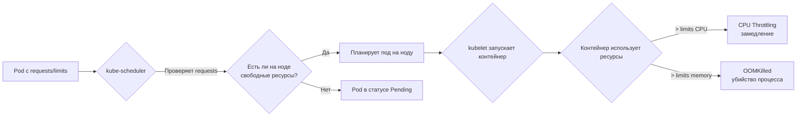

# Resource Management — Управление ресурсами подов и контейнеров

> 📌 `requests` — это **гарантия** (сколько ресурсов нужно поду для запуска, используется планировщиком). `limits` — это **потолок** (максимум, который может использовать контейнер, применяется kubelet через cgroups). **CPU throttling** при превышении limits, **OOMKilled** при превышении memory limits.

---

## 🔹 Requests vs Limits — фундаментальное различие

| Параметр | Кто использует | Назначение | Что происходит при превышении |
|----------|----------------|------------|-------------------------------|
| **`requests`** | `kube-scheduler` | Гарантия ресурсов для **планирования** пода на ноде | Под может использовать больше, если есть свободные ресурсы |
| **`limits`** | `kubelet` + cgroups | **Жёсткий потолок** использования ресурсов контейнером | **CPU**: throttling (замедление)<br>**Memory**: OOMKilled (убийство процесса) |



### 🎯 Ключевые правила

1. **`requests` ≤ `limits`** — иначе API отклонит манифест
2. **Если указан только `limits`** → `requests` автоматически = `limits`
3. **Если указан только `requests`** → `limits` не устанавливается (контейнер может использовать все свободные ресурсы ноды)
4. **Если ничего не указано** → `requests` и `limits` не заданы (BestEffort QoS)

---

## 🔹 Типы ресурсов

| Ресурс | Описание | Базовая единица | Примеры |
|--------|----------|-----------------|---------|
| **`cpu`** | Вычислительная мощность | 1 CPU = 1 ядро (физическое или виртуальное) | `500m`, `1`, `2.5` |
| **`memory`** | Оперативная память (RAM) | Байты | `128Mi`, `1Gi`, `512M` |
| **`ephemeral-storage`** | Локальное временное хранилище | Байты | `1Gi`, `10Gi` |
| **`hugepages-<size>`** | Hugepages (только Linux) | Байты | `hugepages-2Mi: 80Mi` |
| **Extended resources** | Кастомные ресурсы (GPU, FPGA) | Целые числа | `nvidia.com/gpu: 1` |

---

## 🔹 Единицы измерения

### CPU (процессор)

```yaml
resources:
  requests:
    cpu: "500m"      # 500 милли-CPU = 0.5 ядра
  limits:
    cpu: "2"         # 2 полных ядра
```

**Правила:**
- `1` = `1000m` = 1 полное ядро
- `500m` = `0.5` = половина ядра
- **Минимальное значение**: `1m` (0.001 CPU)
- **Всегда абсолютные значения** (не проценты от ноды)

> 💡 **Совет**: Используй `m` (milliCPU) для значений < 1 CPU, чтобы избежать ошибок округления.

### Memory (память)

```yaml
resources:
  requests:
    memory: "128Mi"  # 128 мебибайт (2^20 байт)
  limits:
    memory: "1Gi"    # 1 гибибайт (2^30 байт)
```

**Суффиксы:**

| Суффикс | Значение | Пример |
|---------|----------|--------|
| `Ki` | 1024 байт (кибибайт) | `128Ki` |
| `Mi` | 1024² байт (мебибайт) | `256Mi` |
| `Gi` | 1024³ байт (гибибайт) | `1Gi` |
| `Ti` | 1024⁴ байт (тебибайт) | `2Ti` |
| `K` | 1000 байт (килобайт) | `128K` |
| `M` | 1000² байт (мегабайт) | `256M` |
| `G` | 1000³ байт (гигабайт) | `1G` |

> ⚠️ **Важно**: `M` (мегабайты) ≠ `Mi` (мебибайты)! Используй `Mi`/`Gi` для точности.

> ❌ **Опасная ошибка**: `400m` = 400 **миллибайт** (0.4 байта), а не 400 мегабайт! Используй `400Mi`.

---

## 🔹 Примеры манифестов

### Базовый пример: один контейнер

```yaml
apiVersion: v1
kind: Pod
metadata:
  name: frontend
spec:
  containers:
  - name: app
    image: nginx:1.25
    resources:
      requests:
        memory: "64Mi"
        cpu: "250m"
      limits:
        memory: "128Mi"
        cpu: "500m"
```

**Что произойдёт:**
- Планировщик найдёт ноду с ≥ 250m CPU и ≥ 64Mi памяти
- Kubelet ограничит контейнер: максимум 500m CPU и 128Mi памяти
- Если контейнер попытается использовать > 128Mi → OOMKilled

### Многоконтейнерный Pod

```yaml
apiVersion: v1
kind: Pod
metadata:
  name: multi-container
spec:
  containers:
  - name: app
    image: myapp:v1
    resources:
      requests:
        memory: "64Mi"
        cpu: "250m"
      limits:
        memory: "128Mi"
        cpu: "500m"
  - name: sidecar
    image: sidecar:v1
    resources:
      requests:
        memory: "64Mi"
        cpu: "250m"
      limits:
        memory: "128Mi"
        cpu: "500m"
```

**Суммарные ресурсы Pod:**
- Requests: 500m CPU, 128Mi memory
- Limits: 1 CPU, 256Mi memory

### Pod-level resources (beta в v1.34+)

> **Новая фича**: позволяет задать ресурсы на уровне пода, а не контейнера.

```yaml
apiVersion: v1
kind: Pod
metadata:
  name: pod-level-resources
spec:
  resources:                    # ← ресурсы на уровне пода
    requests:
      cpu: "1"
      memory: "100Mi"
    limits:
      cpu: "1"
      memory: "200Mi"
  containers:
  - name: app
    image: nginx
    resources:
      requests:
        cpu: "0.5"              # ← явные ресурсы контейнера
        memory: "50Mi"
      limits:
        cpu: "0.5"
        memory: "100Mi"
  - name: sidecar
    image: busybox
    # ← нет явных ресурсов, использует остаток от pod-level
```

**Преимущества:**
- Упрощает управление multi-container pods
- Контейнеры могут динамически делить ресурсы
- Не нужно точно оценивать потребности каждого контейнера

---

## 🔹 Как работает планирование и enforcement

### kube-scheduler (планирование)

```
1. Получает Pod с requests: {cpu: 500m, memory: 256Mi}
2. Проходит по всем нодам кластера
3. Для каждой ноды проверяет:
   - Allocatable CPU - Sum(requests всех подов) ≥ 500m?
   - Allocatable Memory - Sum(requests всех подов) ≥ 256Mi?
4. Если нода подходит — планирует под на неё
5. Если ни одна нода не подходит → Pod в статусе Pending
```

### kubelet (enforcement на ноде)

```
1. Запускает контейнер через Container Runtime
2. Настраивает cgroups:
   - CPU: cpu.cfs_quota_us = limits.cpu * 100000
   - Memory: memory.limit_in_bytes = limits.memory
3. Мониторит использование ресурсов
4. При превышении:
   - CPU > limits → throttling (замедление)
   - Memory > limits → OOMKilled (убийство процесса)
```

### Разница в поведении CPU и Memory

| Ресурс | При превышении limits | Поведение |
|--------|----------------------|-----------|
| **CPU** | Throttling | Контейнер замедляется, но продолжает работать |
| **Memory** | OOMKilled | Процесс убит, контейнер перезапущен (если restartPolicy позволяет) |

> 💡 **Важно**: Memory limits применяются **реактивно** — контейнер может временно использовать больше памяти, но будет убит при следующем OOM-событии.

---

## 🔹 In-place resize (stable в v1.35+)

> **Новая фича**: изменение requests/limits **без перезапуска пода**.

```bash
# Изменить ресурсы работающего пода
kubectl patch pod my-pod --type='merge' -p '{
  "spec": {
    "containers": [{
      "name": "app",
      "resources": {
        "requests": {"cpu": "1", "memory": "512Mi"},
        "limits": {"cpu": "2", "memory": "1Gi"}
      }
    }]
  }
}'
```

**Преимущества:**
- Нет downtime при изменении ресурсов
- Не нужно пересоздавать под
- Быстрая адаптация к изменению нагрузки

**Ограничения:**
- Поддерживается не всеми Container Runtime
- Может потребоваться restart в некоторых случаях (зависит от `resizePolicy`)

---

## 🔹 Troubleshooting

### Проблема 1: Pod в статусе Pending (FailedScheduling)

```bash
# Проверить события пода
kubectl describe pod my-pod | grep -A 20 'Events:'

# Пример вывода:
# Warning  FailedScheduling  23s  default-scheduler  0/42 nodes available: insufficient cpu
```

**Причины:**
- ❌ Недостаточно CPU/memory на нодах
- ❌ Pod запрашивает больше ресурсов, чем есть на любой ноде
- ❌ Ноды имеют taints, а под не имеет tolerations

**Решения:**
1. Добавить больше нод в кластер
2. Удалить ненужные поды для освобождения ресурсов
3. Уменьшить requests в манифесте
4. Проверить taints/tolerations

```bash
# Проверить ресурсы нод
kubectl describe nodes | grep -A 20 'Allocated resources:'

# Пример вывода:
# Allocated resources:
#   CPU Requests  CPU Limits  Memory Requests  Memory Limits
#   ------------  ----------  ---------------  -------------
#   680m (34%)    400m (20%)  920Mi (11%)      1070Mi (13%)
```

### Проблема 2: Контейнер убит (OOMKilled)

```bash
# Проверить статус пода
kubectl describe pod my-pod | grep -A 10 'Last State:'

# Пример вывода:
# Last State:     Terminated
#   Reason:       OOMKilled
#   Exit Code:    137
# Restart Count:  5
```

**Причины:**
- ❌ Контейнер использует больше памяти, чем `limits.memory`
- ❌ Утечка памяти в приложении
- ❌ Недостаточно памяти для работы приложения

**Решения:**
1. Увеличить `limits.memory`
2. Оптимизировать приложение (исправить утечки памяти)
3. Добавить больше памяти в ноду
4. Проверить логи приложения на ошибки

```bash
# Посмотреть логи предыдущего запуска (до OOMKilled)
kubectl logs my-pod --previous

# Проверить текущее использование памяти
kubectl top pod my-pod
```

### Проблема 3: CPU Throttling (медленная работа)

```bash
# Проверить метрики CPU throttling (нужен Metrics Server)
kubectl top pod my-pod

# Проверить события
kubectl describe pod my-pod | grep -i throttle
```

**Причины:**
- ⚠️ Контейнер достигает `limits.cpu` и замедляется
- ⚠️ Приложение требует больше CPU, чем выделено

**Решения:**
1. Увеличить `limits.cpu`
2. Оптимизировать приложение
3. Добавить больше CPU в ноду

> 💡 **Совет**: CPU throttling не убивает контейнер, но сильно замедляет работу. Если приложение медленное — проверь throttling.

---

## 🔹 emptyDir и память

> ⚠️ **Важно**: `emptyDir` с `medium: Memory` использует **оперативную память** ноды, а не диск.

```yaml
volumes:
- name: cache-volume
  emptyDir:
    medium: Memory        # ← использовать RAM
    sizeLimit: 512Mi      # ← обязательно указать лимит!
```

**Риски:**
- Если не указать `sizeLimit` → может использовать всю память пода
- Если у пода нет `limits.memory` → может использовать всю память ноды → OOM на ноде

**Best practices:**
- ✅ Всегда указывай `sizeLimit` для `emptyDir` с `medium: Memory`
- ✅ Устанавливай `limits.memory` для всех контейнеров
- ✅ Используй `ResourceQuota` для ограничения памяти в namespace

---

## 🔹 Extended Resources (кастомные ресурсы)

> Позволяют запрашивать кастомные ресурсы (GPU, FPGA, специализированное оборудование).

```yaml
apiVersion: v1
kind: Pod
metadata:
  name: gpu-pod
spec:
  containers:
  - name: ml-training
    image: tensorflow/tensorflow:latest-gpu
    resources:
      requests:
        cpu: "4"
        memory: "8Gi"
        nvidia.com/gpu: 1    # ← запрос 1 GPU
      limits:
        cpu: "4"
        memory: "8Gi"
        nvidia.com/gpu: 1    # ← limits = requests для extended resources
```

**Правила:**
- Extended resources должны быть **целыми числами** (нельзя `0.5` GPU)
- `requests` = `limits` (нельзя overcommit)
- Требуют Device Plugin (например, NVIDIA Device Plugin для GPU)

---

## 🔹 Чек-лист: Best Practices для Resource Management

```text
[ ] Для всех контейнеров указаны requests и limits
[ ] requests ≤ limits для всех ресурсов
[ ] Для CPU используется формат milliCPU (например, 500m, а не 0.5)
[ ] Для memory используется формат Mi/Gi (например, 256Mi, а не 256M)
[ ] Установлены ResourceQuota для namespace (ограничение общих ресурсов)
[ ] Установлены LimitRange для namespace (дефолтные requests/limits)
[ ] Для emptyDir с medium: Memory указан sizeLimit
[ ] Для всех контейнеров установлены limits.memory (защита от OOM на ноде)
[ ] Протестировано реальное использование ресурсов (kubectl top pod)
[ ] Настроен Vertical Pod Autoscaler (VPA) для автоматической оптимизации
[ ] Настроен Horizontal Pod Autoscaler (HPA) для масштабирования по CPU/memory
```

---

## 🔹 Шпаргалка: Полезные команды kubectl

```bash
# 1. Посмотреть использование ресурсов подов
kubectl top pods
kubectl top pods -n my-namespace
kubectl top pods -l app=my-app

# 2. Посмотреть использование ресурсов нод
kubectl top nodes

# 3. Посмотреть ресурсы, запрошенные подами на ноде
kubectl describe node <node-name> | grep -A 20 'Allocated resources:'

# 4. Посмотреть requests/limits контейнера
kubectl get pod <pod-name> -o jsonpath='{.spec.containers[*].resources}'

# 5. Найти поды без limits
kubectl get pods -o json | jq -r '.items[] | select(.spec.containers[*].resources.limits == null) | .metadata.name'

# 6. Найти поды без requests
kubectl get pods -o json | jq -r '.items[] | select(.spec.containers[*].resources.requests == null) | .metadata.name'

# 7. Проверить события планирования
kubectl describe pod <pod-name> | grep -A 10 'Events:'

# 8. Проверить OOMKilled
kubectl get pods -o json | jq -r '.items[] | select(.status.containerStatuses[*].lastState.terminated.reason == "OOMKilled") | .metadata.name'

# 9. Установить ResourceQuota для namespace
kubectl create quota my-quota --hard=cpu=10,memory=20Gi,pods=50 -n my-namespace

# 10. Установить LimitRange для namespace
kubectl apply -f - <<EOF
apiVersion: v1
kind: LimitRange
metadata:
  name: default-limits
  namespace: my-namespace
spec:
  limits:
  - default:
      cpu: 500m
      memory: 256Mi
    defaultRequest:
      cpu: 100m
      memory: 128Mi
    type: Container
EOF
```

---

## 🔹 Ключевые выводы

1. **`requests`** — для планировщика (гарантия ресурсов), **`limits`** — для kubelet (жёсткий потолок).
2. **CPU limits** → throttling (замедление), **Memory limits** → OOMKilled (убийство).
3. **Единицы**: CPU — `m` (milliCPU), Memory — `Mi`/`Gi` (мебибайты/гибибайты).
4. **Pod-level resources** (beta v1.34+) — ресурсы на уровне пода, упрощает multi-container pods.
5. **In-place resize** (stable v1.35+) — изменение ресурсов без перезапуска пода.
6. **Troubleshooting**: `FailedScheduling` → недостаточно ресурсов, `OOMKilled` → превышение memory limits.
7. **emptyDir с Memory** — использует RAM, всегда указывай `sizeLimit`.
8. **Extended resources** — кастомные ресурсы (GPU, FPGA), требуют Device Plugin.
9. **Best practices**: всегда указывай requests/limits, используй ResourceQuota и LimitRange.
