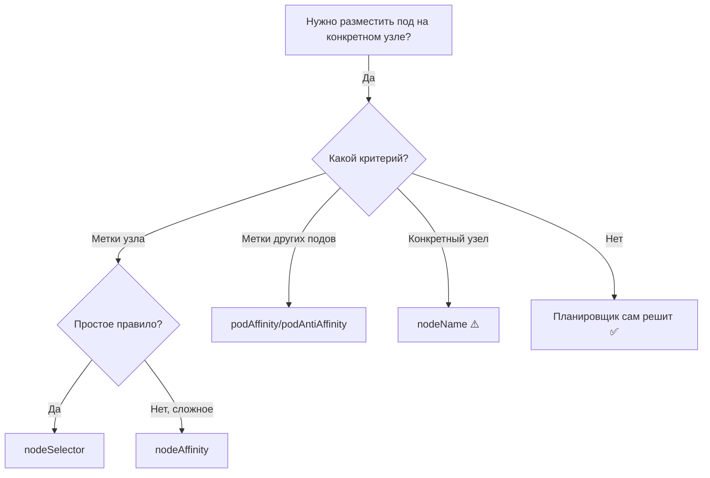

# Assigning Pods to Nodes — привязка подов к узлам

> 📌 **В K8s есть 4 способа** привязать под к узлу: `nodeSelector` (простой), `nodeAffinity` (гибкий, required/preferred), `podAffinity`/`podAntiAffinity` (по меткам других подов), `nodeName` (жёсткий, anti-pattern). Планировщик **автоматически** размещает поды — используй эти механизмы только когда нужно специфичное размещение (SSD, зона доступности, HA).

---

## 🔹 Обзор методов привязки

| Метод | Сложность | Гибкость | Когда использовать |
|-------|-----------|----------|-------------------|
| **`nodeSelector`** | 🟢 Простой | Низкая | Быстрая привязка по меткам узлов |
| **`nodeAffinity`** | 🟡 Средний | Высокая | Сложные правила, soft/hard constraints |
| **`podAffinity`/`podAntiAffinity`** | 🔴 Сложный | Очень высокая | Размещение рядом с другими подами или врозь |
| **`nodeName`** | 🟢 Простой | Нулевая | Только для отладки/спец. случаев (anti-pattern) |



---

## 🔹 Метки узлов (Node Labels)

> Основа всех механизмов привязки. Узлы имеют метки — стандартные (от K8s) и кастомные (от админа).

### 🎯 Стандартные метки узлов

| Метка | Описание |
|-------|----------|
| `kubernetes.io/hostname` | Имя узла |
| `topology.kubernetes.io/region` | Регион облака |
| `topology.kubernetes.io/zone` | Зона доступности (AZ) |
| `node.kubernetes.io/instance-type` | Тип инстанса (m5.large, n1-standard-2) |
| `kubernetes.io/os` | ОС (linux, windows) |
| `kubernetes.io/arch` | Архитектура (amd64, arm64) |
| `kubernetes.io/hostname` | Имя хоста |

### 📝 Добавление кастомной метки

```bash
# Добавить метку к узлу
kubectl label node worker-1 disktype=ssd

# Проверить
kubectl get node worker-1 --show-labels | grep disktype

# Удалить метку
kubectl label node worker-1 disktype-
```

### 🛡️ Изоляция узлов через метки

> ⚠️ **Важно**: kubelet **не должен** иметь возможность менять свои метки (иначе скомпрометированный узел может обмануть планировщик).

**Решение**: используй префикс `node-restriction.kubernetes.io/` — kubelet не может его менять (требует `NodeRestriction` admission plugin).

```bash
# Безопасная метка для изоляции
kubectl label node worker-1 node-restriction.kubernetes.io/fips=true
kubectl label node worker-2 node-restriction.kubernetes.io/pci-dss=true
```

---

## 🔹 1. nodeSelector — простой способ

> Самый простой механизм: под размещается на узлах, у которых есть **все** указанные метки.

### 📝 Пример

```yaml
apiVersion: v1
kind: Pod
metadata:
  name: ssd-pod
spec:
  nodeSelector:
    disktype: ssd              # ← узел должен иметь эту метку
  containers:
  - name: app
    image: nginx:1.25
```

```bash
# Узел должен иметь метку
kubectl label node worker-1 disktype=ssd

# Создать под
kubectl apply -f ssd-pod.yaml
```

### ⚠️ Ограничения nodeSelector

| Ограничение | Описание |
|-------------|----------|
| **Только AND** | Все метки должны совпадать (нельзя "или") |
| **Нет soft rules** | Только жёсткие требования (нет "предпочтительно") |
| **Нет операторов** | Только точное совпадение (нет `In`, `NotIn`, `Exists`) |
| **Только метки узлов** | Нельзя смотреть на метки других подов |

> 💡 **Если нужно больше гибкости** — используй `nodeAffinity`.

---

## 🔹 2. nodeAffinity — гибкий способ

> Расширенная версия `nodeSelector`. Поддерживает:
> - **Операторы**: `In`, `NotIn`, `Exists`, `DoesNotExist`, `Gt`, `Lt`
> - **Soft/Hard правила**: `required` (жёсткое) и `preferred` (предпочтительное)
> - **Логические операции**: OR между `nodeSelectorTerms`, AND между `matchExpressions`

### 🎯 Два типа nodeAffinity

| Тип | Поведение | Когда использовать |
|-----|-----------|-------------------|
| **`requiredDuringSchedulingIgnoredDuringExecution`** | Жёсткое правило. Если не выполняется — под не запустится. | Критичные требования (SSD, GPU, конкретная зона) |
| **`preferredDuringSchedulingIgnoredDuringExecution`** | Мягкое правило. Если не выполняется — под всё равно запустится, но на менее предпочтительном узле. | Оптимизация (предпочтительно, но не обязательно) |

> 💡 **IgnoredDuringExecution** означает: если метки узла изменились **после** запуска пода — под продолжит работать (правило проверяется только при планировании).

### 📝 Пример: required + preferred

```yaml
apiVersion: v1
kind: Pod
metadata:
  name: with-node-affinity
spec:
  affinity:
    nodeAffinity:
      # Жёсткое правило: под запустится ТОЛЬКО в этих зонах
      requiredDuringSchedulingIgnoredDuringExecution:
        nodeSelectorTerms:
        - matchExpressions:
          - key: topology.kubernetes.io/zone
            operator: In
            values:
            - antarctica-east1
            - antarctica-west1
      
      # Мягкое правило: предпочтительно, чтобы была эта метка
      preferredDuringSchedulingIgnoredDuringExecution:
      - weight: 1              # ← вес от 1 до 100
        preference:
          matchExpressions:
          - key: another-node-label-key
            operator: In
            values:
            - another-node-label-value
  containers:
  - name: app
    image: nginx:1.25
```

### 🎯 Операторы nodeAffinity

| Оператор | Описание | Пример |
|----------|----------|--------|
| **`In`** | Значение метки в списке | `values: ["ssd", "nvme"]` |
| **`NotIn`** | Значение метки не в списке | `values: ["hdd"]` |
| **`Exists`** | Метка существует (значение не важно) | (без `values`) |
| **`DoesNotExist`** | Метка не существует | (без `values`) |
| **`Gt`** | Значение метки > указанного | `values: ["100"]` (для чисел) |
| **`Lt`** | Значение метки < указанного | `values: ["1000"]` (для чисел) |

> ⚠️ `Gt` и `Lt` работают **только** с `nodeAffinity` (не с `podAffinity`).

### 🎯 Логика matchExpressions

```yaml
nodeSelectorTerms:
- matchExpressions:
  - key: disktype
    operator: In
    values: ["ssd"]
  - key: region
    operator: In
    values: ["us-east-1"]
```

**Логика**:
- **Внутри одного `nodeSelectorTerms`**: все `matchExpressions` объединяются через **AND**
- **Между разными `nodeSelectorTerms`**: объединяются через **OR**

```yaml
# Пример: (disktype=ssd AND region=us-east-1) OR (disktype=nvme)
nodeSelectorTerms:
- matchExpressions:
  - key: disktype
    operator: In
    values: ["ssd"]
  - key: region
    operator: In
    values: ["us-east-1"]
- matchExpressions:
  - key: disktype
    operator: In
    values: ["nvme"]
```

### 🎯 Вес preferred правил

```yaml
preferredDuringSchedulingIgnoredDuringExecution:
- weight: 1              # ← низкий приоритет
  preference:
    matchExpressions:
    - key: label-1
      operator: In
      values: ["key-1"]
- weight: 50             # ← высокий приоритет
  preference:
    matchExpressions:
    - key: label-2
      operator: In
      values: ["key-2"]
```

**Как работает**:
- Планировщик находит узлы, прошедшие `required` правила
- Для каждого узла суммирует веса всех `preferred` правил, которым узел соответствует
- Выбирает узел с **максимальной суммой весов**

### 📝 Пример: nodeAffinity vs nodeSelector

```yaml
# ❌ nodeSelector: только AND, только точное совпадение
spec:
  nodeSelector:
    disktype: ssd
    region: us-east-1

# ✅ nodeAffinity: OR, операторы, soft/hard
spec:
  affinity:
    nodeAffinity:
      requiredDuringSchedulingIgnoredDuringExecution:
        nodeSelectorTerms:
        - matchExpressions:
          - key: disktype
            operator: In
            values: ["ssd", "nvme"]          # ← OR: ssd или nvme
      preferredDuringSchedulingIgnoredDuringExecution:
      - weight: 100
        preference:
          matchExpressions:
          - key: region
            operator: In
            values: ["us-east-1"]            # ← предпочтительно, но не обязательно
```

---

## 🔹 3. podAffinity / podAntiAffinity — межподовая привязка

> Позволяет размещать поды **рядом с другими подами** (podAffinity) или **врозь от них** (podAntiAffinity) на основе **меток других подов**, а не узлов.

### 🎯 Зачем нужно

| Сценарий | Механизм | Пример |
|----------|----------|--------|
| **Низкая задержка** | `podAffinity` | Веб-сервер рядом с кэшем (Redis) |
| **Высокая доступность** | `podAntiAffinity` | Реплики БД на разных узлах/зонах |
| **Изоляция** | `podAntiAffinity` | Тенанты на разных узлах |

### 🎯 Ключевые концепции

| Концепция | Описание |
|-----------|----------|
| **`topologyKey`** | Ключ метки узла, определяющий "топологический домен" (узел, зона, регион) |
| **`labelSelector`** | Селектор меток **других подов** (не узлов!) |
| **`namespaces`** | В каких namespaces искать поды (по умолчанию — текущий) |
| **`namespaceSelector`** | Селектор меток namespaces (v1.24+) |

### 🎯 Типы правил

| Тип | Поведение |
|-----|-----------|
| **`requiredDuringSchedulingIgnoredDuringExecution`** | Жёсткое. Если не выполняется — под не запустится. |
| **`preferredDuringSchedulingIgnoredDuringExecution`** | Мягкое. Если не выполняется — под запустится, но на менее предпочтительном узле. |

### 📝 Пример: podAffinity + podAntiAffinity

```yaml
apiVersion: v1
kind: Pod
metadata:
  name: with-pod-affinity
spec:
  affinity:
    # Жёсткое правило: под запустится ТОЛЬКО в зоне, где есть поды с security=S1
    podAffinity:
      requiredDuringSchedulingIgnoredDuringExecution:
      - labelSelector:
          matchExpressions:
          - key: security
            operator: In
            values:
            - S1
        topologyKey: topology.kubernetes.io/zone    # ← топологический домен: зона
    
    # Мягкое правило: предпочтительно избегать зоны, где есть поды с security=S2
    podAntiAffinity:
      preferredDuringSchedulingIgnoredDuringExecution:
      - weight: 100
        podAffinityTerm:
          labelSelector:
            matchExpressions:
            - key: security
              operator: In
              values:
              - S2
          topologyKey: topology.kubernetes.io/zone
  containers:
  - name: app
    image: nginx:1.25
```

### 🎯 topologyKey — что это?

`topologyKey` — ключ метки узла, определяющий "домен". Поды считаются "рядом", если они на узлах с **одинаковым значением** этого ключа.

| topologyKey | Домен | Когда использовать |
|-------------|-------|-------------------|
| `kubernetes.io/hostname` | Узел | Реплики на разных нодах (HA) |
| `topology.kubernetes.io/zone` | Зона доступности | Реплики в разных AZ (HA) |
| `topology.kubernetes.io/region` | Регион | Реплики в разных регионах (DR) |
| `node-pool` | Пул нод | Изоляция тенантов |

### ⚠️ Ограничения podAffinity

| Ограничение | Описание |
|-------------|----------|
| **Производительность** | Требует много вычислений. Не рекомендуется для кластеров > 1000 нод. |
| **Метки узлов** | Все узлы должны иметь метку, указанную в `topologyKey`. Иначе — непредсказуемое поведение. |
| **Пустой topologyKey** | Запрещён для `required` правил (безопасность). |
| **Только для required anti-affinity** | `topologyKey` ограничен `kubernetes.io/hostname` (можно изменить через admission plugin). |

### 📝 Практический пример: Redis + Web Server

```yaml
# Redis: каждая реплика на отдельном узле
apiVersion: apps/v1
kind: Deployment
metadata:
  name: redis-cache
spec:
  replicas: 3
  selector:
    matchLabels:
      app: store
  template:
    metadata:
      labels:
        app: store
    spec:
      affinity:
        podAntiAffinity:
          requiredDuringSchedulingIgnoredDuringExecution:
          - labelSelector:
              matchExpressions:
              - key: app
                operator: In
                values:
                - store
            topologyKey: "kubernetes.io/hostname"    # ← реплики на разных нодах
      containers:
      - name: redis
        image: redis:7-alpine
---
# Web Server: рядом с Redis, но реплики на разных нодах
apiVersion: apps/v1
kind: Deployment
metadata:
  name: web-server
spec:
  replicas: 3
  selector:
    matchLabels:
      app: web-store
  template:
    metadata:
      labels:
        app: web-store
    spec:
      affinity:
        # Жёсткое: рядом с Redis
        podAffinity:
          requiredDuringSchedulingIgnoredDuringExecution:
          - labelSelector:
              matchExpressions:
              - key: app
                operator: In
                values:
                - store
            topologyKey: "kubernetes.io/hostname"
        
        # Жёсткое: реплики web на разных нодах
        podAntiAffinity:
          requiredDuringSchedulingIgnoredDuringExecution:
          - labelSelector:
              matchExpressions:
              - key: app
                operator: In
                values:
                - web-store
            topologyKey: "kubernetes.io/hostname"
      containers:
      - name: web
        image: nginx:1.25
```

**Результат**:
```
Node 1: redis-1 + web-1
Node 2: redis-2 + web-2
Node 3: redis-3 + web-3
```

Каждый web-сервер на том же узле, что и Redis → минимальная задержка.

### 🎯 matchLabelKeys / mismatchLabelKeys (v1.33+)

> Новые поля для более точного контроля: какие поды учитывать при расчёте affinity.

#### matchLabelKeys

```yaml
podAffinity:
  requiredDuringSchedulingIgnoredDuringExecution:
  - labelSelector:
      matchExpressions:
      - key: app
        operator: In
        values: ["database"]
    topologyKey: topology.kubernetes.io/zone
    matchLabelKeys:
    - pod-template-hash    # ← учитывать только поды с тем же hash (т.е. из той же ревизии)
```

**Зачем**: при rolling update новые поды не будут учитывать старые поды при расчёте affinity.

#### mismatchLabelKeys

```yaml
podAntiAffinity:
  requiredDuringSchedulingIgnoredDuringExecution:
  - mismatchLabelKeys:
    - tenant               # ← избегать подов с ДРУГИМ значением tenant
    labelSelector:
      matchExpressions:
      - key: tenant
        operator: Exists
    topologyKey: node-pool
```

**Зачем**: изоляция тенантов — поды разных тенантов не должны быть на одном узле.

---

## 🔹 4. nodeName — жёсткая привязка (anti-pattern)

> Прямое указание узла. **Планировщик игнорируется** — kubelet сам пытается запустить под.

### 📝 Пример

```yaml
apiVersion: v1
kind: Pod
metadata:
  name: nginx
spec:
  nodeName: kube-01          # ← жёсткая привязка к узлу
  containers:
  - name: nginx
    image: nginx:1.25
```

### ⚠️ Почему это anti-pattern

| Проблема | Описание |
|----------|----------|
| **Нет проверки ресурсов** | Если на узле нет CPU/memory — под упадёт с OOM/OOC |
| **Нет проверки доступности** | Если узел недоступен — под навсегда в Pending |
| **Нет балансировки** | Обходит все механизмы планировщика |
| **Нестабильность** | В облаке имена узлов могут меняться |

### ✅ Когда использовать

- **Отладка**: быстро запустить под на конкретном узле
- **Кастомные планировщики**: если пишешь свой scheduler
- **Специфичное железо**: под требует конкретный узел с GPU/TPU (лучше использовать `nodeAffinity`)

> 💡 **Лучше**: используй `nodeAffinity` с `requiredDuringScheduling` — планировщик проверит ресурсы и доступность.

---

## 🔹 Сравнение методов

| Критерий | nodeSelector | nodeAffinity | podAffinity | nodeName |
|----------|--------------|--------------|-------------|----------|
| **Сложность** | 🟢 Низкая | 🟡 Средняя | 🔴 Высокая | 🟢 Низкая |
| **Гибкость** | Низкая | Высокая | Очень высокая | Нулевая |
| **Операторы** | Только `=` | `In`, `NotIn`, `Exists`, `DoesNotExist`, `Gt`, `Lt` | `In`, `NotIn`, `Exists`, `DoesNotExist` | Нет |
| **Soft/Hard** | Только Hard | ✅ Да | ✅ Да | Только Hard |
| **По меткам подов** | ❌ Нет | ❌ Нет | ✅ Да | ❌ Нет |
| **Производительность** | 🟢 Быстро | 🟢 Быстро | 🔴 Медленно (больше кластер → медленнее) | 🟢 Быстро |
| **Когда использовать** | Простые правила | Сложные правила по узлам | Размещение рядом/врозь с другими подами | Только отладка |

---

## 🔹 Практика: отладка привязки

### 🚀 Пошаговая диагностика

```bash
# 1. Под в Pending? Смотрим события
kubectl describe pod <pod-name> -n <namespace> | grep -A20 'Events:'
# Ищи сообщения типа:
# - 0/3 nodes are available: 1 node(s) didn't match Pod's node affinity/selector.
# - 0/3 nodes are available: 3 node(s) didn't match pod anti-affinity rules.

# 2. Проверить метки узлов
kubectl get nodes --show-labels
kubectl get node worker-1 --show-labels | grep disktype

# 3. Проверить, какие поды где запущены (для podAffinity)
kubectl get pods -o wide --all-namespaces
kubectl get pods -o custom-columns="NAME:.metadata.name,NODE:.spec.nodeName,STATUS:.status.phase" -A

# 4. Проверить topologyKey (для podAffinity)
kubectl get nodes --show-labels | grep topology.kubernetes.io/zone

# 5. Симулировать планирование (dry-run)
kubectl apply -f pod.yaml --dry-run=server -o yaml | grep -A10 affinity
```

### 🔍 Частые проблемы

| Проблема | Причина | Решение |
|----------|---------|---------|
| **Под в Pending** | Нет узлов, соответствующих `required` правилам | Проверить метки узлов, ослабить правила |
| **podAntiAffinity не работает** | Узлы не имеют метки `topologyKey` | Добавить метку ко всем узлам |
| **podAffinity замедляет планирование** | Слишком много подов/правил | Упростить правила, использовать `preferred` |
| **nodeName: под не запускается** | Узел недоступен или нет ресурсов | Убрать `nodeName`, использовать `nodeAffinity` |
| **Конфликт nodeSelector + nodeAffinity** | Оба должны выполняться | Проверить, что правила не противоречат друг другу |

---

## 🔹 Чек-лист: привязка подов к узлам

```bash
# ✅ 1. Определить требования
#    - Нужна ли привязка вообще? (часто планировщик сам решит)
#    - По меткам узлов? → nodeSelector или nodeAffinity
#    - По меткам других подов? → podAffinity/podAntiAffinity
#    - Конкретный узел? → nodeName (только для отладки!)

# ✅ 2. Выбрать метод
#    - Простое правило → nodeSelector
#    - Сложное правило (OR, операторы, soft/hard) → nodeAffinity
#    - Размещение рядом/врозь с подами → podAffinity/podAntiAffinity

# ✅ 3. Проверить метки узлов
kubectl get nodes --show-labels
kubectl label node <node> <key>=<value>    # если нужно

# ✅ 4. Написать манифест
#    - Использовать required для критичных требований
#    - Использовать preferred для оптимизации
#    - Указать topologyKey для podAffinity

# ✅ 5. Протестировать
kubectl apply -f pod.yaml
kubectl describe pod <pod-name> | grep -A20 'Events:'

# ✅ 6. Мониторинг
#    - Алерт на поды в Pending > 5 минут
#    - Проверять, что podAntiAffinity работает (реплики на разных узлах)
```

> 💡 **Совет для конспекта**:
> 1. Создай файл `00_affinity_cheatsheet.md` с шпаргалкой по синтаксису.
> 2. Добавь блок «Частые ошибки»: «забыл topologyKey", "использовал nodeName в production", "podAntiAffinity замедляет кластер".
> 3. Веди список "Какие affinity правила у нас в кластере": тип, топология, цель.

---

## 🔹 Ключевые выводы

1. **4 метода привязки**: `nodeSelector` (простой), `nodeAffinity` (гибкий), `podAffinity`/`podAntiAffinity` (межподовый), `nodeName` (жёсткий, anti-pattern).
2. **nodeSelector** — только AND, только точное совпадение, только hard rules. Используй для простых случаев.
3. **nodeAffinity** — операторы (`In`, `NotIn`, `Exists`, `DoesNotExist`, `Gt`, `Lt`), soft/hard правила, веса для preferred.
4. **podAffinity** — размещение рядом с другими подами (по их меткам). Требует `topologyKey`.
5. **podAntiAffinity** — размещение врозь от других подов. Критично для HA (реплики на разных узлах/зонах).
6. **topologyKey** — ключ метки узла, определяющий домен (`kubernetes.io/hostname`, `topology.kubernetes.io/zone`).
7. **nodeName** — anti-pattern. Обходит планировщик, не проверяет ресурсы. Только для отладки.
8. **Производительность**: podAffinity/podAntiAffinity замедляют планирование в больших кластерах (>1000 нод).
9. **matchLabelKeys/mismatchLabelKeys** (v1.33+) — для точного контроля, какие поды учитывать при affinity.
10. **Best practice**: используй `nodeAffinity` вместо `nodeSelector`, `podAntiAffinity` для HA, избегай `nodeName`.