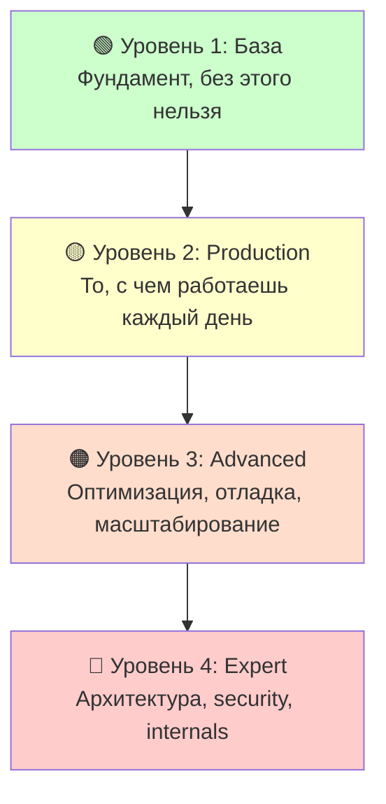

# 🗺️ Kubernetes Learning Roadmap — Карта обучения

> 📌 **Статус**: Конспекты созданы (~87 файлов), но материал нужно **пройти и закрепить практикой**.
> 
> **Легенда**:
> - 📝 Конспект создан (есть файл)
> - ⏳ Не пройдено (нужно изучить + практика)
> - ✅ Пройдено (изучено + практика + чек-лист выполнен)

---

## 📊 Общая статистика

| Блок                               | Тем     | Конспектов | Пройдено | Прогресс  |
| ---------------------------------- | ------- | ---------- | -------- | --------- |
| 🎯 Базовые концепции               | 13      | 13         | 0        | 📝 0%     |
| 🏗️ Архитектура кластера           | 7       | 7          | 0        | 📝 0%     |
| 📦 Workloads (Pod'ы + контроллеры) | 26      | 26         | 0        | 📝 0%     |
| 🌐 Сеть                            | 6       | 6          | 0        | 📝 0%     |
| 💾 Хранилище                       | 6       | 6          | 0        | 📝 0%     |
| ⚙️ Конфигурация                    | 3       | 3          | 0        | 📝 0%     |
| 🔒 Безопасность                    | 6       | 6          | 0        | 📝 0%     |
| 📋 Политики                        | 2       | 2          | 0        | 📝 0%     |
| 🎯 Планирование                    | 7       | 7          | 0        | 📝 0%     |
| 🛠️ Администрирование              | 9       | 9          | 0        | 📝 0%     |
| 🐳 Контейнеры                      | 2       | 2          | 0        | 📝 0%     |
| **ИТОГО**                          | **~87** | **~87**    | **0**    | **📝 0%** |

---

## 🎯 Уровни обучения



---

## 🟢 УРОВЕНЬ 1: База (конспекты есть, нужно пройти)

> Фундамент. Без этого нельзя двигаться дальше.

### 1.1 Обзор и объекты

#### 📝 [[01.k8s_overview.md]] — что такое K8s, зачем нужен
<details>
<summary><b>✅ Чек-лист: Что должен знать/уметь</b></summary>

- [x] Могу объяснить, что такое Kubernetes и зачем он нужен
- [x] Понимаю разницу между контейнерами и виртуальными машинами
- [x] Знаю основные компоненты: Pod, Node, Cluster, Control Plane
- [x] Могу объяснить декларативный подход (desired state)
- [x] Понимаю, что такое оркестрация контейнеров
- [ ] **Практика**: Развернул minikube/kind, запустил первый Pod

</details>

#### 📝 [[01.objects.md]] — что такое объекты K8s
<details>
<summary><b>✅ Чек-лист: Что должен знать/уметь</b></summary>

- [ ] Понимаю, что такое объект K8s (spec, status, metadata)
- [ ] Знаю разницу между ресурсами и объектами
- [ ] Могу объяснить, что такое API-группы и версии
- [ ] Понимаю, как работает API server
- [ ] **Практика**: Создал объект через `kubectl apply -f`

</details>

#### 📝 [[02.object_management]] — декларативное vs императивное управление
<details>
<summary><b>✅ Чек-лист: Что должен знать/уметь</b></summary>

- [ ] Могу объяснить разницу между декларативным и императивным подходом
- [ ] Знаю команды: `kubectl apply`, `kubectl create`, `kubectl edit`, `kubectl patch`
- [ ] Понимаю, что такое `kubectl apply --dry-run`
- [ ] Знаю, что такое `kubectl apply edit-last-applied`
- [ ] **Практика**: Создал объект декларативно (YAML) и императивно (CLI)

</details>

#### 📝 [[03.names_identifiers]] — имена, UID, namespace
<details>
<summary><b>✅ Чек-лист: Что должен знать/уметь</b></summary>

- [ ] Понимаю разницу между name, UID, namespace
- [ ] Знаю правила именования (DNS subdomain, RFC 1123)
- [ ] Могу объяснить, что UID неизменяем
- [ ] Знаю, что имена уникальны в пределах namespace
- [ ] **Практика**: Посмотрел UID объекта через `kubectl get <obj> -o jsonpath='{.metadata.uid}'`
</details>

#### 📝 [[04.labels]] — лейблы и селекторы
<details>
<summary><b>✅ Чек-лист: Что должен знать/уметь</b></summary>

- [ ] Понимаю, что такое labels и selectors
- [ ] Знаю синтаксис: `=`, `==`, `!=`, `in`, `notin`, `exists`
- [ ] Могу добавить/удалить лейбл через `kubectl label`
- [ ] Понимаю, как селекторы используются в Service, Deployment
- [ ] **Практика**: Добавил лейблы к Pod, выбрал через `kubectl get pods -l`

</details>

#### 📝 [[05.namespaces]] — неймспейсы
<details>
<summary><b>✅ Чек-лист: Что должен знать/уметь</b></summary>

- [ ] Понимаю, что такое namespace и зачем нужен
- [ ] Знаю дефолтные namespaces: default, kube-system, kube-public, kube-node-lease
- [ ] Могу создать/удалить namespace через `kubectl create/delete namespace`
- [ ] Понимаю, что ресурсы изолированы в пределах namespace
- [ ] **Практика**: Создал namespace, развернул Pod в нём, переключил контекст

</details>

#### 📝 [[06.annotation]] — аннотации
<details>
<summary><b>✅ Чек-лист: Что должен знать/уметь</b></summary>

- [ ] Понимаю разницу между labels и annotations
- [ ] Знаю, что annotations не используются для селекции
- [ ] Могу добавить/удалить аннотацию через `kubectl annotate`
- [ ] Понимаю, когда использовать annotations (metadata, не идентификация)
- [ ] **Практика**: Добавил аннотацию к Pod, посмотрел через `kubectl describe`

</details>

#### 📝 [[04_k8s_api]] — Kubernetes API
<details>
<summary><b>✅ Чек-лист: Что должен знать/уметь</b></summary>

- [ ] Понимаю структуру API: `/api/v1`, `/apis/<group>/<version>`
- [ ] Знаю, что такое REST API в контексте K8s
- [ ] Могу использовать `kubectl proxy` для доступа к API
- [ ] Понимаю, что такое API-группы (core, apps, batch, etc.)
- [ ] **Практика**: Сделал запрос к API через `curl` с `kubectl proxy`

</details>

### 1.2 Архитектура

#### 📝 [[00.cluster_archi._and_components]] — control plane + worker nodes
<details>
<summary><b>✅ Чек-лист: Что должен знать/уметь</b></summary>

- [ ] Могу нарисовать архитектуру K8s кластера
- [ ] Знаю компоненты control plane: API Server, etcd, Scheduler, Controller Manager
- [ ] Знаю компоненты worker node: kubelet, kube-proxy, container runtime
- [ ] Понимаю, как они взаимодействуют
- [ ] **Практика**: Посмотрел компоненты через `kubectl get pods -n kube-system`

</details>

#### 📝 [[01.nodes]] — узлы кластера
<details>
<summary><b>✅ Чек-лист: Что должен знать/уметь</b></summary>

- [ ] Понимаю, что такое Node (worker node)
- [ ] Знаю, что такое Node conditions: Ready, MemoryPressure, DiskPressure, PIDPressure
- [ ] Могу посмотреть информацию о ноде: `kubectl describe node`
- [ ] Понимаю, что такое capacity vs allocatable
- [ ] **Практика**: Посмотрел ресурсы ноды, проверил conditions

</details>

#### 📝 [[02.node_controlplane_communication]] — как компоненты общаются
<details>
<summary><b>✅ Чек-лист: Что должен знать/уметь</b></summary>

- [ ] Понимаю, как kubelet общается с API server
- [ ] Знаю, что такое Lease objects для heartbeat
- [ ] Понимаю, как контроллеры работают через API server
- [ ] Знаю, что etcd — единственное хранилище состояния
- [ ] **Практика**: Посмотрел Lease объекты: `kubectl get leases -n kube-node-lease`

</details>

#### 📝 [[03.controllers]] — контроллеры
<details>
<summary><b>✅ Чек-лист: Что должен знать/уметь</b></summary>

- [ ] Понимаю, что такое контроллер и control loop
- [ ] Знаю основные контроллеры: ReplicaSet, Deployment, Node, Job, etc.
- [ ] Понимаю принцип "reconcile loop" (desired state vs actual state)
- [ ] Могу объяснить, как контроллеры реагируют на изменения
- [ ] **Практика**: Посмотрел логи контроллера: `kubectl logs -n kube-system <controller-pod>`

</details>

### 1.3 Pod'ы (база)

#### 📝 [[01.pod]] — что такое Pod
<details>
<summary><b>✅ Чек-лист: Что должен знать/уметь</b></summary>

- [ ] Понимаю, что такое Pod и зачем он нужен
- [ ] Знаю, что Pod — минимальная единица деплоя
- [ ] Понимаю, что контейнеры в Pod разделяют network namespace
- [ ] Знаю, что Pod эфемерный (не долговечный)
- [ ] **Практика**: Создал Pod с одним контейнером, посмотрел `kubectl describe pod`

</details>

#### 📝 [[02.pod_lifecycle]] — жизненный цикл
<details>
<summary><b>✅ Чек-лист: Что должен знать/уметь</b></summary>

- [ ] Знаю фазы Pod: Pending, Running, Succeeded, Failed, Unknown
- [ ] Понимаю, что такое container states: Waiting, Running, Terminated
- [ ] Могу объяснить переходы между фазами
- [ ] Знаю, что такое termination grace period
- [ ] **Практика**: Посмотрел фазу Pod: `kubectl get pod -o jsonpath='{.status.phase}'`

</details>

#### 📝 [[03.pod_conditions]] — условия пода
<details>
<summary><b>✅ Чек-лист: Что должен знать/уметь</b></summary>

- [ ] Знаю основные Pod conditions: PodScheduled, Initialized, ContainersReady, Ready
- [ ] Понимаю разницу между Pod phase и Pod conditions
- [ ] Могу посмотреть conditions: `kubectl get pod -o jsonpath='{.status.conditions}'`
- [ ] Понимаю, что Ready condition — итоговое состояние
- [ ] **Практика**: Посмотрел conditions Pod'а, объяснил каждое

</details>

#### 📝 [[07.probes]] — liveness, readiness, startup probes
<details>
<summary><b>✅ Чек-лист: Что должен знать/уметь</b></summary>

- [ ] Понимаю разницу между liveness, readiness, startup probes
- [ ] Знаю типы probes: httpGet, tcpSocket, exec, grpc
- [ ] Могу настроить probe с параметрами: initialDelaySeconds, periodSeconds, timeoutSeconds, failureThreshold
- [ ] Понимаю, что происходит при провале каждой probe
- [ ] **Практика**: Настроил все три probe для Pod'а, проверил поведение

</details>

#### 📝 [[10.qos_classes]] — классы QoS (Guaranteed, Burstable, BestEffort)
<details>
<summary><b>✅ Чек-лист: Что должен знать/уметь</b></summary>

- [ ] Знаю три класса QoS: Guaranteed, Burstable, BestEffort
- [ ] Понимаю, как определяется класс QoS (requests vs limits)
- [ ] Могу объяснить приоритет при eviction (BestEffort → Burstable → Guaranteed)
- [ ] Знаю, что Guaranteed поды защищены от eviction
- [ ] **Практика**: Создал Pod'ы с разными QoS, посмотрел класс: `kubectl get pod -o jsonpath='{.status.qosClass}'`

</details>

### 1.4 Workload контроллеры

#### 📝 [[02.deployaments]] — Deployment
<details>
<summary><b>✅ Чек-лист: Что должен знать/уметь</b></summary>

- [ ] Понимаю, что такое Deployment и зачем нужен
- [ ] Знаю, что Deployment управляет ReplicaSet
- [ ] Могу настроить rolling update strategy: maxSurge, maxUnavailable
- [ ] Понимаю, как делать rollback: `kubectl rollout undo`
- [ ] **Практика**: Создал Deployment, сделал rolling update, откатил

</details>

#### 📝 [[03.replica_set]] — ReplicaSet
<details>
<summary><b>✅ Чек-лист: Что должен знать/уметь</b></summary>

- [ ] Понимаю, что такое ReplicaSet и зачем нужен
- [ ] Знаю, что ReplicaSet обычно не используется напрямую (используется Deployment)
- [ ] Могу объяснить, как ReplicaSet поддерживает желаемое количество реплик
- [ ] Понимаю, как работают label selectors в ReplicaSet
- [ ] **Практика**: Посмотрел ReplicaSet'ы: `kubectl get rs`, объяснил связь с Deployment

</details>

#### 📝 [[05.daemonset]] — DaemonSet
<details>
<summary><b>✅ Чек-лист: Что должен знать/уметь</b></summary>

- [ ] Понимаю, что такое DaemonSet и зачем нужен
- [ ] Знаю, что DaemonSet запускает по одному Pod'у на каждой ноде
- [ ] Могу объяснить типичные use cases: logging, monitoring, network plugins
- [ ] Понимаю, как DaemonSet реагирует на добавление/удаление нод
- [ ] **Практика**: Посмотрел DaemonSet'ы: `kubectl get ds -n kube-system` (например, kube-proxy)

</details>

#### 📝 [[06.job]] — Job
<details>
<summary><b>✅ Чек-лист: Что должен знать/уметь</b></summary>

- [ ] Понимаю, что такое Job и зачем нужен
- [ ] Знаю, что Job запускает Pod до успешного завершения
- [ ] Могу настроить parallelism, completions, backoffLimit
- [ ] Понимаю разницу между Job и Deployment
- [ ] **Практика**: Создал Job, посмотрел статус: `kubectl get job`

</details>

#### 📝 [[08.cronjob]] — CronJob
<details>
<summary><b>✅ Чек-лист: Что должен знать/уметь</b></summary>

- [ ] Понимаю, что такое CronJob и зачем нужен
- [ ] Знаю синтаксис cron: `* * * * *` (минута, час, день, месяц, день недели)
- [ ] Могу настроить schedule, concurrencyPolicy, successfulJobsHistoryLimit
- [ ] Понимаю, что CronJob создаёт Job по расписанию
- [ ] **Практика**: Создал CronJob, проверил, что Job создаётся по расписанию

</details>

### 1.5 Сеть (база)

#### 📝 [[01.networking_overview]] — сетевая модель K8s
<details>
<summary><b>✅ Чек-лист: Что должен знать/уметь</b></summary>

- [ ] Понимаю сетевую модель K8s: каждый Pod имеет IP, все Pod'ы могут общаться
- [ ] Знаю, что такое CNI (Container Network Interface)
- [ ] Могу объяснить разницу между Pod IP и Service IP
- [ ] Понимаю, что такое kube-proxy и зачем нужен
- [ ] **Практика**: Посмотрел IP Pod'а: `kubectl get pod -o wide`, проверил связность между Pod'ами

</details>

#### 📝 [[02.service]] — Service (ClusterIP, NodePort, LoadBalancer)
<details>
<summary><b>✅ Чек-лист: Что должен знать/уметь</b></summary>

- [ ] Понимаю, что такое Service и зачем нужен
- [ ] Знаю типы Service: ClusterIP, NodePort, LoadBalancer, ExternalName
- [ ] Могу объяснить, как Service связан с Pod'ами через selector
- [ ] Понимаю, что такое Endpoints и EndpointSlice
- [ ] **Практика**: Создал Service для Deployment, проверил DNS: `nslookup <service-name>`

</details>

#### 📝 [[03.ingress]] — Ingress (L7)
<details>
<summary><b>✅ Чек-лист: Что должен знать/уметь</b></summary>

- [ ] Понимаю, что такое Ingress и зачем нужен
- [ ] Знаю, что Ingress работает на L7 (HTTP/HTTPS)
- [ ] Могу настроить правила: host-based, path-based routing
- [ ] Понимаю, что нужен Ingress Controller (nginx, traefik, etc.)
- [ ] **Практика**: Создал Ingress для Service, проверил маршрутизацию

</details>

### 1.6 Хранилище (база)

#### 📝 [[01.volumes]] — volumes
<details>
<summary><b>✅ Чек-лист: Что должен знать/уметь</b></summary>

- [ ] Понимаю, что такое Volume и зачем нужен
- [ ] Знаю типы volumes: emptyDir, hostPath, configMap, secret, etc.
- [ ] Могу подключить volume к Pod через volumeMounts
- [ ] Понимаю разницу между volume и volumeMount
- [ ] **Практика**: Создал Pod с emptyDir volume, проверил, что данные сохраняются между контейнерами

</details>

#### 📝 [[02.pv]] — PV и PVC
<details>
<summary><b>✅ Чек-лист: Что должен знать/уметь</b></summary>

- [ ] Понимаю разницу между PersistentVolume (PV) и PersistentVolumeClaim (PVC)
- [ ] Знаю, что PV — ресурс кластера, PVC — запрос от пользователя
- [ ] Могу объяснить access modes: ReadWriteOnce, ReadOnlyMany, ReadWriteMany
- [ ] Понимаю reclaim policies: Retain, Delete, Recycle
- [ ] **Практика**: Создал PVC, подключил к Pod, проверил, что данные сохраняются после удаления Pod

</details>

---

## 🟡 УРОВЕНЬ 2: Production (конспекты есть, нужно пройти)

> То, с чем работаешь в реальной эксплуатации.

### 2.1 Продвинутые Pod'ы

#### 📝 [[04.init_containers]] — init-контейнеры
<details>
<summary><b>✅ Чек-лист: Что должен знать/уметь</b></summary>

- [ ] Понимаю, что такое init-контейнеры и зачем нужны
- [ ] Знаю, что init-контейнеры выполняются последовательно до main-контейнеров
- [ ] Могу объяснить типичные use cases: инициализация, ожидание зависимостей
- [ ] Понимаю, что происходит при падении init-контейнера
- [ ] **Практика**: Создал Pod с init-контейнером, проверил порядок выполнения

</details>

#### 📝 [[05.sidecar_containers]] — sidecar-паттерн
<details>
<summary><b>✅ Чек-лист: Что должен знать/уметь</b></summary>

- [ ] Понимаю, что такое sidecar-паттерн
- [ ] Знаю типичные use cases: logging, proxy, config reloader
- [ ] Могу объяснить, как sidecar общается с main-контейнером (localhost)
- [ ] Понимаю преимущества и недостатки sidecar-паттерна
- [ ] **Практика**: Создал Pod с sidecar-контейнером (например, nginx + log shipper)

</details>

#### 📝 [[06.ephemeral_containers]] — debug-контейнеры
<details>
<summary><b>✅ Чек-лист: Что должен знать/уметь</b></summary>

- [ ] Понимаю, что такое ephemeral-контейнеры и зачем нужны
- [ ] Знаю, что ephemeral-контейнеры используются для отладки
- [ ] Могу добавить ephemeral-контейнер: `kubectl debug`
- [ ] Понимаю, что ephemeral-контейнеры не перезапускаются
- [ ] **Практика**: Добавил ephemeral-контейнер к Running Pod, выполнил отладку

</details>

#### 📝 [[08.disruptions_pdb]] — PodDisruptionBudget
<details>
<summary><b>✅ Чек-лист: Что должен знать/уметь</b></summary>

- [ ] Понимаю, что такое PodDisruptionBudget (PDB) и зачем нужен
- [ ] Знаю разницу между minAvailable и maxUnavailable
- [ ] Могу объяснить voluntary vs involuntary disruptions
- [ ] Понимаю, как PDB защищает от simultaneous failures
- [ ] **Практика**: Создал PDB для Deployment, проверил поведение при drain ноды

</details>

#### 📝 [[11.static_pods]] — статические поды
<details>
<summary><b>✅ Чек-лист: Что должен знать/уметь</b></summary>

- [ ] Понимаю, что такое статические Pod'ы
- [ ] Знаю, что статические Pod'ы управляются kubelet, не API server
- [ ] Могу объяснить, где хранятся манифесты: `/etc/kubernetes/manifests/`
- [ ] Понимаю, что такое mirror Pods
- [ ] **Практика**: Посмотрел статические Pod'ы: `kubectl get pods -n kube-system` (kube-apiserver, etcd)

</details>

#### 📝 [[13.downward_api]] — Downward API
<details>
<summary><b>✅ Чек-лист: Что должен знать/уметь</b></summary>

- [ ] Понимаю, что такое Downward API
- [ ] Знаю, как передать metadata Pod'а в контейнер (env vars, volume)
- [ ] Могу использовать fieldRef и resourceFieldRef
- [ ] Понимаю типичные use cases: передача имени Pod'а, namespace, labels
- [ ] **Практика**: Передал имя Pod'а в контейнер через env var, проверил

</details>

#### 📝 [[14.advanced_pod_config]] — продвинутая конфигурация
<details>
<summary><b>✅ Чек-лист: Что должен знать/уметь</b></summary>

- [ ] Знаю securityContext: runAsUser, runAsGroup, fsGroup, privileged
- [ ] Понимаю resource requests vs limits
- [ ] Могу настроить nodeSelector, affinity, tolerations
- [ ] Знаю, что такое hostNetwork, hostPID, hostIPC
- [ ] **Практика**: Настроил securityContext для Pod'а, проверил, что контейнер запускается от нужного пользователя

</details>

### 2.2 Продвинутые workload'ы

#### 📝 [[04.statefulSet]] — StatefulSet
<details>
<summary><b>✅ Чек-лист: Что должен знать/уметь</b></summary>

- [ ] Понимаю, что такое StatefulSet и зачем нужен
- [ ] Знаю разницу между StatefulSet и Deployment
- [ ] Могу объяснить stable network identity, stable storage, ordered deployment
- [ ] Понимаю, что такое headless Service и зачем нужен для StatefulSet
- [ ] **Практика**: Создал StatefulSet для PostgreSQL, проверил stable Pod names

</details>

#### 📝 [[07.job_ttl]] — TTL для Job
<details>
<summary><b>✅ Чек-лист: Что должен знать/уметь</b></summary>

- [ ] Понимаю, что такое TTL controller для Job
- [ ] Знаю, как настроить ttlSecondsAfterFinished
- [ ] Могу объяснить, что происходит после истечения TTL
- [ ] Понимаю, что TTL работает только для завершённых Job
- [ ] **Практика**: Создал Job с TTL, проверил, что Job удаляется после завершения

</details>

#### 📝 [[01.workload_management_overview]] — управление workload'ами
<details>
<summary><b>✅ Чек-лист: Что должен знать/уметь</b></summary>

- [ ] Понимаю, как выбирать между Deployment, StatefulSet, DaemonSet, Job
- [ ] Знаю, что такое ReplicaSet и как он связан с Deployment
- [ ] Могу объяснить, когда использовать какой контроллер
- [ ] Понимаю, что такое Pod templates
- [ ] **Практика**: Создал разные workload'ы для разных сценариев

</details>

### 2.3 Autoscaling

#### 📝 [[02.autoscaling]] — обзор автомасштабирования
<details>
<summary><b>✅ Чек-лист: Что должен знать/уметь</b></summary>

- [ ] Понимаю разницу между HPA, VPA, Cluster Autoscaler
- [ ] Могу объяснить, когда использовать каждый тип
- [ ] Знаю, что такое metrics-server и зачем нужен
- [ ] Понимаю, как автомасштабирование связано с resource requests
- [ ] **Практика**: Посмотрел, какие автомаскалеры установлены в кластере

</details>

#### 📝 [[03.hpa]] — HPA (горизонтальное)
<details>
<summary><b>✅ Чек-лист: Что должен знать/уметь</b></summary>

- [ ] Понимаю, что такое HPA и зачем нужен
- [ ] Могу настроить HPA по CPU/memory
- [ ] Знаю, что такое custom metrics и external metrics
- [ ] Понимаю, как HPA принимает решения (target utilization)
- [ ] **Практика**: Создал HPA для Deployment, сгенерировал нагрузку, проверил масштабирование

</details>

#### 📝 [[05.vpa]] — VPA (вертикальное)
<details>
<summary><b>✅ Чек-лист: Что должен знать/уметь</b></summary>

- [ ] Понимаю, что такое VPA и зачем нужен
- [ ] Знаю, что VPA не входит в стандартную поставку K8s
- [ ] Могу объяснить разницу между Auto, Initial, Off, Recreate режимы
- [ ] Понимаю, что VPA не может масштабировать Pod'ы, только обновляет requests/limits
- [ ] **Практика**: Установил VPA, создал VPA для Deployment, посмотрел рекомендации

</details>

#### 📝 [[04.resource_manager]] — CPU/Memory/Topology Manager
<details>
<summary><b>✅ Чек-лист: Что должен знать/уметь</b></summary>

- [ ] Понимаю, что такое CPU Manager и зачем нужен
- [ ] Знаю, что такое Topology Manager и зачем нужен
- [ ] Могу объяснить CPU policies: none, static
- [ ] Понимаю, что такое exclusive CPU allocation
- [ ] **Практика**: Посмотрел, какие политики включены на ноде: `kubectl get node -o jsonpath='{.status.allocatable}'`

</details>

### 2.4 Сеть (advanced)

#### 📝 [[04.network_policy]] — NetworkPolicy (firewall для подов)
<details>
<summary><b>✅ Чек-лист: Что должен знать/уметь</b></summary>

- [ ] Понимаю, что такое NetworkPolicy и зачем нужен
- [ ] Знаю, что NetworkPolicy работает на L3/L4 (IP/port)
- [ ] Могу настроить ingress и egress правила
- [ ] Понимаю, что нужен CNI с поддержкой NetworkPolicy (Calico, Cilium)
- [ ] **Практика**: Создал NetworkPolicy, запретил трафик между Pod'ами, проверил

</details>

#### 📝 [[05.gateway_api]] — Gateway API (современная замена Ingress)
<details>
<summary><b>✅ Чек-лист: Что должен знать/уметь</b></summary>

- [ ] Понимаю, что такое Gateway API и зачем нужен
- [ ] Знаю разницу между Gateway API и Ingress
- [ ] Могу объяснить основные ресурсы: GatewayClass, Gateway, HTTPRoute
- [ ] Понимаю преимущества Gateway API: расширяемость, роли, expressiveness
- [ ] **Практика**: Создал Gateway и HTTPRoute, проверил маршрутизацию

</details>

#### 📝 [[06.dns]] — CoreDNS, service discovery
<details>
<summary><b>✅ Чек-лист: Что должен знать/уметь</b></summary>

- [ ] Понимаю, как работает DNS в K8s
- [ ] Знаю формат DNS-имён: `<service>.<namespace>.svc.cluster.local`
- [ ] Могу настроить CoreDNS через ConfigMap
- [ ] Понимаю, что такое ndots и как влияет на разрешение имён
- [ ] **Практика**: Посмотрел CoreDNS ConfigMap, проверил разрешение имён из Pod'а

</details>

### 2.5 Хранилище (advanced)

#### 📝 [[03.ephemeral_volumes]] — ephemeral volumes
<details>
<summary><b>✅ Чек-лист: Что должен знать/уметь</b></summary>

- [ ] Понимаю, что такое ephemeral volumes
- [ ] Знаю типы: emptyDir, CSI ephemeral volumes, generic ephemeral volumes
- [ ] Могу объяснить, когда использовать ephemeral volumes
- [ ] Понимаю разницу между ephemeral и persistent volumes
- [ ] **Практика**: Создал Pod с generic ephemeral volume, проверил, что volume удаляется вместе с Pod

</details>

#### 📝 [[04.storage_class]] — StorageClass
<details>
<summary><b>✅ Чек-лист: Что должен знать/уметь</b></summary>

- [ ] Понимаю, что такое StorageClass и зачем нужен
- [ ] Знаю, что StorageClass определяет "класс" хранилища (SSD, HDD, etc.)
- [ ] Могу настроить provisioner, parameters, reclaimPolicy
- [ ] Понимаю, что такое dynamic provisioning
- [ ] **Практика**: Создал StorageClass, создал PVC с этим StorageClass, проверил, что PV создаётся динамически

</details>

#### 📝 [[05.volume_attributes_class]] — VolumeAttributesClass
<details>
<summary><b>✅ Чек-лист: Что должен знать/уметь</b></summary>

- [ ] Понимаю, что такое VolumeAttributesClass (v1.29+)
- [ ] Знаю, что VolumeAttributesClass позволяет изменять параметры PV после создания
- [ ] Могу объяснить разницу между StorageClass и VolumeAttributesClass
- [ ] Понимаю, что VolumeAttributesClass — alpha/beta фича
- [ ] **Практика**: Посмотрел, поддерживается ли VolumeAttributesClass в кластере

</details>

#### 📝 [[06.volume_snapshots]] — снапшоты
<details>
<summary><b>✅ Чек-лист: Что должен знать/уметь</b></summary>

- [ ] Понимаю, что такое VolumeSnapshot и VolumeSnapshotContent
- [ ] Знаю, что такое VolumeSnapshotClass
- [ ] Могу создать снапшот PVC
- [ ] Понимаю, как восстановить PVC из снапшота
- [ ] **Практика**: Создал снапшот PVC, восстановил новый PVC из снапшота, проверил данные

</details>


### 2.6 Конфигурация

#### 📝 [[01.configmaps]] — ConfigMap
<details>
<summary><b>✅ Чек-лист: Что должен знать/уметь</b></summary>

- [ ] Понимаю, что такое ConfigMap и зачем нужен
- [ ] Могу создать ConfigMap из файла, директории, literal values
- [ ] Знаю, как подключить ConfigMap к Pod (env vars, volume)
- [ ] Понимаю, что ConfigMap не для секретов (используй Secret)
- [ ] **Практика**: Создал ConfigMap, подключил к Pod через env vars и volume

</details>

#### 📝 [[02.secrets]] — Secret
<details>
<summary><b>✅ Чек-лист: Что должен знать/уметь</b></summary>

- [ ] Понимаю, что такое Secret и зачем нужен
- [ ] Знаю типы Secrets: Opaque, kubernetes.io/tls, kubernetes.io/dockerconfigjson
- [ ] Могу создать Secret из literal values, файла
- [ ] Понимаю, что Secrets хранятся в etcd (нужно шифрование at rest)
- [ ] **Практика**: Создал Secret, подключил к Pod, проверил, что данные base64-encoded

</details>

#### 📝 [[03.resource_management]] — управление ресурсами
<details>
<summary><b>✅ Чек-лист: Что должен знать/уметь</b></summary>

- [ ] Понимаю разницу между requests и limits
- [ ] Могу объяснить, что происходит при превышении limits (OOMKilled, throttling)
- [ ] Знаю, что такое QoS classes (Guaranteed, Burstable, BestEffort)
- [ ] Понимаю, как scheduler использует requests для placement
- [ ] **Практика**: Настроил requests/limits для Pod'а, сгенерировал нагрузку, проверил поведение

</details>

### 2.7 Контейнеры 🐳

#### 📝 [[16.container_images]] — образы контейнеров
<details>
<summary><b>✅ Чек-лист: Что должен знать/уметь</b></summary>

- [ ] Понимаю структуру имени образа: `[registry/]name[:tag|@digest]`
- [ ] Знаю imagePullPolicy: Always, IfNotPresent, Never
- [ ] Могу объяснить разницу между tag и digest
- [ ] Понимаю, как работать с приватными registry (imagePullSecrets)
- [ ] **Практика**: Создал imagePullSecret, подключил к Pod, проверил загрузку образа из приватного registry

</details>

#### 📝 [[17.container_lifecycle_hooks]] — хуки жизненного цикла
<details>
<summary><b>✅ Чек-лист: Что должен знать/уметь</b></summary>

- [ ] Понимаю, что такое PostStart и PreStop hooks
- [ ] Знаю типы обработчиков: exec, httpGet, sleep
- [ ] Могу объяснить, когда вызывается каждый hook
- [ ] Понимаю, что hooks должны быть идемпотентными
- [ ] **Практика**: Настроил PostStart и PreStop hooks для Pod'а, проверил поведение

</details>

---

## 🟠 УРОВЕНЬ 3: Advanced (конспекты есть, нужно пройти)

> Оптимизация, отладка, масштабирование, безопасность.

### 3.1 Безопасность 🔒

#### 📝 [[01.rbac]] — RBAC (роли, привязки)
<details>
<summary><b>✅ Чек-лист: Что должен знать/уметь</b></summary>

- [ ] Понимаю, что такое RBAC и зачем нужен
- [ ] Знаю ресурсы: Role, ClusterRole, RoleBinding, ClusterRoleBinding
- [ ] Могу создать Role с правилами (verbs, resources, apiGroups)
- [ ] Понимаю разницу между Role (namespace-scoped) и ClusterRole (cluster-scoped)
- [ ] **Практика**: Создал Role и RoleBinding для пользователя, проверил доступ

</details>

#### 📝 [[02.PSS]] — Pod Security Standards
<details>
<summary><b>✅ Чек-лист: Что должен знать/уметь</b></summary>

- [ ] Понимаю, что такое Pod Security Standards (PSS)
- [ ] Знаю три уровня: Privileged, Baseline, Restricted
- [ ] Могу объяснить, что ограничивает каждый уровень
- [ ] Понимаю, что PSS — это рекомендации, не enforcement
- [ ] **Практика**: Посмотрел, какие PSS применяются в кластере

</details>

#### 📝 [[03.PSA]] — Pod Security Admission
<details>
<summary><b>✅ Чек-лист: Что должен знать/уметь</b></summary>

- [ ] Понимаю, что такое Pod Security Admission (PSA)
- [ ] Знаю, что PSA — built-in admission controller (v1.25+)
- [ ] Могу настроить PSA через labels на namespace
- [ ] Понимаю режимы: enforce, audit, warn
- [ ] **Практика**: Включил PSA для namespace, проверил, что Pod'ы валидируются

</details>

#### 📝 [[04.service_accounts]] — Service Accounts
<details>
<summary><b>✅ Чек-лист: Что должен знать/уметь</b></summary>

- [ ] Понимаю, что такое ServiceAccount и зачем нужен
- [ ] Знаю, что каждый Pod имеет ServiceAccount (по умолчанию default)
- [ ] Могу создать ServiceAccount и привязать к Pod
- [ ] Понимаю, как ServiceAccount связан с RBAC
- [ ] **Практика**: Создал ServiceAccount, привязал к Pod, проверил token

</details>

#### 📝 [[05.secrets_best_practices]] — best practices для секретов
<details>
<summary><b>✅ Чек-лист: Что должен знать/уметь</b></summary>

- [ ] Знаю best practices для работы с секретами
- [ ] Понимаю, что нужно шифровать etcd at rest
- [ ] Могу объяснить, как использовать external secret stores (Vault, AWS Secrets Manager)
- [ ] Знаю, как ротировать секреты
- [ ] **Практика**: Настроил шифрование etcd at rest (или проверил, что оно включено)

</details>

#### 📝 [[06.security_checklist]] — чек-лист безопасности
<details>
<summary><b>✅ Чек-лист: Что должен знать/уметь</b></summary>

- [ ] Знаю основные security best practices для K8s
- [ ] Могу провести security audit кластера
- [ ] Понимаю, что такое CIS Kubernetes Benchmark
- [ ] Знаю инструменты: kube-bench, kube-hunter, Falco
- [ ] **Практика**: Запустил kube-bench, проверил compliance

</details>

### 3.2 Политики 📋

#### 📝 [[01.limit_ranges]] — LimitRange
<details>
<summary><b>✅ Чек-лист: Что должен знать/уметь</b></summary>

- [ ] Понимаю, что такое LimitRange и зачем нужен
- [ ] Могу настроить min/max/default для CPU/memory
- [ ] Знаю, что LimitRange применяется на уровне namespace
- [ ] Понимаю, что LimitRange автоматически устанавливает defaults для Pod'ов без requests/limits
- [ ] **Практика**: Создал LimitRange, создал Pod без requests/limits, проверил, что defaults применились

</details>

#### 📝 [[02.resource_quotas]] — ResourceQuota
<details>
<summary><b>✅ Чек-лист: Что должен знать/уметь</b></summary>

- [ ] Понимаю, что такое ResourceQuota и зачем нужен
- [ ] Могу настроить квоты на CPU, memory, количество объектов
- [ ] Знаю, что ResourceQuota применяется на уровне namespace
- [ ] Понимаю разницу между ResourceQuota и LimitRange
- [ ] **Практика**: Создал ResourceQuota, попытался создать Pod сверх квоты, проверил ошибку

</details>

### 3.3 Планирование 🎯

#### 📝 [[01.scheduler]] — как работает планировщик
<details>
<summary><b>✅ Чек-лист: Что должен знать/уметь</b></summary>

- [ ] Понимаю, как работает kube-scheduler
- [ ] Знаю этапы: filtering, scoring, binding
- [ ] Могу объяснить, что такое predicates и priorities
- [ ] Понимаю, что такое scheduling profiles и plugins
- [ ] **Практика**: Посмотрел логи scheduler: `kubectl logs -n kube-system kube-scheduler-*`

</details>

#### 📝 [[02.assigning_pods_to_nodes]] — nodeSelector, affinity
<details>
<summary><b>✅ Чек-лист: Что должен знать/уметь</b></summary>

- [ ] Понимаю, что такое nodeSelector
- [ ] Знаю, что такое nodeAffinity (required, preferred)
- [ ] Могу объяснить podAffinity и podAntiAffinity
- [ ] Понимаю разницу между nodeSelector и nodeAffinity
- [ ] **Практика**: Создал Pod с nodeSelector, создал Pod с nodeAffinity, проверил placement

</details>

#### 📝 [[03.taints_tolerations]] — taints и tolerations
<details>
<summary><b>✅ Чек-лист: Что должен знать/уметь</b></summary>

- [ ] Понимаю, что такое taints и tolerations
- [ ] Могу добавить/удалить taint на ноде: `kubectl taint nodes`
- [ ] Знаю эффекты: NoSchedule, PreferNoSchedule, NoExecute
- [ ] Понимаю, как tolerations позволяют Pod'ам запускаться на tainted нодах
- [ ] **Практика**: Добавил taint на ноду, создал Pod с toleration, проверил placement

</details>

#### 📝 [[04.topology_spread_constraints]] — распределение по зонам
<details>
<summary><b>✅ Чек-лист: Что должен знать/уметь</b></summary>

- [ ] Понимаю, что такое topology spread constraints
- [ ] Могу настроить maxSkew, topologyKey, whenUnsatisfiable
- [ ] Знаю, что такое topologyKey (hostname, zone, region)
- [ ] Понимаю, как topology spread constraints помогают с HA
- [ ] **Практика**: Создал Deployment с topology spread constraints, проверил распределение Pod'ов по зонам

</details>

#### 📝 [[05.pod_priority_preemption]] — приоритеты и preemption
<details>
<summary><b>✅ Чек-лист: Что должен знать/уметь</b></summary>

- [ ] Понимаю, что такое PriorityClass
- [ ] Могу создать PriorityClass и привязать к Pod
- [ ] Знаю, что такое preemption и когда оно происходит
- [ ] Понимаю, что такое non-preempting priority
- [ ] **Практика**: Создал PriorityClass, создал Pod с высоким приоритетом, проверил preemption

</details>

#### 📝 [[06.pod_overhead]] — overhead подов
<details>
<summary><b>✅ Чек-лист: Что должен знать/уметь</b></summary>

- [ ] Понимаю, что такое Pod overhead
- [ ] Знаю, что Pod overhead настраивается через RuntimeClass
- [ ] Могу объяснить, что overhead учитывается при планировании
- [ ] Понимаю, что overhead используется для sandbox-контейнеров (gVisor, Kata)
- [ ] **Практика**: Посмотрел, есть ли Pod overhead в кластере

</details>

#### 📝 [[07.eviction]] — вытеснение подов
<details>
<summary><b>✅ Чек-лист: Что должен знать/уметь</b></summary>

- [ ] Понимаю разницу между node-pressure eviction и API-initiated eviction
- [ ] Знаю, что такое eviction thresholds (memory, disk, pid)
- [ ] Могу объяснить, как kubelet выбирает жертвы для eviction
- [ ] Понимаю, что такое graceful node shutdown
- [ ] **Практика**: Посмотрел eviction events: `kubectl get events --field-selector reason=Evicted`

</details>

### 3.4 Администрирование 🛠️

#### 📝 [[01.certificates]] — PKI, сертификаты
<details>
<summary><b>✅ Чек-лист: Что должен знать/уметь</b></summary>

- [ ] Понимаю, как работает PKI в K8s
- [ ] Знаю, какие сертификаты нужны кластеру
- [ ] Могу проверить срок действия сертификатов: `kubeadm certs check-expiration`
- [ ] Понимаю, как ротировать сертификаты
- [ ] **Практика**: Проверил срок действия сертификатов, ротировал (если нужно)

</details>

#### 📝 [[02.node_autoscaling]] — Cluster Autoscaler, Karpenter
<details>
<summary><b>✅ Чек-лист: Что должен знать/уметь</b></summary>

- [ ] Понимаю, что такое Cluster Autoscaler и Karpenter
- [ ] Знаю разницу между ними
- [ ] Могу объяснить, как они работают (provisioning, consolidation)
- [ ] Понимаю, когда использовать каждый
- [ ] **Практика**: Посмотрел, какой автомаскалер установлен в кластере

</details>

#### 📝 [[03.observability]] — метрики, логи, трейсы
<details>
<summary><b>✅ Чек-лист: Что должен знать/уметь</b></summary>

- [ ] Понимаю три столпа observability: метрики, логи, трейсы
- [ ] Знаю инструменты: Prometheus, Loki, Tempo, Grafana
- [ ] Могу настроить базовый мониторинг
- [ ] Понимаю, что такое health checks (probes)
- [ ] **Практика**: Установил Prometheus + Grafana, настроил базовые dashboards

</details>

#### 📝 [[04.logging_architecture]] — архитектура логирования
<details>
<summary><b>✅ Чек-лист: Что должен знать/уметь</b></summary>

- [ ] Понимаю, как работает логирование в K8s
- [ ] Знаю, где хранятся логи контейнеров: `/var/log/pods/`
- [ ] Могу объяснить node-level logging vs application-level logging
- [ ] Понимаю, что такое CRI log format
- [ ] **Практика**: Посмотрел логи контейнера на ноде: `/var/log/pods/<namespace>_<pod-name>_<pod-uid>/<container>/`

</details>

#### 📝 [[05.node_shutdowns]] — graceful shutdown нод
<details>
<summary><b>✅ Чек-лист: Что должен знать/уметь</b></summary>

- [ ] Понимаю, что такое graceful node shutdown
- [ ] Могу настроить shutdownGracePeriod, shutdownGracePeriodCriticalPods
- [ ] Знаю, что такое taint `node.kubernetes.io/out-of-service`
- [ ] Понимаю, как обрабатывать unclean shutdown
- [ ] **Практика**: Настроил graceful shutdown, проверил поведение при shutdown ноды

</details>

#### 📝 [[06.metrics_kubernetes_system_components]] — метрики control plane
<details>
<summary><b>✅ Чек-лист: Что должен знать/уметь</b></summary>

- [ ] Понимаю, какие метрики экспортируют компоненты control plane
- [ ] Знаю endpoints: `/metrics` для apiserver, scheduler, controller-manager
- [ ] Могу настроить сбор метрик через Prometheus
- [ ] Понимаю жизненный цикл метрик: Alpha → Beta → Stable → Deprecated
- [ ] **Практика**: Посмотрел метрики apiserver: `curl -k https://localhost:6443/metrics`

</details>

#### 📝 [[07.admission_webhook_good_practices]] — веб-хуки допуска
<details>
<summary><b>✅ Чек-лист: Что должен знать/уметь</b></summary>

- [ ] Понимаю, что такое admission webhooks (mutating, validating)
- [ ] Знаю best practices для разработки webhook'ов
- [ ] Могу объяснить, что такое failurePolicy, sideEffects
- [ ] Понимаю, что такое CEL-based admission policies (альтернатива webhook'ам)
- [ ] **Практика**: Посмотрел, какие webhook'и установлены в кластере: `kubectl get mutatingwebhookconfigurations`

</details>

#### 📝 [[08.api_priority_and_fairness]] — APF
<details>
<summary><b>✅ Чек-лист: Что должен знать/уметь</b></summary>

- [ ] Понимаю, что такое API Priority and Fairness (APF)
- [ ] Знаю, что такое PriorityLevelConfiguration и FlowSchema
- [ ] Могу объяснить, как APF защищает API server от перегрузки
- [ ] Понимаю, что такое seats, queues, borrowing
- [ ] **Практика**: Посмотрел метрики APF: `kubectl get --raw /metrics | grep apiserver_flowcontrol`

</details>

---

## 🎯 План прохождения

### 📅 Рекомендуемый темп

| Неделя | Блок | Тем | Часов/день | Результат |
|--------|------|-----|------------|-----------|
| 1-2 | Уровень 1: База | 30 тем | 2-3 часа | ✅ Пройдена база |
| 3-4 | Уровень 2: Production | 28 тем | 2-3 часа | ✅ Пройден production |
| 5-6 | Уровень 3: Advanced | 29 тем | 2-3 часа | ✅ Пройден advanced |
| 7 | Практика | Capstone | 3-4 часа | ✅ Финальный проект |

### 🎯 Методика изучения каждой темы

```
1. 📖 Прочитать конспект (30-60 мин)
   ↓
2. 🔍 Разобрать примеры из конспекта (30 мин)
   ↓
3. 🛠️ Выполнить практику из чек-листа (30-60 мин)
   ↓
4. ✅ Пройти чек-лист (15 мин)
   ↓
5. 📝 Добавить свои заметки/выводы в конспект (15 мин)
```

**Итого на тему**: 2-3 часа

---

## 🏆 Capstone-проект (финальный)

> После прохождения всех уровней — финальный проект для закрепления.

### 🎯 Задача

Развернуть полноценное приложение в K8s:

```
1. Frontend (React) + Backend (Node.js) + PostgreSQL
2. Deployment + Service + Ingress для каждого
3. ConfigMap + Secret для конфигов
4. PVC для PostgreSQL
5. NetworkPolicy: frontend → backend → DB (только нужный трафик)
6. HPA для frontend и backend
7. PodDisruptionBudget для HA
8. ResourceQuota для namespace
9. Prometheus + Grafana для мониторинга
10. Loki для логов
```

### ✅ Критерии успеха

- [ ] Все компоненты развернуты и работают
- [ ] Сеть настроена правильно (NetworkPolicy)
- [ ] Мониторинг работает (Prometheus + Grafana)
- [ ] Логи собираются (Loki)
- [ ] Autoscaling работает (HPA)
- [ ] HA настроено (PDB)
- [ ] Ресурсы ограничены (ResourceQuota)
- [ ] Документация написана

---

## 📊 Трекинг прогресса

```
Уровень 1: База
[░░░░░░░░░░░░░░░░░░░░] 0% (0/30 тем)

Уровень 2: Production
[░░░░░░░░░░░░░░░░░░░░] 0% (0/28 тем)

Уровень 3: Advanced
[░░░░░░░░░░░░░░░░░░░░] 0% (0/29 тем)

Capstone-проект
[░░░░░░░░░░░░░░░░░░░░] 0%

Общий прогресс: 0% 📝
```

---

## 💡 Советы по изучению

### ✅ Делай

1. **Изучай по одной теме за раз** — не пытайся охватить всё сразу
2. **Выполняй практику** — без практики знания забываются через неделю
3. **Веди заметки** — добавляй свои выводы, вопросы, идеи в конспекты
4. **Задавай вопросы** — если что-то непонятно, не иди дальше, пока не разберёшься
5. **Повторяй** — возвращайся к пройденным темам через неделю, месяц
6. **Делай мини-проекты** — применяй знания на практике сразу

### ❌ Не делай

1. **Не читай всё подряд** — изучай последовательно, от базы к advanced
2. **Не пропускай практику** — теория без практики бесполезна
3. **Не бойся ломать** — для этого есть minikube/kind
4. **Не забывай про документацию** — официальная документация K8s отличная
5. **Не сравнивай себя с другими** — у каждого свой темп

---

## 🎯 Что дальше?

### 🚀 После прохождения курса

1. **Сертификация** (опционально):
   - **CKA** (Certified Kubernetes Administrator)
   - **CKAD** (Certified Kubernetes Application Developer)
   - **CKS** (Certified Kubernetes Security Specialist)

2. **Специализация**:
   - DevOps: CI/CD, GitOps (ArgoCD, Flux)
   - Platform Engineering: внутренние платформы
   - Security: hardening, compliance
   - Observability: APM, distributed tracing

3. **Real-world опыт**:
   - Production кластер
   - Multi-cluster управление
   - Migration проектов в K8s
   - Cost optimization