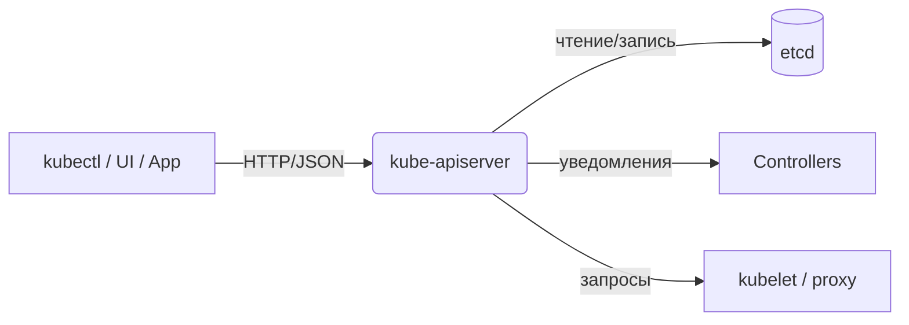

# Kubernetes API — Взаимодействие с кластером

> *📌*  Весь K8s управляется через **единый HTTP API**. `kubectl` — лишь клиент к нему. Вы можете взаимодействовать с кластером декларативно (YAML), императивно (команды) или программно (REST/клиентские библиотеки).

---

## Что такое Kubernetes API

| Аспект             | Описание                                                                                                        |
| ------------------ | --------------------------------------------------------------------------------------------------------------- |
| **Назначение**     | Единый интерфейс для запроса и изменения состояния всех объектов кластера (Pods, Deployments, ConfigMaps и др.) |
| **Реализация**     | `kube-apiserver` — фронтенд плоскости управления, обрабатывающий HTTP/HTTPS запросы                             |
| **Кто использует** | `kubectl`, другие компоненты K8s, внешние инструменты, ваши приложения, CI/CD-системы                           |
| **Протокол**       | RESTful HTTP API + поддержка Protobuf для внутренней оптимизации                                                |
| **Формат данных**  | JSON (по умолчанию) / Protobuf / YAML (на стороне клиента)                                                      |



## Способы взаимодействия с API

|Способ|Когда использовать|Пример|
|---|---|---|
|**`kubectl`**|Ручное управление, отладка, скрипты|`kubectl get pods`, `kubectl apply -f deploy.yaml`|
|**Прямые REST-запросы**|Низкоуровневая интеграция, кастомные инструменты|`curl -k https://<api-server>/api/v1/pods -H "Authorization: Bearer <token>"`|
|**Клиентские библиотеки**|Разработка приложений под K8s|Python: `kubernetes.client`, Go: `client-go`, Java: `kubernetes-client`|
|**Динамические клиенты**|Работа с неизвестными заранее ресурсами (операторы, CRD)|Go: `dynamic.Interface`, Python: `DynamicClient`|

> 💡 **Важно**: 
> `kubectl` сам использует API — вы всегда можете добавить `-v=6` для просмотра сырых запросов:  
> `kubectl get pods -v=6`

---

## Обнаружение API (API Discovery)

Kubernetes публикует метаданные о доступных ресурсах, чтобы клиенты могли адаптироваться динамически.

### Два механизма публикации:

|Механизм|Конечная точка|Что возвращает|Когда использовать|
|---|---|---|---|
|**🔍 Неагрегированное**|`/api`, `/apis`, `/apis/<group>/<version>`|Список групп/версий/ресурсов по отдельности|Простые клиенты, ручная отладка|
|**📦 Агрегированное** _(стабильно с v1.30)_|`/api`, `/apis` с `Accept: application/json;v=v2;g=apidiscovery.k8s.io;as=APIGroupDiscoveryList`|Сводный список всех ресурсов за 1–2 запроса|Эффективное кэширование, автодополнение в `kubectl`, операторы|

**Пример неагрегированного ответа** (`/apis`):
```json
{
  "kind": "APIGroupList",
  "apiVersion": "v1",
  "groups": [
    {
      "name": "apps",
      "preferredVersion": { "groupVersion": "apps/v1", "version": "v1" },
      "versions": [ { "groupVersion": "apps/v1", "version": "v1" } ]
    }
  ]
}
```
>📁 Справочный документ по встроенным ресурсам: [kubernetes-api GitHub](https://github.com/kubernetes/kubernetes/tree/master/api/openapi-spec)

---
## Документация через OpenAPI

Kubernetes генерирует машиночитаемые спецификации для автогенерации клиентов, валидации и документирования.

|Версия|Конечная точка|Статус|Особенности|
|---|---|---|---|
|**OpenAPI v2**|`/openapi/v2`|✅ Стабильно|Базовая схема, некоторые поля упрощены (no `oneOf`, `nullable`)|
|**OpenAPI v3**|`/openapi/v3`|✅ Стабильно с v1.27|Полная схема, точная валидация, расширяемость, предпочтительный вариант|

**Запрос спецификации**:

```bash
# JSON (по умолчанию)
curl -k https://<api>/openapi/v3 -H "Authorization: Bearer <token>"

# Protobuf (для внутренней оптимизации)
curl -k https://<api>/openapi/v3 -H "Accept: application/com.github.proto-openapi.spec.v3@v1.0+protobuf"
```

> ⚠️ **Валидация**: Схемы OpenAPI — ориентир, но финальную проверку делает `kube-apiserver`. Для точной pre-flight проверки используйте:  
> `kubectl apply --dry-run=server -f manifest.yaml`

---

## Сериализация: JSON vs Protobuf

|Формат|Плюсы|Минусы|Где используется|
|---|---|---|---|
|**JSON**|Человекочитаемый, универсальный, отладка|Больший размер, медленнее парсинг|`kubectl`, внешние клиенты, конфиги|
|**Protobuf**|Компактный, быстрый, типобезопасный|Требует `.proto`-схем, менее удобен для ручной правки|Внутренняя коммуникация компонентов, высоконагруженные операторы|

> 📦 Схемы Protobuf (IDL) лежат в репозитории K8s: `staging/src/k8s.io/api/...`

---

## Хранение состояния: etcd
```
kube-apiserver → сериализация (JSON/Protobuf) → запись в etcd
```
- **etcd** — единственное хранилище состояния кластера (все объекты, конфиги, статусы).
- Все изменения проходят через API Server — прямой доступ к etcd **не рекомендуется**.
- Для бэкапа/восстановления используйте `etcdctl snapshot save/restore`.

---
## Группы API и версионирование

### Структура пути к ресурсу:
```
/apis/<group>/<version>/namespaces/<ns>/<resource>/<name>
/api/<version>/...  # для core-группы (без имени группы)
```

|Уровень|Пример|Назначение|
|---|---|---|
|**Группа**|`apps`, `rbac.authorization.k8s.io`, `networking.k8s.io`|Логическое объединение связанных ресурсов|
|**Версия**|`v1`, `v1beta1`, `v2alpha1`|Эволюция схемы без поломки клиентов|
|**Ресурс**|`deployments`, `services`, `ingresses`|Тип объекта|
|**Объект**|Конкретный экземпляр (имя + неймспейс)|Уникальный идентификатор|

### Стадии жизненного цикла версии API:
```
alpha → beta → GA (v1) → deprecated → removed
```

|Стадия|Гарантии|Рекомендации|
|---|---|---|
|**alpha**|Нет обратной совместимости, могут исчезнуть в любом релизе|Только тестирование, не для production|
|**beta**|Обратная совместимость в рамках beta, но возможны изменения|Можно использовать в prod с готовностью к миграции|
|**GA (v1)**|Полная совместимость, поддержка на годы|Безопасно для production|
|**deprecated**|Работает, но помечен на удаление|Планируйте миграцию до удаления|
|**removed**|Больше не доступен|Обязательно перейти на замену|

> 🔄 **Прозрачное преобразование**: Объект, созданный в `v1beta1`, можно читать/править через `v1` — API Server сам конвертирует версии.

---
## Расширение API

Kubernetes позволяет добавлять свои ресурсы и логику без изменения ядра.

| Механизм                              | Что даёт                                                                          | Когда использовать                                  |
| ------------------------------------- | --------------------------------------------------------------------------------- | --------------------------------------------------- |
| **Custom Resource Definitions (CRD)** | Декларативное добавление новых типов ресурсов (например, `MyApp`, `BackupPolicy`) | Большинство кастомных задач, операторы              |
| **Aggregation Layer**                 | Подключение внешних API-серверов как «расширений» основного API                   | Сложные интеграции, наследование аутентификации K8s |
| **Webhooks**                          | Динамическая валидация/мутация объектов при создании/обновлении                   | Политики безопасности, инъекция конфигов, аудит     |
**Пример минимального CRD**:
```yaml
apiVersion: apiextensions.k8s.io/v1
kind: CustomResourceDefinition
metadata:
  name: myapps.example.com
spec:
  group: example.com
  versions:
    - name: v1
      served: true
      storage: true
      schema: { ... }  # OpenAPI v3 схема валидации
  scope: Namespaced
  names:
    plural: myapps
    singular: myapp
    kind: MyApp
```

## Чек-лист: работа с API
```bash
# 1. Посмотреть доступные ресурсы (агрегированно)
kubectl api-resources --output=wide

# 2. Узнать версию API для конкретного ресурса
kubectl explain pod | head -5
kubectl explain deployment.apiVersion

# 3. Прямой запрос к API (с токеном из kubeconfig)
TOKEN=$(kubectl config view --raw -o jsonpath='{.users[*].user.token}')
curl -k -H "Authorization: Bearer $TOKEN" \
     https://<api-server>/apis/apps/v1/namespaces/default/deployments

# 4. Проверить, какие версии API поддерживает кластер
kubectl get --raw /apis | jq '.groups[].name'

# 5. Получить OpenAPI v3 спецификацию для группы
curl -k -H "Authorization: Bearer $TOKEN" \
     https://<api-server>/openapi/v3/apis/apps/v1 > apps-v1-openapi.json

# 6. Dry-run применения манифеста (валидация без изменений)
kubectl apply -f deploy.yaml --dry-run=server -o yaml
```